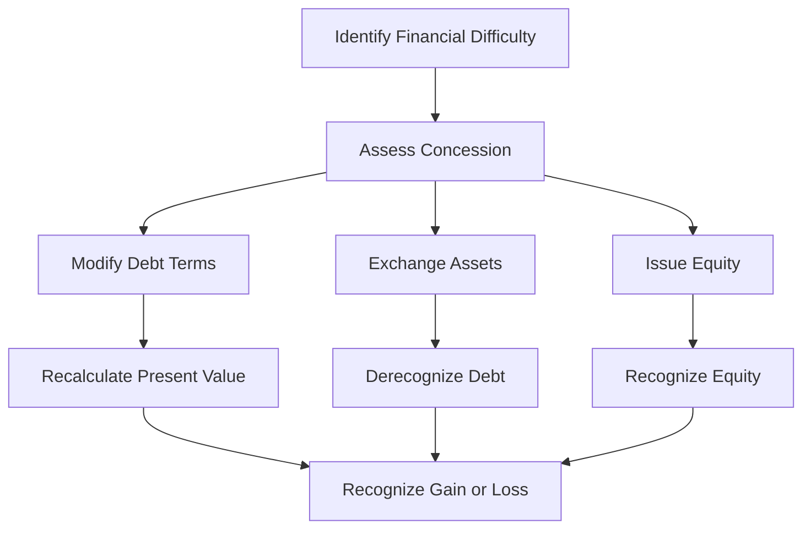

## 5.5 Troubled Debt Restructuring

Troubled Debt Restructuring (TDR) is a critical concept in accounting that arises when a debtor is unable to meet the original terms of a debt agreement due to financial difficulties. This section delves into the accounting implications, practical examples, and regulatory considerations surrounding TDR, providing a comprehensive understanding for those preparing for Canadian accounting exams.

### Understanding Troubled Debt Restructuring

TDR occurs when a creditor, for economic or legal reasons related to the debtor's financial difficulties, grants a concession to the debtor that it would not otherwise consider. This restructuring can take various forms, including:

- **Modification of Terms:** Altering the interest rate, extending the maturity date, reducing the principal amount, or changing the payment schedule.
- **Asset Exchange:** The debtor transfers assets to the creditor to satisfy the debt.
- **Equity Interest:** The debtor issues equity to the creditor as a form of settlement.

### Accounting Standards and Framework

In Canada, the accounting for TDR is governed by International Financial Reporting Standards (IFRS) and Accounting Standards for Private Enterprises (ASPE). Understanding these standards is crucial for accurate financial reporting and compliance.

#### IFRS and ASPE Guidelines

- **IFRS 9 - Financial Instruments:** Provides guidance on the recognition and measurement of financial instruments, including modifications and derecognition.
- **ASPE Section 3856 - Financial Instruments:** Offers similar guidance for private enterprises, emphasizing the need for fair value measurement and impairment considerations.

### Key Accounting Implications

The accounting treatment of TDR involves several critical steps:

1. **Identification of Financial Difficulty:** Assess whether the debtor is experiencing financial hardship, which is a prerequisite for TDR.
2. **Recognition of Concession:** Determine if the creditor has granted a concession that it would not normally offer.
3. **Measurement of Restructured Debt:** Calculate the new carrying amount of the debt, considering any changes in terms or asset exchanges.
4. **Impairment Assessment:** Evaluate the need for impairment based on the revised cash flows or fair value of assets exchanged.

### Practical Examples and Scenarios

To illustrate the application of TDR accounting, consider the following scenarios:

#### Example 1: Modification of Terms

A company, XYZ Corp, is unable to meet its debt obligations due to declining sales. The creditor agrees to reduce the interest rate from 8% to 5% and extend the maturity date by two years. The accounting treatment involves:

- **Recalculation of Present Value:** Determine the present value of the revised cash flows using the original effective interest rate.
- **Recognition of Gain or Loss:** If the present value of the restructured debt is less than the carrying amount, recognize a gain.

#### Example 2: Asset Exchange

ABC Ltd. transfers equipment with a fair value of $500,000 to settle a $600,000 debt. The accounting steps include:

- **Derecognition of Debt:** Remove the carrying amount of the debt from the books.
- **Recognition of Gain or Loss:** Record a loss of $100,000, representing the difference between the debt and the fair value of the asset.

### Regulatory Considerations and Compliance

Compliance with Canadian accounting standards is essential for accurate financial reporting. Key considerations include:

- **Disclosure Requirements:** Provide detailed disclosures about the nature and impact of TDR on financial statements.
- **Audit Implications:** Ensure that auditors review TDR transactions for compliance with applicable standards and assess the adequacy of disclosures.

### Challenges and Best Practices

TDR presents several challenges, including:

- **Complex Valuation:** Accurately valuing restructured debt or exchanged assets can be challenging.
- **Judgment and Estimates:** Significant judgment is required in assessing financial difficulty and concessions.
- **Regulatory Changes:** Stay informed about updates to accounting standards that may impact TDR.

To overcome these challenges, consider the following best practices:

- **Regular Training:** Stay updated on accounting standards and regulatory changes through continuous professional development.
- **Robust Internal Controls:** Implement strong internal controls to ensure accurate identification and measurement of TDR.
- **Comprehensive Documentation:** Maintain detailed documentation of TDR transactions and related judgments.

### Real-world Applications and Case Studies

Consider the case of a Canadian manufacturing company that faced financial difficulties due to a downturn in the industry. The company negotiated a TDR with its creditors, involving a combination of term modifications and asset exchanges. The successful restructuring allowed the company to stabilize its financial position and continue operations.

### Diagrams and Visual Aids

To enhance understanding, consider the following diagram illustrating the TDR process:

### Exam Preparation and Practice

To prepare for Canadian accounting exams, focus on:

- **Understanding Key Concepts:** Ensure a solid grasp of TDR principles and accounting standards.
- **Practice Problems:** Work through sample problems and scenarios to reinforce learning.
- **Review Regulatory Guidelines:** Familiarize yourself with IFRS and ASPE requirements for TDR.

### Summary and Key Takeaways

Troubled Debt Restructuring is a complex area of accounting that requires a thorough understanding of financial difficulties, concessions, and regulatory standards. By mastering these concepts, you can effectively navigate TDR transactions and ensure compliance with Canadian accounting standards.

## **Ready to Test Your Knowledge?**



### What is a key prerequisite for a Troubled Debt Restructuring?

- [x] The debtor must be experiencing financial difficulties.
- [ ] The debtor must have a high credit rating.
- [ ] The creditor must be a financial institution.
- [ ] The debt must be unsecured.

> **Explanation:** A key prerequisite for TDR is that the debtor is experiencing financial difficulties, prompting the creditor to grant concessions.

### Which accounting standard governs TDR under IFRS?

- [x] IFRS 9 - Financial Instruments
- [ ] IFRS 15 - Revenue from Contracts with Customers
- [ ] IFRS 16 - Leases
- [ ] IFRS 7 - Financial Instruments: Disclosures

> **Explanation:** IFRS 9 provides guidance on the recognition and measurement of financial instruments, including TDR.

### In a TDR, what happens if the present value of restructured debt is less than the carrying amount?

- [x] A gain is recognized.
- [ ] A loss is recognized.
- [ ] The debt is written off.
- [ ] No adjustment is made.

> **Explanation:** If the present value of restructured debt is less than the carrying amount, a gain is recognized.

### What is a common form of concession in TDR?

- [x] Modification of interest rate
- [ ] Increase in principal amount
- [ ] Reduction in equity
- [ ] Issuance of new debt

> **Explanation:** A common concession in TDR is the modification of interest rates to ease the debtor's financial burden.

### How should a company account for an asset exchange in TDR?

- [x] Derecognize the debt and recognize a gain or loss based on the asset's fair value.
- [ ] Recognize the asset at book value.
- [ ] Increase the carrying amount of the debt.
- [ ] Record the asset as a liability.

> **Explanation:** In an asset exchange, the debt is derecognized, and a gain or loss is recognized based on the asset's fair value.

### What is a critical challenge in TDR accounting?

- [x] Complex valuation of restructured debt
- [ ] High interest rates
- [ ] Lack of financial statements
- [ ] Excessive cash flow

> **Explanation:** Accurately valuing restructured debt or exchanged assets is a critical challenge in TDR accounting.

### Which of the following is a best practice for managing TDR?

- [x] Maintain comprehensive documentation of transactions.
- [ ] Ignore regulatory changes.
- [ ] Use arbitrary estimates.
- [ ] Avoid internal controls.

> **Explanation:** Maintaining comprehensive documentation of TDR transactions is a best practice for ensuring accuracy and compliance.

### What should be disclosed in financial statements regarding TDR?

- [x] Nature and impact of TDR on financial statements
- [ ] Only the interest rate changes
- [ ] The debtor's credit score
- [ ] The creditor's financial position

> **Explanation:** Disclosures should include the nature and impact of TDR on financial statements to provide transparency.

### What is the role of auditors in TDR?

- [x] Review transactions for compliance with standards
- [ ] Set interest rates
- [ ] Approve debt modifications
- [ ] Negotiate with creditors

> **Explanation:** Auditors review TDR transactions to ensure compliance with applicable standards and assess the adequacy of disclosures.

### True or False: A TDR always results in a gain for the debtor.

- [ ] True
- [x] False

> **Explanation:** A TDR does not always result in a gain; it depends on the terms of the restructuring and the fair value of exchanged assets.


