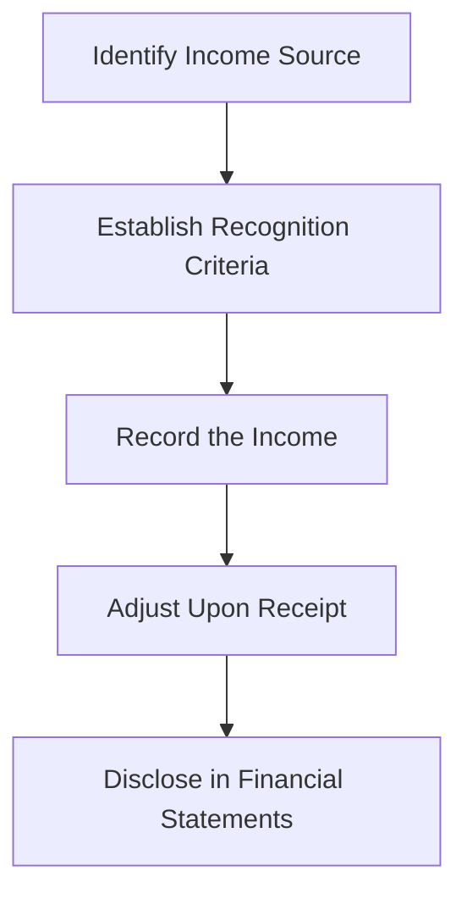

## 6.13 Dividend and Interest Income Recognition

### Introduction

Understanding the recognition of dividend and interest income is crucial for accurate financial reporting and compliance with Canadian accounting standards. This section delves into the principles and practices surrounding the recognition of income from investments in debt and equity securities, providing a comprehensive guide for those preparing for Canadian accounting exams.

### Overview of Dividend and Interest Income

Dividend and interest income are two primary forms of returns that investors receive from their investments. Dividends are typically distributed by corporations to their shareholders as a return on equity investments, while interest income is earned from debt securities such as bonds and loans. The recognition of these income streams is governed by specific accounting standards, which ensure that financial statements accurately reflect the economic benefits received by the entity.

### Dividend Income Recognition

#### Definition and Types of Dividends

Dividends represent a portion of a company's earnings distributed to shareholders. They can be classified into several types:

- **Cash Dividends:** Payments made in cash to shareholders.
- **Stock Dividends:** Additional shares issued to shareholders, increasing the number of shares owned.
- **Property Dividends:** Distribution of non-cash assets to shareholders.
- **Scrip Dividends:** Promissory notes issued to shareholders, promising to pay dividends at a later date.

#### Recognition Criteria

Under International Financial Reporting Standards (IFRS) as adopted in Canada, dividend income is recognized when the entity's right to receive payment is established. This typically occurs on the ex-dividend date, which is the date when the dividend is declared and the shareholder is entitled to receive the payment.

#### Accounting Treatment

The accounting treatment for dividend income involves recording the income in the period it is earned. For example, when a company declares a cash dividend, the investor records the following journal entry:

```
Debit: Dividend Receivable
Credit: Dividend Income
```

Upon receipt of the dividend, the entry is adjusted to:

```
Debit: Cash
Credit: Dividend Receivable
```

#### Practical Example

Consider a Canadian company, Maple Investments Inc., which holds 1,000 shares of a corporation that declares a cash dividend of $2 per share. On the ex-dividend date, Maple Investments would recognize a dividend income of $2,000 (1,000 shares x $2 per share).

### Interest Income Recognition

#### Definition and Sources of Interest Income

Interest income arises from investments in debt securities, such as bonds, loans, and notes receivable. It represents the compensation for the use of money over time and is typically expressed as a percentage of the principal amount.

#### Recognition Criteria

Interest income is recognized using the effective interest method, which allocates interest income over the life of the investment based on the effective interest rate. This method ensures that the income is recognized in a manner that reflects the economic reality of the investment.

#### Effective Interest Method

The effective interest method involves calculating the interest income by applying the effective interest rate to the carrying amount of the investment at the beginning of each period. The effective interest rate is the rate that exactly discounts the estimated future cash receipts through the expected life of the financial asset to the net carrying amount of the financial asset.

#### Accounting Treatment

The accounting treatment for interest income involves the following journal entry:

```
Debit: Interest Receivable
Credit: Interest Income
```

This entry is adjusted upon receipt of the interest payment:

```
Debit: Cash
Credit: Interest Receivable
```

#### Practical Example

Suppose Maple Investments Inc. holds a bond with a face value of $100,000, an annual coupon rate of 5%, and an effective interest rate of 6%. The interest income for the first year would be calculated as $6,000 ($100,000 x 6%), and the journal entry would reflect this amount.

### Differences Between IFRS and ASPE

While IFRS is widely used in Canada, some private enterprises may choose to follow the Accounting Standards for Private Enterprises (ASPE). The recognition of dividend and interest income under ASPE is generally consistent with IFRS, but there are some differences in disclosure requirements and presentation.

### Regulatory Considerations

In Canada, the recognition of dividend and interest income must comply with the guidelines set forth by CPA Canada and other regulatory bodies. Entities must ensure that their financial reporting accurately reflects the income earned from investments, and any deviations from standard practices must be disclosed.

### Common Challenges and Best Practices

#### Challenges

- **Timing of Recognition:** Determining the appropriate period for recognizing dividend and interest income can be challenging, especially when dealing with complex financial instruments.
- **Measurement of Effective Interest Rate:** Calculating the effective interest rate requires accurate estimation of future cash flows, which can be difficult in volatile markets.

#### Best Practices

- **Regular Review of Investments:** Regularly review investment portfolios to ensure that income recognition aligns with current market conditions and accounting standards.
- **Use of Technology:** Leverage accounting software to automate the calculation of interest income using the effective interest method, reducing the risk of errors.

### Real-World Applications

In practice, the recognition of dividend and interest income plays a critical role in financial analysis and decision-making. Investors rely on accurate income reporting to assess the performance of their investments and make informed decisions about portfolio management.

### Case Study: Dividend and Interest Income Recognition at Maple Investments Inc.

Maple Investments Inc. is a Canadian investment firm that manages a diverse portfolio of equity and debt securities. The firm follows IFRS for its financial reporting and has implemented a robust system for recognizing dividend and interest income.

#### Scenario

In the fiscal year 2023, Maple Investments received the following income:

- **Dividends:** $50,000 from various equity investments.
- **Interest:** $75,000 from bonds and other debt securities.

#### Analysis

The firm recognized the dividend income on the ex-dividend date and used the effective interest method to calculate interest income. By adhering to these standards, Maple Investments ensured that its financial statements accurately reflected the economic benefits received from its investments.

### Step-by-Step Guidance for Dividend and Interest Income Recognition

1. **Identify the Income Source:** Determine whether the income is from dividends or interest.
2. **Establish Recognition Criteria:** For dividends, identify the ex-dividend date. For interest, calculate the effective interest rate.
3. **Record the Income:** Use the appropriate journal entries to record the income in the financial statements.
4. **Adjust Upon Receipt:** Update the entries upon receipt of cash or other forms of payment.
5. **Disclose in Financial Statements:** Ensure that all income is accurately disclosed in accordance with IFRS or ASPE.

### Diagrams and Visual Aids

Below is a diagram illustrating the process of dividend and interest income recognition:



### Summary

The recognition of dividend and interest income is a fundamental aspect of accounting for investments in debt and equity securities. By understanding the principles and practices outlined in this guide, you can ensure accurate financial reporting and compliance with Canadian accounting standards.

### References

- CPA Canada Handbook
- International Financial Reporting Standards (IFRS)
- Accounting Standards for Private Enterprises (ASPE)

## **Ready to Test Your Knowledge?**



### What is the primary criterion for recognizing dividend income under IFRS?

- [x] The entity's right to receive payment is established.
- [ ] The dividend is paid in cash.
- [ ] The dividend is declared by the company.
- [ ] The dividend is received by the entity.

> **Explanation:** Under IFRS, dividend income is recognized when the entity's right to receive payment is established, typically on the ex-dividend date.

### How is interest income recognized under the effective interest method?

- [x] By applying the effective interest rate to the carrying amount of the investment.
- [ ] By applying the coupon rate to the face value of the investment.
- [ ] By recognizing interest income when cash is received.
- [ ] By using the straight-line method over the life of the investment.

> **Explanation:** The effective interest method involves applying the effective interest rate to the carrying amount of the investment to recognize interest income.

### What is the journal entry to record dividend income when it is declared?

- [x] Debit: Dividend Receivable; Credit: Dividend Income
- [ ] Debit: Cash; Credit: Dividend Income
- [ ] Debit: Dividend Income; Credit: Cash
- [ ] Debit: Dividend Income; Credit: Dividend Receivable

> **Explanation:** When dividend income is declared, the appropriate journal entry is to debit Dividend Receivable and credit Dividend Income.

### What is the effective interest rate?

- [x] The rate that exactly discounts the estimated future cash receipts to the net carrying amount of the financial asset.
- [ ] The rate stated on the bond or loan agreement.
- [ ] The rate at which the bond or loan was originally issued.
- [ ] The average rate of interest over the life of the investment.

> **Explanation:** The effective interest rate is the rate that exactly discounts the estimated future cash receipts through the expected life of the financial asset to the net carrying amount of the financial asset.

### Which of the following is a type of dividend?

- [x] Cash Dividend
- [ ] Interest Dividend
- [x] Stock Dividend
- [ ] Bond Dividend

> **Explanation:** Cash and stock dividends are common types of dividends. Interest and bond dividends are not recognized types.

### What is the main challenge in recognizing interest income?

- [x] Measurement of the effective interest rate.
- [ ] Timing of interest payments.
- [ ] Recording cash receipts.
- [ ] Calculating the coupon rate.

> **Explanation:** The main challenge in recognizing interest income is accurately measuring the effective interest rate, which requires estimating future cash flows.

### When is dividend income typically recognized?

- [x] On the ex-dividend date.
- [ ] On the payment date.
- [x] When the dividend is declared.
- [ ] When the dividend is received.

> **Explanation:** Dividend income is typically recognized on the ex-dividend date, when the shareholder's right to receive the dividend is established.

### What is a scrip dividend?

- [x] A promissory note issued to shareholders promising to pay dividends at a later date.
- [ ] A cash payment to shareholders.
- [ ] Additional shares issued to shareholders.
- [ ] Non-cash assets distributed to shareholders.

> **Explanation:** A scrip dividend is a promissory note issued to shareholders, promising to pay dividends at a later date.

### What is the purpose of the effective interest method?

- [x] To allocate interest income over the life of the investment based on the effective interest rate.
- [ ] To recognize interest income when cash is received.
- [ ] To calculate interest income using the coupon rate.
- [ ] To simplify the recognition of interest income.

> **Explanation:** The effective interest method allocates interest income over the life of the investment based on the effective interest rate, reflecting the economic reality of the investment.

### True or False: Under ASPE, the recognition of dividend and interest income is significantly different from IFRS.

- [x] False
- [ ] True

> **Explanation:** Under ASPE, the recognition of dividend and interest income is generally consistent with IFRS, with some differences in disclosure requirements and presentation.


