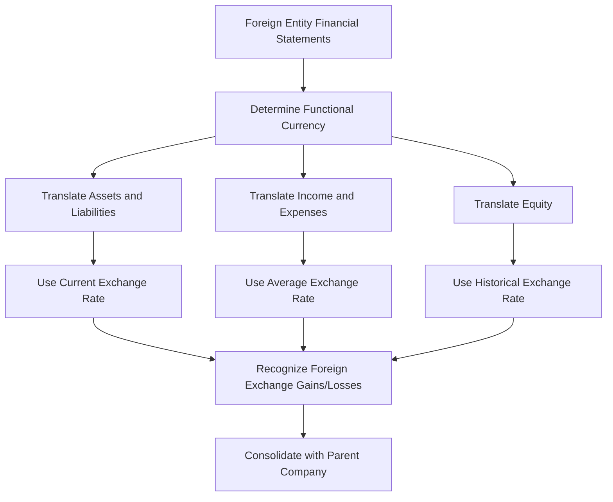

## 6.14 Foreign Investments

Foreign investments play a crucial role in the global economy, allowing companies to diversify their portfolios, access new markets, and enhance their competitive advantage. For accounting professionals, understanding the complexities of foreign investments is essential, particularly when preparing for Canadian accounting exams. This section delves into the accounting treatment of foreign investments, focusing on the impact of exchange rates, compliance with Canadian standards, and practical examples relevant to the Canadian accounting profession.

### Understanding Foreign Investments

Foreign investments refer to the acquisition of financial assets or interests in foreign entities. These investments can take various forms, including equity investments, debt securities, and joint ventures. The accounting treatment of foreign investments is governed by International Financial Reporting Standards (IFRS) as adopted in Canada, and the Accounting Standards for Private Enterprises (ASPE).

#### Types of Foreign Investments

1. **Equity Investments**: Involves acquiring shares or ownership interests in a foreign entity. These investments can be classified as either significant influence (equity method) or control (consolidation method).
   
2. **Debt Securities**: Includes bonds or other fixed-income instruments issued by foreign entities. These investments are typically classified as held-to-maturity, available-for-sale, or trading securities.

3. **Joint Ventures and Strategic Alliances**: Partnerships with foreign entities to achieve specific business objectives. Accounting for joint ventures often involves the equity method or proportionate consolidation.

### Impact of Exchange Rates

Exchange rates significantly impact the accounting for foreign investments, as they affect the valuation of foreign currency transactions and the translation of financial statements. Understanding how to manage exchange rate fluctuations is critical for accurate financial reporting.

#### Exchange Rate Mechanisms

1. **Spot Rate**: The current exchange rate at which a currency can be exchanged for another. It is used for immediate transactions.

2. **Forward Rate**: A predetermined exchange rate for a transaction that will occur at a future date. Forward contracts are often used to hedge against exchange rate fluctuations.

3. **Exchange Rate Fluctuations**: Changes in exchange rates can lead to foreign exchange gains or losses, impacting the financial statements.

### Accounting Standards and Compliance

Canadian accounting standards, including IFRS and ASPE, provide guidelines for accounting for foreign investments. These standards ensure consistency and transparency in financial reporting.

#### IFRS Guidelines

1. **IAS 21 - The Effects of Changes in Foreign Exchange Rates**: Provides guidance on how to account for foreign currency transactions and translate financial statements of foreign operations.

2. **IFRS 9 - Financial Instruments**: Addresses the classification and measurement of financial assets and liabilities, including foreign investments.

3. **IFRS 10 - Consolidated Financial Statements**: Outlines the requirements for preparing consolidated financial statements, including the treatment of foreign subsidiaries.

#### ASPE Guidelines

1. **Section 1651 - Foreign Currency Translation**: Provides guidance on translating foreign currency transactions and financial statements under ASPE.

2. **Section 3856 - Financial Instruments**: Covers the recognition, measurement, and disclosure of financial instruments, including foreign investments.

### Practical Examples and Scenarios

To illustrate the accounting treatment of foreign investments, consider the following scenarios:

#### Example 1: Equity Investment in a Foreign Subsidiary

A Canadian company acquires a 60% interest in a foreign subsidiary. The subsidiary's functional currency is different from the Canadian dollar. The company must consolidate the subsidiary's financial statements, translating them into Canadian dollars using the current exchange rate for assets and liabilities and the historical exchange rate for equity.

#### Example 2: Debt Security Investment

A Canadian company invests in a bond issued by a foreign entity. The bond is classified as an available-for-sale security. The company must revalue the bond at each reporting date using the current exchange rate, recognizing any unrealized gains or losses in other comprehensive income.

### Real-World Applications and Regulatory Scenarios

Foreign investments are subject to various regulatory requirements, including disclosure and compliance with anti-money laundering (AML) and know-your-customer (KYC) regulations. Accounting professionals must stay informed about these requirements to ensure compliance and mitigate risks.

#### Regulatory Considerations

1. **Disclosure Requirements**: Companies must disclose information about their foreign investments, including the nature, risks, and financial impact.

2. **Tax Implications**: Foreign investments may have tax implications, including withholding taxes and transfer pricing considerations.

3. **Risk Management**: Companies must implement strategies to manage risks associated with foreign investments, including currency risk and geopolitical risk.

### Step-by-Step Guidance for Accounting Procedures

#### Step 1: Determine the Functional Currency

Identify the functional currency of the foreign entity, which is the currency of the primary economic environment in which the entity operates.

#### Step 2: Translate Financial Statements

Translate the foreign entity's financial statements into the reporting currency using the appropriate exchange rates:

- **Assets and Liabilities**: Use the current exchange rate at the reporting date.
- **Income and Expenses**: Use the average exchange rate for the period.
- **Equity**: Use the historical exchange rate.

#### Step 3: Recognize Foreign Exchange Gains or Losses

Recognize any foreign exchange gains or losses resulting from the translation process in other comprehensive income.

#### Step 4: Prepare Consolidated Financial Statements

Consolidate the financial statements of the foreign entity with those of the parent company, ensuring compliance with IFRS or ASPE guidelines.

### Diagrams and Visual Aids

To enhance understanding, consider the following diagram illustrating the translation process for foreign financial statements:

### Best Practices and Common Pitfalls

#### Best Practices

1. **Stay Informed**: Keep up-to-date with changes in accounting standards and regulations affecting foreign investments.

2. **Implement Robust Controls**: Establish internal controls to manage risks associated with foreign investments, including currency risk and compliance risk.

3. **Engage Experts**: Consult with experts in foreign investment accounting to ensure accurate financial reporting and compliance.

#### Common Pitfalls

1. **Ignoring Exchange Rate Fluctuations**: Failing to account for exchange rate fluctuations can lead to inaccurate financial statements.

2. **Inadequate Disclosure**: Insufficient disclosure of foreign investments can result in non-compliance with regulatory requirements.

3. **Overlooking Tax Implications**: Neglecting the tax implications of foreign investments can lead to unexpected tax liabilities.

### References to Official Canadian Accounting Standards

For further exploration, refer to the following resources:

- **CPA Canada**: Provides guidance on accounting standards and best practices for foreign investments.
- **IFRS Foundation**: Offers comprehensive resources on IFRS standards, including IAS 21 and IFRS 9.
- **Canadian Accounting Standards Board (AcSB)**: Develops and maintains accounting standards for private enterprises in Canada.

### Summary and Key Points

- Foreign investments involve acquiring financial assets or interests in foreign entities, including equity investments, debt securities, and joint ventures.
- Exchange rates significantly impact the accounting for foreign investments, affecting the valuation of transactions and translation of financial statements.
- Canadian accounting standards, including IFRS and ASPE, provide guidelines for accounting for foreign investments, ensuring consistency and transparency in financial reporting.
- Practical examples and scenarios illustrate the accounting treatment of foreign investments, emphasizing the importance of compliance and risk management.
- Best practices include staying informed about changes in standards, implementing robust controls, and engaging experts.

### Sample Exam-Style Questions

To reinforce your understanding, consider the following practice questions:

## **Ready to Test Your Knowledge?**



### What is the primary purpose of translating foreign financial statements into the reporting currency?

- [x] To ensure accurate financial reporting and compliance with accounting standards
- [ ] To increase the value of foreign investments
- [ ] To reduce tax liabilities
- [ ] To eliminate currency risk

> **Explanation:** Translating foreign financial statements into the reporting currency ensures accurate financial reporting and compliance with accounting standards, such as IFRS and ASPE.

### Which exchange rate is typically used to translate income and expenses of a foreign entity?

- [ ] Spot rate
- [x] Average exchange rate
- [ ] Forward rate
- [ ] Historical exchange rate

> **Explanation:** The average exchange rate for the period is typically used to translate income and expenses of a foreign entity.

### What is a common pitfall in accounting for foreign investments?

- [x] Ignoring exchange rate fluctuations
- [ ] Overestimating investment returns
- [ ] Underreporting financial gains
- [ ] Overstating liabilities

> **Explanation:** Ignoring exchange rate fluctuations can lead to inaccurate financial statements, making it a common pitfall in accounting for foreign investments.

### Which Canadian accounting standard provides guidance on foreign currency translation under ASPE?

- [ ] Section 3856
- [x] Section 1651
- [ ] IFRS 9
- [ ] IAS 21

> **Explanation:** Section 1651 of ASPE provides guidance on foreign currency translation.

### What is the functional currency of a foreign entity?

- [x] The currency of the primary economic environment in which the entity operates
- [ ] The currency in which the entity reports its financial statements
- [ ] The currency of the parent company's country
- [ ] The currency with the highest exchange rate

> **Explanation:** The functional currency is the currency of the primary economic environment in which the entity operates.

### What is the impact of exchange rate fluctuations on foreign investments?

- [x] They can lead to foreign exchange gains or losses
- [ ] They eliminate currency risk
- [ ] They increase the value of foreign investments
- [ ] They reduce tax liabilities

> **Explanation:** Exchange rate fluctuations can lead to foreign exchange gains or losses, impacting the financial statements.

### What is the role of IFRS 10 in accounting for foreign investments?

- [x] It outlines the requirements for preparing consolidated financial statements
- [ ] It provides guidelines for foreign currency translation
- [ ] It addresses the classification of financial assets
- [ ] It regulates tax implications of foreign investments

> **Explanation:** IFRS 10 outlines the requirements for preparing consolidated financial statements, including the treatment of foreign subsidiaries.

### Which of the following is a best practice in managing foreign investments?

- [x] Implementing robust internal controls
- [ ] Ignoring tax implications
- [ ] Minimizing disclosure
- [ ] Overlooking exchange rate fluctuations

> **Explanation:** Implementing robust internal controls is a best practice in managing foreign investments to mitigate risks.

### What is the purpose of using forward contracts in foreign investments?

- [x] To hedge against exchange rate fluctuations
- [ ] To increase investment returns
- [ ] To reduce tax liabilities
- [ ] To eliminate currency risk

> **Explanation:** Forward contracts are used to hedge against exchange rate fluctuations, providing stability in foreign investments.

### True or False: Foreign investments are only subject to Canadian accounting standards.

- [ ] True
- [x] False

> **Explanation:** Foreign investments are subject to both Canadian accounting standards and international regulations, depending on the nature and location of the investment.



By understanding the complexities of foreign investments and their accounting treatment, you will be well-prepared for the Canadian accounting exams and equipped to handle real-world challenges in the accounting profession.
