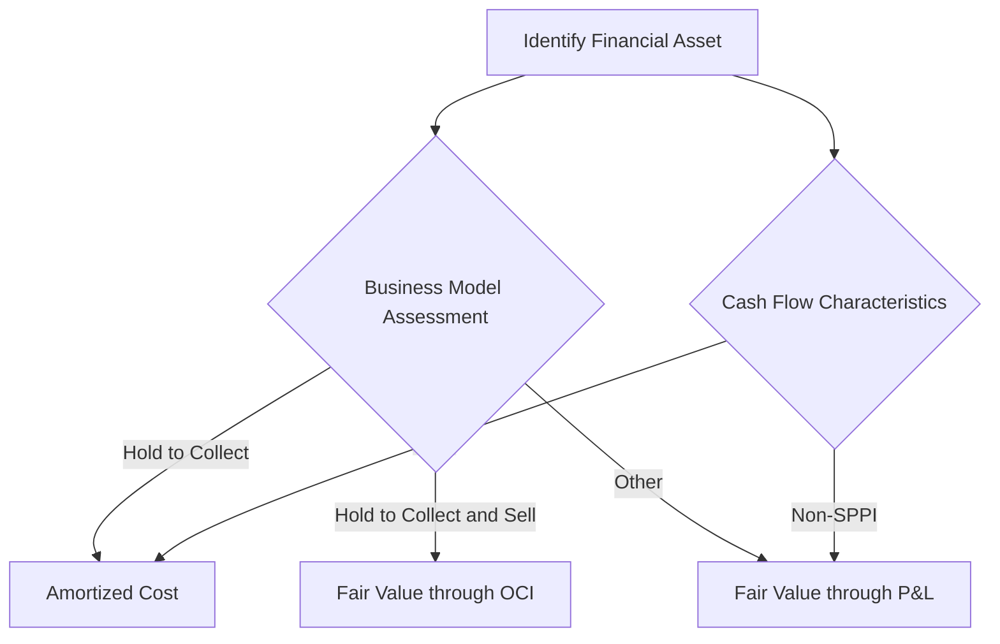

## 6.16 Regulatory Considerations

### Introduction

Regulatory considerations in investment accounting are crucial for ensuring transparency, accuracy, and compliance in financial reporting. This section delves into the various regulations affecting investment accounting, focusing on Canadian standards, international frameworks, and specific requirements from bodies such as the Securities and Exchange Commission (SEC). Understanding these regulations is essential for accountants and financial professionals who prepare, audit, or analyze financial statements involving investments in debt and equity securities.

### Canadian Accounting Standards

#### IFRS and ASPE

In Canada, public companies are required to follow the International Financial Reporting Standards (IFRS), while private enterprises may choose between IFRS and Accounting Standards for Private Enterprises (ASPE). Both frameworks provide guidance on the recognition, measurement, and disclosure of investments in debt and equity securities.

- **IFRS 9 Financial Instruments**: This standard addresses the classification and measurement of financial assets and liabilities, impairment, and hedge accounting. It requires investments to be classified based on the entity's business model and the contractual cash flow characteristics of the financial asset.

- **ASPE Section 3856 Financial Instruments**: This section provides guidance for private enterprises on the recognition, measurement, and disclosure of financial instruments, including investments in debt and equity securities.

#### Key Differences Between IFRS and ASPE

While both IFRS and ASPE aim to provide a fair representation of financial instruments, there are notable differences:

- **Classification and Measurement**: IFRS 9 uses a business model approach for classification, whereas ASPE allows more flexibility in measurement choices.

- **Impairment**: IFRS 9 employs an expected credit loss model, while ASPE uses an incurred loss model.

- **Hedge Accounting**: IFRS 9 offers more comprehensive guidance on hedge accounting compared to ASPE.

### International Regulatory Frameworks

#### SEC Requirements

For Canadian companies listed on U.S. exchanges, compliance with SEC regulations is mandatory. The SEC's rules are designed to protect investors and maintain fair, orderly, and efficient markets.

- **Regulation S-X**: This regulation outlines the form and content of financial statements required to be filed with the SEC, including those related to investments in securities.

- **Regulation S-K**: Provides non-financial statement disclosure requirements, including management's discussion and analysis (MD&A) and other qualitative information about investments.

- **Form 10-K and 10-Q**: These forms require detailed disclosures about a company's investments, including fair value measurements, risk factors, and market risk disclosures.

#### Global Convergence Efforts

The convergence of accounting standards globally aims to reduce differences between IFRS and U.S. GAAP, facilitating cross-border investment and financial reporting. The International Accounting Standards Board (IASB) and the Financial Accounting Standards Board (FASB) have been working towards harmonizing standards to improve comparability and consistency.

### Compliance Challenges and Best Practices

#### Common Compliance Challenges

- **Complexity of Standards**: Navigating the intricacies of different accounting standards can be challenging, especially for multinational corporations.

- **Frequent Updates**: Keeping up with changes and updates to standards requires continuous learning and adaptation.

- **Judgment and Estimates**: Many aspects of investment accounting involve significant judgment and estimation, such as fair value measurement and impairment testing.

#### Best Practices for Compliance

- **Regular Training and Education**: Continuous professional development ensures that accountants stay informed about the latest standards and regulations.

- **Robust Internal Controls**: Implementing strong internal controls helps ensure the accuracy and reliability of financial reporting.

- **Use of Technology**: Leveraging accounting software and technology can streamline compliance processes and improve efficiency.

- **Engagement with Regulators**: Maintaining open communication with regulatory bodies can help address compliance issues proactively.

### Practical Examples and Case Studies

#### Case Study: Fair Value Measurement

Consider a Canadian company with significant investments in equity securities. Under IFRS 9, these investments must be measured at fair value through profit or loss (FVTPL) or fair value through other comprehensive income (FVOCI). The company must determine the appropriate classification based on its business model and the characteristics of the securities.

- **Scenario**: The company holds shares in a publicly traded entity. It classifies these as FVTPL due to its business model focused on short-term profit-taking.

- **Regulatory Considerations**: The company must disclose the fair value measurement methods, key assumptions, and any changes in classification in its financial statements.

#### Example: Impairment Testing

A private enterprise using ASPE holds a portfolio of debt securities. It must assess these for impairment using the incurred loss model.

- **Scenario**: The company identifies a significant decline in the creditworthiness of one of its debtors, indicating potential impairment.

- **Regulatory Considerations**: The company must recognize an impairment loss in its financial statements and disclose the factors leading to the impairment.

### Real-world Applications and Scenarios

#### Scenario: Cross-border Investments

A Canadian company invests in a U.S. entity, requiring compliance with both IFRS and SEC regulations. This scenario highlights the need for dual reporting and understanding of both regulatory environments.

- **Regulatory Considerations**: The company must prepare financial statements in accordance with IFRS for Canadian reporting and reconcile these with U.S. GAAP for SEC filings.

#### Scenario: Derivative Instruments

A company uses derivative instruments to hedge against foreign currency risk. Under IFRS 9, it must apply hedge accounting to reflect the economic relationship between the hedged item and the hedging instrument.

- **Regulatory Considerations**: The company must document its hedging strategy, effectiveness testing, and disclose the impact of hedge accounting on its financial statements.

### Step-by-step Guidance for Compliance

#### Preparing Financial Statements

1. **Identify Investments**: Determine the types of investments held and their classification under the relevant accounting standards.

2. **Measure and Recognize**: Apply the appropriate measurement and recognition criteria, considering fair value, amortized cost, or other relevant bases.

3. **Assess Impairment**: Conduct impairment testing as required, using expected credit loss models (IFRS) or incurred loss models (ASPE).

4. **Disclose Information**: Ensure comprehensive disclosure of investment-related information, including fair value measurements, risk factors, and accounting policies.

#### Sample Problems and Exercises

- **Exercise 1**: Classify a portfolio of debt and equity securities under IFRS 9, considering the business model and cash flow characteristics.

- **Exercise 2**: Calculate the impairment loss for a debt security under ASPE, given a decline in creditworthiness.

### Diagrams and Visuals

Below is a diagram illustrating the classification and measurement process for financial instruments under IFRS 9:

### Best Practices, Pitfalls, and Strategies

#### Best Practices

- **Stay Updated**: Regularly review updates to accounting standards and regulatory requirements.

- **Engage Experts**: Consult with accounting professionals or auditors to ensure compliance with complex regulations.

- **Document Judgments**: Maintain thorough documentation of judgments and estimates used in financial reporting.

#### Common Pitfalls

- **Misclassification**: Incorrectly classifying investments can lead to significant misstatements in financial statements.

- **Inadequate Disclosures**: Failing to provide sufficient disclosures can result in regulatory scrutiny and penalties.

#### Strategies to Overcome Challenges

- **Develop a Compliance Checklist**: Create a checklist to ensure all regulatory requirements are met during the financial reporting process.

- **Conduct Regular Audits**: Perform internal audits to identify and address compliance issues proactively.

### References and Additional Resources

- **CPA Canada**: Offers resources and guidance on Canadian accounting standards and regulatory compliance.

- **IFRS Foundation**: Provides access to IFRS standards and interpretations.

- **SEC**: Offers detailed information on U.S. regulatory requirements for foreign issuers.

- **FASB**: Provides updates on U.S. GAAP and convergence efforts with IFRS.

### Summary

Regulatory considerations in investment accounting are complex but essential for ensuring accurate and compliant financial reporting. By understanding Canadian and international standards, engaging in best practices, and staying informed about regulatory updates, accountants can effectively navigate the challenges of investment accounting.

---

## **Ready to Test Your Knowledge?**



### Which accounting standard in Canada is required for public companies?

- [x] IFRS
- [ ] ASPE
- [ ] U.S. GAAP
- [ ] None of the above

> **Explanation:** Public companies in Canada are required to follow IFRS for financial reporting.

### What is the primary focus of IFRS 9?

- [x] Classification and measurement of financial instruments
- [ ] Revenue recognition
- [ ] Lease accounting
- [ ] Inventory valuation

> **Explanation:** IFRS 9 focuses on the classification, measurement, and impairment of financial instruments.

### Which regulation outlines the form and content of financial statements filed with the SEC?

- [x] Regulation S-X
- [ ] Regulation S-K
- [ ] Form 10-K
- [ ] Form 10-Q

> **Explanation:** Regulation S-X specifies the form and content of financial statements required by the SEC.

### What model does IFRS 9 use for impairment?

- [x] Expected credit loss model
- [ ] Incurred loss model
- [ ] Historical cost model
- [ ] Fair value model

> **Explanation:** IFRS 9 employs an expected credit loss model for impairment testing.

### Which of the following is a key difference between IFRS and ASPE?

- [x] Classification and measurement of financial instruments
- [ ] Revenue recognition
- [ ] Lease accounting
- [ ] Inventory valuation

> **Explanation:** IFRS and ASPE differ in their approach to the classification and measurement of financial instruments.

### What is a common pitfall in investment accounting?

- [x] Misclassification of investments
- [ ] Overstating revenue
- [ ] Understating expenses
- [ ] Misreporting cash flows

> **Explanation:** Misclassification of investments can lead to significant misstatements in financial statements.

### Which best practice helps ensure compliance with investment accounting regulations?

- [x] Regular training and education
- [ ] Ignoring updates to standards
- [ ] Avoiding internal audits
- [ ] Relying solely on external auditors

> **Explanation:** Regular training and education help accountants stay informed about the latest standards and regulations.

### What is the purpose of hedge accounting under IFRS 9?

- [x] To reflect the economic relationship between the hedged item and the hedging instrument
- [ ] To increase revenue
- [ ] To reduce expenses
- [ ] To inflate asset values

> **Explanation:** Hedge accounting under IFRS 9 aims to reflect the economic relationship between the hedged item and the hedging instrument.

### Which organization is responsible for global convergence efforts in accounting standards?

- [x] IASB
- [ ] SEC
- [ ] FASB
- [ ] CPA Canada

> **Explanation:** The IASB is responsible for global convergence efforts in accounting standards.

### True or False: ASPE uses an expected credit loss model for impairment.

- [ ] True
- [x] False

> **Explanation:** ASPE uses an incurred loss model for impairment, not an expected credit loss model.


