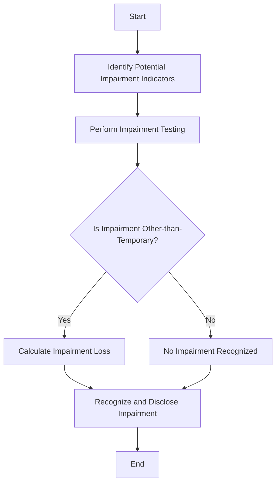

## 6.7 Impairment of Investments

In the realm of accounting, recognizing and measuring the impairment of investments is a critical task that ensures the accuracy and reliability of financial statements. This section delves into the intricacies of impairment, focusing on the decline in value of investment securities that are considered other-than-temporary. We will explore the relevant accounting standards, provide practical examples, and offer guidance on how to apply these principles in the context of Canadian accounting practices.

### Understanding Impairment of Investments

Investment impairment occurs when the fair value of an investment falls below its carrying amount, and this decline is deemed to be other-than-temporary. The recognition of impairment is crucial as it affects the financial statements by reducing the carrying amount of the investment and recognizing a loss in the income statement.

#### Key Concepts and Terminology

- **Fair Value:** The price that would be received to sell an asset or paid to transfer a liability in an orderly transaction between market participants at the measurement date.
- **Carrying Amount:** The amount at which an asset is recognized in the balance sheet after deducting any accumulated depreciation and accumulated impairment losses.
- **Other-than-Temporary Impairment (OTTI):** A situation where the decline in the fair value of an investment is not expected to recover in the foreseeable future.

### Regulatory Framework

In Canada, the recognition and measurement of investment impairment are governed by the International Financial Reporting Standards (IFRS) and the Accounting Standards for Private Enterprises (ASPE). The relevant standards include:

- **IFRS 9 - Financial Instruments:** This standard outlines the requirements for recognizing and measuring financial assets, financial liabilities, and some contracts to buy or sell non-financial items.
- **ASPE Section 3856 - Financial Instruments:** Provides guidance for private enterprises on the recognition, measurement, and disclosure of financial instruments.

### Recognizing Impairment

The process of recognizing impairment involves assessing whether there is objective evidence that an investment is impaired. This assessment is based on several indicators, including:

- Significant financial difficulty of the issuer or obligor.
- A breach of contract, such as a default or delinquency in interest or principal payments.
- The disappearance of an active market for the investment due to financial difficulties.
- Observable data indicating that there is a measurable decrease in the estimated future cash flows from a group of financial assets.

#### Practical Example

Consider a Canadian company holding an investment in a publicly traded equity security. The fair value of the security has declined significantly due to adverse market conditions. The company must assess whether this decline is temporary or other-than-temporary by evaluating factors such as the duration and extent of the decline, the financial health of the issuer, and the company's ability and intention to hold the investment until recovery.

### Measuring Impairment

Once impairment is recognized, the next step is to measure the amount of impairment loss. The impairment loss is calculated as the difference between the investment's carrying amount and its fair value.

#### Calculation Example

Suppose a company holds an investment with a carrying amount of $100,000. Due to market conditions, the fair value of the investment has declined to $70,000. The impairment loss is calculated as:


\text{Impairment Loss} = \text{Carrying Amount} - \text{Fair Value} = \$100,000 - \$70,000 = \$30,000


This $30,000 loss is recognized in the income statement, and the carrying amount of the investment is adjusted to its fair value of $70,000.

### Reversal of Impairment

Under IFRS, if the fair value of an impaired investment increases in subsequent periods, the impairment loss can be reversed, but only for debt securities. For equity securities, once an impairment loss is recognized, it cannot be reversed.

#### Example of Reversal

Assume the fair value of a previously impaired debt security increases to $90,000 in the next reporting period. The company can reverse a portion of the impairment loss, adjusting the carrying amount of the investment to $90,000 and recognizing a gain in the income statement.

### Case Study: Impairment in Practice

Let's consider a real-world scenario involving a Canadian investment firm holding a portfolio of equity and debt securities. Due to an economic downturn, the fair value of several securities in the portfolio declines significantly. The firm must evaluate each security to determine whether the decline is other-than-temporary.

For equity securities, the firm assesses factors such as the issuer's financial health, industry conditions, and the duration of the decline. For debt securities, the firm considers the issuer's credit rating, payment history, and market conditions. Based on this analysis, the firm recognizes impairment losses for securities with declines deemed other-than-temporary.

### Best Practices for Impairment Assessment

1. **Regular Monitoring:** Continuously monitor the fair value of investments and assess potential impairment indicators.
2. **Comprehensive Analysis:** Evaluate both quantitative and qualitative factors when assessing impairment.
3. **Documentation:** Maintain thorough documentation of the impairment assessment process and the rationale for recognizing or not recognizing impairment losses.
4. **Professional Judgment:** Apply professional judgment in determining whether a decline is other-than-temporary, considering all relevant factors.

### Common Challenges and Pitfalls

- **Subjectivity in Assessment:** Determining whether a decline is other-than-temporary involves significant judgment and can be subjective.
- **Timely Recognition:** Delays in recognizing impairment can lead to misstated financial statements and potential regulatory issues.
- **Complexity of Standards:** Navigating the complexities of IFRS and ASPE standards can be challenging, especially for entities with diverse investment portfolios.

### Strategies for Overcoming Challenges

- **Training and Education:** Ensure accounting professionals are well-versed in the relevant standards and impairment assessment techniques.
- **Use of Technology:** Leverage technology and financial modeling tools to support impairment analysis and decision-making.
- **Collaboration:** Engage with auditors, valuation experts, and other stakeholders to gain insights and validate impairment assessments.

### Real-World Applications and Regulatory Scenarios

In the Canadian context, companies must adhere to CPA Canada's guidelines and the requirements set forth by the Canadian Securities Administrators (CSA) when reporting impairment losses. This includes providing detailed disclosures in financial statements about the nature and extent of impairment, the assumptions used in impairment testing, and any reversals of impairment losses.

### Step-by-Step Guidance for Impairment Testing

1. **Identify Potential Impairment Indicators:** Regularly review investment portfolios for signs of impairment, such as significant declines in market value or adverse changes in the issuer's financial condition.
2. **Perform Impairment Testing:** For investments with potential impairment indicators, conduct a detailed impairment test to assess whether the decline is other-than-temporary.
3. **Calculate Impairment Loss:** If impairment is recognized, calculate the impairment loss as the difference between the carrying amount and fair value of the investment.
4. **Recognize and Disclose Impairment:** Record the impairment loss in the income statement and adjust the carrying amount of the investment. Provide comprehensive disclosures in the financial statements.

### Diagrams and Visuals

To enhance understanding, consider the following diagram illustrating the impairment assessment process:

### Summary

Impairment of investments is a critical aspect of financial reporting that ensures the accuracy and reliability of financial statements. By understanding the regulatory framework, recognizing impairment indicators, and applying best practices, accounting professionals can effectively manage investment impairment and provide transparent financial reporting.

### References and Additional Resources

- CPA Canada Handbook: [CPA Canada](https://www.cpacanada.ca/)
- International Financial Reporting Standards (IFRS): [IFRS Foundation](https://www.ifrs.org/)
- Accounting Standards for Private Enterprises (ASPE): [CPA Canada ASPE](https://www.cpacanada.ca/en/business-and-accounting-resources/accounting-and-financial-reporting/aspe)

---

## **Ready to Test Your Knowledge?**



### What is the primary purpose of recognizing impairment of investments?

- [x] To ensure the accuracy and reliability of financial statements
- [ ] To increase the carrying amount of investments
- [ ] To avoid recognizing losses in the income statement
- [ ] To enhance the fair value of investments

> **Explanation:** Recognizing impairment ensures that financial statements accurately reflect the value of investments, providing reliable information to stakeholders.

### Which standard governs the recognition and measurement of impairment for financial instruments in Canada?

- [x] IFRS 9
- [ ] ASPE Section 3856
- [ ] IFRS 15
- [ ] ASPE Section 3465

> **Explanation:** IFRS 9 outlines the requirements for recognizing and measuring financial instruments, including impairment.

### What is the key indicator for recognizing other-than-temporary impairment?

- [x] Significant decline in fair value that is not expected to recover
- [ ] Temporary market fluctuations
- [ ] Increase in carrying amount
- [ ] Short-term decline in value

> **Explanation:** A significant decline in fair value that is not expected to recover indicates other-than-temporary impairment.

### Can impairment losses on equity securities be reversed under IFRS?

- [ ] Yes
- [x] No

> **Explanation:** Under IFRS, impairment losses on equity securities cannot be reversed once recognized.

### What is the impairment loss if the carrying amount is $120,000 and the fair value is $80,000?

- [x] $40,000
- [ ] $120,000
- [ ] $80,000
- [ ] $200,000

> **Explanation:** Impairment loss is calculated as the difference between the carrying amount and fair value: $120,000 - $80,000 = $40,000.

### Which of the following is a common challenge in impairment assessment?

- [x] Subjectivity in determining other-than-temporary impairment
- [ ] Lack of impairment indicators
- [ ] Simplicity of standards
- [ ] Overestimation of fair value

> **Explanation:** Determining whether a decline is other-than-temporary involves significant judgment and can be subjective.

### What is the first step in the impairment assessment process?

- [x] Identify potential impairment indicators
- [ ] Calculate impairment loss
- [ ] Recognize and disclose impairment
- [ ] Perform impairment testing

> **Explanation:** The first step is to identify potential impairment indicators by reviewing investment portfolios.

### How is impairment loss recognized in financial statements?

- [x] As a loss in the income statement
- [ ] As a gain in the income statement
- [ ] As an increase in carrying amount
- [ ] As a decrease in fair value

> **Explanation:** Impairment loss is recognized as a loss in the income statement, reducing the carrying amount of the investment.

### What role does professional judgment play in impairment assessment?

- [x] It is crucial for determining whether a decline is other-than-temporary
- [ ] It is not required for impairment assessment
- [ ] It simplifies the impairment process
- [ ] It eliminates the need for impairment testing

> **Explanation:** Professional judgment is crucial in assessing whether a decline is other-than-temporary, considering all relevant factors.

### True or False: Impairment of investments only applies to publicly traded securities.

- [ ] True
- [x] False

> **Explanation:** Impairment of investments applies to both publicly traded and privately held securities, depending on the circumstances.


