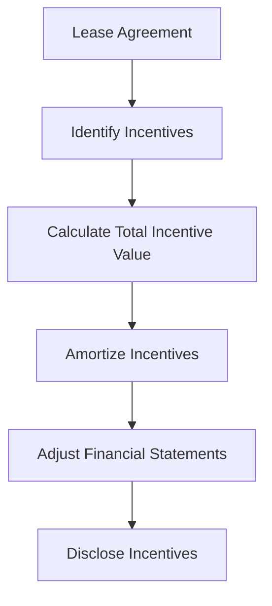

## 7.14 Operating Lease Incentives

Operating lease incentives are a common feature in lease agreements, designed to encourage lessees to enter into leases. These incentives can take various forms, such as rent-free periods, cash payments, or contributions towards leasehold improvements. Understanding the accounting treatment of these incentives is crucial for both lessors and lessees, as it impacts financial reporting and compliance with accounting standards.

### Understanding Operating Lease Incentives

Operating lease incentives are benefits provided by lessors to lessees to make a lease agreement more attractive. These incentives can significantly influence the decision-making process for lessees and affect the financial statements of both parties involved. The accounting for these incentives is governed by specific standards, including the International Financial Reporting Standards (IFRS) and Accounting Standards for Private Enterprises (ASPE) in Canada.

#### Types of Operating Lease Incentives

1. **Rent-free Periods:** Lessees are allowed to occupy the leased asset without paying rent for a specified period.
2. **Cash Payments:** Lessors may provide cash payments to lessees as an incentive to enter into the lease agreement.
3. **Leasehold Improvements:** Contributions towards improvements made to the leased asset, which enhance its value or utility.
4. **Reduced Rent:** Offering a lower rent amount for the initial period of the lease.
5. **Reimbursement of Relocation Costs:** Covering costs associated with moving to the new leased premises.

### Accounting Treatment for Lessees

For lessees, the accounting treatment of operating lease incentives involves recognizing the incentives over the lease term. This ensures that the financial impact of the incentives is spread evenly, aligning with the matching principle in accounting.

#### Recognition and Measurement

- **Initial Recognition:** At the commencement of the lease, lessees should recognize any lease incentives received as a reduction of lease expense over the lease term.
- **Amortization of Incentives:** The total value of the incentives should be amortized on a straight-line basis over the lease term, reducing the periodic lease expense.

#### Practical Example

Consider a lessee who enters into a five-year lease agreement with a rent-free period of six months. The annual rent is $120,000, and the lessee receives a cash incentive of $10,000. The accounting treatment would involve:

- **Total Lease Expense:** $120,000 x 5 years = $600,000
- **Less Incentive:** $10,000
- **Net Lease Expense:** $590,000
- **Amortized Expense per Year:** $590,000 / 5 years = $118,000

The lessee would recognize $118,000 as lease expense each year, reflecting the impact of the incentive.

### Accounting Treatment for Lessors

Lessors must also account for lease incentives, ensuring that the financial statements accurately reflect the economic substance of the lease agreement.

#### Recognition and Measurement

- **Initial Recognition:** Lessors should recognize lease incentives as a reduction in lease income over the lease term.
- **Amortization of Incentives:** Similar to lessees, the incentives should be amortized on a straight-line basis over the lease term, reducing the periodic lease income.

#### Practical Example

A lessor provides a lessee with a rent-free period of six months in a five-year lease agreement with an annual rent of $120,000. The lessor would record:

- **Total Lease Income:** $120,000 x 5 years = $600,000
- **Amortized Income per Year:** $600,000 / 5 years = $120,000

The lessor would recognize $120,000 as lease income each year, adjusted for the rent-free period.

### Impact on Financial Statements

Operating lease incentives impact several aspects of financial statements for both lessees and lessors. Understanding these impacts is crucial for accurate financial reporting and compliance with accounting standards.

#### Lessees

- **Balance Sheet:** Lease incentives may reduce the liability recognized for operating leases.
- **Income Statement:** Lease expenses are reduced by the amortized value of the incentives, impacting net income.
- **Cash Flow Statement:** Cash flow from operating activities may reflect the timing of incentive payments.

#### Lessors

- **Balance Sheet:** Lease incentives may reduce the asset recognized for lease receivables.
- **Income Statement:** Lease income is reduced by the amortized value of the incentives, impacting net income.
- **Cash Flow Statement:** Cash flow from operating activities may reflect the timing of incentive receipts.

### Regulatory Considerations

In Canada, the accounting for operating lease incentives is governed by IFRS for publicly accountable enterprises and ASPE for private enterprises. Key standards include:

- **IFRS 16 Leases:** Provides guidance on the recognition, measurement, and presentation of leases, including incentives.
- **ASPE Section 3065 Leases:** Offers guidance for private enterprises on lease accounting, including the treatment of incentives.

### Best Practices and Common Pitfalls

#### Best Practices

- **Consistent Application:** Ensure consistent application of accounting policies for lease incentives across all lease agreements.
- **Documentation:** Maintain thorough documentation of lease agreements and incentives to support financial reporting.
- **Regular Review:** Periodically review lease agreements to ensure compliance with accounting standards and identify any changes in incentives.

#### Common Pitfalls

- **Incorrect Amortization:** Failing to amortize lease incentives correctly can lead to misstated financial statements.
- **Inadequate Disclosure:** Insufficient disclosure of lease incentives can obscure the true financial position of the entity.
- **Ignoring Changes:** Failing to account for changes in lease agreements or incentives can result in non-compliance with accounting standards.

### Real-world Applications and Case Studies

#### Case Study: Retail Industry

In the retail industry, operating lease incentives are common due to the competitive nature of securing prime retail locations. A retail chain may receive incentives such as rent-free periods or contributions towards store fit-outs. Proper accounting for these incentives ensures accurate financial reporting and compliance with IFRS 16 or ASPE Section 3065.

#### Scenario: Office Lease Agreement

Consider a company entering into an office lease with a rent-free period and cash incentives. The company must account for these incentives over the lease term, reducing lease expenses and ensuring compliance with accounting standards. This scenario highlights the importance of understanding lease incentives and their impact on financial statements.

### Step-by-step Guidance for Accounting Procedures

1. **Identify Lease Incentives:** Review lease agreements to identify any incentives provided by the lessor.
2. **Determine Total Incentive Value:** Calculate the total value of the incentives, including rent-free periods, cash payments, and contributions.
3. **Amortize Incentives:** Spread the total value of the incentives over the lease term on a straight-line basis.
4. **Adjust Financial Statements:** Reflect the amortized value of the incentives in the income statement and balance sheet.
5. **Disclose Incentives:** Provide adequate disclosure of lease incentives in the financial statements, ensuring transparency and compliance with accounting standards.

### Diagrams and Visual Aids

To enhance understanding, consider the following diagram illustrating the flow of accounting for operating lease incentives:

### Summary and Key Points

- Operating lease incentives are benefits provided by lessors to encourage lessees to enter into leases.
- Lessees and lessors must account for these incentives over the lease term, impacting financial statements.
- Compliance with IFRS 16 and ASPE Section 3065 is crucial for accurate financial reporting.
- Best practices include consistent application, thorough documentation, and regular review of lease agreements.
- Common pitfalls include incorrect amortization, inadequate disclosure, and ignoring changes in lease agreements.

### References and Further Reading

- **IFRS 16 Leases:** International Financial Reporting Standards for lease accounting.
- **ASPE Section 3065 Leases:** Accounting Standards for Private Enterprises in Canada.
- **CPA Canada:** Resources and guidance on lease accounting and financial reporting.

## **Ready to Test Your Knowledge?**



### What is an operating lease incentive?

- [x] A benefit provided by lessors to encourage lessees to enter into lease agreements.
- [ ] A penalty imposed on lessees for early termination of a lease.
- [ ] A mandatory payment required by lessors at the end of a lease term.
- [ ] A tax deduction available to lessors for leasing activities.

> **Explanation:** Operating lease incentives are benefits provided by lessors to make lease agreements more attractive to lessees.

### How should lessees account for operating lease incentives?

- [x] As a reduction of lease expense over the lease term.
- [ ] As an immediate gain in the income statement.
- [ ] As a liability on the balance sheet.
- [ ] As an increase in lease income.

> **Explanation:** Lessees should recognize lease incentives as a reduction of lease expense, amortized over the lease term.

### Which standard governs lease accounting for publicly accountable enterprises in Canada?

- [x] IFRS 16 Leases
- [ ] ASPE Section 3065
- [ ] IAS 17 Leases
- [ ] CPA Canada Guidelines

> **Explanation:** IFRS 16 Leases provides guidance on the recognition, measurement, and presentation of leases for publicly accountable enterprises.

### What is a common form of operating lease incentive?

- [x] Rent-free periods
- [ ] Penalty clauses
- [ ] Lease termination fees
- [ ] Security deposits

> **Explanation:** Rent-free periods are a common form of operating lease incentive, allowing lessees to occupy the leased asset without paying rent for a specified period.

### How should lessors account for operating lease incentives?

- [x] As a reduction in lease income over the lease term.
- [ ] As an immediate expense in the income statement.
- [ ] As an asset on the balance sheet.
- [ ] As an increase in lease receivables.

> **Explanation:** Lessors should recognize lease incentives as a reduction in lease income, amortized over the lease term.

### What impact do operating lease incentives have on lessees' financial statements?

- [x] They reduce lease expenses and impact net income.
- [ ] They increase lease liabilities and impact cash flow.
- [ ] They create a new asset category on the balance sheet.
- [ ] They have no impact on financial statements.

> **Explanation:** Operating lease incentives reduce lease expenses, impacting net income and the overall financial position of lessees.

### What is a best practice for accounting for operating lease incentives?

- [x] Consistent application of accounting policies across all lease agreements.
- [ ] Immediate recognition of all incentives as income.
- [ ] Ignoring changes in lease agreements.
- [ ] Minimal disclosure of lease incentives.

> **Explanation:** Consistent application of accounting policies ensures accurate financial reporting and compliance with accounting standards.

### What is a common pitfall in accounting for operating lease incentives?

- [x] Incorrect amortization of incentives.
- [ ] Overstating lease income.
- [ ] Underreporting lease liabilities.
- [ ] Immediate recognition of all incentives as expenses.

> **Explanation:** Incorrect amortization of incentives can lead to misstated financial statements and non-compliance with accounting standards.

### Which Canadian accounting standard provides guidance for private enterprises on lease accounting?

- [x] ASPE Section 3065
- [ ] IFRS 16 Leases
- [ ] IAS 17 Leases
- [ ] CPA Canada Guidelines

> **Explanation:** ASPE Section 3065 offers guidance for private enterprises in Canada on lease accounting, including the treatment of incentives.

### True or False: Operating lease incentives must be disclosed in financial statements.

- [x] True
- [ ] False

> **Explanation:** Adequate disclosure of operating lease incentives is essential for transparency and compliance with accounting standards.


