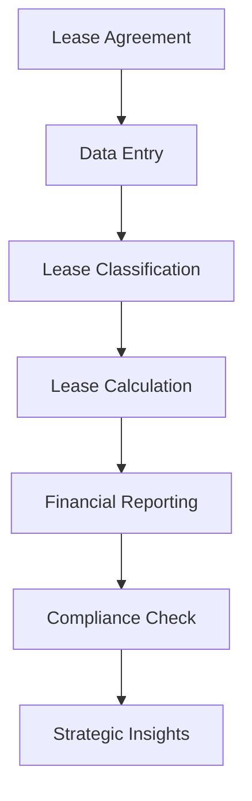

## 7.15 Lease Accounting Technology

In the modern accounting landscape, technology plays a pivotal role in streamlining complex processes and ensuring compliance with stringent regulatory requirements. Lease accounting, governed by standards such as ASC 842 and IFRS 16, is one area where technology has significantly transformed traditional practices. This section explores the role of lease accounting technology, focusing on software solutions that enhance compliance, improve efficiency, and provide strategic insights for Canadian accountants.

### Understanding Lease Accounting Standards

Before delving into the technological aspects, it's crucial to understand the lease accounting standards that drive the need for advanced solutions. ASC 842 and IFRS 16 require organizations to recognize lease assets and liabilities on the balance sheet, a shift from the previous off-balance-sheet treatment for operating leases. This change necessitates detailed tracking and reporting of lease agreements, making technology an indispensable tool.

### The Role of Technology in Lease Accounting

Lease accounting technology encompasses a range of software solutions designed to automate and simplify the lease management process. These solutions offer several benefits:

1. **Compliance Automation**: Technology ensures adherence to ASC 842 and IFRS 16 by automating the calculation of lease liabilities and right-of-use assets. This reduces the risk of errors and non-compliance.

2. **Data Centralization**: Lease accounting software centralizes lease data, providing a single source of truth. This facilitates accurate reporting and decision-making.

3. **Efficiency and Time Savings**: Automation of lease calculations and reporting tasks saves time and reduces the administrative burden on accounting teams.

4. **Strategic Insights**: Advanced analytics and reporting capabilities offer insights into lease portfolios, helping organizations optimize lease management and financial planning.

5. **Scalability**: As organizations grow, lease accounting technology can scale to accommodate increasing volumes of lease data without compromising performance.

### Key Features of Lease Accounting Software

When selecting lease accounting software, organizations should consider the following key features:

- **Lease Classification and Calculation**: The software should accurately classify leases as finance or operating and calculate lease liabilities and right-of-use assets.

- **Integration Capabilities**: Seamless integration with existing ERP systems and financial software ensures data consistency and reduces manual data entry.

- **Reporting and Disclosure**: Comprehensive reporting tools that generate required disclosures under ASC 842 and IFRS 16 are essential for compliance.

- **Audit Trail and Security**: Robust security features and audit trails ensure data integrity and facilitate audits.

- **User-Friendly Interface**: An intuitive interface enhances user experience and reduces the learning curve for accounting teams.

### Practical Examples and Case Studies

Consider a Canadian retail chain with a vast portfolio of store leases. Implementing lease accounting software enabled the chain to automate lease calculations, ensuring compliance with IFRS 16. The software's reporting capabilities provided insights into lease expenses and cash flow impacts, aiding strategic decision-making.

In another scenario, a multinational corporation faced challenges in consolidating lease data across various subsidiaries. Lease accounting technology centralized lease information, improving data accuracy and facilitating compliance with both ASC 842 and IFRS 16.

### Real-World Applications and Regulatory Scenarios

Lease accounting technology is particularly beneficial in scenarios involving complex lease agreements, such as sale and leaseback transactions or leases with variable payments. The software's ability to handle these complexities ensures accurate reporting and compliance.

In Canada, organizations must adhere to IFRS standards, making it essential to choose software that supports IFRS 16 requirements. Additionally, Canadian companies operating internationally may need solutions that accommodate both IFRS and ASC standards.

### Step-by-Step Guidance for Implementing Lease Accounting Software

1. **Assess Organizational Needs**: Evaluate the volume and complexity of lease agreements to determine the necessary features and capabilities of the software.

2. **Select the Right Solution**: Choose software that aligns with organizational needs and integrates with existing systems.

3. **Data Migration and Setup**: Migrate lease data into the software, ensuring accuracy and completeness.

4. **User Training and Support**: Provide comprehensive training to accounting teams to maximize the software's benefits.

5. **Continuous Monitoring and Updates**: Regularly update the software to incorporate regulatory changes and enhance functionality.

### Diagrams and Visual Aids

To enhance understanding, consider the following diagram illustrating the lease accounting process using technology:

### Best Practices and Common Pitfalls

- **Regularly Update Software**: Ensure the software is updated to reflect changes in accounting standards and regulations.

- **Thorough Data Validation**: Validate lease data before and after migration to prevent errors.

- **Comprehensive Training**: Invest in training to ensure accounting teams are proficient in using the software.

- **Monitor Regulatory Changes**: Stay informed about changes in lease accounting standards to maintain compliance.

### References and Additional Resources

For further exploration, consider the following resources:

- CPA Canada's guidelines on IFRS 16 compliance
- Software vendor documentation and user guides
- Online forums and communities for lease accounting professionals

### Encouraging Application Through Practice

To reinforce learning, consider the following practice exercise:

**Exercise:** Using a lease accounting software demo, input a sample lease agreement and generate the required financial reports under IFRS 16. Analyze the impact on the balance sheet and income statement.

### Summary and Key Points

In summary, lease accounting technology is a vital tool for organizations navigating the complexities of ASC 842 and IFRS 16. By automating compliance, centralizing data, and providing strategic insights, these solutions enhance efficiency and accuracy in lease management.

### Ready to Test Your Knowledge?



### What is a primary benefit of using lease accounting technology?

- [x] Automating compliance with ASC 842 and IFRS 16
- [ ] Increasing manual data entry tasks
- [ ] Reducing the need for financial reporting
- [ ] Eliminating the need for audits

> **Explanation:** Lease accounting technology automates compliance with standards like ASC 842 and IFRS 16, reducing errors and ensuring accurate reporting.

### Which feature is essential for lease accounting software?

- [x] Integration with existing ERP systems
- [ ] Manual data entry
- [ ] Limited reporting capabilities
- [ ] Lack of security features

> **Explanation:** Integration with ERP systems ensures data consistency and reduces manual data entry, enhancing efficiency.

### What should organizations consider when selecting lease accounting software?

- [x] The volume and complexity of lease agreements
- [ ] The number of employees in the organization
- [ ] The location of the company's headquarters
- [ ] The color scheme of the software interface

> **Explanation:** The volume and complexity of lease agreements determine the necessary features and capabilities of the software.

### How does lease accounting technology provide strategic insights?

- [x] Through advanced analytics and reporting capabilities
- [ ] By reducing the need for financial statements
- [ ] By eliminating lease agreements
- [ ] Through manual calculations

> **Explanation:** Advanced analytics and reporting capabilities offer insights into lease portfolios, aiding strategic decision-making.

### What is a common pitfall when implementing lease accounting software?

- [x] Failing to validate lease data before migration
- [ ] Providing comprehensive training to users
- [ ] Regularly updating the software
- [ ] Monitoring regulatory changes

> **Explanation:** Failing to validate lease data can lead to errors and inaccuracies in financial reporting.

### Which Canadian standard must organizations adhere to for lease accounting?

- [x] IFRS 16
- [ ] ASC 842
- [ ] GAAP
- [ ] SOX

> **Explanation:** Canadian organizations must adhere to IFRS 16 for lease accounting compliance.

### What is the role of technology in lease classification?

- [x] Accurately classifying leases as finance or operating
- [ ] Eliminating the need for lease classification
- [ ] Increasing the complexity of lease agreements
- [ ] Reducing the need for financial reporting

> **Explanation:** Technology accurately classifies leases, ensuring compliance with accounting standards.

### How can lease accounting technology aid in audit processes?

- [x] By providing robust security features and audit trails
- [ ] By eliminating the need for audits
- [ ] By reducing data accuracy
- [ ] By increasing manual calculations

> **Explanation:** Security features and audit trails ensure data integrity and facilitate audits.

### What is a benefit of data centralization in lease accounting software?

- [x] Providing a single source of truth for lease data
- [ ] Increasing the need for manual data entry
- [ ] Reducing data accuracy
- [ ] Eliminating the need for financial reporting

> **Explanation:** Data centralization provides a single source of truth, enhancing accuracy and decision-making.

### True or False: Lease accounting technology can scale with organizational growth.

- [x] True
- [ ] False

> **Explanation:** Lease accounting technology is scalable, accommodating increasing volumes of lease data as organizations grow.


