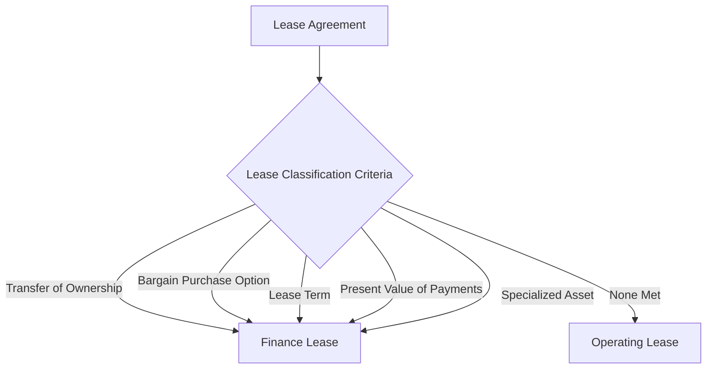

## 7.2 Lessor Accounting

Lessor accounting is a crucial aspect of financial reporting, especially for those preparing for Canadian accounting exams. This section delves into the classification of leases by lessors, the recognition of lease income, and the application of relevant accounting standards. Understanding these concepts is essential for accurate financial reporting and compliance with Canadian regulations.

### Understanding Lessor Accounting

Lessor accounting involves the recognition and measurement of lease transactions from the perspective of the lessor. It requires a thorough understanding of the lease classification process, income recognition, and the impact of leases on financial statements. The primary accounting standards governing lessor accounting are IFRS 16 (International Financial Reporting Standards) and ASC 842 (Accounting Standards Codification) in the United States, which have been adopted in Canada.

### Lease Classification by Lessors

Lease classification is the first step in lessor accounting. Lessors must determine whether a lease is classified as an operating lease or a finance lease. This classification affects how lease income is recognized and reported.

#### Criteria for Lease Classification

Under IFRS 16 and ASC 842, a lease is classified as a finance lease if it transfers substantially all the risks and rewards incidental to ownership of the underlying asset. Otherwise, it is classified as an operating lease. The following criteria help determine the classification:

1. **Transfer of Ownership:** If the lease transfers ownership of the asset to the lessee by the end of the lease term, it is a finance lease.

2. **Bargain Purchase Option:** If the lessee has the option to purchase the asset at a price significantly lower than its fair value, it is a finance lease.

3. **Lease Term:** If the lease term covers the major part of the asset's economic life, it is a finance lease.

4. **Present Value of Lease Payments:** If the present value of lease payments amounts to substantially all of the asset's fair value, it is a finance lease.

5. **Specialized Nature of the Asset:** If the asset is of such a specialized nature that only the lessee can use it without major modifications, it is a finance lease.

If none of these criteria are met, the lease is classified as an operating lease.

#### Practical Example of Lease Classification

Consider a company, ABC Ltd., that leases a piece of machinery to XYZ Corp. for five years. The machinery has a useful life of seven years. The lease agreement includes a bargain purchase option allowing XYZ Corp. to purchase the machinery at the end of the lease term for a nominal amount. In this case, the lease would be classified as a finance lease because it meets the criteria of a bargain purchase option and covers the major part of the asset's economic life.

### Recognition of Lease Income

Once the lease classification is determined, the next step is recognizing lease income. The method of income recognition depends on whether the lease is classified as an operating lease or a finance lease.

#### Operating Lease Income Recognition

For operating leases, lease income is recognized on a straight-line basis over the lease term unless another systematic basis is more representative of the time pattern in which use benefit derived from the leased asset is diminished.

**Example:**

Suppose a lessor leases office space to a tenant for a period of three years. The annual lease payment is $10,000. The lessor would recognize $10,000 as lease income each year, assuming a straight-line basis is appropriate.

#### Finance Lease Income Recognition

For finance leases, the lessor recognizes interest income over the lease term based on a pattern reflecting a constant periodic rate of return on the lessor's net investment in the lease.

**Example:**

Consider a lessor who leases equipment to a lessee under a finance lease. The present value of lease payments is $50,000, and the interest rate implicit in the lease is 5%. The lessor would recognize interest income on the lease by applying the 5% rate to the net investment in the lease, adjusting for lease payments received.

### Financial Statement Impact

The classification and recognition of leases have significant implications for a lessor's financial statements. 

#### Operating Leases

- **Balance Sheet:** The leased asset remains on the lessor's balance sheet, and depreciation is recognized over the asset's useful life.
- **Income Statement:** Lease income is recognized on a straight-line basis, and depreciation expense is recorded.

#### Finance Leases

- **Balance Sheet:** The lessor recognizes a receivable equal to the net investment in the lease.
- **Income Statement:** Interest income is recognized over the lease term, and the asset is derecognized.

### Regulatory Framework and Compliance

Lessor accounting must comply with the relevant accounting standards and regulations. In Canada, IFRS 16 is the primary standard for lease accounting, with specific guidance for lessors. Lessors must ensure that their accounting practices align with these standards to maintain compliance and provide accurate financial reporting.

### Ethical Considerations

Ethical considerations in lessor accounting involve ensuring transparency and accuracy in financial reporting. Lessors must avoid manipulating lease classifications to achieve desired financial outcomes. Adhering to ethical standards and professional guidelines is essential for maintaining trust and integrity in financial reporting.

### Challenges and Best Practices

Lessor accounting can present challenges, particularly in determining lease classification and recognizing lease income. Best practices include:

- **Thorough Analysis:** Conduct a detailed analysis of lease agreements to determine the appropriate classification.
- **Consistent Application:** Apply accounting standards consistently to ensure accurate financial reporting.
- **Regular Review:** Regularly review lease agreements and accounting policies to ensure compliance with current standards.

### Case Study: Lessor Accounting in Practice

Consider a real-world scenario where a lessor, DEF Corp., leases a fleet of vehicles to a logistics company, GHI Ltd. The lease agreement includes a clause allowing GHI Ltd. to purchase the vehicles at the end of the lease term for a nominal amount. DEF Corp. must determine whether the lease is a finance lease or an operating lease based on the criteria outlined earlier. After analysis, DEF Corp. classifies the lease as a finance lease and recognizes interest income over the lease term.

### Diagrams and Visuals

To enhance understanding, let's use a diagram to illustrate the lease classification process:

### Conclusion

Lessor accounting is a vital component of financial reporting, requiring a comprehensive understanding of lease classification and income recognition. By adhering to accounting standards and ethical guidelines, lessors can ensure accurate and transparent financial reporting. This knowledge is essential for those preparing for Canadian accounting exams and pursuing a career in accounting.

---

## **Ready to Test Your Knowledge?**



### Which of the following criteria would classify a lease as a finance lease?

- [x] Transfer of ownership at the end of the lease term
- [ ] Lease term is less than the asset's economic life
- [ ] Lease payments are variable
- [ ] Asset is not specialized

> **Explanation:** A lease is classified as a finance lease if it transfers ownership of the asset to the lessee by the end of the lease term.

### How is lease income recognized for an operating lease?

- [x] On a straight-line basis over the lease term
- [ ] As interest income
- [ ] At the end of the lease term
- [ ] Based on the fair value of the asset

> **Explanation:** Lease income for operating leases is recognized on a straight-line basis over the lease term unless another systematic basis is more representative.

### What is the primary standard for lease accounting in Canada?

- [x] IFRS 16
- [ ] ASC 842
- [ ] ASPE
- [ ] GAAP

> **Explanation:** IFRS 16 is the primary standard for lease accounting in Canada.

### In a finance lease, how is interest income recognized?

- [x] Over the lease term based on a constant periodic rate of return
- [ ] As a lump sum at the beginning of the lease
- [ ] Only if the lessee defaults
- [ ] At the end of the lease term

> **Explanation:** Interest income in a finance lease is recognized over the lease term based on a constant periodic rate of return on the lessor's net investment.

### Which of the following is NOT a criterion for classifying a lease as a finance lease?

- [ ] Transfer of ownership
- [ ] Bargain purchase option
- [ ] Lease term covers major part of asset's life
- [x] Lease payments are made monthly

> **Explanation:** Monthly lease payments are not a criterion for classifying a lease as a finance lease.

### What happens to the leased asset in an operating lease?

- [x] It remains on the lessor's balance sheet
- [ ] It is transferred to the lessee's balance sheet
- [ ] It is sold to a third party
- [ ] It is written off

> **Explanation:** In an operating lease, the leased asset remains on the lessor's balance sheet.

### How should a lessor handle a lease with a bargain purchase option?

- [x] Classify it as a finance lease
- [ ] Classify it as an operating lease
- [ ] Defer income recognition
- [ ] Recognize income upfront

> **Explanation:** A lease with a bargain purchase option is classified as a finance lease.

### What is the impact of a finance lease on the lessor's balance sheet?

- [x] Recognize a receivable equal to the net investment
- [ ] Recognize the leased asset
- [ ] Recognize lease payments as liabilities
- [ ] Recognize lease income as equity

> **Explanation:** In a finance lease, the lessor recognizes a receivable equal to the net investment in the lease.

### Which accounting standard is adopted in Canada for lease accounting?

- [x] IFRS 16
- [ ] ASC 842
- [ ] ASPE
- [ ] GAAP

> **Explanation:** IFRS 16 is adopted in Canada for lease accounting.

### True or False: A lease with a specialized asset that only the lessee can use is classified as an operating lease.

- [ ] True
- [x] False

> **Explanation:** A lease with a specialized asset that only the lessee can use is classified as a finance lease.


