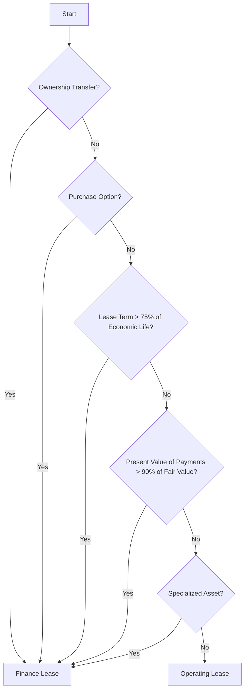

## 7.3 Lease Classification Tests

### Introduction

Lease classification is a critical aspect of accounting for leases, as it determines how leases are recognized and reported in financial statements. The classification affects both the lessee's and lessor's financial statements, impacting balance sheets, income statements, and cash flow statements. This section will explore the criteria used to determine whether a lease is classified as a finance lease (also known as a capital lease) or an operating lease under the relevant accounting standards, including IFRS 16 and ASC 842.

### Understanding Lease Classification

Lease classification involves evaluating the terms and conditions of a lease agreement to determine the appropriate accounting treatment. The classification hinges on whether the lease transfers substantially all the risks and rewards incidental to ownership of the underlying asset to the lessee. If it does, the lease is classified as a finance lease. If not, it is classified as an operating lease.

### Key Accounting Standards

#### IFRS 16 Leases

Under IFRS 16, which is applicable in Canada and many other jurisdictions, lessees are required to recognize nearly all leases on the balance sheet as right-of-use assets and lease liabilities. The distinction between finance and operating leases primarily affects lessors under IFRS 16.

#### ASC 842 Leases

ASC 842, which is the lease accounting standard under U.S. GAAP, requires lessees to recognize lease assets and liabilities for most leases. However, it retains the distinction between finance and operating leases for both lessees and lessors.

### Criteria for Lease Classification

The criteria for classifying a lease as a finance lease or an operating lease are similar under both IFRS 16 and ASC 842, although there are some differences in application. The following are the main criteria used to determine lease classification:

1. **Transfer of Ownership**: If the lease transfers ownership of the underlying asset to the lessee by the end of the lease term, it is classified as a finance lease.

2. **Purchase Option**: If the lessee has an option to purchase the asset at a price that is expected to be sufficiently lower than the fair value at the date the option becomes exercisable, and it is reasonably certain that the lessee will exercise this option, the lease is classified as a finance lease.

3. **Lease Term**: If the lease term is for the major part of the economic life of the asset, even if title is not transferred, the lease is classified as a finance lease. The term "major part" is generally interpreted as 75% or more of the asset's economic life.

4. **Present Value of Lease Payments**: If the present value of the lease payments amounts to at least substantially all of the fair value of the underlying asset, the lease is classified as a finance lease. "Substantially all" is typically interpreted as 90% or more.

5. **Specialized Nature of the Asset**: If the underlying asset is of such a specialized nature that only the lessee can use it without major modifications, the lease is classified as a finance lease.

6. **Alternative Use**: Under IFRS 16, if the lessor does not have an alternative use for the asset at the end of the lease term, it may indicate a finance lease.

### Practical Examples and Scenarios

#### Example 1: Transfer of Ownership

Consider a lease agreement for a piece of machinery with a lease term of 10 years. The lease agreement explicitly states that ownership of the machinery will transfer to the lessee at the end of the lease term. In this case, the lease would be classified as a finance lease because ownership is transferred.

#### Example 2: Purchase Option

A company leases a vehicle for five years with an option to purchase the vehicle at the end of the lease term for $1,000. The fair value of the vehicle at the end of the lease term is expected to be $10,000. Given the significant discount, it is reasonably certain that the lessee will exercise the purchase option, classifying the lease as a finance lease.

#### Example 3: Lease Term

A company leases office equipment for seven years. The economic life of the equipment is estimated to be eight years. Since the lease term covers the major part of the economic life of the equipment (87.5%), the lease is classified as a finance lease.

#### Example 4: Present Value of Lease Payments

A company leases a building for 15 years with annual lease payments of $100,000. The fair value of the building is $1,200,000. The present value of the lease payments, using a discount rate of 5%, is $1,050,000. Since the present value of the lease payments is 87.5% of the fair value of the building, the lease is classified as a finance lease.

#### Example 5: Specialized Nature of the Asset

A company leases a custom-built manufacturing plant for 20 years. The plant is designed specifically for the lessee's production process and cannot be easily modified for other uses. This specialized nature indicates a finance lease classification.

### Real-World Applications and Regulatory Scenarios

In practice, lease classification can have significant implications for financial reporting and compliance. For instance, a finance lease results in the recognition of both an asset and a liability on the balance sheet, affecting key financial ratios such as debt-to-equity and return on assets. This can influence a company's ability to obtain financing or comply with debt covenants.

Regulatory bodies, such as CPA Canada, provide guidance on lease classification to ensure consistency and transparency in financial reporting. Companies must carefully evaluate lease agreements against the classification criteria and document their assessments to support their accounting decisions.

### Step-by-Step Guidance for Lease Classification

1. **Review the Lease Agreement**: Carefully examine the terms and conditions of the lease agreement to identify any clauses related to ownership transfer, purchase options, lease term, and payment structure.

2. **Assess Ownership Transfer and Purchase Options**: Determine if the lease transfers ownership or includes a purchase option that is reasonably certain to be exercised.

3. **Evaluate Lease Term and Economic Life**: Compare the lease term to the economic life of the asset to assess whether it constitutes the major part.

4. **Calculate Present Value of Lease Payments**: Use an appropriate discount rate to calculate the present value of the lease payments and compare it to the fair value of the asset.

5. **Consider the Asset's Specialized Nature**: Assess whether the asset is specialized and whether the lessor has an alternative use for it at the end of the lease term.

6. **Document the Classification Decision**: Prepare documentation to support the lease classification decision, including calculations, assumptions, and rationale.

### Diagrams and Visual Aids

To enhance understanding, the following Mermaid.js diagram illustrates the lease classification decision process:

### Best Practices and Common Pitfalls

- **Best Practices**:
  - Regularly review and update lease classification policies to align with current accounting standards.
  - Engage with legal and accounting professionals to interpret complex lease agreements.
  - Use software tools to automate lease classification calculations and documentation.

- **Common Pitfalls**:
  - Failing to reassess lease classification when lease terms are modified.
  - Overlooking the impact of lease classification on financial ratios and covenants.
  - Misinterpreting the criteria for lease classification, leading to incorrect financial reporting.

### References and Additional Resources

- **IFRS 16 Leases**: International Financial Reporting Standards as adopted in Canada.
- **ASC 842 Leases**: U.S. GAAP lease accounting standard.
- **CPA Canada**: Guidance on lease accounting and financial reporting.
- **Additional Study Materials**: Practice exams, online courses, and CPA Canada resources for deeper insights into lease classification.

### Summary

Lease classification is a fundamental aspect of lease accounting that affects financial reporting and compliance. By understanding the criteria for classifying leases as finance or operating leases, accountants can ensure accurate and transparent financial statements. This section has provided a comprehensive overview of lease classification tests, practical examples, and best practices to help you succeed in your Canadian Accounting Exams and professional practice.

## **Ready to Test Your Knowledge?**



### Which of the following criteria would classify a lease as a finance lease?

- [x] Transfer of ownership at the end of the lease term
- [ ] Lease term is less than 50% of the asset's economic life
- [ ] Lease payments are less than 50% of the asset's fair value
- [ ] Asset is not specialized

> **Explanation:** A lease is classified as a finance lease if ownership is transferred to the lessee at the end of the lease term.

### Under IFRS 16, which party is primarily affected by the distinction between finance and operating leases?

- [ ] Lessees
- [x] Lessors
- [ ] Both lessees and lessors
- [ ] Neither lessees nor lessors

> **Explanation:** Under IFRS 16, the distinction between finance and operating leases primarily affects lessors, as lessees recognize nearly all leases on the balance sheet.

### What is the typical interpretation of "major part" in the context of lease term compared to the asset's economic life?

- [ ] 50%
- [x] 75%
- [ ] 90%
- [ ] 100%

> **Explanation:** "Major part" is generally interpreted as 75% or more of the asset's economic life.

### If the present value of lease payments is 85% of the asset's fair value, how is the lease classified?

- [ ] Finance lease
- [x] Operating lease
- [ ] Cannot be determined
- [ ] Both finance and operating lease

> **Explanation:** A lease is classified as a finance lease if the present value of lease payments is at least 90% of the asset's fair value. In this case, it is an operating lease.

### A lease with a purchase option at a significant discount is likely to be classified as:

- [x] Finance lease
- [ ] Operating lease
- [ ] Sale leaseback
- [ ] Service contract

> **Explanation:** If a purchase option is at a significant discount and is reasonably certain to be exercised, the lease is classified as a finance lease.

### Which of the following is NOT a criterion for lease classification?

- [ ] Transfer of ownership
- [ ] Purchase option
- [ ] Lease term
- [x] Lease location

> **Explanation:** Lease location is not a criterion for lease classification. The criteria focus on ownership transfer, purchase options, lease term, and payment structure.

### What is the impact of lease classification on financial ratios?

- [x] It affects key financial ratios such as debt-to-equity and return on assets.
- [ ] It has no impact on financial ratios.
- [ ] It only affects the income statement.
- [ ] It only affects cash flow statements.

> **Explanation:** Lease classification affects balance sheet items, impacting key financial ratios such as debt-to-equity and return on assets.

### Which standard requires lessees to recognize nearly all leases on the balance sheet?

- [x] IFRS 16
- [ ] ASC 842
- [ ] Both IFRS 16 and ASC 842
- [ ] Neither IFRS 16 nor ASC 842

> **Explanation:** IFRS 16 requires lessees to recognize nearly all leases on the balance sheet as right-of-use assets and lease liabilities.

### How should a lease be classified if the asset is of a specialized nature?

- [x] Finance lease
- [ ] Operating lease
- [ ] Service contract
- [ ] Cannot be determined

> **Explanation:** If the asset is of a specialized nature and only the lessee can use it without major modifications, the lease is classified as a finance lease.

### True or False: Under ASC 842, the distinction between finance and operating leases affects both lessees and lessors.

- [x] True
- [ ] False

> **Explanation:** Under ASC 842, the distinction between finance and operating leases affects both lessees and lessors, as both must recognize lease assets and liabilities.


