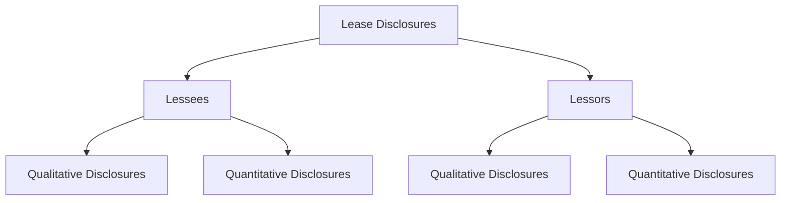

## 7.8 Disclosures Related to Leases

In the realm of accounting, lease disclosures play a pivotal role in ensuring transparency and providing stakeholders with a comprehensive understanding of a company's leasing activities. This section delves into the disclosure requirements under the International Financial Reporting Standards (IFRS 16) and the Accounting Standards Codification (ASC 842), which are pivotal for Canadian accounting exams. By mastering these disclosures, you will be well-prepared to tackle related exam questions and apply this knowledge in professional practice.

### Understanding Lease Disclosures

Lease disclosures are designed to provide users of financial statements with relevant information about the impact of leases on an entity's financial position, performance, and cash flows. These disclosures are crucial for both lessees and lessors, and they encompass a wide range of qualitative and quantitative information.

#### Key Objectives of Lease Disclosures

1. **Transparency:** Ensure that stakeholders have a clear view of the entity's leasing activities and their financial implications.
2. **Comparability:** Allow users to compare leasing activities across different entities and periods.
3. **Decision-Making:** Provide information that aids stakeholders in making informed decisions regarding the entity.

### Lessee Disclosures

Under IFRS 16 and ASC 842, lessees are required to disclose a variety of information to provide a comprehensive view of their leasing arrangements. These disclosures include both qualitative and quantitative aspects.

#### Qualitative Disclosures

1. **Nature of Leasing Activities:** Describe the nature and extent of leasing activities, including significant terms and conditions of lease contracts.
2. **Variable Lease Payments:** Explain the basis for variable lease payments and any restrictions or covenants imposed by leases.
3. **Options and Guarantees:** Disclose information about options to extend or terminate leases and residual value guarantees.

#### Quantitative Disclosures

1. **Lease Liabilities:** Present a maturity analysis of lease liabilities, showing the undiscounted cash flows for each of the first five years and the total thereafter.
2. **Right-of-Use Assets:** Provide a reconciliation of the opening and closing balances of right-of-use assets, including additions, depreciation, and impairments.
3. **Lease Expenses:** Disclose the total cash outflow for leases, short-term lease expenses, and low-value asset lease expenses.

### Lessor Disclosures

Lessors, under IFRS 16 and ASC 842, must also provide detailed disclosures to give users insight into their leasing activities.

#### Qualitative Disclosures

1. **Lease Portfolio:** Describe the nature of the lessor's leasing activities and the significant terms of lease agreements.
2. **Risk Management:** Explain the risk management strategies related to residual value risk and credit risk.

#### Quantitative Disclosures

1. **Lease Income:** Disclose the components of lease income, including variable lease payments and income from subleasing.
2. **Maturity Analysis:** Provide a maturity analysis of lease payments receivable, similar to the lessee's disclosure of lease liabilities.
3. **Residual Value Risk:** Detail any residual value guarantees provided to lessees.

### Practical Examples and Case Studies

To illustrate the application of these disclosure requirements, let's consider a practical example of a Canadian company, MapleTech Inc., which has both lessee and lessor arrangements.

#### Example: MapleTech Inc.

**Lessee Disclosures:**

- **Nature of Leasing Activities:** MapleTech leases office space and equipment. The lease agreements include options to extend the lease term and variable lease payments based on usage.
- **Quantitative Disclosures:** MapleTech discloses a maturity analysis of its lease liabilities, showing significant payments in the first three years due to a major office lease.

**Lessor Disclosures:**

- **Lease Portfolio:** MapleTech acts as a lessor for its IT equipment, offering leases with options for purchase at the end of the term.
- **Quantitative Disclosures:** The company provides a maturity analysis of lease payments receivable, highlighting the expected cash inflows from its leasing activities.

### Real-World Applications and Regulatory Scenarios

In practice, lease disclosures have significant implications for financial reporting and compliance. Companies must ensure that their disclosures align with the requirements of IFRS 16 and ASC 842, as adopted in Canada. This alignment is crucial for maintaining transparency and meeting regulatory expectations.

#### Compliance Considerations

1. **Consistency:** Ensure that lease disclosures are consistent with other financial statement elements, such as revenue recognition and asset impairment.
2. **Audit and Assurance:** Lease disclosures are subject to audit scrutiny, requiring companies to maintain accurate records and documentation.

### Step-by-Step Guidance for Preparing Lease Disclosures

1. **Identify Lease Contracts:** Begin by identifying all lease contracts and determining whether they fall within the scope of IFRS 16 or ASC 842.
2. **Gather Data:** Collect relevant data on lease terms, payments, and options to prepare both qualitative and quantitative disclosures.
3. **Prepare Disclosures:** Draft the required disclosures, ensuring clarity and completeness. Use tables and charts to present quantitative information effectively.

### Diagrams and Visual Aids

To enhance understanding, let's use a Mermaid.js diagram to illustrate the relationship between lessee and lessor disclosures:

### Best Practices, Common Pitfalls, and Strategies

#### Best Practices

- **Clarity and Precision:** Ensure that disclosures are clear, precise, and free from ambiguity.
- **Regular Updates:** Regularly update lease disclosures to reflect changes in leasing arrangements or accounting standards.

#### Common Pitfalls

- **Incomplete Disclosures:** Avoid omitting critical information, such as maturity analyses or variable lease payment details.
- **Inconsistent Information:** Ensure consistency between lease disclosures and other financial statement elements.

#### Strategies for Success

- **Use Templates:** Utilize disclosure templates to ensure all required information is included.
- **Engage Stakeholders:** Collaborate with stakeholders, including auditors and legal advisors, to ensure comprehensive disclosures.

### References and Additional Resources

- **IFRS 16 Leases:** Access the full text of IFRS 16 for detailed guidance on lease disclosures.
- **CPA Canada Resources:** Explore CPA Canada's resources for additional insights into lease accounting and disclosures.
- **Practice Exams:** Utilize practice exams to test your understanding of lease disclosures and prepare for the Canadian accounting exams.

### Summary and Key Points

In summary, lease disclosures are a critical component of financial reporting, providing stakeholders with essential information about an entity's leasing activities. By mastering both qualitative and quantitative disclosures, you will be well-prepared for the Canadian accounting exams and equipped to apply this knowledge in professional practice.

### Ready to Test Your Knowledge?



### Which of the following is a qualitative disclosure requirement for lessees under IFRS 16?

- [x] Nature of leasing activities
- [ ] Maturity analysis of lease liabilities
- [ ] Reconciliation of right-of-use assets
- [ ] Total cash outflow for leases

> **Explanation:** The nature of leasing activities is a qualitative disclosure requirement that provides insight into the lessee's leasing arrangements.

### What is the purpose of providing a maturity analysis of lease liabilities?

- [x] To show the undiscounted cash flows for each of the first five years and the total thereafter
- [ ] To disclose the total cash outflow for leases
- [ ] To explain the basis for variable lease payments
- [ ] To describe the nature of leasing activities

> **Explanation:** A maturity analysis of lease liabilities provides a breakdown of future lease payments, enhancing transparency and aiding stakeholders in understanding the lessee's financial obligations.

### Which standard governs lease disclosures for lessees and lessors in Canada?

- [x] IFRS 16
- [ ] ASC 842
- [ ] ASPE 3065
- [ ] GAAP

> **Explanation:** IFRS 16 is the standard that governs lease disclosures for both lessees and lessors in Canada, providing comprehensive guidance on reporting requirements.

### Which of the following is a quantitative disclosure requirement for lessors?

- [x] Maturity analysis of lease payments receivable
- [ ] Nature of leasing activities
- [ ] Risk management strategies
- [ ] Options to extend or terminate leases

> **Explanation:** A maturity analysis of lease payments receivable is a quantitative disclosure requirement that provides insight into the lessor's expected cash inflows from leasing activities.

### What should lessees disclose about variable lease payments?

- [x] The basis for variable lease payments
- [ ] The total cash outflow for leases
- [x] Any restrictions or covenants imposed by leases
- [ ] A reconciliation of right-of-use assets

> **Explanation:** Lessees must disclose the basis for variable lease payments and any restrictions or covenants, providing stakeholders with a clear understanding of the lessee's financial commitments.

### Which of the following is a best practice for preparing lease disclosures?

- [x] Ensure clarity and precision
- [ ] Omit critical information
- [ ] Provide inconsistent information
- [ ] Avoid using templates

> **Explanation:** Ensuring clarity and precision in lease disclosures is a best practice that enhances transparency and aids stakeholders in understanding the entity's leasing activities.

### What is a common pitfall in lease disclosures?

- [x] Incomplete disclosures
- [ ] Regular updates
- [ ] Consistent information
- [ ] Engaging stakeholders

> **Explanation:** Incomplete disclosures are a common pitfall that can lead to misunderstandings and misinterpretations of the entity's leasing activities.

### Which of the following strategies can help ensure comprehensive lease disclosures?

- [x] Use templates
- [ ] Omit critical information
- [ ] Provide inconsistent information
- [ ] Avoid engaging stakeholders

> **Explanation:** Using templates can help ensure comprehensive lease disclosures by providing a structured format that includes all required information.

### What is the role of auditors in lease disclosures?

- [x] To scrutinize lease disclosures for accuracy and completeness
- [ ] To prepare lease disclosures
- [ ] To provide inconsistent information
- [ ] To omit critical information

> **Explanation:** Auditors play a crucial role in scrutinizing lease disclosures to ensure they are accurate, complete, and compliant with accounting standards.

### True or False: Lease disclosures are only required for lessees, not lessors.

- [ ] True
- [x] False

> **Explanation:** False. Lease disclosures are required for both lessees and lessors to provide a comprehensive view of leasing activities and their financial implications.


