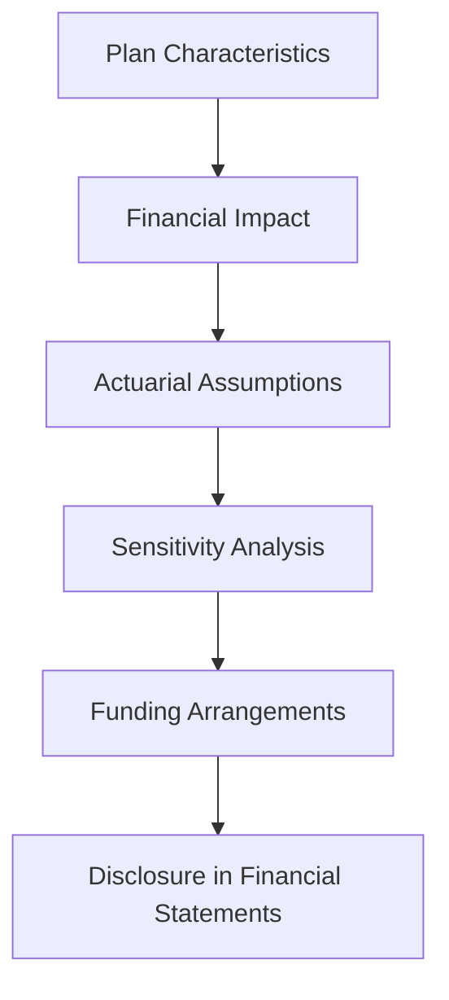

## 8.11 Employee Benefit Plan Disclosures

Employee benefit plan disclosures are a critical component of financial reporting, providing stakeholders with essential information about the obligations and costs associated with pension plans and other post-employment benefits. This section delves into the disclosure requirements as per Canadian accounting standards, specifically focusing on International Financial Reporting Standards (IFRS) as adopted in Canada, and Accounting Standards for Private Enterprises (ASPE). Understanding these disclosures is vital for preparing for the Canadian Accounting Exams and for practical application in the field.

### Understanding Employee Benefit Plans

Employee benefit plans encompass a range of benefits provided to employees, including pensions, health insurance, and other post-employment benefits. These plans can be categorized into defined benefit plans and defined contribution plans. 

- **Defined Benefit Plans:** These plans promise a specified monthly benefit upon retirement, which is often based on salary and years of service. The employer bears the investment risk.
  
- **Defined Contribution Plans:** In these plans, the employer contributes a fixed amount or percentage of salary to an individual account for each employee. The retirement benefit depends on the account balance, which is subject to investment performance.

### Key Disclosure Requirements

The disclosure requirements for employee benefit plans aim to provide transparency regarding the financial implications of these plans. The primary objectives are to:

1. **Provide Information on Plan Characteristics:** Disclosures should describe the nature of the plans, including eligibility criteria, benefit formulas, and funding arrangements.

2. **Detail the Financial Impact:** Companies must disclose the financial impact of these plans on their financial statements, including the amounts recognized in the balance sheet and income statement.

3. **Explain Actuarial Assumptions:** Disclosures should include the key actuarial assumptions used in measuring the obligations and costs associated with the plans.

4. **Highlight Risks and Uncertainties:** Companies should disclose any risks and uncertainties related to the plans, such as investment risks and changes in actuarial assumptions.

### IFRS Requirements for Employee Benefit Plan Disclosures

Under IFRS, IAS 19 Employee Benefits outlines the disclosure requirements for employee benefit plans. The standard requires entities to provide a comprehensive view of the financial impact of these plans, including:

- **Reconciliation of Opening and Closing Balances:** Entities must provide a reconciliation of the opening and closing balances of the defined benefit obligation and plan assets.

- **Components of Defined Benefit Cost:** The components of the defined benefit cost recognized in the income statement and other comprehensive income must be disclosed.

- **Actuarial Assumptions:** Key actuarial assumptions, such as discount rates, salary growth rates, and mortality rates, must be disclosed.

- **Sensitivity Analysis:** A sensitivity analysis showing the impact of changes in key actuarial assumptions on the defined benefit obligation is required.

- **Funding Arrangements and Policies:** Entities must disclose the funding arrangements and policies for the plans, including any minimum funding requirements.

### ASPE Requirements for Employee Benefit Plan Disclosures

For private enterprises in Canada, ASPE Section 3462 Employee Future Benefits provides guidance on the disclosure requirements. Key disclosures include:

- **Description of the Plans:** A description of the types of plans and the nature of benefits provided.

- **Reconciliation of Funded Status:** A reconciliation of the funded status of the plans, showing the fair value of plan assets and the defined benefit obligation.

- **Components of Benefit Cost:** The components of the benefit cost recognized in the income statement must be disclosed.

- **Actuarial Assumptions:** Disclosure of the significant actuarial assumptions used in measuring the benefit obligations and costs.

- **Risks and Uncertainties:** Any significant risks and uncertainties related to the plans should be disclosed.

### Practical Examples and Case Studies

To illustrate the application of these disclosure requirements, consider the following examples:

#### Example 1: Defined Benefit Pension Plan

A Canadian corporation sponsors a defined benefit pension plan for its employees. The plan promises a monthly benefit based on the employee's final salary and years of service. The company must disclose:

- **Plan Description:** The plan's benefit formula and eligibility criteria.
- **Financial Impact:** The defined benefit obligation and plan assets at the end of the reporting period.
- **Actuarial Assumptions:** The discount rate and salary growth rate used in the actuarial valuation.
- **Sensitivity Analysis:** The impact of a 1% change in the discount rate on the defined benefit obligation.

#### Example 2: Defined Contribution Plan

A private enterprise offers a defined contribution plan, contributing 5% of each employee's salary to an individual account. The disclosures include:

- **Plan Description:** The contribution formula and eligibility criteria.
- **Financial Impact:** The total contributions made by the employer during the reporting period.
- **Risks and Uncertainties:** Any investment risks associated with the plan assets.

### Real-world Applications and Regulatory Scenarios

In practice, companies must navigate various regulatory scenarios when preparing employee benefit plan disclosures. These include:

- **Compliance with IFRS and ASPE:** Ensuring that disclosures meet the requirements of the relevant accounting standards.
- **Regulatory Oversight:** Adhering to regulations set by bodies such as the Canadian Accounting Standards Board (AcSB) and CPA Canada.
- **Stakeholder Communication:** Effectively communicating the financial impact and risks associated with employee benefit plans to stakeholders.

### Best Practices for Preparing Employee Benefit Plan Disclosures

To ensure compliance and provide meaningful information to stakeholders, consider the following best practices:

- **Thorough Documentation:** Maintain detailed documentation of the plan characteristics, actuarial assumptions, and funding arrangements.
- **Regular Review and Update:** Regularly review and update disclosures to reflect changes in the plans or actuarial assumptions.
- **Clear and Concise Presentation:** Present disclosures in a clear and concise manner, using tables and charts where appropriate to enhance understanding.
- **Engage Actuarial Experts:** Engage actuarial experts to assist in measuring the obligations and costs associated with the plans and to provide input on the actuarial assumptions.

### Common Pitfalls and Challenges

When preparing employee benefit plan disclosures, companies may encounter several challenges, including:

- **Complexity of Actuarial Assumptions:** The complexity of actuarial assumptions can make it difficult to accurately measure the obligations and costs associated with the plans.
- **Volatility of Plan Assets:** The volatility of plan assets can impact the funded status of the plans and the amounts recognized in the financial statements.
- **Regulatory Changes:** Changes in accounting standards or regulatory requirements can necessitate updates to the disclosures.

### Strategies to Overcome Challenges

To address these challenges, consider the following strategies:

- **Use Sensitivity Analysis:** Conduct sensitivity analysis to assess the impact of changes in key actuarial assumptions on the defined benefit obligation.
- **Monitor Regulatory Developments:** Stay informed about changes in accounting standards and regulatory requirements to ensure compliance.
- **Engage with Stakeholders:** Engage with stakeholders, including auditors and regulators, to ensure that disclosures meet their needs and expectations.

### Sample Problems and Exercises

To reinforce your understanding of employee benefit plan disclosures, consider the following sample problems:

#### Problem 1: Calculating the Defined Benefit Obligation

A company sponsors a defined benefit pension plan with the following characteristics:

- Discount rate: 5%
- Salary growth rate: 3%
- Expected return on plan assets: 6%

Calculate the defined benefit obligation at the end of the reporting period.

#### Problem 2: Sensitivity Analysis

Conduct a sensitivity analysis to assess the impact of a 1% change in the discount rate on the defined benefit obligation.

### Diagrams and Visual Aids

To enhance understanding, consider the following diagram illustrating the flow of information in employee benefit plan disclosures:

### Summary and Key Points

In summary, employee benefit plan disclosures are a critical component of financial reporting, providing stakeholders with essential information about the obligations and costs associated with these plans. Key points to remember include:

- **Comprehensive Disclosures:** Ensure that disclosures provide a comprehensive view of the financial impact of the plans.
- **Actuarial Assumptions:** Clearly disclose the key actuarial assumptions used in measuring the obligations and costs.
- **Sensitivity Analysis:** Conduct sensitivity analysis to assess the impact of changes in key assumptions.
- **Regulatory Compliance:** Ensure compliance with relevant accounting standards and regulatory requirements.

### References and Additional Resources

For further exploration of employee benefit plan disclosures, consider the following resources:

- **IFRS Standards:** Review IAS 19 Employee Benefits for detailed guidance on disclosure requirements.
- **ASPE Standards:** Refer to ASPE Section 3462 Employee Future Benefits for guidance on disclosures for private enterprises.
- **CPA Canada:** Explore resources and publications from CPA Canada for additional insights into employee benefit plan disclosures.

## **Ready to Test Your Knowledge?**



### What is the primary objective of employee benefit plan disclosures?

- [x] To provide transparency regarding the financial implications of employee benefit plans
- [ ] To calculate the exact pension benefits for each employee
- [ ] To reduce the tax liabilities of the company
- [ ] To determine the investment strategy for plan assets

> **Explanation:** The primary objective of employee benefit plan disclosures is to provide transparency regarding the financial implications of these plans, including their impact on the financial statements.

### Which standard outlines the disclosure requirements for employee benefit plans under IFRS?

- [x] IAS 19 Employee Benefits
- [ ] IFRS 9 Financial Instruments
- [ ] IAS 16 Property, Plant and Equipment
- [ ] IFRS 15 Revenue from Contracts with Customers

> **Explanation:** IAS 19 Employee Benefits outlines the disclosure requirements for employee benefit plans under IFRS.

### What is a key component of the defined benefit cost recognized in the income statement?

- [x] Service cost
- [ ] Interest income
- [ ] Dividend income
- [ ] Capital gains

> **Explanation:** The service cost is a key component of the defined benefit cost recognized in the income statement.

### What is the purpose of conducting a sensitivity analysis in employee benefit plan disclosures?

- [x] To assess the impact of changes in key actuarial assumptions on the defined benefit obligation
- [ ] To determine the exact pension benefits for each employee
- [ ] To reduce the tax liabilities of the company
- [ ] To decide on the investment strategy for plan assets

> **Explanation:** Sensitivity analysis is conducted to assess the impact of changes in key actuarial assumptions on the defined benefit obligation.

### What should be included in the reconciliation of the opening and closing balances of the defined benefit obligation?

- [x] Service cost, interest cost, and actuarial gains and losses
- [ ] Only the service cost
- [ ] Only the interest cost
- [ ] Only the actuarial gains and losses

> **Explanation:** The reconciliation of the opening and closing balances of the defined benefit obligation should include service cost, interest cost, and actuarial gains and losses.

### Which of the following is a common pitfall in preparing employee benefit plan disclosures?

- [x] Complexity of actuarial assumptions
- [ ] Simplicity of plan descriptions
- [ ] Lack of investment options
- [ ] Overestimation of employee benefits

> **Explanation:** The complexity of actuarial assumptions is a common pitfall in preparing employee benefit plan disclosures.

### What is a best practice for preparing employee benefit plan disclosures?

- [x] Engaging actuarial experts
- [ ] Avoiding sensitivity analysis
- [ ] Minimizing documentation
- [ ] Reducing stakeholder communication

> **Explanation:** Engaging actuarial experts is a best practice for preparing employee benefit plan disclosures to ensure accurate measurement of obligations and costs.

### Under ASPE, what must be disclosed regarding the funded status of the plans?

- [x] A reconciliation showing the fair value of plan assets and the defined benefit obligation
- [ ] Only the fair value of plan assets
- [ ] Only the defined benefit obligation
- [ ] The investment strategy for plan assets

> **Explanation:** Under ASPE, a reconciliation showing the fair value of plan assets and the defined benefit obligation must be disclosed.

### What is a key disclosure requirement related to risks and uncertainties of employee benefit plans?

- [x] Disclosure of any significant risks and uncertainties related to the plans
- [ ] Calculation of exact pension benefits for each employee
- [ ] Reduction of tax liabilities
- [ ] Determination of investment strategy

> **Explanation:** Disclosure of any significant risks and uncertainties related to the plans is a key requirement to provide stakeholders with a comprehensive view of potential challenges.

### True or False: Employee benefit plan disclosures are only required for defined benefit plans.

- [ ] True
- [x] False

> **Explanation:** Employee benefit plan disclosures are required for both defined benefit plans and defined contribution plans to provide a comprehensive view of the financial impact of these plans.


