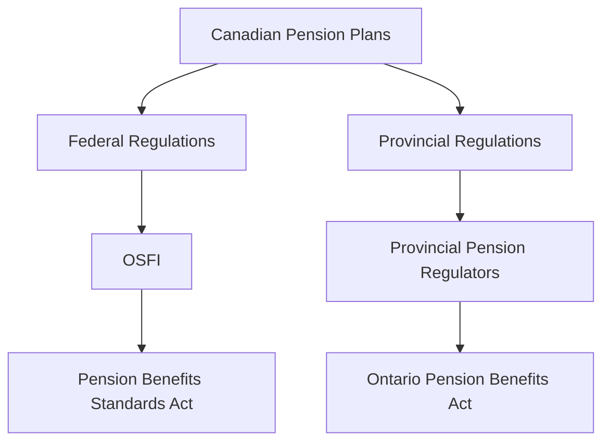

## 8.12 Regulatory Compliance and ERISA

In this section, we delve into the regulatory landscape governing employee benefit plans, with a particular focus on the Employee Retirement Income Security Act (ERISA) and its implications for accounting practices. Understanding these regulations is crucial for ensuring compliance and accurate financial reporting, especially in the context of Canadian accounting standards and practices.

### Understanding ERISA

The Employee Retirement Income Security Act (ERISA) was enacted in 1974 in the United States to set minimum standards for pension plans in private industry. While ERISA is a U.S. federal law, its principles and frameworks have influenced global pension regulations, including those in Canada. ERISA aims to protect the interests of employee benefit plan participants and their beneficiaries by:

- Requiring the disclosure of financial and other information concerning the plan to beneficiaries.
- Establishing standards of conduct for plan fiduciaries.
- Providing for appropriate remedies and access to the federal courts.

### Key Provisions of ERISA

ERISA encompasses several key provisions that are critical for accountants and financial professionals to understand:

1. **Fiduciary Responsibilities**: ERISA imposes strict fiduciary duties on those who manage and control plan assets. Fiduciaries must act solely in the interest of plan participants and beneficiaries, with the care, skill, prudence, and diligence that a prudent person would exercise.

2. **Plan Participation and Vesting**: ERISA sets minimum standards for participation, vesting, benefit accrual, and funding. These standards ensure that employees have a fair opportunity to participate in benefit plans and accrue benefits over time.

3. **Funding and Reporting Requirements**: ERISA requires plans to provide participants with information about plan features and funding. It also mandates detailed reporting to the government to ensure transparency and accountability.

4. **Benefit Claims and Appeals**: ERISA establishes procedures for participants to file claims for benefits and appeal denied claims, ensuring that participants have a clear path to resolve disputes.

### ERISA and Canadian Pension Plans

While ERISA is not directly applicable to Canadian pension plans, its influence is evident in the regulatory frameworks governing Canadian employee benefits. Canadian pension plans are primarily regulated at the provincial level, with each province having its own pension standards legislation. However, the principles of transparency, fiduciary responsibility, and participant protection are common across jurisdictions.

### Regulatory Compliance in Canada

In Canada, pension plans must comply with both federal and provincial regulations. Key regulatory bodies include:

- **Office of the Superintendent of Financial Institutions (OSFI)**: Regulates federally registered pension plans.
- **Provincial Pension Regulators**: Each province has its own regulatory body responsible for overseeing pension plans within its jurisdiction.

### Key Canadian Pension Regulations

1. **Pension Benefits Standards Act (PBSA)**: Governs federally regulated pension plans, setting standards for funding, administration, and member protection.

2. **Provincial Pension Legislation**: Each province has its own legislation, such as the Ontario Pension Benefits Act, which outlines requirements for plan registration, funding, and administration.

3. **Accounting Standards for Pension Plans**: In Canada, pension plans must adhere to specific accounting standards, including those set by the Canadian Institute of Chartered Accountants (CICA) and CPA Canada.

### Compliance Challenges and Best Practices

Compliance with pension regulations can be complex, given the varying requirements across jurisdictions. To navigate these challenges, consider the following best practices:

- **Stay Informed**: Regularly update your knowledge of regulatory changes and emerging trends in pension legislation.

- **Implement Robust Internal Controls**: Establish strong internal controls to ensure compliance with fiduciary responsibilities and reporting requirements.

- **Engage with Experts**: Work with legal and financial experts to ensure that your pension plans meet all regulatory requirements.

- **Conduct Regular Audits**: Perform regular audits of your pension plans to identify and address compliance issues proactively.

### Practical Examples and Case Studies

To illustrate the application of these principles, consider the following scenarios:

#### Example 1: Fiduciary Responsibility

A Canadian corporation sponsors a defined benefit pension plan for its employees. The plan's fiduciaries are responsible for managing the plan's assets. They must act in the best interest of the participants, ensuring that investment decisions are prudent and align with the plan's objectives. Failure to adhere to these responsibilities could result in legal action and financial penalties.

#### Example 2: Compliance with Funding Requirements

A company operating in Ontario must comply with the Ontario Pension Benefits Act, which requires regular actuarial valuations to ensure the plan is adequately funded. The company engages an actuary to perform these valuations and reports the results to the provincial regulator, demonstrating compliance with funding standards.

### Diagrams and Visual Aids

To enhance understanding, let's use a diagram to illustrate the regulatory framework for pension plans in Canada:

### Conclusion

Understanding and complying with regulatory requirements for employee benefit plans is essential for accountants and financial professionals. By adhering to ERISA principles and Canadian pension regulations, you can ensure the integrity and transparency of your pension plans, protecting the interests of participants and beneficiaries.

### Additional Resources

For further study, consider the following resources:

- CPA Canada's Guide to Pension Plan Accounting
- OSFI's Guidelines for Federally Regulated Pension Plans
- Provincial Pension Regulators' Websites

### Ready to Test Your Knowledge?



### What is the primary purpose of ERISA?

- [x] To protect the interests of employee benefit plan participants and beneficiaries
- [ ] To regulate corporate tax rates
- [ ] To establish international trade agreements
- [ ] To manage public health policies

> **Explanation:** ERISA was enacted to protect the interests of employee benefit plan participants and beneficiaries by establishing standards for plan management and fiduciary responsibilities.

### Which Canadian regulatory body oversees federally registered pension plans?

- [x] Office of the Superintendent of Financial Institutions (OSFI)
- [ ] Canada Revenue Agency (CRA)
- [ ] Canadian Securities Administrators (CSA)
- [ ] Financial Transactions and Reports Analysis Centre of Canada (FINTRAC)

> **Explanation:** OSFI is responsible for regulating federally registered pension plans in Canada.

### What is a key fiduciary responsibility under ERISA?

- [x] Acting solely in the interest of plan participants and beneficiaries
- [ ] Maximizing corporate profits
- [ ] Reducing employee wages
- [ ] Increasing shareholder dividends

> **Explanation:** Fiduciaries under ERISA must act solely in the interest of plan participants and beneficiaries, ensuring prudent management of plan assets.

### Which act governs federally regulated pension plans in Canada?

- [x] Pension Benefits Standards Act (PBSA)
- [ ] Income Tax Act
- [ ] Canada Business Corporations Act
- [ ] Employment Standards Act

> **Explanation:** The Pension Benefits Standards Act (PBSA) governs federally regulated pension plans in Canada, setting standards for funding and administration.

### What is a common compliance challenge for pension plans?

- [x] Navigating varying requirements across jurisdictions
- [ ] Increasing employee salaries
- [ ] Reducing plan benefits
- [ ] Decreasing plan contributions

> **Explanation:** Compliance challenges often arise from navigating the varying requirements across different jurisdictions, making it essential to stay informed and implement robust controls.

### What is the role of provincial pension regulators in Canada?

- [x] Overseeing pension plans within their jurisdiction
- [ ] Setting national tax policies
- [ ] Regulating international trade
- [ ] Managing federal employment standards

> **Explanation:** Provincial pension regulators oversee pension plans within their jurisdiction, ensuring compliance with provincial legislation.

### How can companies ensure compliance with pension regulations?

- [x] Conduct regular audits and engage with experts
- [ ] Ignore regulatory changes
- [ ] Reduce employee benefits
- [ ] Increase plan contributions without review

> **Explanation:** Companies can ensure compliance by conducting regular audits, engaging with legal and financial experts, and staying informed about regulatory changes.

### What does ERISA require regarding benefit claims and appeals?

- [x] Establishing procedures for filing claims and appealing denied claims
- [ ] Eliminating all benefit claims
- [ ] Reducing appeal options
- [ ] Increasing claim processing times

> **Explanation:** ERISA requires plans to establish procedures for participants to file claims and appeal denied claims, ensuring a clear path for resolving disputes.

### Which of the following is a principle common to both ERISA and Canadian pension regulations?

- [x] Transparency and participant protection
- [ ] Maximizing corporate profits
- [ ] Reducing employee benefits
- [ ] Increasing shareholder dividends

> **Explanation:** Both ERISA and Canadian pension regulations emphasize transparency and participant protection, ensuring fair treatment of plan participants.

### True or False: ERISA directly applies to Canadian pension plans.

- [x] False
- [ ] True

> **Explanation:** ERISA is a U.S. federal law and does not directly apply to Canadian pension plans, although its principles influence Canadian regulations.



By mastering the intricacies of regulatory compliance and ERISA, you can enhance your understanding of accounting for liabilities and equities, ensuring that you are well-prepared for the Canadian Accounting Exams.
