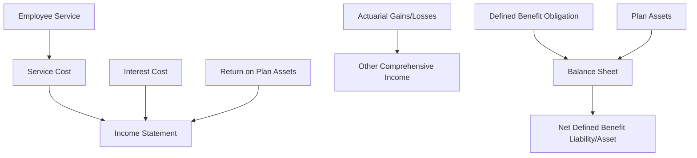

## 8.15 Impact on Financial Statements

The accounting for pensions and other employee benefits is a critical aspect of financial reporting that significantly affects both the income statement and the balance sheet. Understanding how these elements are recognized, measured, and reported is essential for anyone preparing for Canadian accounting exams. This section will delve into the intricacies of pension and employee benefit accounting, providing you with the knowledge necessary to analyze their impact on financial statements effectively.

### Understanding Pensions and Employee Benefits

Pensions and employee benefits are commitments made by employers to provide financial support and other benefits to employees during their retirement or in the event of certain life circumstances. These commitments can take various forms, including defined benefit plans, defined contribution plans, and other post-employment benefits.

#### Defined Benefit Plans

Defined benefit plans promise a specified monthly benefit upon retirement, which is often based on factors such as salary history and years of service. The employer bears the investment risk and is responsible for ensuring that the plan is sufficiently funded to meet future obligations.

#### Defined Contribution Plans

In contrast, defined contribution plans involve contributions made by the employer, employee, or both, to an individual account for each participant. The retirement benefit is determined by the amount contributed and the investment performance of those contributions. Here, the employee bears the investment risk.

#### Other Post-employment Benefits

These benefits may include healthcare, life insurance, and other non-pension benefits provided after retirement. The accounting for these benefits can be complex due to the uncertainty and variability of future costs.

### Accounting Standards and Regulations

In Canada, the accounting for pensions and employee benefits is governed by International Financial Reporting Standards (IFRS) and Accounting Standards for Private Enterprises (ASPE). These standards provide guidance on how to recognize, measure, and disclose pension and benefit obligations and expenses.

#### IFRS Standards

Under IFRS, the primary standard for pension and employee benefit accounting is IAS 19 - Employee Benefits. This standard requires the recognition of a liability when an employee has provided service in exchange for employee benefits to be paid in the future and an expense when the entity consumes the economic benefit arising from service provided by an employee in exchange for employee benefits.

#### ASPE Standards

For private enterprises in Canada, ASPE Section 3462 - Employee Future Benefits provides the framework for accounting for employee benefits. While similar to IFRS, there are differences in measurement and disclosure requirements that must be considered.

### Impact on the Income Statement

The accounting for pensions and employee benefits can have a significant impact on the income statement, affecting both operating and non-operating expenses. Key components include:

#### Service Cost

Service cost represents the present value of the benefits earned by employees during the current period. It is recognized as an expense in the income statement and is typically included in operating expenses.

#### Interest Cost

Interest cost arises from the unwinding of the discount on the defined benefit obligation. It reflects the increase in the present value of the obligation due to the passage of time and is recognized as a finance cost.

#### Return on Plan Assets

The expected return on plan assets is recognized as a reduction in pension expense. Any difference between the expected and actual return is recognized in other comprehensive income (OCI) under IFRS.

#### Actuarial Gains and Losses

Actuarial gains and losses result from changes in actuarial assumptions or experience adjustments. Under IFRS, these are recognized in OCI, whereas ASPE allows for immediate recognition in profit or loss.

### Impact on the Balance Sheet

The balance sheet reflects the funded status of pension and employee benefit plans, which is the difference between the fair value of plan assets and the present value of the defined benefit obligation.

#### Net Defined Benefit Liability or Asset

The net defined benefit liability or asset is recognized on the balance sheet. A liability is recognized when the obligation exceeds the plan assets, and an asset is recognized when the plan assets exceed the obligation.

#### Plan Assets

Plan assets are measured at fair value and are offset against the defined benefit obligation to determine the net liability or asset.

#### Funded Status

The funded status provides insight into the financial health of the pension plan. An underfunded plan indicates a liability, while an overfunded plan indicates an asset.

### Practical Examples and Case Studies

To illustrate the impact of pension and employee benefit accounting on financial statements, consider the following example:

**Example: Defined Benefit Pension Plan**

ABC Corporation sponsors a defined benefit pension plan. At the end of the fiscal year, the present value of the defined benefit obligation is $10 million, and the fair value of plan assets is $8 million. The service cost for the year is $500,000, and the interest cost is $400,000. The expected return on plan assets is $600,000.

**Income Statement Impact:**

- Service Cost: $500,000
- Interest Cost: $400,000
- Expected Return on Plan Assets: ($600,000)
- Net Pension Expense: $300,000

**Balance Sheet Impact:**

- Defined Benefit Obligation: $10,000,000
- Fair Value of Plan Assets: $8,000,000
- Net Defined Benefit Liability: $2,000,000

This example demonstrates how pension accounting affects both the income statement and balance sheet, highlighting the importance of accurate measurement and reporting.

### Real-world Applications and Regulatory Scenarios

In practice, the accounting for pensions and employee benefits can be influenced by various factors, including changes in regulations, economic conditions, and actuarial assumptions. Companies must stay informed about regulatory changes and ensure compliance with applicable standards.

#### Regulatory Considerations

In Canada, pension plans are subject to regulation by provincial and federal authorities, depending on the jurisdiction. Companies must adhere to funding requirements and disclosure obligations to ensure transparency and protect the interests of plan participants.

#### Economic and Demographic Factors

Economic conditions, such as interest rates and inflation, can significantly impact the valuation of pension obligations and plan assets. Demographic factors, including changes in life expectancy and workforce composition, also affect the measurement of benefit obligations.

### Step-by-step Guidance for Exam Preparation

To effectively prepare for questions related to the impact of pensions and employee benefits on financial statements, consider the following steps:

1. **Understand the Key Concepts:** Familiarize yourself with the definitions and characteristics of defined benefit and defined contribution plans, as well as other post-employment benefits.

2. **Study the Relevant Standards:** Review IAS 19 and ASPE Section 3462 to understand the recognition, measurement, and disclosure requirements for employee benefits.

3. **Analyze Financial Statements:** Practice analyzing financial statements to identify the impact of pension and benefit accounting on the income statement and balance sheet.

4. **Work Through Examples:** Solve practical examples and case studies to reinforce your understanding of the accounting treatment for pensions and employee benefits.

5. **Stay Informed:** Keep up-to-date with regulatory changes and economic trends that may affect pension and benefit accounting.

### Diagrams and Visual Aids

To enhance your understanding of pension and employee benefit accounting, consider the following diagram illustrating the flow of pension accounting transactions:

### Best Practices and Common Pitfalls

When accounting for pensions and employee benefits, consider the following best practices and common pitfalls:

#### Best Practices

- **Regularly Review Assumptions:** Periodically review actuarial assumptions to ensure they reflect current economic and demographic conditions.
- **Ensure Compliance:** Adhere to regulatory requirements and disclosure obligations to maintain transparency and protect stakeholders.
- **Engage Experts:** Consider engaging actuarial and accounting experts to assist with complex valuations and reporting.

#### Common Pitfalls

- **Underestimating Obligations:** Failing to accurately estimate benefit obligations can lead to significant financial statement misstatements.
- **Ignoring Regulatory Changes:** Overlooking changes in regulations can result in non-compliance and potential penalties.
- **Inadequate Disclosures:** Insufficient disclosure of pension and benefit information can obscure the financial health of the company.

### References and Additional Resources

For further exploration of pension and employee benefit accounting, consider the following resources:

- **CPA Canada:** Offers guidance and resources on accounting standards and best practices.
- **International Financial Reporting Standards (IFRS):** Provides comprehensive information on IAS 19 and other relevant standards.
- **Accounting Standards for Private Enterprises (ASPE):** Offers insights into the accounting treatment of employee benefits for private enterprises.

### Summary and Key Points

In summary, the accounting for pensions and employee benefits has a profound impact on financial statements, affecting both the income statement and balance sheet. By understanding the key concepts, standards, and real-world applications, you can effectively analyze and report on these elements in your financial statements.

### Ready to Test Your Knowledge?



### Which of the following is a characteristic of a defined benefit plan?

- [x] The employer bears the investment risk.
- [ ] The employee bears the investment risk.
- [ ] Contributions are made to individual accounts.
- [ ] Benefits are determined by the amount contributed.

> **Explanation:** In a defined benefit plan, the employer bears the investment risk and is responsible for ensuring that the plan is sufficiently funded to meet future obligations.

### Under IFRS, where are actuarial gains and losses recognized?

- [ ] Income Statement
- [x] Other Comprehensive Income
- [ ] Balance Sheet
- [ ] Cash Flow Statement

> **Explanation:** Under IFRS, actuarial gains and losses are recognized in Other Comprehensive Income (OCI).

### What is the funded status of a pension plan?

- [x] The difference between the fair value of plan assets and the present value of the defined benefit obligation.
- [ ] The total contributions made to the plan.
- [ ] The expected return on plan assets.
- [ ] The service cost for the period.

> **Explanation:** The funded status of a pension plan is the difference between the fair value of plan assets and the present value of the defined benefit obligation.

### Which standard governs the accounting for employee benefits under IFRS?

- [ ] IAS 16
- [ ] IFRS 9
- [x] IAS 19
- [ ] IFRS 15

> **Explanation:** IAS 19 - Employee Benefits governs the accounting for employee benefits under IFRS.

### What is the impact of interest cost on the income statement?

- [x] It is recognized as a finance cost.
- [ ] It is recognized as an operating expense.
- [ ] It is recognized as a reduction in pension expense.
- [ ] It is recognized in Other Comprehensive Income.

> **Explanation:** Interest cost is recognized as a finance cost on the income statement.

### How are plan assets measured on the balance sheet?

- [ ] At cost
- [ ] At book value
- [x] At fair value
- [ ] At historical cost

> **Explanation:** Plan assets are measured at fair value on the balance sheet.

### What is the primary standard for pension accounting under ASPE?

- [ ] Section 3856
- [x] Section 3462
- [ ] Section 3400
- [ ] Section 3065

> **Explanation:** ASPE Section 3462 - Employee Future Benefits is the primary standard for pension accounting under ASPE.

### Which of the following is a common pitfall in pension accounting?

- [ ] Regularly reviewing actuarial assumptions
- [x] Underestimating benefit obligations
- [ ] Ensuring compliance with regulations
- [ ] Engaging actuarial experts

> **Explanation:** Underestimating benefit obligations is a common pitfall in pension accounting that can lead to significant financial statement misstatements.

### What is the role of actuarial assumptions in pension accounting?

- [x] They are used to estimate the present value of benefit obligations.
- [ ] They determine the fair value of plan assets.
- [ ] They are used to calculate the service cost.
- [ ] They determine the expected return on plan assets.

> **Explanation:** Actuarial assumptions are used to estimate the present value of benefit obligations in pension accounting.

### True or False: Under ASPE, actuarial gains and losses can be recognized immediately in profit or loss.

- [x] True
- [ ] False

> **Explanation:** Under ASPE, actuarial gains and losses can be recognized immediately in profit or loss, unlike under IFRS where they are recognized in OCI.



By mastering the concepts covered in this section, you will be well-prepared to analyze the impact of pensions and employee benefits on financial statements, both for your exams and in professional practice.
