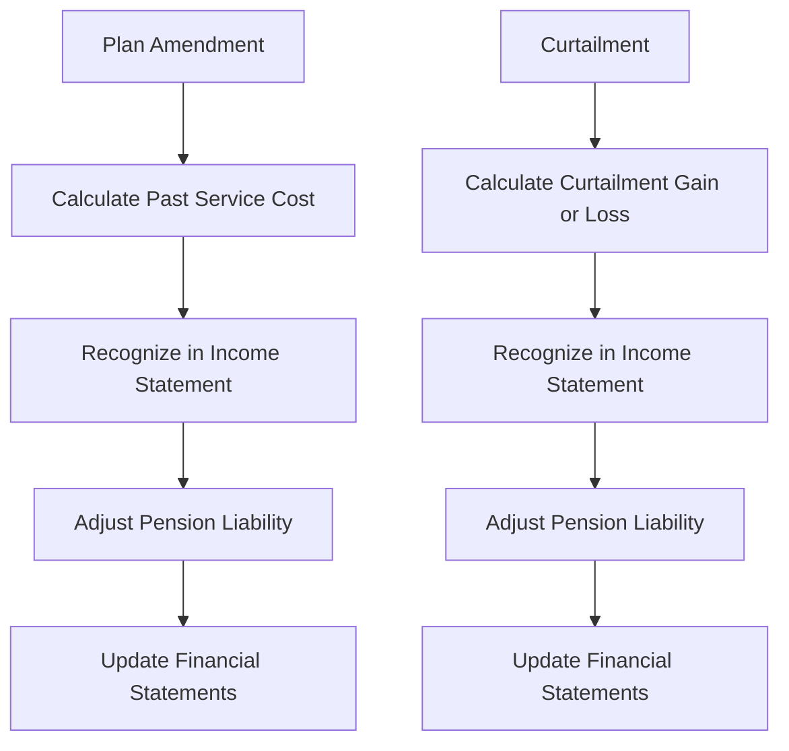

## 8.5 Accounting for Plan Amendments and Curtailments

In the realm of pension accounting, plan amendments and curtailments are significant events that can have profound impacts on an organization's financial statements. Understanding these concepts is crucial for accounting professionals, especially those preparing for Canadian accounting exams. This section provides a comprehensive overview of accounting for plan amendments and curtailments, focusing on their impact on pension obligations and expenses, and aligning with Canadian accounting standards.

### Understanding Plan Amendments and Curtailments

#### What are Plan Amendments?

Plan amendments refer to changes in the terms of a pension plan. These changes can affect the benefits that employees will receive, the eligibility criteria, or the contributions required from either the employer or the employees. Amendments can be initiated for various reasons, such as changes in regulatory requirements, financial considerations, or strategic shifts in the organization.

**Key Points:**
- **Types of Amendments:** Amendments can be either beneficial or detrimental to employees. Beneficial amendments increase the benefits or reduce the contributions required from employees, while detrimental amendments do the opposite.
- **Impact on Obligations:** Amendments can lead to a remeasurement of the pension obligation, affecting the present value of defined benefit obligations (DBO).

#### What are Curtailments?

Curtailments occur when an organization significantly reduces the expected years of future service of current employees or eliminates the accrual of defined benefits for some or all future service. This can happen due to events like downsizing, restructuring, or plan termination.

**Key Points:**
- **Types of Curtailments:** Curtailments can involve a reduction in the number of employees covered by the plan or a reduction in the benefits for future service.
- **Impact on Obligations:** Curtailments typically lead to a reduction in the DBO and may result in a gain or loss recognized in the financial statements.

### Accounting Standards and Frameworks

#### Canadian Accounting Standards

In Canada, pension accounting is governed by International Financial Reporting Standards (IFRS) as adopted in Canada, specifically IAS 19 - Employee Benefits. For private enterprises, Accounting Standards for Private Enterprises (ASPE) Section 3462 applies.

**IAS 19 - Employee Benefits:**
- **Recognition and Measurement:** IAS 19 provides guidance on recognizing and measuring the costs associated with employee benefits, including the impact of plan amendments and curtailments.
- **Past Service Cost:** Under IAS 19, past service cost resulting from plan amendments is recognized in profit or loss at the earlier of when the amendment occurs or when the related restructuring costs are recognized.

**ASPE Section 3462:**
- **Differences from IFRS:** While ASPE Section 3462 is similar to IAS 19, there are differences in the recognition and measurement of certain components, such as the treatment of remeasurements.

### Impact on Financial Statements

#### Recognition of Past Service Cost

When a plan amendment occurs, the resulting past service cost is recognized immediately in the financial statements. This cost represents the change in the present value of the DBO resulting from the amendment.

**Example:**
Suppose a company amends its pension plan to increase the benefits for employees. The increase in the present value of the DBO due to this amendment is recognized as a past service cost in the income statement.

#### Curtailment Gains or Losses

Curtailments can result in either a gain or a loss, depending on the impact on the DBO. The gain or loss is recognized in profit or loss at the time of the curtailment.

**Example:**
If a company decides to close a division and, as a result, reduces the number of employees covered by the pension plan, the reduction in the DBO is recognized as a curtailment gain.

### Practical Examples and Scenarios

#### Case Study: Plan Amendment

**Scenario:**
A Canadian manufacturing company decides to amend its pension plan to provide additional benefits to employees who have served for more than 20 years. This amendment increases the DBO by $2 million.

**Accounting Treatment:**
- Recognize the $2 million increase in the DBO as a past service cost in the income statement.
- Update the pension liability on the balance sheet to reflect the increased obligation.

#### Case Study: Curtailment

**Scenario:**
A technology firm undergoes a restructuring process, resulting in the elimination of a department. This leads to a reduction in the DBO by $1.5 million.

**Accounting Treatment:**
- Recognize a $1.5 million curtailment gain in the income statement.
- Adjust the pension liability on the balance sheet to reflect the reduced obligation.

### Real-World Applications and Regulatory Scenarios

#### Compliance Considerations

Organizations must ensure compliance with Canadian accounting standards when accounting for plan amendments and curtailments. This includes proper recognition, measurement, and disclosure of the impacts on financial statements.

**Regulatory Bodies:**
- **CPA Canada:** Provides guidance and resources for accounting professionals on pension accounting and related topics.
- **Office of the Superintendent of Financial Institutions (OSFI):** Oversees pension plans in Canada and ensures compliance with regulatory requirements.

### Step-by-Step Guidance

#### Accounting for Plan Amendments

1. **Identify the Amendment:** Determine the nature and impact of the amendment on the pension plan.
2. **Calculate the Past Service Cost:** Measure the change in the present value of the DBO resulting from the amendment.
3. **Recognize the Cost:** Record the past service cost in the income statement at the time of the amendment.
4. **Update Financial Statements:** Adjust the pension liability and related disclosures in the financial statements.

#### Accounting for Curtailments

1. **Identify the Curtailment:** Determine the nature and impact of the curtailment on the pension plan.
2. **Calculate the Curtailment Gain or Loss:** Measure the change in the present value of the DBO resulting from the curtailment.
3. **Recognize the Gain or Loss:** Record the curtailment gain or loss in the income statement at the time of the curtailment.
4. **Update Financial Statements:** Adjust the pension liability and related disclosures in the financial statements.

### Diagrams and Visual Aids

To enhance understanding, consider using diagrams to illustrate the flow of accounting transactions related to plan amendments and curtailments.

### Best Practices and Common Pitfalls

#### Best Practices

- **Timely Recognition:** Ensure that past service costs and curtailment gains or losses are recognized promptly in the financial statements.
- **Accurate Measurement:** Use appropriate actuarial assumptions and methods to measure the impact of amendments and curtailments.
- **Comprehensive Disclosures:** Provide clear and comprehensive disclosures in the financial statements to enhance transparency.

#### Common Pitfalls

- **Delayed Recognition:** Failing to recognize the impact of amendments and curtailments in a timely manner can lead to financial misstatements.
- **Inaccurate Assumptions:** Using outdated or incorrect actuarial assumptions can result in inaccurate measurements of the DBO.

### References and Additional Resources

- **IAS 19 - Employee Benefits:** Provides detailed guidance on accounting for employee benefits, including plan amendments and curtailments.
- **ASPE Section 3462:** Offers guidance for private enterprises on pension accounting.
- **CPA Canada:** Offers resources and publications on pension accounting and related topics.

### Summary and Key Points

- Plan amendments and curtailments have significant impacts on pension obligations and expenses.
- Canadian accounting standards, such as IAS 19 and ASPE Section 3462, provide guidance on recognizing and measuring these impacts.
- Proper recognition, measurement, and disclosure are essential for compliance and transparency in financial reporting.

### Practice Questions and Exam Tips

To reinforce your understanding, consider working through practice questions and scenarios related to plan amendments and curtailments. Focus on the recognition and measurement of past service costs and curtailment gains or losses, and ensure you are familiar with the relevant Canadian accounting standards.

## **Ready to Test Your Knowledge?**



### What is a plan amendment?

- [x] A change in the terms of a pension plan that affects benefits or contributions.
- [ ] A reduction in the number of employees covered by a pension plan.
- [ ] The termination of a pension plan.
- [ ] A change in the actuarial assumptions used to measure pension obligations.

> **Explanation:** A plan amendment involves changes to the terms of a pension plan, affecting benefits or contributions.

### What is a curtailment?

- [x] A significant reduction in the expected years of future service of employees.
- [ ] An increase in pension benefits for employees.
- [ ] A change in the actuarial assumptions used to measure pension obligations.
- [ ] A change in the discount rate used to calculate the present value of pension obligations.

> **Explanation:** A curtailment involves a significant reduction in the expected years of future service of employees or the elimination of the accrual of defined benefits for future service.

### Under IAS 19, when is past service cost recognized?

- [x] At the earlier of when the amendment occurs or when the related restructuring costs are recognized.
- [ ] At the end of the reporting period.
- [ ] When the amendment is approved by the board of directors.
- [ ] When the employees are informed of the amendment.

> **Explanation:** IAS 19 requires past service cost to be recognized at the earlier of when the amendment occurs or when the related restructuring costs are recognized.

### What is the impact of a beneficial plan amendment on the defined benefit obligation (DBO)?

- [x] It increases the DBO.
- [ ] It decreases the DBO.
- [ ] It has no impact on the DBO.
- [ ] It eliminates the DBO.

> **Explanation:** A beneficial plan amendment increases the benefits provided to employees, resulting in an increase in the DBO.

### How is a curtailment gain or loss recognized?

- [x] In profit or loss at the time of the curtailment.
- [ ] In other comprehensive income.
- [ ] As an adjustment to retained earnings.
- [ ] As a deferred liability.

> **Explanation:** A curtailment gain or loss is recognized in profit or loss at the time of the curtailment.

### What is the primary accounting standard for pension accounting in Canada?

- [x] IAS 19 - Employee Benefits.
- [ ] IFRS 9 - Financial Instruments.
- [ ] IAS 16 - Property, Plant, and Equipment.
- [ ] IFRS 15 - Revenue from Contracts with Customers.

> **Explanation:** IAS 19 - Employee Benefits is the primary accounting standard for pension accounting in Canada.

### What is the impact of a detrimental plan amendment on the defined benefit obligation (DBO)?

- [x] It decreases the DBO.
- [ ] It increases the DBO.
- [ ] It has no impact on the DBO.
- [ ] It eliminates the DBO.

> **Explanation:** A detrimental plan amendment reduces the benefits provided to employees, resulting in a decrease in the DBO.

### What is the role of actuarial assumptions in measuring pension obligations?

- [x] They are used to estimate the present value of future pension benefits.
- [ ] They determine the discount rate used to calculate pension expenses.
- [ ] They are used to calculate the fair value of plan assets.
- [ ] They are used to determine the contribution rate for employees.

> **Explanation:** Actuarial assumptions are used to estimate the present value of future pension benefits, impacting the measurement of pension obligations.

### What is a common pitfall in accounting for plan amendments?

- [x] Delayed recognition of past service costs.
- [ ] Overestimating the fair value of plan assets.
- [ ] Underestimating the discount rate.
- [ ] Failing to disclose the amendment in the financial statements.

> **Explanation:** A common pitfall is the delayed recognition of past service costs, leading to financial misstatements.

### True or False: A curtailment always results in a gain.

- [ ] True
- [x] False

> **Explanation:** A curtailment can result in either a gain or a loss, depending on its impact on the defined benefit obligation.



By understanding and applying the principles of accounting for plan amendments and curtailments, you can enhance your proficiency in pension accounting and prepare effectively for the Canadian accounting exams.
