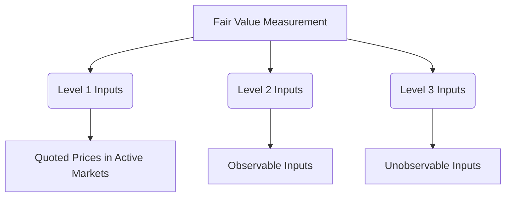

## 9.10 Fair Value Measurement and Disclosure

Fair value measurement and disclosure are critical components of financial reporting, providing transparency and comparability in financial statements. This section delves into the principles of fair value measurement, the fair value hierarchy, valuation techniques, and the disclosure requirements under Canadian accounting standards. Understanding these concepts is essential for preparing for Canadian accounting exams and for practical application in the accounting profession.

### Understanding Fair Value Measurement

**Fair Value Definition:** Fair value is defined as the price that would be received to sell an asset or paid to transfer a liability in an orderly transaction between market participants at the measurement date. This definition emphasizes the exit price notion, focusing on the price at which an asset could be sold or a liability settled.

**Objective of Fair Value Measurement:** The primary objective is to provide users of financial statements with a clear and accurate representation of the value of assets and liabilities, reflecting current market conditions. Fair value measurement enhances the relevance and reliability of financial information.

### Fair Value Hierarchy

The fair value hierarchy categorizes the inputs used in valuation techniques into three levels, prioritizing the use of observable inputs over unobservable inputs:

- **Level 1 Inputs:** Quoted prices in active markets for identical assets or liabilities that the entity can access at the measurement date. These inputs provide the most reliable evidence of fair value.

- **Level 2 Inputs:** Inputs other than quoted prices included within Level 1 that are observable for the asset or liability, either directly or indirectly. Examples include quoted prices for similar assets in active markets or quoted prices for identical assets in inactive markets.

- **Level 3 Inputs:** Unobservable inputs for the asset or liability. These inputs are used when observable inputs are not available, and they require significant management judgment or estimation.

**Mermaid Diagram: Fair Value Hierarchy**

### Valuation Techniques

Valuation techniques should maximize the use of relevant observable inputs and minimize the use of unobservable inputs. Common valuation techniques include:

- **Market Approach:** Uses prices and other relevant information generated by market transactions involving identical or comparable assets or liabilities.

- **Cost Approach:** Reflects the amount that would be required currently to replace the service capacity of an asset (often referred to as current replacement cost).

- **Income Approach:** Converts future amounts (e.g., cash flows or income and expenses) to a single current (discounted) amount. This approach often uses present value techniques.

### Application of Fair Value Measurement

**Example 1: Valuing a Publicly Traded Equity Security**

A company holds shares of a publicly traded company. The fair value of these shares is determined using Level 1 inputs, as the shares are traded on an active market, and the quoted market price is readily available.

**Example 2: Valuing a Private Company Investment**

For an investment in a private company, Level 3 inputs may be necessary, as there are no quoted market prices. The valuation might involve discounted cash flow analysis, requiring significant assumptions about future cash flows and discount rates.

### Disclosure Requirements

Fair value disclosures are designed to provide users with information about the valuation techniques and inputs used, as well as the impact of fair value measurements on the financial statements. Key disclosure requirements include:

- **Description of Valuation Techniques and Inputs:** Entities must disclose the valuation techniques and inputs used for each class of assets and liabilities measured at fair value.

- **Fair Value Hierarchy Level:** Disclose the level within the fair value hierarchy for each class of assets and liabilities.

- **Reconciliation of Level 3 Measurements:** For fair value measurements categorized within Level 3, a reconciliation of the beginning and ending balances is required, including total gains or losses, purchases, sales, and transfers.

- **Sensitivity Analysis:** Entities may need to disclose a sensitivity analysis for Level 3 measurements, showing the effect of changes in significant unobservable inputs.

### Regulatory Framework

In Canada, fair value measurement and disclosure are governed by International Financial Reporting Standards (IFRS) as adopted by the Canadian Accounting Standards Board (AcSB). Key standards include:

- **IFRS 13 Fair Value Measurement:** Provides guidance on how to measure fair value and the related disclosure requirements.

- **ASPE Section 3856 Financial Instruments:** For private enterprises, this section outlines the requirements for recognizing and measuring financial instruments, including fair value considerations.

### Practical Examples and Case Studies

**Case Study: Fair Value Measurement in a Volatile Market**

Consider a scenario where a company holds derivative instruments that are subject to significant market volatility. The company must assess whether the market conditions affect the fair value hierarchy level and the valuation techniques used. This case study illustrates the importance of regularly reassessing fair value measurements and disclosures in response to changing market conditions.

**Example: Real Estate Valuation**

A real estate company must determine the fair value of its investment properties. The company uses a combination of market and income approaches, considering comparable sales and discounted cash flow analysis. The disclosures include detailed descriptions of the valuation techniques and the inputs used, as well as the fair value hierarchy levels.

### Best Practices and Common Pitfalls

**Best Practices:**

- **Regularly Update Valuations:** Ensure that fair value measurements reflect current market conditions by regularly updating valuations and reassessing inputs.

- **Document Assumptions and Judgments:** Maintain thorough documentation of the assumptions and judgments used in fair value measurements, particularly for Level 3 inputs.

- **Enhance Transparency:** Provide clear and comprehensive disclosures that enhance the transparency and comparability of financial statements.

**Common Pitfalls:**

- **Overreliance on Unobservable Inputs:** Avoid excessive reliance on Level 3 inputs without sufficient justification and documentation.

- **Inadequate Disclosures:** Ensure that disclosures are complete and provide sufficient detail to enable users to understand the fair value measurements.

### Exam Preparation Tips

- **Understand the Fair Value Hierarchy:** Familiarize yourself with the three levels of the fair value hierarchy and the types of inputs associated with each level.

- **Practice Valuation Techniques:** Gain hands-on experience with different valuation techniques, such as market, cost, and income approaches.

- **Review Disclosure Requirements:** Study the disclosure requirements under IFRS 13 and ASPE Section 3856, focusing on the information that must be provided for fair value measurements.

- **Solve Practice Problems:** Work through practice problems and case studies to apply fair value measurement concepts in various scenarios.

- **Stay Updated on Standards:** Keep abreast of any updates or changes to the accounting standards related to fair value measurement and disclosure.

### Conclusion

Fair value measurement and disclosure are integral to financial reporting, providing valuable insights into the value of assets and liabilities. By understanding the principles of fair value measurement, the fair value hierarchy, and the related disclosure requirements, you will be well-prepared for Canadian accounting exams and equipped to apply these concepts in your professional career.

## **Ready to Test Your Knowledge?**



### What is the primary objective of fair value measurement?

- [x] To provide users with a clear representation of the value of assets and liabilities
- [ ] To determine the historical cost of assets
- [ ] To calculate the book value of liabilities
- [ ] To assess the tax implications of financial transactions

> **Explanation:** The primary objective of fair value measurement is to provide users of financial statements with a clear and accurate representation of the value of assets and liabilities, reflecting current market conditions.

### Which level of the fair value hierarchy uses quoted prices in active markets?

- [x] Level 1
- [ ] Level 2
- [ ] Level 3
- [ ] Level 4

> **Explanation:** Level 1 inputs are quoted prices in active markets for identical assets or liabilities that the entity can access at the measurement date.

### What is a common valuation technique that uses future cash flows?

- [x] Income Approach
- [ ] Market Approach
- [ ] Cost Approach
- [ ] Historical Approach

> **Explanation:** The income approach converts future amounts (e.g., cash flows or income and expenses) to a single current (discounted) amount, often using present value techniques.

### Which standard provides guidance on fair value measurement in Canada?

- [x] IFRS 13
- [ ] ASPE Section 3856
- [ ] IAS 16
- [ ] CPA Handbook Section 4000

> **Explanation:** IFRS 13 Fair Value Measurement provides guidance on how to measure fair value and the related disclosure requirements in Canada.

### What must be disclosed for Level 3 fair value measurements?

- [x] Reconciliation of beginning and ending balances
- [ ] Quoted prices in active markets
- [ ] Historical cost information
- [ ] Tax implications

> **Explanation:** For Level 3 fair value measurements, a reconciliation of the beginning and ending balances is required, including total gains or losses, purchases, sales, and transfers.

### What is the focus of the market approach in valuation?

- [x] Prices and information from market transactions
- [ ] Replacement cost of an asset
- [ ] Future cash flows
- [ ] Historical cost

> **Explanation:** The market approach uses prices and other relevant information generated by market transactions involving identical or comparable assets or liabilities.

### Which inputs are considered unobservable in the fair value hierarchy?

- [x] Level 3 Inputs
- [ ] Level 1 Inputs
- [ ] Level 2 Inputs
- [ ] Level 4 Inputs

> **Explanation:** Level 3 inputs are unobservable inputs for the asset or liability, used when observable inputs are not available and requiring significant management judgment or estimation.

### What is a key benefit of fair value disclosure?

- [x] Enhances transparency and comparability
- [ ] Reduces tax liabilities
- [ ] Increases historical accuracy
- [ ] Simplifies financial statements

> **Explanation:** Fair value disclosures enhance the transparency and comparability of financial statements, providing users with valuable information about valuation techniques and inputs.

### How often should fair value measurements be updated?

- [x] Regularly, to reflect current market conditions
- [ ] Annually, at the end of the fiscal year
- [ ] Only when significant changes occur
- [ ] Every five years

> **Explanation:** Fair value measurements should be regularly updated to ensure they reflect current market conditions and provide accurate information to users of financial statements.

### True or False: Level 2 inputs include quoted prices for identical assets in inactive markets.

- [x] True
- [ ] False

> **Explanation:** Level 2 inputs include inputs other than quoted prices in active markets, such as quoted prices for identical assets in inactive markets or for similar assets in active markets.


