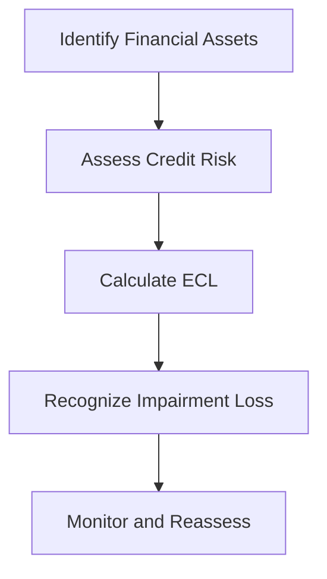

## 9.11 Impairment of Financial Assets

The impairment of financial assets is a critical area in accounting that ensures the accurate representation of an entity's financial position. This section delves into the expected credit loss (ECL) model, which is central to recognizing impairment on financial assets under the International Financial Reporting Standards (IFRS) and Accounting Standards for Private Enterprises (ASPE) in Canada. Understanding this model is essential for accounting professionals, especially those preparing for Canadian accounting exams.

### Understanding Impairment of Financial Assets

Impairment of financial assets refers to the reduction in the recoverable amount of a financial asset below its carrying amount. This concept is crucial in financial reporting as it ensures that assets are not overstated on the balance sheet, providing a true and fair view of an entity's financial health.

### The Expected Credit Loss Model

The expected credit loss model, introduced by IFRS 9, represents a significant shift from the previous incurred loss model. This model requires entities to account for expected credit losses at all times and to update the amount of expected losses recognized at each reporting date to reflect changes in credit risk.

#### Key Components of the ECL Model

1. **Probability of Default (PD):** The likelihood that a borrower will default on their financial obligation.
2. **Loss Given Default (LGD):** The amount of loss incurred if a borrower defaults.
3. **Exposure at Default (EAD):** The total value exposed to loss at the time of default.

These components are used to estimate the expected credit losses over the life of a financial asset.

### Stages of Impairment

The ECL model categorizes financial assets into three stages based on changes in credit risk since initial recognition:

1. **Stage 1:** Assets with no significant increase in credit risk. Entities recognize a 12-month ECL.
2. **Stage 2:** Assets with a significant increase in credit risk. Entities recognize lifetime ECL.
3. **Stage 3:** Credit-impaired assets. Entities recognize lifetime ECL and interest revenue is calculated on the net carrying amount.

### Application of the ECL Model

#### Step-by-Step Guidance

1. **Identify Financial Assets:** Determine which financial assets are subject to impairment testing under the ECL model. This typically includes loans, trade receivables, and debt securities.

2. **Assess Credit Risk:** Evaluate whether there has been a significant increase in credit risk since initial recognition. This involves both quantitative and qualitative assessments.

3. **Calculate ECL:** Use the PD, LGD, and EAD to calculate the expected credit loss for each asset. This calculation should consider forward-looking information and macroeconomic factors.

4. **Recognize Impairment Loss:** Record the impairment loss in the financial statements, adjusting the carrying amount of the asset.

5. **Monitor and Reassess:** Continuously monitor credit risk and reassess the ECL at each reporting date.

#### Practical Example

Consider a Canadian bank holding a portfolio of loans. Initially, these loans are in Stage 1, with a 12-month ECL recognized. If economic conditions worsen, leading to an increase in credit risk, some loans may move to Stage 2, requiring a lifetime ECL. The bank would need to adjust its impairment calculations accordingly.

### Regulatory Framework and Compliance

#### IFRS 9 vs. ASPE

- **IFRS 9:** Mandates the use of the ECL model for all entities, emphasizing forward-looking information.
- **ASPE:** Offers more flexibility, allowing entities to choose between the ECL model and the incurred loss model, depending on their circumstances.

#### Compliance Considerations

Entities must ensure compliance with the relevant accounting standards, considering the specific requirements for disclosure and documentation. This includes providing detailed disclosures about the assumptions and estimates used in calculating ECL.

### Challenges and Best Practices

#### Common Pitfalls

1. **Inadequate Data:** Insufficient historical data can lead to inaccurate ECL calculations.
2. **Ignoring Forward-looking Information:** Failing to incorporate macroeconomic forecasts can result in underestimating credit losses.
3. **Overlooking Qualitative Factors:** Solely relying on quantitative assessments may overlook significant credit risk indicators.

#### Strategies for Success

- **Robust Data Collection:** Implement systems to gather comprehensive historical and current data.
- **Incorporate Expert Judgement:** Use expert judgement to assess qualitative factors and forward-looking information.
- **Regular Training:** Ensure staff are well-trained in the latest accounting standards and ECL methodologies.

### Real-world Applications

#### Case Study: Canadian Financial Institution

A Canadian financial institution implemented the ECL model across its loan portfolio. By leveraging advanced analytics and incorporating macroeconomic scenarios, the institution improved its credit risk assessment and enhanced its financial reporting accuracy.

#### Impact on Financial Statements

The adoption of the ECL model can significantly impact an entity's financial statements, affecting both the balance sheet and income statement. Entities must be prepared to explain these changes to stakeholders and regulators.

### Diagrams and Visuals

To aid understanding, consider the following diagram illustrating the ECL calculation process:

### Summary

The impairment of financial assets under the ECL model is a complex but essential aspect of financial reporting. By understanding and applying this model, accounting professionals can ensure accurate and compliant financial statements. The key to success lies in robust data management, forward-looking assessments, and continuous monitoring of credit risk.

### References and Further Reading

- **IFRS 9 Financial Instruments:** Official standard detailing the ECL model.
- **CPA Canada Handbook:** Guidance on applying IFRS and ASPE in Canada.
- **Financial Reporting Council (FRC):** Publications on best practices for ECL implementation.

## **Ready to Test Your Knowledge?**



### What is the primary objective of the expected credit loss model?

- [x] To account for expected credit losses at all times
- [ ] To account for incurred losses only
- [ ] To eliminate credit risk
- [ ] To increase asset value

> **Explanation:** The ECL model requires entities to account for expected credit losses at all times, reflecting changes in credit risk.

### Which component of the ECL model represents the likelihood of a borrower defaulting?

- [x] Probability of Default (PD)
- [ ] Loss Given Default (LGD)
- [ ] Exposure at Default (EAD)
- [ ] Credit Risk Assessment

> **Explanation:** Probability of Default (PD) is the likelihood that a borrower will default on their financial obligation.

### In which stage of impairment are lifetime expected credit losses recognized?

- [ ] Stage 1
- [x] Stage 2
- [x] Stage 3
- [ ] None of the above

> **Explanation:** Lifetime expected credit losses are recognized in both Stage 2 and Stage 3, with Stage 3 involving credit-impaired assets.

### What is a common pitfall when calculating ECL?

- [x] Inadequate data
- [ ] Overestimating credit risk
- [ ] Ignoring historical data
- [ ] Excessive documentation

> **Explanation:** Inadequate data can lead to inaccurate ECL calculations, making it a common pitfall.

### Which standard mandates the use of the ECL model for all entities?

- [x] IFRS 9
- [ ] ASPE
- [ ] GAAP
- [ ] None of the above

> **Explanation:** IFRS 9 mandates the use of the ECL model for all entities, emphasizing forward-looking information.

### What should entities continuously monitor under the ECL model?

- [x] Credit risk
- [ ] Asset value
- [ ] Market trends
- [ ] Interest rates

> **Explanation:** Entities should continuously monitor credit risk and reassess the ECL at each reporting date.

### How can entities improve their ECL calculations?

- [x] Robust data collection
- [ ] Ignoring forward-looking information
- [ ] Relying solely on quantitative assessments
- [ ] Reducing staff training

> **Explanation:** Robust data collection and incorporating forward-looking information can improve ECL calculations.

### What impact does the ECL model have on financial statements?

- [x] Affects both balance sheet and income statement
- [ ] Only affects the balance sheet
- [ ] Only affects the income statement
- [ ] No impact

> **Explanation:** The ECL model affects both the balance sheet and income statement, impacting financial reporting.

### Which of the following is NOT a component of the ECL model?

- [ ] Probability of Default (PD)
- [ ] Loss Given Default (LGD)
- [x] Asset Recovery Rate (ARR)
- [ ] Exposure at Default (EAD)

> **Explanation:** Asset Recovery Rate (ARR) is not a component of the ECL model.

### True or False: The ECL model eliminates the need for qualitative assessments in credit risk evaluation.

- [ ] True
- [x] False

> **Explanation:** The ECL model requires both quantitative and qualitative assessments in credit risk evaluation.


