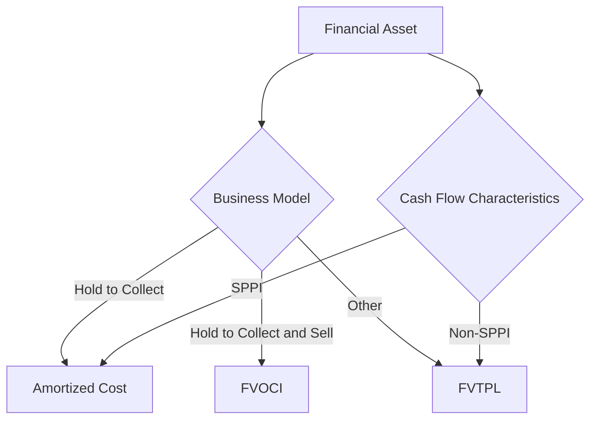

## 9.16 IFRS 9 vs. ASC 815: A Comprehensive Guide to Financial Instruments and Derivatives

In the realm of accounting for financial instruments and derivatives, two major standards dominate the landscape: IFRS 9, issued by the International Accounting Standards Board (IASB), and ASC 815, issued by the Financial Accounting Standards Board (FASB) in the United States. Understanding these standards is crucial for Canadian accountants, as they navigate both domestic and international financial reporting environments. This section aims to provide a comprehensive comparison of IFRS 9 and ASC 815, highlighting their key differences and similarities, and offering practical insights for application in professional practice and exam preparation.

### Overview of IFRS 9 and ASC 815

**IFRS 9 Financial Instruments** is a standard that addresses the classification, measurement, impairment, and hedge accounting of financial instruments. It replaced IAS 39 and aims to provide a more logical and simplified approach to accounting for financial instruments.

**ASC 815 Derivatives and Hedging** focuses on the recognition, measurement, and disclosure of derivative instruments and hedging activities. It provides guidelines for accounting for derivatives and hedging relationships, ensuring that entities accurately reflect the economic realities of these financial activities.

### Key Differences Between IFRS 9 and ASC 815

#### 1. Classification and Measurement

**IFRS 9** classifies financial assets based on the business model for managing them and their contractual cash flow characteristics. It uses three categories: amortized cost, fair value through other comprehensive income (FVOCI), and fair value through profit or loss (FVTPL).

**ASC 815**, on the other hand, primarily focuses on derivatives and hedging activities, without providing a comprehensive framework for classifying all financial instruments. However, ASC 320 addresses the classification and measurement of financial assets, using categories such as held-to-maturity, trading, and available-for-sale.

**Example:**
Consider a Canadian company holding debt securities. Under IFRS 9, if the securities are held to collect contractual cash flows, they are measured at amortized cost. Under ASC 320, if the same securities are classified as held-to-maturity, they are also measured at amortized cost.

#### 2. Impairment

**IFRS 9** introduces an expected credit loss (ECL) model for impairment, requiring entities to recognize credit losses based on forward-looking information. This model applies to financial assets measured at amortized cost and FVOCI.

**ASC 815** does not specifically address impairment of financial instruments, as it focuses on derivatives. However, ASC 326 provides guidance on credit losses, using a current expected credit loss (CECL) model, which is conceptually similar to IFRS 9's ECL model.

**Example:**
For a Canadian bank, IFRS 9 requires estimating ECLs on loans and receivables, considering macroeconomic forecasts. Under ASC 326, the bank would estimate CECLs, incorporating similar forward-looking information.

#### 3. Hedge Accounting

**IFRS 9** simplifies hedge accounting by aligning it more closely with risk management practices. It allows for more types of hedging relationships and provides flexibility in designating hedged items and hedging instruments.

**ASC 815** offers a detailed framework for hedge accounting, with specific criteria for qualifying hedging relationships. It distinguishes between fair value hedges, cash flow hedges, and net investment hedges.

**Example:**
A Canadian exporter hedging foreign currency risk can designate a forward contract as a cash flow hedge under both IFRS 9 and ASC 815. However, IFRS 9 may offer more flexibility in terms of hedge effectiveness assessment.

#### 4. Derivatives

**IFRS 9** requires all derivatives to be measured at fair value, with changes in fair value recognized in profit or loss unless they are part of a designated hedging relationship.

**ASC 815** also requires derivatives to be measured at fair value, but it provides detailed guidance on accounting for derivatives embedded in non-derivative contracts.

**Example:**
A Canadian energy company using commodity derivatives to hedge price risk would measure these derivatives at fair value under both IFRS 9 and ASC 815. However, ASC 815 provides additional guidance on bifurcating embedded derivatives.

### Practical Examples and Case Studies

#### Case Study 1: Hedge Accounting for Interest Rate Swaps

A Canadian manufacturing company has a variable-rate loan and wants to hedge interest rate risk using an interest rate swap. Under IFRS 9, the company can designate the swap as a cash flow hedge, with changes in fair value recognized in OCI. Under ASC 815, the company must meet specific criteria for hedge effectiveness and document the hedging relationship.

#### Case Study 2: Impairment of Trade Receivables

A Canadian retailer applies IFRS 9's ECL model to estimate credit losses on trade receivables. The retailer considers historical loss rates, current conditions, and forward-looking information. Under ASC 326, the retailer would follow a similar approach using the CECL model.

### Real-World Applications and Regulatory Scenarios

In Canada, IFRS 9 is widely adopted for financial reporting, aligning with international standards. However, Canadian subsidiaries of U.S. companies may also need to comply with ASC 815 for group reporting purposes. Understanding both standards is essential for Canadian accountants working in multinational environments.

### Step-by-Step Guidance for Applying IFRS 9 and ASC 815

1. **Identify Financial Instruments:** Determine whether the instruments are within the scope of IFRS 9 or ASC 815.
2. **Classify and Measure:** Apply the appropriate classification and measurement criteria based on the business model and contractual cash flows.
3. **Assess Impairment:** Use the ECL model under IFRS 9 or the CECL model under ASC 326 to estimate credit losses.
4. **Designate Hedging Relationships:** Identify eligible hedging instruments and hedged items, and document the hedging strategy.
5. **Measure Derivatives at Fair Value:** Recognize changes in fair value in profit or loss or OCI, depending on the hedging relationship.

### Diagrams and Visual Aids

Below is a diagram illustrating the classification and measurement process under IFRS 9:

### Best Practices, Common Pitfalls, and Strategies

- **Best Practices:** Regularly update impairment models with current and forward-looking information to ensure accuracy.
- **Common Pitfalls:** Failing to adequately document hedging relationships can lead to disqualification of hedge accounting.
- **Strategies:** Leverage technology and data analytics to enhance the accuracy of credit loss estimates and hedge effectiveness assessments.

### References and Additional Resources

- **CPA Canada:** Offers guidance on applying IFRS 9 in the Canadian context.
- **IASB and FASB Websites:** Provide access to the full text of IFRS 9 and ASC 815.
- **Practice Exams:** Available through CPA Canada to test your understanding of financial instruments and derivatives.

### Summary

Understanding the nuances of IFRS 9 and ASC 815 is crucial for Canadian accountants, especially those working in multinational environments. By mastering these standards, you can ensure accurate financial reporting and compliance with both international and U.S. regulations.

## **Ready to Test Your Knowledge?**



### What is the primary focus of IFRS 9?

- [x] Classification, measurement, and impairment of financial instruments
- [ ] Recognition and measurement of inventory
- [ ] Revenue recognition
- [ ] Accounting for leases

> **Explanation:** IFRS 9 focuses on the classification, measurement, and impairment of financial instruments, providing a comprehensive framework for financial reporting.

### Which model does IFRS 9 use for impairment?

- [x] Expected Credit Loss (ECL) model
- [ ] Historical Loss Model
- [ ] Fair Value Model
- [ ] Cost Model

> **Explanation:** IFRS 9 uses the Expected Credit Loss (ECL) model, which incorporates forward-looking information to estimate credit losses.

### What is a key difference between IFRS 9 and ASC 815 in hedge accounting?

- [x] IFRS 9 aligns hedge accounting more closely with risk management practices
- [ ] ASC 815 allows for more types of hedging relationships
- [ ] IFRS 9 requires more detailed documentation
- [ ] ASC 815 does not distinguish between different types of hedges

> **Explanation:** IFRS 9 aligns hedge accounting more closely with risk management practices, offering more flexibility in designating hedging relationships.

### Under ASC 815, how are derivatives measured?

- [x] At fair value
- [ ] At amortized cost
- [ ] At historical cost
- [ ] At replacement cost

> **Explanation:** Under ASC 815, derivatives are measured at fair value, with changes in fair value recognized in profit or loss.

### What is the purpose of the CECL model under ASC 326?

- [x] To estimate credit losses using forward-looking information
- [ ] To classify financial instruments
- [ ] To measure derivatives at fair value
- [ ] To assess hedge effectiveness

> **Explanation:** The CECL model under ASC 326 is used to estimate credit losses using forward-looking information, similar to IFRS 9's ECL model.

### Which of the following is a category under IFRS 9 for financial assets?

- [x] Fair Value Through Profit or Loss (FVTPL)
- [ ] Held-to-Maturity
- [ ] Trading Securities
- [ ] Available-for-Sale

> **Explanation:** Under IFRS 9, financial assets can be classified as Fair Value Through Profit or Loss (FVTPL), among other categories.

### How does IFRS 9 handle derivatives?

- [x] Requires all derivatives to be measured at fair value
- [ ] Allows derivatives to be measured at historical cost
- [ ] Requires derivatives to be measured at amortized cost
- [ ] Does not provide guidance on derivatives

> **Explanation:** IFRS 9 requires all derivatives to be measured at fair value, with changes in fair value recognized in profit or loss unless part of a hedging relationship.

### What is a common pitfall in hedge accounting under IFRS 9?

- [x] Inadequate documentation of hedging relationships
- [ ] Overestimating credit losses
- [ ] Misclassifying financial assets
- [ ] Ignoring fair value changes

> **Explanation:** A common pitfall in hedge accounting under IFRS 9 is inadequate documentation of hedging relationships, which can disqualify hedge accounting.

### Which standard provides a comprehensive framework for classifying all financial instruments?

- [x] IFRS 9
- [ ] ASC 815
- [ ] ASC 320
- [ ] IAS 39

> **Explanation:** IFRS 9 provides a comprehensive framework for classifying all financial instruments based on business models and cash flow characteristics.

### True or False: ASC 815 provides detailed guidance on impairment of financial instruments.

- [ ] True
- [x] False

> **Explanation:** False. ASC 815 focuses on derivatives and hedging, not on impairment of financial instruments. Impairment is addressed under ASC 326.


