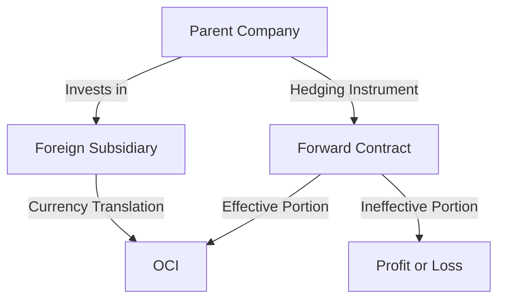

## 9.7 Net Investment Hedges

In the globalized business environment, companies often have operations in multiple countries, exposing them to foreign currency risks. Net investment hedges are a vital tool for managing this exposure, particularly when dealing with investments in foreign operations. This section delves into the fundamentals of net investment hedges, their accounting treatment, and practical applications within the Canadian accounting framework.

### Understanding Net Investment Hedges

Net investment hedges are a type of hedge accounting used to mitigate the risk of foreign currency fluctuations affecting an entity's net investment in a foreign operation. These hedges are crucial for companies with significant international operations, as they help stabilize financial statements by offsetting foreign exchange gains and losses.

#### Key Concepts and Terminology

- **Net Investment in a Foreign Operation:** This refers to the amount of an entity's equity in a foreign subsidiary, branch, associate, or joint venture.
- **Foreign Currency Risk:** The risk that changes in exchange rates will adversely affect the value of an entity's net investment in a foreign operation.
- **Hedge Accounting:** A method of accounting that aligns the financial reporting of hedging instruments with the hedged items to reduce volatility in financial statements.

### Regulatory Framework

In Canada, net investment hedges are governed by International Financial Reporting Standards (IFRS), specifically IAS 21 "The Effects of Changes in Foreign Exchange Rates" and IFRS 9 "Financial Instruments." These standards provide guidance on the recognition, measurement, and disclosure of net investment hedges.

#### IAS 21: The Effects of Changes in Foreign Exchange Rates

IAS 21 outlines how to account for foreign currency transactions and operations. It requires entities to translate foreign operations' financial statements into the reporting currency and recognize exchange differences in other comprehensive income (OCI).

#### IFRS 9: Financial Instruments

IFRS 9 provides the framework for hedge accounting, including net investment hedges. It allows entities to apply hedge accounting if certain criteria are met, ensuring that the hedging relationship is effective and documented.

### Accounting for Net Investment Hedges

To apply hedge accounting for a net investment hedge, an entity must meet specific criteria, including:

1. **Hedging Instrument:** The entity must designate a hedging instrument, such as a foreign currency forward contract, option, or a non-derivative financial instrument like a foreign currency-denominated loan.

2. **Hedged Item:** The net investment in a foreign operation must be clearly identified as the hedged item.

3. **Hedge Effectiveness:** The hedge must be expected to be highly effective in offsetting changes in the value of the hedged item due to foreign currency movements.

4. **Documentation:** The entity must document the hedging relationship, including the risk management objective, strategy, and methods for assessing hedge effectiveness.

#### Recognition and Measurement

When a net investment hedge is designated, the effective portion of the hedge is recognized in OCI, while any ineffective portion is recognized in profit or loss. The cumulative amount in OCI is reclassified to profit or loss upon disposal or partial disposal of the foreign operation.

### Practical Examples

#### Example 1: Hedging with a Foreign Currency Loan

A Canadian company, Maple Inc., has a subsidiary in Europe. To hedge its net investment in the subsidiary, Maple Inc. takes out a loan in euros. The loan serves as a natural hedge, as any depreciation in the euro will result in a gain on the loan, offsetting the loss on the net investment.

#### Example 2: Using Forward Contracts

Consider a Canadian corporation, Northern Lights Ltd., with a significant investment in a UK subsidiary. To hedge against the British pound's volatility, Northern Lights Ltd. enters into a forward contract to sell pounds and buy Canadian dollars. The forward contract's gains or losses are recognized in OCI, aligning with the net investment's currency translation adjustments.

### Challenges and Best Practices

#### Common Pitfalls

- **Ineffectiveness:** A hedge may become ineffective if the hedging instrument does not perfectly offset the hedged item's foreign currency risk.
- **Documentation Errors:** Incomplete or inaccurate documentation can lead to disqualification from hedge accounting.

#### Best Practices

- **Regular Effectiveness Testing:** Continuously assess the hedge's effectiveness to ensure compliance with IFRS 9 requirements.
- **Comprehensive Documentation:** Maintain detailed records of the hedging relationship, including the rationale for hedge designation and effectiveness testing methods.

### Real-World Applications

Net investment hedges are widely used by multinational corporations to manage foreign currency exposure. For instance, a Canadian mining company with operations in Australia might use net investment hedges to protect against fluctuations in the Australian dollar, ensuring stable financial results.

### Exam Focus and Practical Tips

For Canadian accounting exams, understanding the principles and applications of net investment hedges is crucial. Focus on the following areas:

- **Hedge Accounting Criteria:** Be familiar with the conditions required to apply hedge accounting under IFRS 9.
- **Documentation Requirements:** Know the necessary documentation for establishing a hedging relationship.
- **Effectiveness Testing:** Understand how to assess and document hedge effectiveness.

### Sample Problems and Exercises

To reinforce your understanding, consider the following exercises:

1. **Scenario Analysis:** Analyze a scenario where a Canadian company uses a forward contract to hedge its net investment in a foreign subsidiary. Determine the accounting entries required under IFRS 9.

2. **Effectiveness Testing:** Design a method for testing the effectiveness of a net investment hedge and document the process.

### Diagrams and Visual Aids

To enhance comprehension, consider the following diagram illustrating the flow of transactions in a net investment hedge:

### Conclusion

Net investment hedges are a powerful tool for managing foreign currency exposure in multinational operations. By understanding the regulatory framework, accounting treatment, and practical applications, you can effectively prepare for Canadian accounting exams and apply these principles in your professional career.

## **Ready to Test Your Knowledge?**



### What is the primary purpose of a net investment hedge?

- [x] To mitigate foreign currency risk in a net investment in a foreign operation
- [ ] To speculate on foreign currency movements
- [ ] To hedge interest rate risk
- [ ] To manage commodity price risk

> **Explanation:** Net investment hedges are specifically designed to mitigate the foreign currency risk associated with a net investment in a foreign operation.

### Which standard governs the accounting for net investment hedges in Canada?

- [x] IFRS 9
- [ ] ASPE
- [ ] IAS 16
- [ ] IFRS 15

> **Explanation:** IFRS 9 "Financial Instruments" provides the framework for hedge accounting, including net investment hedges.

### What is recognized in OCI when a net investment hedge is effective?

- [x] The effective portion of the hedge
- [ ] The entire gain or loss on the hedging instrument
- [ ] The ineffective portion of the hedge
- [ ] The entire gain or loss on the hedged item

> **Explanation:** The effective portion of a net investment hedge is recognized in OCI, aligning with the currency translation adjustments of the net investment.

### What happens to the cumulative amount in OCI upon disposal of the foreign operation?

- [x] It is reclassified to profit or loss
- [ ] It remains in OCI
- [ ] It is written off against retained earnings
- [ ] It is transferred to additional paid-in capital

> **Explanation:** Upon disposal of the foreign operation, the cumulative amount in OCI related to the net investment hedge is reclassified to profit or loss.

### Which of the following is a common hedging instrument for net investment hedges?

- [x] Foreign currency forward contracts
- [ ] Commodity futures
- [x] Foreign currency loans
- [ ] Interest rate swaps

> **Explanation:** Foreign currency forward contracts and loans are commonly used as hedging instruments for net investment hedges.

### What must be documented to apply hedge accounting for a net investment hedge?

- [x] The hedging relationship and effectiveness testing methods
- [ ] The expected future exchange rates
- [ ] The historical exchange rate data
- [ ] The financial statements of the foreign operation

> **Explanation:** Detailed documentation of the hedging relationship and methods for assessing hedge effectiveness is required to apply hedge accounting.

### What is a potential consequence of incomplete hedge documentation?

- [x] Disqualification from hedge accounting
- [ ] Increased foreign currency risk
- [x] Ineffectiveness of the hedge
- [ ] Enhanced financial statement stability

> **Explanation:** Incomplete documentation can lead to disqualification from hedge accounting and may result in hedge ineffectiveness.

### How often should hedge effectiveness be tested?

- [x] Regularly, to ensure compliance with IFRS 9
- [ ] Once at the inception of the hedge
- [ ] Only when exchange rates fluctuate significantly
- [ ] Annually, at the end of the fiscal year

> **Explanation:** Regular effectiveness testing is necessary to ensure ongoing compliance with IFRS 9 requirements.

### Which of the following is a key benefit of net investment hedges?

- [x] Stabilization of financial statements
- [ ] Speculation on currency movements
- [ ] Increased volatility in profit or loss
- [ ] Enhanced interest rate management

> **Explanation:** Net investment hedges help stabilize financial statements by offsetting foreign exchange gains and losses.

### True or False: A net investment hedge can only be applied using derivative instruments.

- [ ] True
- [x] False

> **Explanation:** Net investment hedges can be applied using both derivative instruments and non-derivative financial instruments like foreign currency-denominated loans.


