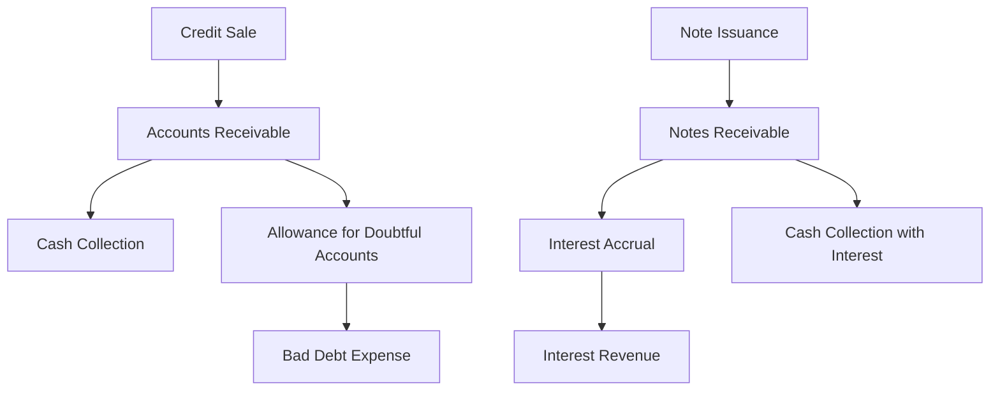

## 10.1 Types of Receivables

Receivables are a crucial component of a company's financial statements, representing the amounts owed to the business by its customers or other parties. Understanding the different types of receivables is essential for anyone preparing for Canadian accounting exams, as they play a significant role in financial reporting and analysis. In this section, we will delve into the various types of receivables, including accounts receivable, notes receivable, and other receivables, providing practical examples and insights relevant to the Canadian accounting profession.

### Understanding Receivables

Receivables are classified as current assets on the balance sheet, as they are expected to be converted into cash within a year. They arise from credit sales, loans, or other transactions where payment is deferred. The primary types of receivables include:

1. **Accounts Receivable (A/R):** Amounts owed by customers for goods or services sold on credit.
2. **Notes Receivable (N/R):** Written promises for amounts to be received, usually with interest.
3. **Other Receivables:** Various other claims for money, such as interest receivable, tax refunds, and advances to employees.

Let's explore each type in detail, examining their characteristics, accounting treatment, and relevance to Canadian accounting standards.

### Accounts Receivable

Accounts Receivable (A/R) is the most common type of receivable, representing amounts owed by customers for credit sales. It is a critical component of working capital management, impacting a company's liquidity and cash flow.

#### Characteristics of Accounts Receivable

- **Non-Interest Bearing:** Typically, accounts receivable do not bear interest, making them less costly for customers.
- **Short-Term Nature:** Generally collected within 30 to 90 days, aligning with standard credit terms.
- **Risk of Non-Collection:** There is always a risk that some receivables may not be collected, necessitating the use of an allowance for doubtful accounts.

#### Accounting for Accounts Receivable

The accounting treatment for accounts receivable involves recognizing the receivable at the time of sale and subsequently managing it through collections and adjustments for uncollectible accounts.

**Recognition:**

When a sale is made on credit, accounts receivable is debited, and sales revenue is credited. For example:

```
Accounts Receivable   $10,000
   Sales Revenue                   $10,000
```

**Allowance for Doubtful Accounts:**

To account for potential non-collection, companies estimate uncollectible amounts and record an allowance for doubtful accounts. This is a contra-asset account that reduces the net realizable value of accounts receivable.

**Example:**

If a company estimates that 5% of its $100,000 receivables will be uncollectible, it records:

```
Bad Debt Expense         $5,000
   Allowance for Doubtful Accounts   $5,000
```

**Collection:**

When cash is collected, the entry is:

```
Cash                              $10,000
   Accounts Receivable                  $10,000
```

#### Practical Example

Consider a Canadian retail company, Maple Leaf Electronics, which sells electronics on credit. At the end of the fiscal year, it has $200,000 in accounts receivable. Based on historical data, the company estimates that 3% of these receivables will be uncollectible. The journal entry to record the allowance for doubtful accounts would be:

```
Bad Debt Expense         $6,000
   Allowance for Doubtful Accounts   $6,000
```

This adjustment ensures that the financial statements reflect a more accurate picture of the company's financial position.

### Notes Receivable

Notes Receivable (N/R) are formal written promises to receive a specific amount of money at a future date, often with interest. They are used when the credit period extends beyond the typical accounts receivable terms or when the amount involved is substantial.

#### Characteristics of Notes Receivable

- **Interest-Bearing:** Notes receivable usually include an interest component, providing compensation for the time value of money.
- **Longer Term:** They often have longer maturities, ranging from several months to years.
- **Legal Enforceability:** As formal agreements, notes receivable are legally enforceable, offering greater security than accounts receivable.

#### Accounting for Notes Receivable

The accounting for notes receivable involves recognizing the note, accruing interest, and recording collection or settlement.

**Recognition:**

When a note is issued, the entry is:

```
Notes Receivable   $15,000
   Accounts Receivable              $15,000
```

**Interest Accrual:**

Interest is recognized over the life of the note. For example, a $15,000 note with a 6% annual interest rate would accrue $900 in interest over a year:

```
Interest Receivable   $900
   Interest Revenue            $900
```

**Collection:**

Upon maturity, the collection entry includes both principal and interest:

```
Cash                              $15,900
   Notes Receivable                  $15,000
   Interest Receivable                  $900
```

#### Practical Example

Imagine a Canadian manufacturing firm, Northern Machines, that sells equipment to a client on a 12-month note receivable for $50,000 with a 5% interest rate. The annual interest revenue would be $2,500. The journal entries for interest accrual and collection at maturity would be:

**Interest Accrual:**

```
Interest Receivable   $2,500
   Interest Revenue            $2,500
```

**Collection:**

```
Cash                              $52,500
   Notes Receivable                  $50,000
   Interest Receivable                  $2,500
```

### Other Receivables

Other receivables encompass various claims for money that do not fit into the categories of accounts or notes receivable. These can include:

- **Interest Receivable:** Accrued interest on investments or loans.
- **Tax Refunds:** Amounts due from tax authorities.
- **Advances to Employees:** Loans or advances given to employees, expected to be repaid.
- **Dividends Receivable:** Declared dividends not yet received.

#### Accounting for Other Receivables

The accounting treatment for other receivables involves recognizing the receivable and recording any subsequent collections or adjustments.

**Recognition:**

For example, if a company is owed $1,000 in interest from a bond investment, the entry is:

```
Interest Receivable   $1,000
   Interest Revenue            $1,000
```

**Collection:**

Upon receipt of the interest, the entry is:

```
Cash                              $1,000
   Interest Receivable                  $1,000
```

#### Practical Example

Consider a Canadian financial institution, Maple Finance, which has $5,000 in interest receivable from corporate bonds. The journal entry to recognize the interest is:

```
Interest Receivable   $5,000
   Interest Revenue            $5,000
```

When the interest is collected, the entry is:

```
Cash                              $5,000
   Interest Receivable                  $5,000
```

### Real-World Applications and Regulatory Scenarios

Understanding receivables is not only crucial for accounting exams but also for real-world applications. In Canada, companies must adhere to International Financial Reporting Standards (IFRS) or Accounting Standards for Private Enterprises (ASPE) when accounting for receivables.

#### IFRS and ASPE Considerations

- **IFRS 9:** Under IFRS, companies must assess the impairment of receivables using an expected credit loss model, which requires estimating future credit losses.
- **ASPE Section 3856:** For private enterprises, ASPE provides guidance on the recognition, measurement, and impairment of financial instruments, including receivables.

#### Compliance and Best Practices

- **Regular Review:** Companies should regularly review receivables for collectability and adjust allowances as necessary.
- **Credit Policies:** Establishing clear credit policies and monitoring customer creditworthiness can mitigate the risk of non-collection.
- **Aging Analysis:** Performing an aging analysis helps identify overdue accounts and prioritize collection efforts.

### Diagrams and Visual Aids

To enhance understanding, let's visualize the flow of accounting transactions related to receivables using a Mermaid.js diagram:



This diagram illustrates the process from credit sale to cash collection, including the handling of doubtful accounts and notes receivable.

### Common Pitfalls and Exam Tips

- **Overlooking Allowance for Doubtful Accounts:** Ensure you understand how to estimate and record allowances, as this is a common exam topic.
- **Interest Calculations:** Practice calculating interest on notes receivable, as this can be tricky under exam conditions.
- **Regulatory Differences:** Be aware of the differences between IFRS and ASPE, especially regarding impairment models.

### Summary

In this section, we explored the various types of receivables, including accounts receivable, notes receivable, and other receivables. We discussed their characteristics, accounting treatment, and relevance to Canadian accounting standards. Understanding these concepts is essential for preparing for Canadian accounting exams and for practical application in the accounting profession.

### Additional Resources

- **CPA Canada:** Offers resources and guidance on accounting standards and best practices.
- **IFRS Foundation:** Provides comprehensive information on IFRS standards.
- **Accounting Standards for Private Enterprises (ASPE):** Detailed guidance for private enterprises in Canada.

### Practice Questions

To reinforce your understanding, try answering the following practice questions related to receivables.

## **Ready to Test Your Knowledge?**



### What is the primary characteristic of accounts receivable?

- [x] Non-interest bearing
- [ ] Long-term nature
- [ ] Legal enforceability
- [ ] Interest-bearing

> **Explanation:** Accounts receivable are typically non-interest bearing, making them less costly for customers.

### Which of the following is a formal written promise to receive a specific amount of money at a future date?

- [ ] Accounts Receivable
- [x] Notes Receivable
- [ ] Other Receivables
- [ ] Interest Receivable

> **Explanation:** Notes receivable are formal written promises to receive a specific amount of money at a future date, often with interest.

### What is the purpose of the allowance for doubtful accounts?

- [x] To estimate uncollectible amounts
- [ ] To record interest revenue
- [ ] To recognize sales revenue
- [ ] To accrue interest receivable

> **Explanation:** The allowance for doubtful accounts is used to estimate uncollectible amounts and adjust the net realizable value of accounts receivable.

### How is interest on notes receivable typically recognized?

- [ ] As a reduction of sales revenue
- [x] Over the life of the note
- [ ] At the time of note issuance
- [ ] When cash is collected

> **Explanation:** Interest on notes receivable is recognized over the life of the note, accruing periodically.

### Which accounting standard requires the use of an expected credit loss model for impairment of receivables?

- [x] IFRS 9
- [ ] ASPE Section 3856
- [ ] IFRS 15
- [ ] ASPE Section 3400

> **Explanation:** IFRS 9 requires the use of an expected credit loss model for impairment of receivables.

### What is a common method for analyzing overdue accounts?

- [ ] Interest accrual
- [ ] Notes issuance
- [x] Aging analysis
- [ ] Cash collection

> **Explanation:** An aging analysis is a common method for analyzing overdue accounts and prioritizing collection efforts.

### Which of the following is not considered a type of receivable?

- [ ] Accounts Receivable
- [ ] Notes Receivable
- [ ] Interest Receivable
- [x] Inventory

> **Explanation:** Inventory is not considered a type of receivable; it is a current asset but not a claim for money.

### What is the journal entry to record a credit sale?

- [x] Debit Accounts Receivable, Credit Sales Revenue
- [ ] Debit Cash, Credit Sales Revenue
- [ ] Debit Sales Revenue, Credit Accounts Receivable
- [ ] Debit Sales Revenue, Credit Cash

> **Explanation:** The journal entry to record a credit sale is to debit accounts receivable and credit sales revenue.

### What is the impact of a bad debt expense on the financial statements?

- [x] Reduces net income
- [ ] Increases cash flow
- [ ] Increases sales revenue
- [ ] Reduces accounts payable

> **Explanation:** A bad debt expense reduces net income by recognizing potential losses from uncollectible accounts.

### True or False: Notes receivable are typically non-interest bearing.

- [ ] True
- [x] False

> **Explanation:** False. Notes receivable are typically interest-bearing, providing compensation for the time value of money.



By mastering the concepts of receivables, you will be well-prepared for the Canadian accounting exams and equipped with the knowledge to excel in the accounting profession.
