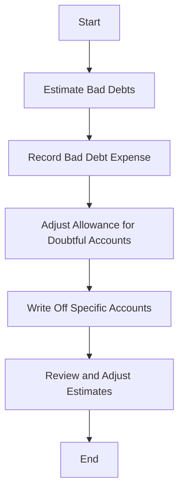

## 10.4 The Allowance Method

The Allowance Method is a fundamental accounting technique used to manage and report accounts receivable, specifically focusing on estimating and recording bad debts. This method is essential for maintaining accurate financial statements and ensuring compliance with accounting standards such as the International Financial Reporting Standards (IFRS) as adopted in Canada. In this section, we will delve into the principles, calculations, and practical applications of the Allowance Method, providing you with the knowledge needed to excel in your Canadian accounting exams and professional practice.

### Understanding Bad Debts

Before exploring the Allowance Method, it's crucial to understand what bad debts are. Bad debts refer to amounts owed to a company that are unlikely to be collected. These arise from credit sales where customers fail to fulfill their payment obligations. Recognizing and accounting for bad debts is vital for presenting a true and fair view of a company's financial position.

### The Need for the Allowance Method

The Allowance Method is preferred over the Direct Write-Off Method because it adheres to the matching principle in accounting. This principle requires that expenses be matched with the revenues they help generate within the same accounting period. By estimating bad debts and recording them in the same period as the related sales, the Allowance Method ensures that financial statements reflect a more accurate picture of a company's financial health.

### Key Concepts of the Allowance Method

1. **Allowance for Doubtful Accounts**: This is a contra-asset account that reduces the total accounts receivable on the balance sheet. It represents the estimated amount of receivables that may not be collected.

2. **Bad Debt Expense**: This is the expense recognized in the income statement, reflecting the estimated uncollectible accounts for a period.

3. **Estimation Techniques**: Companies use various methods to estimate bad debts, including the percentage of sales method and the accounts receivable aging method.

### Estimation Techniques

#### Percentage of Sales Method

The percentage of sales method estimates bad debts as a percentage of total credit sales. This approach assumes that a consistent proportion of sales will become uncollectible over time. The formula is:

 \text{Bad Debt Expense} = \text{Credit Sales} \times \text{Estimated Percentage of Uncollectible Accounts} 

**Example:**

Suppose a company has $500,000 in credit sales and estimates that 2% will be uncollectible. The bad debt expense would be:

 \text{Bad Debt Expense} = \$500,000 \times 0.02 = \$10,000 

#### Accounts Receivable Aging Method

The accounts receivable aging method categorizes receivables based on how long they have been outstanding. Different percentages are applied to each category to estimate uncollectible amounts, reflecting the increased risk of non-payment as receivables age.

**Example:**

Consider the following aging schedule:

| Age of Receivables | Amount | Estimated Uncollectible Percentage |
|--------------------|--------|------------------------------------|
| 0-30 days          | $300,000 | 1%                                |
| 31-60 days         | $150,000 | 5%                                |
| 61-90 days         | $50,000  | 10%                               |
| Over 90 days       | $20,000  | 20%                               |

The estimated uncollectible amount is calculated as follows:

 \text{Total Estimated Uncollectible} = (\$300,000 \times 0.01) + (\$150,000 \times 0.05) + (\$50,000 \times 0.10) + (\$20,000 \times 0.20) = \$3,000 + \$7,500 + \$5,000 + \$4,000 = \$19,500 

### Recording the Allowance Method

The Allowance Method involves two main journal entries:

1. **Recording Bad Debt Expense**: At the end of the accounting period, the estimated bad debt expense is recorded.

   **Journal Entry:**

   ```
   Bad Debt Expense       $XX
      Allowance for Doubtful Accounts   $XX
   ```

2. **Writing Off Specific Accounts**: When a specific account is determined to be uncollectible, it is written off against the allowance.

   **Journal Entry:**

   ```
   Allowance for Doubtful Accounts   $XX
      Accounts Receivable                  $XX
   ```

### Real-World Application

In practice, companies must regularly review and adjust their allowance for doubtful accounts to reflect current economic conditions and customer payment behaviors. This requires judgment and experience, as well as adherence to regulatory standards.

### Compliance with Canadian Accounting Standards

Under IFRS, specifically IFRS 9 - Financial Instruments, entities are required to use an expected credit loss model to estimate and recognize impairment losses on receivables. This approach aligns with the principles of the Allowance Method, emphasizing the need for timely recognition of potential losses.

### Common Challenges and Best Practices

**Challenges:**

- **Estimating Accurate Percentages**: Determining the correct percentage for estimating bad debts can be challenging, especially in volatile markets.
- **Economic Changes**: Fluctuations in the economy can impact customer payment behaviors, requiring frequent adjustments to estimates.

**Best Practices:**

- **Regular Review**: Continuously monitor and update estimates based on current data and trends.
- **Historical Analysis**: Use historical data to inform estimates, adjusting for current conditions.
- **Documentation**: Maintain thorough documentation of assumptions and calculations to support estimates and facilitate audits.

### Practical Example

Let's consider a Canadian company, Maple Leaf Electronics, which has the following accounts receivable aging schedule:

| Age of Receivables | Amount | Estimated Uncollectible Percentage |
|--------------------|--------|------------------------------------|
| 0-30 days          | $200,000 | 1%                                |
| 31-60 days         | $100,000 | 3%                                |
| 61-90 days         | $50,000  | 7%                                |
| Over 90 days       | $25,000  | 15%                               |

**Calculation:**

 \text{Total Estimated Uncollectible} = (\$200,000 \times 0.01) + (\$100,000 \times 0.03) + (\$50,000 \times 0.07) + (\$25,000 \times 0.15) = \$2,000 + \$3,000 + \$3,500 + \$3,750 = \$12,250 

**Journal Entry:**

```
Bad Debt Expense       $12,250
   Allowance for Doubtful Accounts   $12,250
```

### Diagrams and Visuals

To enhance understanding, let's visualize the process using a flowchart:



### Summary

The Allowance Method is a critical component of accounting for receivables, ensuring that financial statements accurately reflect potential losses from uncollectible accounts. By understanding and applying this method, you can enhance your financial reporting skills and prepare effectively for Canadian accounting exams.

### References and Further Reading

- **CPA Canada**: Guidelines and resources for accounting professionals.
- **IFRS 9 - Financial Instruments**: Detailed standards for impairment and credit loss recognition.
- **Accounting Standards for Private Enterprises (ASPE)**: Relevant standards for private Canadian companies.

---

## **Ready to Test Your Knowledge?**



### What is the primary purpose of the Allowance Method?

- [x] To estimate and record potential bad debts
- [ ] To directly write off bad debts as they occur
- [ ] To increase total accounts receivable
- [ ] To eliminate the need for credit sales

> **Explanation:** The Allowance Method is used to estimate and record potential bad debts, ensuring financial statements reflect a true and fair view of a company's financial position.

### Which principle does the Allowance Method adhere to?

- [x] Matching Principle
- [ ] Revenue Recognition Principle
- [ ] Cost Principle
- [ ] Full Disclosure Principle

> **Explanation:** The Allowance Method adheres to the Matching Principle, which requires that expenses be matched with the revenues they help generate within the same accounting period.

### How is the Allowance for Doubtful Accounts classified?

- [x] Contra-asset account
- [ ] Liability account
- [ ] Expense account
- [ ] Revenue account

> **Explanation:** The Allowance for Doubtful Accounts is a contra-asset account that reduces the total accounts receivable on the balance sheet.

### What is the formula for estimating bad debt expense using the percentage of sales method?

- [x] Bad Debt Expense = Credit Sales × Estimated Percentage of Uncollectible Accounts
- [ ] Bad Debt Expense = Total Sales × Estimated Percentage of Uncollectible Accounts
- [ ] Bad Debt Expense = Credit Sales × Total Receivables
- [ ] Bad Debt Expense = Total Receivables × Estimated Percentage of Uncollectible Accounts

> **Explanation:** The formula for estimating bad debt expense using the percentage of sales method is: Bad Debt Expense = Credit Sales × Estimated Percentage of Uncollectible Accounts.

### What is the estimated uncollectible amount for receivables aged 31-60 days, if the amount is $150,000 and the estimated percentage is 5%?

- [x] $7,500
- [ ] $3,000
- [x] $5,000
- [ ] $10,000

> **Explanation:** The estimated uncollectible amount is calculated as $150,000 × 0.05 = $7,500.

### What journal entry is made when a specific account is determined to be uncollectible?

- [x] Allowance for Doubtful Accounts is debited, and Accounts Receivable is credited
- [ ] Bad Debt Expense is debited, and Accounts Receivable is credited
- [ ] Accounts Receivable is debited, and Allowance for Doubtful Accounts is credited
- [ ] Allowance for Doubtful Accounts is debited, and Bad Debt Expense is credited

> **Explanation:** When a specific account is determined to be uncollectible, the Allowance for Doubtful Accounts is debited, and Accounts Receivable is credited.

### Which accounting standard requires the use of an expected credit loss model?

- [x] IFRS 9
- [ ] IFRS 15
- [x] ASPE
- [ ] IFRS 16

> **Explanation:** IFRS 9 requires the use of an expected credit loss model to estimate and recognize impairment losses on receivables.

### What is a common challenge when using the Allowance Method?

- [x] Estimating accurate percentages for bad debts
- [ ] Recording cash sales
- [ ] Increasing total sales
- [ ] Reducing total liabilities

> **Explanation:** A common challenge when using the Allowance Method is estimating accurate percentages for bad debts, especially in volatile markets.

### What is the estimated uncollectible amount for receivables aged over 90 days, if the amount is $25,000 and the estimated percentage is 15%?

- [x] $3,750
- [ ] $2,500
- [ ] $3,000
- [ ] $4,000

> **Explanation:** The estimated uncollectible amount is calculated as $25,000 × 0.15 = $3,750.

### True or False: The Allowance Method eliminates the need for credit sales.

- [x] False
- [ ] True

> **Explanation:** False. The Allowance Method does not eliminate the need for credit sales; it is used to estimate and record potential bad debts from credit sales.


