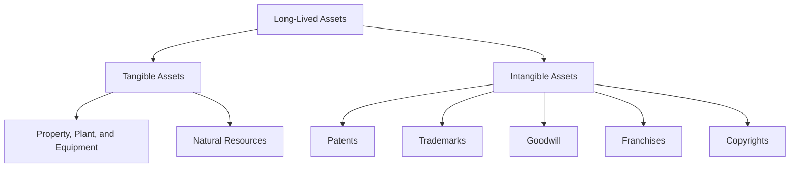

## 11.1 Types of Long-Lived Assets

In the realm of accounting, long-lived assets play a pivotal role in the financial health and operational capabilities of a business. These assets, often referred to as non-current or fixed assets, are essential for generating revenue over extended periods. This section delves into the various types of long-lived assets, including property, plant, equipment (PPE), and intangible assets, providing a comprehensive understanding of their characteristics, accounting treatment, and significance in the Canadian accounting landscape.

### Understanding Long-Lived Assets

Long-lived assets are resources owned by a business that are expected to provide economic benefits for more than one year. These assets are crucial for the ongoing operations of a company and are typically categorized into tangible and intangible assets.

#### Tangible Assets

Tangible assets are physical items that a company uses in its operations. They include:

1. **Property, Plant, and Equipment (PPE):** These are the most common types of tangible long-lived assets. They encompass land, buildings, machinery, vehicles, and equipment. PPE is vital for production and service delivery, and its value is gradually expensed through depreciation.

2. **Natural Resources:** These are assets like oil reserves, mineral deposits, and timber tracts. Unlike PPE, natural resources are depleted over time as they are extracted or harvested.

#### Intangible Assets

Intangible assets lack physical substance but hold significant value for a business. They include:

1. **Patents:** Legal rights granted to inventors, allowing them to exclude others from making, using, or selling their inventions for a specified period.

2. **Trademarks:** Symbols, names, or phrases legally registered or established by use as representing a company or product.

3. **Goodwill:** Arises when a company acquires another business for more than the fair value of its identifiable net assets. Goodwill reflects the value of a company's brand, customer base, and other intangibles.

4. **Franchises:** Agreements that allow one party to use the trademark and business model of another party.

5. **Copyrights:** Legal rights given to creators for their literary and artistic works.

### Accounting for Property, Plant, and Equipment (PPE)

The accounting treatment of PPE involves several key steps, including initial recognition, subsequent measurement, and depreciation.

#### Initial Recognition

PPE is initially recognized at cost, which includes the purchase price and any directly attributable costs necessary to bring the asset to its intended use. This may encompass transportation, installation, and testing costs.

#### Subsequent Measurement

After initial recognition, PPE can be measured using either the cost model or the revaluation model:

- **Cost Model:** The asset is carried at its cost less any accumulated depreciation and impairment losses.

- **Revaluation Model:** The asset is carried at a revalued amount, being its fair value at the date of revaluation less any subsequent accumulated depreciation and impairment losses. Revaluations must be made with sufficient regularity to ensure the carrying amount does not differ materially from fair value.

#### Depreciation

Depreciation is the systematic allocation of the depreciable amount of an asset over its useful life. Common methods include:

- **Straight-Line Method:** Allocates an equal amount of depreciation each year.

- **Declining Balance Method:** Accelerates depreciation, with higher expenses in the early years.

- **Units of Production Method:** Depreciation is based on the asset's usage or output.

### Accounting for Intangible Assets

Intangible assets are accounted for based on their acquisition and useful life.

#### Initial Recognition

Intangible assets are recognized at cost if it is probable that future economic benefits attributable to the asset will flow to the entity and the cost of the asset can be measured reliably.

#### Amortization

Intangible assets with finite useful lives are amortized over their useful life. The method of amortization should reflect the pattern in which the asset's economic benefits are consumed. Common methods include:

- **Straight-Line Amortization:** Similar to the straight-line method for depreciation.

- **Revenue-Based Amortization:** Based on the revenue generated by the asset.

Intangible assets with indefinite useful lives, such as goodwill, are not amortized but are tested for impairment annually.

### Real-World Applications and Regulatory Scenarios

In Canada, the accounting treatment of long-lived assets is governed by International Financial Reporting Standards (IFRS) for public companies and Accounting Standards for Private Enterprises (ASPE) for private companies. Key standards include:

- **IFRS 16 Leases:** Addresses the accounting for leases, impacting how companies recognize and measure leased assets.

- **IAS 16 Property, Plant, and Equipment:** Provides guidance on the recognition and measurement of PPE.

- **IAS 38 Intangible Assets:** Covers the accounting for intangible assets, including recognition, measurement, and amortization.

- **ASPE Section 3061 Property, Plant, and Equipment:** Offers guidance for private enterprises on accounting for PPE.

- **ASPE Section 3064 Goodwill and Intangible Assets:** Provides standards for recognizing and measuring intangible assets.

### Practical Examples and Case Studies

To illustrate the application of these concepts, consider the following examples:

#### Example 1: Depreciation of Machinery

A manufacturing company purchases a machine for $100,000 with an estimated useful life of 10 years and a residual value of $10,000. Using the straight-line method, the annual depreciation expense is calculated as:

 \text{Depreciation Expense} = \frac{\text{Cost} - \text{Residual Value}}{\text{Useful Life}} = \frac{100,000 - 10,000}{10} = 9,000 

#### Example 2: Amortization of a Patent

A company acquires a patent for $50,000 with a useful life of 5 years. The annual amortization expense using the straight-line method is:

 \text{Amortization Expense} = \frac{\text{Cost}}{\text{Useful Life}} = \frac{50,000}{5} = 10,000 

#### Case Study: Goodwill Impairment

A technology firm acquires a competitor for $1 million, with the fair value of identifiable net assets being $800,000. The goodwill recognized is $200,000. If the fair value of the acquired business declines, the company must assess whether the goodwill is impaired and recognize any impairment loss.

### Diagrams and Visuals

To enhance understanding, consider the following diagram illustrating the relationship between various types of long-lived assets:

### Best Practices and Common Pitfalls

When accounting for long-lived assets, consider the following best practices:

- **Regularly Review Useful Lives:** Ensure that the estimated useful lives of assets reflect their actual usage and condition.

- **Monitor for Impairment:** Regularly assess assets for impairment, especially in volatile industries.

- **Maintain Accurate Records:** Keep detailed records of asset acquisitions, improvements, and disposals.

Common pitfalls include:

- **Overlooking Impairment Indicators:** Failing to recognize impairment indicators can lead to overstated asset values.

- **Inconsistent Depreciation Methods:** Using inconsistent methods can result in inaccurate financial reporting.

### Exam Strategies and Practical Tips

For the Canadian Accounting Exams, focus on:

- **Understanding Key Standards:** Familiarize yourself with IFRS and ASPE standards related to long-lived assets.

- **Practicing Calculations:** Work through depreciation and amortization calculations to ensure accuracy.

- **Analyzing Case Studies:** Study real-world scenarios to understand the application of accounting principles.

### Summary

Long-lived assets are integral to a company's operations and financial reporting. Understanding the types, accounting treatment, and regulatory requirements is crucial for accurate financial statements and effective asset management. By mastering these concepts, you will be well-prepared for the Canadian Accounting Exams and equipped to handle long-lived assets in professional practice.

## **Ready to Test Your Knowledge?**



### Which of the following is NOT considered a tangible asset?

- [ ] Property, Plant, and Equipment
- [ ] Natural Resources
- [x] Goodwill
- [ ] Machinery

> **Explanation:** Goodwill is an intangible asset, while the others are tangible assets.

### What is the primary purpose of depreciation?

- [x] To allocate the cost of a tangible asset over its useful life
- [ ] To increase the value of an asset
- [ ] To record the market value of an asset
- [ ] To calculate the cash flow from an asset

> **Explanation:** Depreciation allocates the cost of a tangible asset over its useful life, reflecting its consumption.

### Which method of depreciation results in higher expenses in the early years?

- [ ] Straight-Line Method
- [x] Declining Balance Method
- [ ] Units of Production Method
- [ ] Revenue-Based Method

> **Explanation:** The Declining Balance Method accelerates depreciation, resulting in higher expenses in the early years.

### What is the key characteristic of intangible assets?

- [ ] They have a physical presence
- [x] They lack physical substance
- [ ] They are always amortized
- [ ] They are tangible

> **Explanation:** Intangible assets lack physical substance but hold significant value for a business.

### Which accounting standard governs the treatment of PPE in Canada?

- [x] IAS 16
- [ ] IFRS 9
- [ ] ASPE 3064
- [ ] IAS 38

> **Explanation:** IAS 16 governs the treatment of Property, Plant, and Equipment in Canada.

### How is goodwill typically tested for impairment?

- [x] Annually and when there are indicators of impairment
- [ ] Only when there is a market downturn
- [ ] Every five years
- [ ] When a company is acquired

> **Explanation:** Goodwill is tested for impairment annually and when there are indicators of impairment.

### What is the primary difference between the cost model and the revaluation model for PPE?

- [x] The revaluation model involves adjusting assets to fair value
- [ ] The cost model includes market value adjustments
- [ ] The revaluation model is only for intangible assets
- [ ] The cost model is used for natural resources

> **Explanation:** The revaluation model involves adjusting assets to fair value, while the cost model does not.

### What is the purpose of amortization for intangible assets?

- [x] To allocate the cost of an intangible asset over its useful life
- [ ] To increase the asset's market value
- [ ] To calculate cash flow from the asset
- [ ] To determine the asset's fair value

> **Explanation:** Amortization allocates the cost of an intangible asset over its useful life.

### Which of the following is an example of a natural resource?

- [ ] Patent
- [ ] Trademark
- [ ] Goodwill
- [x] Timber tract

> **Explanation:** A timber tract is a natural resource, while the others are intangible assets.

### True or False: Intangible assets with indefinite useful lives are amortized.

- [ ] True
- [x] False

> **Explanation:** Intangible assets with indefinite useful lives are not amortized but are tested for impairment annually.


