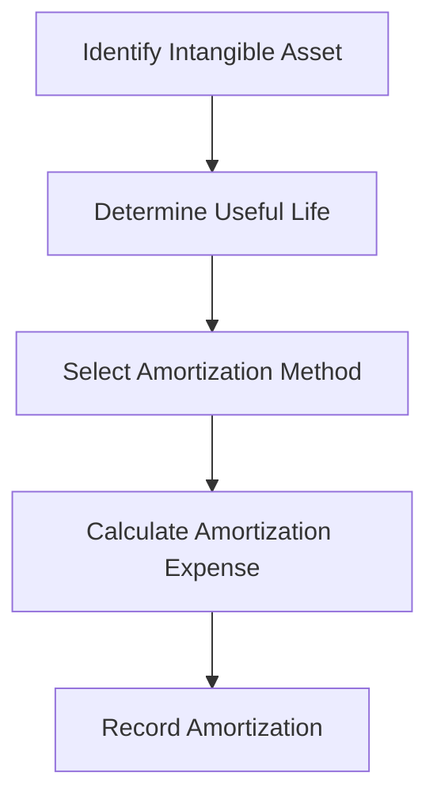

## 11.8 Amortization of Intangibles

In the realm of accounting, intangible assets represent non-physical assets that hold significant value for a business. These assets, such as patents, trademarks, copyrights, and goodwill, are crucial for a company's operations and competitive edge. Unlike tangible assets, intangibles do not have a physical presence, yet their economic benefits are undeniable. Understanding how to account for these assets is vital for accurate financial reporting and compliance with Canadian accounting standards. This section delves into the concept of amortization of intangibles, providing a detailed exploration of the methods, standards, and practical applications relevant to Canadian accounting.

### Understanding Intangible Assets

Intangible assets are identifiable non-monetary assets without physical substance. They are recognized on the balance sheet when they meet specific criteria: they must be identifiable, the company must control the asset, and the asset must provide future economic benefits. Common examples include:

- **Patents**: Legal rights granted to inventors to exclusively exploit their inventions.
- **Trademarks**: Symbols, names, or phrases legally registered or established by use as representing a company or product.
- **Copyrights**: Exclusive rights to reproduce, publish, and sell the matter and form of a literary, musical, or artistic work.
- **Goodwill**: The excess of the purchase price over the fair value of the identifiable net assets acquired in a business combination.

### Amortization of Intangible Assets

Amortization refers to the systematic allocation of the cost of an intangible asset over its useful life. This process is akin to depreciation for tangible assets but applies to intangibles. The purpose of amortization is to match the cost of the asset with the revenue it generates, adhering to the matching principle in accounting.

#### Key Points in Amortization

1. **Useful Life**: The period over which the asset is expected to contribute to future cash flows. Intangible assets can have finite or indefinite useful lives.
2. **Residual Value**: Often assumed to be zero for intangible assets unless a third party is committed to purchasing the asset at the end of its useful life.
3. **Amortization Method**: Typically, the straight-line method is used, where the cost is evenly distributed over the asset's useful life.

### Accounting Standards for Amortization

In Canada, the accounting treatment for intangible assets is governed by the International Financial Reporting Standards (IFRS) for public companies and the Accounting Standards for Private Enterprises (ASPE) for private companies.

#### IFRS Standards

Under IFRS, IAS 38 "Intangible Assets" provides guidance on the recognition, measurement, and amortization of intangible assets. Key considerations include:

- **Recognition**: An intangible asset is recognized if it is probable that future economic benefits will flow to the entity and the cost can be reliably measured.
- **Measurement**: Initially measured at cost. After recognition, it can be measured using the cost model or the revaluation model.
- **Amortization**: Intangible assets with finite useful lives are amortized over their useful lives. Those with indefinite useful lives are not amortized but are tested for impairment annually.

#### ASPE Standards

Under ASPE, Section 3064 "Goodwill and Intangible Assets" outlines the treatment of intangible assets. The principles are similar to IFRS, with some differences in application for private enterprises.

### Practical Application and Examples

To illustrate the concept of amortization, consider a company that acquires a patent for $100,000 with a useful life of 10 years. Using the straight-line method, the annual amortization expense would be $10,000 ($100,000 / 10 years). This expense is recorded on the income statement, reducing the carrying amount of the patent on the balance sheet.

#### Example Journal Entry

```plaintext
Amortization Expense - Patent      $10,000
   Accumulated Amortization - Patent      $10,000
```

### Challenges and Considerations

When dealing with intangible assets, several challenges may arise:

- **Determining Useful Life**: Estimating the useful life of an intangible asset can be complex, especially for assets with indefinite lives.
- **Impairment Testing**: Intangible assets with indefinite useful lives require annual impairment testing, which can be subjective and require significant judgment.
- **Regulatory Compliance**: Staying updated with changes in accounting standards is crucial for accurate reporting.

### Real-World Applications

In practice, companies must carefully evaluate their intangible assets to ensure proper recognition and amortization. For example, technology companies often hold significant intangible assets in the form of patents and software licenses. Proper amortization ensures that financial statements accurately reflect the company's financial position and performance.

### Best Practices

1. **Regular Review**: Periodically review the useful lives and amortization methods of intangible assets to ensure they remain appropriate.
2. **Documentation**: Maintain detailed records of the acquisition, valuation, and amortization of intangible assets.
3. **Compliance**: Ensure compliance with relevant accounting standards and regulatory requirements.

### Common Pitfalls

1. **Overlooking Impairment**: Failing to conduct regular impairment tests for intangible assets with indefinite lives can lead to misstated financial statements.
2. **Inaccurate Useful Life Estimates**: Incorrectly estimating the useful life of an asset can result in inappropriate amortization expenses.
3. **Ignoring Residual Value**: While often zero, ignoring potential residual value can lead to errors in amortization calculations.

### Canadian Context and Regulatory Scenarios

In Canada, the adoption of IFRS for public companies and ASPE for private enterprises means that accountants must be familiar with both sets of standards. Understanding the nuances of each framework is essential for accurate financial reporting and compliance.

### Step-by-Step Guidance

1. **Identify the Intangible Asset**: Determine if the asset meets the criteria for recognition.
2. **Determine Useful Life**: Assess whether the asset has a finite or indefinite useful life.
3. **Select Amortization Method**: Choose an appropriate method, typically straight-line.
4. **Calculate Amortization Expense**: Divide the cost of the asset by its useful life.
5. **Record Amortization**: Make journal entries to reflect the amortization expense and accumulated amortization.

### Diagrams and Visuals

To enhance understanding, consider the following diagram illustrating the amortization process:



### Summary and Key Points

- Intangible assets are non-physical assets that provide future economic benefits.
- Amortization is the systematic allocation of the cost of an intangible asset over its useful life.
- Compliance with IFRS and ASPE is essential for accurate financial reporting.
- Regular review and impairment testing are crucial for maintaining accurate financial statements.

### Additional Resources

- CPA Canada: [CPA Canada Resources](https://www.cpacanada.ca)
- IFRS Foundation: [IFRS Standards](https://www.ifrs.org)
- ASPE Guidelines: [ASPE Standards](https://www.cpacanada.ca/en/business-and-accounting-resources/accounting-and-financial-reporting/aspe)

---

## **Ready to Test Your Knowledge?**



### What is the primary purpose of amortizing intangible assets?

- [x] To systematically allocate the cost of the asset over its useful life
- [ ] To increase the asset's value on the balance sheet
- [ ] To reduce tax liabilities
- [ ] To improve cash flow

> **Explanation:** Amortization is used to systematically allocate the cost of an intangible asset over its useful life, reflecting its consumption and matching it with the revenue it generates.

### Which accounting standard governs the treatment of intangible assets under IFRS?

- [x] IAS 38
- [ ] IFRS 9
- [ ] IAS 16
- [ ] IFRS 15

> **Explanation:** IAS 38 "Intangible Assets" provides guidance on the recognition, measurement, and amortization of intangible assets under IFRS.

### How is the useful life of an intangible asset determined?

- [x] Based on the period over which the asset is expected to contribute to future cash flows
- [ ] By the asset's physical condition
- [ ] By the company's financial performance
- [ ] By the asset's market value

> **Explanation:** The useful life of an intangible asset is determined based on the period over which it is expected to contribute to future cash flows.

### What is typically assumed about the residual value of intangible assets?

- [x] It is often assumed to be zero
- [ ] It is equal to the asset's initial cost
- [ ] It is based on market trends
- [ ] It is determined by the asset's physical condition

> **Explanation:** The residual value of intangible assets is often assumed to be zero unless there is a commitment from a third party to purchase the asset at the end of its useful life.

### Which method is commonly used to amortize intangible assets?

- [x] Straight-line method
- [ ] Declining balance method
- [x] Units of production method
- [ ] Sum-of-the-years'-digits method

> **Explanation:** The straight-line method is commonly used to amortize intangible assets, where the cost is evenly distributed over the asset's useful life.

### What is the main challenge in amortizing intangible assets with indefinite useful lives?

- [x] Conducting annual impairment tests
- [ ] Calculating residual value
- [ ] Estimating future cash flows
- [ ] Determining market value

> **Explanation:** Intangible assets with indefinite useful lives are not amortized but require annual impairment tests, which can be subjective and require significant judgment.

### What is the primary difference between IFRS and ASPE in accounting for intangibles?

- [x] IFRS allows revaluation of intangible assets, while ASPE does not
- [ ] ASPE requires annual impairment tests for all intangibles
- [x] IFRS mandates straight-line amortization for all intangibles
- [ ] ASPE allows indefinite useful lives for all intangibles

> **Explanation:** Under IFRS, intangible assets can be measured using the cost model or the revaluation model, whereas ASPE does not allow revaluation.

### What is a common pitfall when amortizing intangible assets?

- [x] Overlooking impairment testing
- [ ] Using the declining balance method
- [ ] Ignoring the asset's physical condition
- [ ] Overestimating the asset's market value

> **Explanation:** A common pitfall is overlooking impairment testing for intangible assets with indefinite useful lives, leading to misstated financial statements.

### Why is regular review of intangible assets important?

- [x] To ensure useful lives and amortization methods remain appropriate
- [ ] To increase the asset's book value
- [ ] To reduce tax liabilities
- [ ] To improve cash flow

> **Explanation:** Regular review ensures that the useful lives and amortization methods of intangible assets remain appropriate, reflecting their actual consumption and economic benefits.

### True or False: Amortization of intangible assets is similar to depreciation of tangible assets.

- [x] True
- [ ] False

> **Explanation:** True. Amortization of intangible assets is similar to depreciation of tangible assets, as both involve the systematic allocation of an asset's cost over its useful life.


