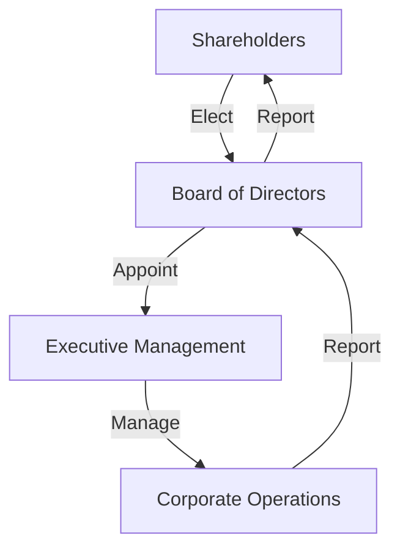

## 13.2 Corporations: An Overview

Corporations are a cornerstone of modern business, representing a unique form of business organization that offers distinct advantages and challenges. Understanding corporations is crucial for anyone preparing for Canadian accounting exams, as they play a significant role in the economy and financial reporting. This section provides a comprehensive overview of corporations, including their structure, characteristics, and the regulatory framework governing them in Canada.

### What is a Corporation?

A corporation is a legal entity that is separate and distinct from its owners, known as shareholders. It is created under the laws of a particular jurisdiction and is recognized as a "person" in the eyes of the law. This means that a corporation can own property, incur debt, enter into contracts, sue and be sued, and pay taxes independently of its shareholders.

#### Key Characteristics of Corporations

1. **Limited Liability**: Shareholders are only liable for the amount they have invested in the corporation. This means that personal assets are protected from the corporation's creditors.

2. **Perpetual Existence**: A corporation continues to exist even if the ownership changes or shareholders die. This continuity is a significant advantage over sole proprietorships and partnerships.

3. **Transferability of Ownership**: Shares of a corporation can be bought and sold, allowing for easy transfer of ownership without affecting the corporation's operations.

4. **Centralized Management**: Corporations are managed by a board of directors elected by the shareholders. The board appoints officers to handle the day-to-day operations.

5. **Separate Legal Entity**: As a separate legal entity, a corporation can own assets, incur liabilities, and engage in business activities independently of its shareholders.

6. **Regulatory Compliance**: Corporations must comply with various regulatory requirements, including filing annual reports, holding shareholder meetings, and adhering to corporate governance standards.

### Types of Corporations

Corporations can be classified into different types based on their purpose, ownership, and size. Understanding these distinctions is essential for accounting professionals.

1. **Public Corporations**: These are companies whose shares are traded on public stock exchanges. They are subject to stringent regulatory requirements, including disclosure of financial information to the public.

2. **Private Corporations**: Owned by a small group of investors, these corporations do not trade their shares publicly. They have fewer regulatory obligations compared to public corporations.

3. **Non-Profit Corporations**: These entities are organized for charitable, educational, or social purposes. They do not distribute profits to shareholders but reinvest them in their mission.

4. **Crown Corporations**: Owned by the government, these entities provide services or products that are deemed essential for the public good.

### The Process of Incorporation

Incorporation is the process of legally declaring a corporate entity as separate from its owners. This process involves several steps:

1. **Choosing a Corporate Name**: The name must be unique and comply with the naming rules of the jurisdiction.

2. **Filing Articles of Incorporation**: This document outlines the corporation's structure, purpose, and other essential details. It must be filed with the appropriate government body.

3. **Creating Corporate Bylaws**: Bylaws govern the internal management of the corporation, including the roles and responsibilities of directors and officers.

4. **Appointing Directors**: The initial board of directors is appointed to oversee the corporation's activities.

5. **Issuing Shares**: Shares are issued to the initial shareholders, representing their ownership in the corporation.

6. **Obtaining Necessary Licenses and Permits**: Depending on the business activities, the corporation may need specific licenses to operate legally.

### Corporate Governance

Corporate governance refers to the system of rules, practices, and processes by which a corporation is directed and controlled. It involves balancing the interests of a company's many stakeholders, including shareholders, management, customers, suppliers, financiers, government, and the community.

#### Key Elements of Corporate Governance

1. **Board of Directors**: The board is responsible for making major decisions, setting policies, and overseeing the corporation's management. It acts in the best interests of the shareholders.

2. **Executive Management**: Officers such as the CEO and CFO are responsible for the day-to-day operations of the corporation. They implement the board's policies and strategies.

3. **Shareholder Rights**: Shareholders have the right to vote on important matters, such as electing directors and approving major corporate changes.

4. **Transparency and Disclosure**: Corporations must provide accurate and timely information to stakeholders, ensuring transparency in financial reporting and decision-making.

5. **Accountability**: Management and the board are accountable to shareholders and must act in their best interests.

6. **Ethical Conduct**: Corporations are expected to operate ethically and comply with laws and regulations.

### Advantages and Disadvantages of Corporations

Understanding the pros and cons of corporations is essential for making informed business decisions.

#### Advantages

- **Limited Liability**: Protects shareholders' personal assets.
- **Access to Capital**: Corporations can raise funds by issuing shares or bonds.
- **Perpetual Existence**: Ensures continuity and stability.
- **Transferability of Shares**: Facilitates liquidity and investment opportunities.

#### Disadvantages

- **Complexity and Cost**: Incorporation involves legal and administrative costs.
- **Regulatory Compliance**: Corporations face ongoing reporting and compliance obligations.
- **Double Taxation**: Profits may be taxed at both the corporate and shareholder levels.

### Real-World Applications and Regulatory Scenarios

In Canada, corporations are governed by federal and provincial laws. The Canada Business Corporations Act (CBCA) is the primary legislation for federal corporations, while each province has its own corporate statutes. Understanding these regulations is crucial for compliance and effective corporate management.

#### Case Study: Incorporation in Canada

Consider a tech startup in Toronto that decides to incorporate to attract investors. The founders choose a unique name, file the articles of incorporation with Corporations Canada, and appoint a board of directors. They issue shares to initial investors and create corporate bylaws to guide internal operations. By incorporating, the startup gains credibility, access to capital, and limited liability protection.

### Practical Examples and Scenarios

Let's explore a practical example of corporate governance in action:

**Scenario**: A publicly traded corporation is facing a shareholder vote on a proposed merger. The board of directors must evaluate the merger's potential benefits and risks, considering the impact on shareholder value. They engage with shareholders, provide detailed disclosures, and ensure transparency throughout the process. The shareholders vote on the merger, exercising their rights and influencing the corporation's strategic direction.

### Diagrams and Visuals

To enhance understanding, let's visualize the corporate structure using a Mermaid.js diagram:

This diagram illustrates the flow of authority and accountability within a corporation, highlighting the roles of shareholders, the board, and executive management.

### Best Practices and Common Pitfalls

**Best Practices**:
- Ensure compliance with corporate governance standards.
- Maintain transparency and open communication with stakeholders.
- Regularly review and update corporate bylaws and policies.

**Common Pitfalls**:
- Failing to adhere to regulatory requirements can lead to legal issues.
- Poor communication with shareholders may result in dissatisfaction and conflict.
- Neglecting ethical standards can damage reputation and stakeholder trust.

### Exam Focus and Strategies

For Canadian accounting exams, focus on understanding the key characteristics of corporations, the incorporation process, and corporate governance principles. Practice analyzing scenarios involving corporate decisions and shareholder rights. Use mnemonic devices to remember the advantages and disadvantages of corporations.

### Additional Resources

For further exploration, refer to the following resources:
- Canada Business Corporations Act (CBCA)
- CPA Canada's guidelines on corporate governance
- International Financial Reporting Standards (IFRS) as adopted in Canada

### Summary

Corporations are a vital component of the business landscape, offering unique advantages and challenges. Understanding their structure, characteristics, and governance is essential for accounting professionals. By mastering these concepts, you will be well-prepared for Canadian accounting exams and equipped to navigate the corporate world.

## **Ready to Test Your Knowledge?**



### What is a key characteristic of a corporation?

- [x] Limited liability for shareholders
- [ ] Unlimited liability for shareholders
- [ ] Sole ownership
- [ ] Partnership structure

> **Explanation:** A corporation provides limited liability, meaning shareholders are only liable for their investment amount.

### Which document outlines a corporation's structure and purpose?

- [x] Articles of Incorporation
- [ ] Corporate Bylaws
- [ ] Shareholder Agreement
- [ ] Board Resolution

> **Explanation:** Articles of Incorporation detail the corporation's structure and purpose and are filed with the government.

### What is the role of the board of directors in a corporation?

- [x] Oversee management and make major decisions
- [ ] Manage day-to-day operations
- [ ] Issue shares
- [ ] Prepare financial statements

> **Explanation:** The board of directors oversees management and makes major decisions, acting in the shareholders' best interests.

### How can a corporation raise capital?

- [x] Issuing shares or bonds
- [ ] Selling assets
- [ ] Reducing liabilities
- [ ] Increasing expenses

> **Explanation:** Corporations can raise capital by issuing shares or bonds, providing funds for growth and operations.

### What is a disadvantage of corporations?

- [x] Double taxation
- [ ] Limited liability
- [ ] Perpetual existence
- [ ] Transferability of shares

> **Explanation:** Corporations may face double taxation, where profits are taxed at both the corporate and shareholder levels.

### What is the primary legislation for federal corporations in Canada?

- [x] Canada Business Corporations Act (CBCA)
- [ ] Provincial Corporate Statutes
- [ ] Securities Act
- [ ] Income Tax Act

> **Explanation:** The CBCA governs federal corporations in Canada, outlining the legal framework for incorporation and operation.

### What is a benefit of perpetual existence for a corporation?

- [x] Continuity despite ownership changes
- [ ] Limited liability
- [ ] Double taxation
- [ ] Regulatory compliance

> **Explanation:** Perpetual existence ensures continuity, allowing the corporation to operate despite changes in ownership.

### What is a common pitfall in corporate governance?

- [x] Failing to adhere to regulatory requirements
- [ ] Maintaining transparency
- [ ] Engaging with stakeholders
- [ ] Updating corporate bylaws

> **Explanation:** Non-compliance with regulations can lead to legal issues and damage the corporation's reputation.

### How are shares of a corporation transferred?

- [x] Bought and sold on stock exchanges
- [ ] Through board resolutions
- [ ] By issuing new shares
- [ ] By reducing liabilities

> **Explanation:** Shares can be bought and sold on stock exchanges, facilitating easy transfer of ownership.

### True or False: Corporations are considered separate legal entities from their owners.

- [x] True
- [ ] False

> **Explanation:** True. Corporations are separate legal entities, allowing them to own property, incur debt, and enter contracts independently.


