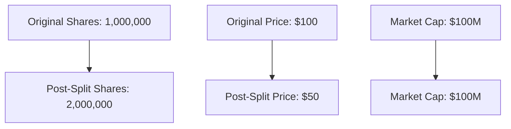

## 13.8 Stock Splits and Stock Dividends

Stock splits and stock dividends are significant corporate actions that can impact a company's financial statements and the value perceived by shareholders. Understanding these concepts is crucial for accounting professionals and investors alike, particularly those preparing for Canadian Accounting Exams. This section provides a detailed exploration of stock splits and stock dividends, their accounting treatment, and their effects on financial statements and shareholder equity.

### Understanding Stock Splits

A stock split is a corporate action that increases the number of a company's outstanding shares by issuing more shares to current shareholders. This action reduces the stock price, making it more affordable for investors, without changing the company's market capitalization.

#### Types of Stock Splits

1. **Forward Stock Split**: This is the most common type of stock split, where a company increases its number of shares and decreases the price per share. For example, in a 2-for-1 split, each shareholder receives an additional share for every share they own, and the stock price is halved.

2. **Reverse Stock Split**: In contrast, a reverse stock split reduces the number of shares and increases the price per share. For example, in a 1-for-2 reverse split, shareholders exchange two shares for one, doubling the stock price.

#### Accounting for Stock Splits

Stock splits do not affect the total value of shareholders' equity or the company's market capitalization. However, they do require adjustments in the financial statements:

- **Balance Sheet**: The number of shares outstanding is adjusted, but the par value per share remains unchanged. The total equity remains the same.
- **Earnings Per Share (EPS)**: EPS is recalculated to reflect the new number of shares.

#### Example of a Stock Split

Consider a company with 1 million shares outstanding, each priced at $100. A 2-for-1 stock split would result in 2 million shares outstanding, each priced at $50. The total market capitalization remains $100 million.

### Understanding Stock Dividends

A stock dividend is a payment made by a corporation to its shareholders in the form of additional shares, rather than cash. This action increases the number of shares outstanding but does not affect the overall market capitalization.

#### Types of Stock Dividends

1. **Small Stock Dividend**: Typically less than 20-25% of the existing shares. The dividend is recorded at the market value of the shares.
2. **Large Stock Dividend**: More than 20-25% of the existing shares. The dividend is recorded at the par or stated value of the shares.

#### Accounting for Stock Dividends

Stock dividends require specific accounting entries to reflect the issuance of new shares:

- **Retained Earnings**: Decreased by the fair market value of the additional shares for small stock dividends or by the par value for large stock dividends.
- **Common Stock**: Increased by the par value of the additional shares.
- **Additional Paid-In Capital**: Adjusted for the difference between the market value and par value in the case of small stock dividends.

#### Example of a Stock Dividend

Suppose a company declares a 10% stock dividend when its shares are trading at $100, and the par value is $1. For 1 million shares outstanding, the company issues 100,000 new shares. The journal entry would decrease retained earnings by $10 million (100,000 shares x $100) and increase common stock by $100,000 (100,000 shares x $1), with the remainder going to additional paid-in capital.

### Impact on Financial Statements and Shareholders

#### Financial Statements

- **Balance Sheet**: Both stock splits and stock dividends increase the number of shares outstanding. Stock splits do not affect retained earnings, while stock dividends decrease retained earnings.
- **Income Statement**: There is no direct impact on the income statement, but EPS is affected due to the change in the number of shares.
- **Statement of Cash Flows**: Neither action affects cash flows directly.

#### Shareholders

- **Ownership Percentage**: Both actions maintain the proportional ownership of shareholders.
- **Market Perception**: Stock splits can signal management's confidence in future growth, potentially attracting more investors. Stock dividends can be seen as a way to reward shareholders without depleting cash reserves.

### Real-World Applications and Regulatory Considerations

In Canada, companies must adhere to specific regulations when executing stock splits and stock dividends. These actions must be approved by the board of directors and comply with the guidelines set by regulatory bodies such as the Canadian Securities Administrators (CSA).

### Practical Examples and Case Studies

#### Case Study: Apple Inc. Stock Split

Apple Inc. executed a 4-for-1 stock split in 2020. This move made its shares more accessible to a broader range of investors, increasing liquidity and potentially boosting demand.

#### Case Study: Canadian Company Stock Dividend

Consider a Canadian company that issues a 5% stock dividend. This action rewards shareholders with additional shares, enhancing their investment without impacting the company's cash position.

### Diagrams and Visual Aids

To further illustrate these concepts, consider the following diagram showing the impact of a 2-for-1 stock split:

### Best Practices and Common Pitfalls

- **Best Practices**: Companies should communicate clearly with shareholders about the reasons for stock splits or dividends and the expected impact.
- **Common Pitfalls**: Misunderstanding the implications of these actions can lead to incorrect financial reporting or investor dissatisfaction.

### Conclusion

Stock splits and stock dividends are powerful tools for companies to manage their equity structure and reward shareholders. Understanding their accounting treatment and impact on financial statements is essential for accounting professionals and investors.

### References and Further Reading

- CPA Canada Handbook
- International Financial Reporting Standards (IFRS)
- Canadian Securities Administrators (CSA) Guidelines

## **Ready to Test Your Knowledge?**



### What is the primary purpose of a stock split?

- [x] To increase the number of shares and decrease the price per share
- [ ] To decrease the number of shares and increase the price per share
- [ ] To distribute cash to shareholders
- [ ] To reduce the company's market capitalization

> **Explanation:** A stock split increases the number of shares and decreases the price per share, making the stock more accessible to investors without changing the company's market capitalization.

### How does a stock dividend affect retained earnings?

- [x] Decreases retained earnings
- [ ] Increases retained earnings
- [ ] Has no effect on retained earnings
- [ ] Converts retained earnings to cash

> **Explanation:** A stock dividend decreases retained earnings by the value of the additional shares issued.

### What is the impact of a stock split on the balance sheet?

- [x] Increases the number of shares outstanding
- [ ] Decreases the number of shares outstanding
- [ ] Changes the total equity
- [ ] Affects the cash balance

> **Explanation:** A stock split increases the number of shares outstanding without affecting the total equity or cash balance.

### Which of the following is true about a reverse stock split?

- [x] It reduces the number of shares and increases the price per share
- [ ] It increases the number of shares and decreases the price per share
- [ ] It has no effect on the stock price
- [ ] It is the same as a stock dividend

> **Explanation:** A reverse stock split reduces the number of shares and increases the price per share, often used to boost the stock price.

### In a 10% stock dividend, how many new shares are issued if a company has 1 million shares outstanding?

- [x] 100,000
- [ ] 10,000
- [ ] 1,000,000
- [ ] 10,000,000

> **Explanation:** A 10% stock dividend on 1 million shares results in 100,000 new shares being issued.

### What is the effect of a stock dividend on the market capitalization of a company?

- [x] No effect on market capitalization
- [ ] Increases market capitalization
- [ ] Decreases market capitalization
- [ ] Converts market capitalization to cash

> **Explanation:** A stock dividend does not affect the market capitalization, as it only changes the number of shares outstanding.

### How is a large stock dividend typically recorded?

- [x] At the par or stated value of the shares
- [ ] At the market value of the shares
- [ ] As a liability
- [ ] As a cash outflow

> **Explanation:** A large stock dividend is recorded at the par or stated value of the shares, unlike small stock dividends, which are recorded at market value.

### What is a common reason for a company to execute a stock split?

- [x] To make shares more affordable and increase liquidity
- [ ] To reduce the number of shareholders
- [ ] To increase the company's debt
- [ ] To decrease the company's equity

> **Explanation:** Companies often execute stock splits to make shares more affordable and increase liquidity, attracting more investors.

### What happens to EPS after a stock split?

- [x] EPS is recalculated to reflect the new number of shares
- [ ] EPS remains unchanged
- [ ] EPS increases
- [ ] EPS decreases to zero

> **Explanation:** After a stock split, EPS is recalculated to reflect the increased number of shares, maintaining the same earnings.

### Stock splits and stock dividends have the same impact on a company's cash flow.

- [ ] True
- [x] False

> **Explanation:** False. Neither stock splits nor stock dividends directly impact a company's cash flow, as they involve equity adjustments rather than cash transactions.


