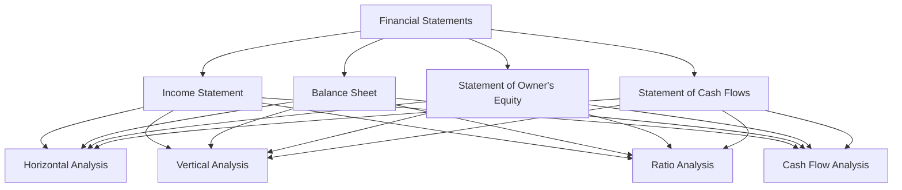

## 14.1 Purpose of Financial Statement Analysis

Financial statement analysis is a critical component of accounting that provides valuable insights into a company's financial health and operational effectiveness. By examining financial statements, stakeholders can make informed decisions that impact investment, lending, and management strategies. This section delves into the purpose of financial statement analysis, illustrating its significance through practical examples, real-world applications, and regulatory considerations within the Canadian accounting context.

### Understanding Financial Statements

Financial statements are formal records of a company's financial activities and position. They typically include the income statement, balance sheet, statement of owner's equity, and statement of cash flows. Each statement serves a specific purpose:

- **Income Statement:** Shows the company's profitability over a specific period by detailing revenues, expenses, and net income.
- **Balance Sheet:** Provides a snapshot of the company's financial position at a given point in time, listing assets, liabilities, and equity.
- **Statement of Owner's Equity:** Reflects changes in the owner's equity over a period, including investments, withdrawals, and retained earnings.
- **Statement of Cash Flows:** Illustrates the cash inflows and outflows from operating, investing, and financing activities.

### The Importance of Financial Statement Analysis

Financial statement analysis is essential for various reasons:

1. **Assessing Financial Health:** Analyzing financial statements helps stakeholders evaluate a company's financial stability and performance. This assessment is crucial for investors, creditors, and management to understand the company's ability to generate profits, manage debts, and sustain operations.

2. **Informed Decision Making:** By interpreting financial data, stakeholders can make informed decisions regarding investments, lending, and strategic planning. For example, investors use financial statement analysis to determine the potential return on investment, while creditors assess the company's creditworthiness.

3. **Performance Evaluation:** Financial statement analysis allows management to evaluate the company's operational efficiency and profitability. By comparing financial ratios and trends over time, management can identify areas for improvement and implement corrective measures.

4. **Compliance and Reporting:** Companies must adhere to accounting standards and regulatory requirements when preparing financial statements. Financial statement analysis ensures that the company complies with these standards, such as the International Financial Reporting Standards (IFRS) and Accounting Standards for Private Enterprises (ASPE) in Canada.

5. **Benchmarking and Competitive Analysis:** Analyzing financial statements enables companies to benchmark their performance against industry peers. This comparison helps identify competitive advantages and areas where the company may lag behind.

### Key Components of Financial Statement Analysis

Financial statement analysis involves various techniques and tools to interpret financial data effectively. Some key components include:

- **Horizontal Analysis:** Examines financial statement data over multiple periods to identify trends and growth patterns. This analysis helps stakeholders understand how a company's financial performance has evolved over time.

- **Vertical Analysis:** Involves analyzing each financial statement item as a percentage of a base figure, such as total assets or sales. Vertical analysis provides insights into the relative size of each component and its impact on the overall financial position.

- **Ratio Analysis:** Utilizes financial ratios to assess a company's liquidity, solvency, profitability, and efficiency. Common ratios include the current ratio, debt-to-equity ratio, return on equity, and inventory turnover.

- **Cash Flow Analysis:** Focuses on the cash flow statement to evaluate a company's ability to generate cash and meet its financial obligations. This analysis is crucial for assessing liquidity and financial flexibility.

### Practical Examples and Case Studies

To illustrate the purpose of financial statement analysis, consider the following examples:

#### Example 1: Investment Decision

An investor is considering purchasing shares in a Canadian manufacturing company. By analyzing the company's financial statements, the investor can assess its profitability, growth potential, and financial stability. Key metrics such as the price-to-earnings ratio, return on assets, and dividend yield provide valuable insights into the investment's potential return and risk.

#### Example 2: Credit Assessment

A bank is evaluating a loan application from a small business. Through financial statement analysis, the bank can determine the business's creditworthiness by examining its debt-to-equity ratio, interest coverage ratio, and cash flow from operations. This analysis helps the bank assess the likelihood of loan repayment and set appropriate lending terms.

#### Example 3: Performance Improvement

A retail company is experiencing declining profits. By conducting a detailed financial statement analysis, management identifies that high operating expenses and low inventory turnover are contributing to the decline. The company implements cost-cutting measures and improves inventory management, resulting in increased profitability.

### Real-World Applications and Regulatory Scenarios

Financial statement analysis plays a vital role in various real-world applications and regulatory scenarios:

- **Mergers and Acquisitions:** During mergers and acquisitions, financial statement analysis helps assess the financial health and value of the target company. This analysis is crucial for negotiating fair terms and ensuring a successful transaction.

- **Regulatory Compliance:** Companies must comply with accounting standards and regulations when preparing financial statements. Financial statement analysis ensures that the company adheres to these requirements, reducing the risk of legal and financial penalties.

- **Investor Relations:** Publicly traded companies use financial statement analysis to communicate their financial performance and prospects to investors. This transparency builds investor confidence and supports the company's market valuation.

### Step-by-Step Guidance for Financial Statement Analysis

To conduct a comprehensive financial statement analysis, follow these steps:

1. **Gather Financial Statements:** Obtain the company's income statement, balance sheet, statement of owner's equity, and statement of cash flows for the relevant periods.

2. **Perform Horizontal Analysis:** Compare financial statement data over multiple periods to identify trends and growth patterns.

3. **Conduct Vertical Analysis:** Analyze each financial statement item as a percentage of a base figure to understand its relative size and impact.

4. **Calculate Financial Ratios:** Use financial ratios to assess the company's liquidity, solvency, profitability, and efficiency.

5. **Analyze Cash Flows:** Evaluate the cash flow statement to assess the company's ability to generate cash and meet financial obligations.

6. **Interpret Findings:** Draw conclusions from the analysis and identify areas for improvement or potential risks.

7. **Make Informed Decisions:** Use the analysis to make informed decisions regarding investments, lending, and strategic planning.

### Diagrams and Charts

To enhance understanding, consider the following diagram illustrating the relationship between financial statements and analysis techniques:

### Best Practices, Common Pitfalls, and Strategies

When conducting financial statement analysis, consider the following best practices, common pitfalls, and strategies:

- **Best Practices:**
  - Use multiple analysis techniques to gain a comprehensive understanding of the company's financial position.
  - Compare financial data with industry benchmarks to assess performance relative to peers.
  - Regularly update financial analysis to reflect the most current data and trends.

- **Common Pitfalls:**
  - Relying solely on financial ratios without considering qualitative factors, such as management quality and market conditions.
  - Overlooking the impact of accounting policies and estimates on financial statements.
  - Failing to consider the broader economic and industry context when interpreting financial data.

- **Strategies:**
  - Develop a systematic approach to financial statement analysis, following a consistent methodology.
  - Use software tools and financial databases to streamline data collection and analysis.
  - Collaborate with financial analysts and industry experts to gain additional insights and perspectives.

### References and Additional Resources

For further exploration of financial statement analysis, consider the following resources:

- **CPA Canada:** Offers guidance on financial statement analysis and accounting standards.
- **International Financial Reporting Standards (IFRS):** Provides the framework for preparing financial statements in Canada.
- **Accounting Standards for Private Enterprises (ASPE):** Outlines the accounting standards for private companies in Canada.
- **Financial Analysis Textbooks:** Comprehensive guides on financial statement analysis techniques and applications.

### Conclusion

Financial statement analysis is a vital tool for understanding a company's financial health and making informed decisions. By examining financial statements, stakeholders can assess financial stability, evaluate performance, and ensure compliance with regulatory standards. Through practical examples, real-world applications, and step-by-step guidance, this section has highlighted the importance of financial statement analysis within the Canadian accounting context.

## **Ready to Test Your Knowledge?**



### What is the primary purpose of financial statement analysis?

- [x] To assess a company's financial health and make informed decisions
- [ ] To prepare financial statements for external reporting
- [ ] To audit a company's financial records
- [ ] To calculate taxes owed by a company

> **Explanation:** The primary purpose of financial statement analysis is to assess a company's financial health and make informed decisions regarding investments, lending, and management strategies.

### Which financial statement provides a snapshot of a company's financial position at a given point in time?

- [ ] Income Statement
- [x] Balance Sheet
- [ ] Statement of Owner's Equity
- [ ] Statement of Cash Flows

> **Explanation:** The balance sheet provides a snapshot of a company's financial position at a given point in time, listing assets, liabilities, and equity.

### What is horizontal analysis?

- [x] Examining financial statement data over multiple periods to identify trends
- [ ] Analyzing each financial statement item as a percentage of a base figure
- [ ] Calculating financial ratios to assess liquidity and profitability
- [ ] Evaluating cash inflows and outflows from operations

> **Explanation:** Horizontal analysis involves examining financial statement data over multiple periods to identify trends and growth patterns.

### Which financial ratio assesses a company's ability to meet short-term obligations?

- [ ] Return on Equity
- [ ] Debt-to-Equity Ratio
- [x] Current Ratio
- [ ] Inventory Turnover

> **Explanation:** The current ratio assesses a company's ability to meet short-term obligations by comparing current assets to current liabilities.

### What is the purpose of vertical analysis?

- [ ] To compare financial data with industry benchmarks
- [x] To analyze each financial statement item as a percentage of a base figure
- [ ] To evaluate cash flows from operating activities
- [ ] To identify trends over multiple periods

> **Explanation:** Vertical analysis involves analyzing each financial statement item as a percentage of a base figure, such as total assets or sales, to understand its relative size and impact.

### Which financial statement is crucial for assessing a company's liquidity and financial flexibility?

- [ ] Income Statement
- [ ] Balance Sheet
- [ ] Statement of Owner's Equity
- [x] Statement of Cash Flows

> **Explanation:** The statement of cash flows is crucial for assessing a company's liquidity and financial flexibility by illustrating cash inflows and outflows from operating, investing, and financing activities.

### What is a common pitfall in financial statement analysis?

- [x] Relying solely on financial ratios without considering qualitative factors
- [ ] Using multiple analysis techniques
- [ ] Comparing financial data with industry benchmarks
- [ ] Regularly updating financial analysis

> **Explanation:** A common pitfall in financial statement analysis is relying solely on financial ratios without considering qualitative factors, such as management quality and market conditions.

### Which accounting standards are used in Canada for preparing financial statements?

- [x] International Financial Reporting Standards (IFRS)
- [ ] Generally Accepted Accounting Principles (GAAP)
- [ ] Financial Accounting Standards Board (FASB)
- [ ] Sarbanes-Oxley Act (SOX)

> **Explanation:** In Canada, the International Financial Reporting Standards (IFRS) are used for preparing financial statements, along with the Accounting Standards for Private Enterprises (ASPE) for private companies.

### What is the role of financial statement analysis in mergers and acquisitions?

- [x] To assess the financial health and value of the target company
- [ ] To prepare financial statements for the acquiring company
- [ ] To audit the financial records of the target company
- [ ] To calculate taxes owed by the target company

> **Explanation:** In mergers and acquisitions, financial statement analysis helps assess the financial health and value of the target company, which is crucial for negotiating fair terms and ensuring a successful transaction.

### True or False: Financial statement analysis is only important for investors.

- [ ] True
- [x] False

> **Explanation:** False. Financial statement analysis is important for various stakeholders, including investors, creditors, management, and regulatory bodies, as it provides insights into a company's financial health and operational effectiveness.


