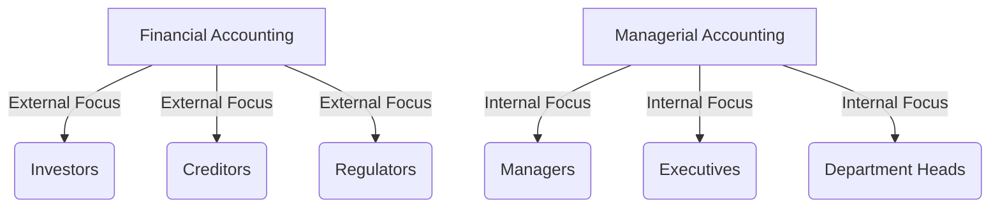

## 16.1 Financial vs. Managerial Accounting

Understanding the differences between financial and managerial accounting is crucial for anyone preparing for Canadian accounting exams or entering the accounting profession. Both branches of accounting serve distinct purposes and cater to different audiences, yet they are interconnected in the broader context of business operations. This section will delve into the core differences, objectives, methodologies, and applications of financial and managerial accounting, providing you with a comprehensive understanding of these essential accounting disciplines.

### **Overview of Financial Accounting**

Financial accounting is primarily concerned with the preparation of financial statements that provide information about a company's financial performance and position to external users. These users include investors, creditors, regulators, and other stakeholders who rely on accurate and standardized financial information to make informed decisions.

#### **Objectives of Financial Accounting**

1. **Provide Financial Information**: The primary objective is to provide financial information that is useful for making investment and credit decisions.
2. **Ensure Compliance**: Financial accounting ensures compliance with accounting standards such as the International Financial Reporting Standards (IFRS) and Accounting Standards for Private Enterprises (ASPE) in Canada.
3. **Historical Perspective**: It focuses on recording past financial transactions and summarizing them into financial statements, such as the income statement, balance sheet, and cash flow statement.

#### **Key Characteristics of Financial Accounting**

- **Standardization**: Financial accounting follows strict guidelines and standards to ensure consistency and comparability across different entities.
- **External Focus**: It is designed to meet the needs of external stakeholders, providing them with a clear picture of the company's financial health.
- **Periodic Reporting**: Financial statements are typically prepared on a quarterly and annual basis, providing a snapshot of the company's financial position at specific points in time.

#### **Financial Statements and Their Importance**

Financial statements are the primary output of financial accounting. They include:

- **Income Statement**: Shows the company's profitability over a specific period.
- **Balance Sheet**: Provides a snapshot of the company's assets, liabilities, and equity at a given point in time.
- **Statement of Cash Flows**: Details the cash inflows and outflows from operating, investing, and financing activities.
- **Statement of Changes in Equity**: Reflects changes in the company's equity during the reporting period.

These statements are crucial for assessing a company's financial performance and making informed economic decisions.

### **Overview of Managerial Accounting**

Managerial accounting, on the other hand, focuses on providing information to internal users, such as managers and executives, to aid in decision-making, planning, and controlling business operations. Unlike financial accounting, managerial accounting is not bound by standardized rules and can be tailored to meet the specific needs of the organization.

#### **Objectives of Managerial Accounting**

1. **Support Decision-Making**: Provides relevant information to managers to make informed business decisions.
2. **Assist in Planning and Budgeting**: Helps in preparing budgets and forecasts to guide future business activities.
3. **Facilitate Performance Evaluation**: Assists in evaluating the performance of different departments and business units.

#### **Key Characteristics of Managerial Accounting**

- **Flexibility**: Managerial accounting is flexible and can be adapted to the specific needs of the organization.
- **Internal Focus**: It is primarily concerned with providing information to internal stakeholders for operational and strategic decision-making.
- **Forward-Looking**: Unlike financial accounting, managerial accounting often focuses on future projections and scenarios.

#### **Tools and Techniques in Managerial Accounting**

Managerial accounting employs various tools and techniques to support decision-making, including:

- **Cost Analysis**: Understanding and managing costs to improve efficiency and profitability.
- **Budgeting**: Preparing detailed budgets to plan and control financial resources.
- **Variance Analysis**: Comparing actual performance with budgeted figures to identify discrepancies and areas for improvement.
- **Cost-Volume-Profit Analysis**: Analyzing the relationship between costs, sales volume, and profit to make informed pricing and production decisions.

### **Comparative Analysis: Financial vs. Managerial Accounting**

To further understand the distinctions between financial and managerial accounting, let's explore their differences across several dimensions:

#### **Purpose and Audience**

- **Financial Accounting**: Aims to provide a true and fair view of the company's financial position to external stakeholders. It is primarily used by investors, creditors, and regulatory bodies.
- **Managerial Accounting**: Focuses on providing relevant information to internal stakeholders, such as managers and executives, to aid in decision-making and strategic planning.

#### **Regulatory Compliance**

- **Financial Accounting**: Must comply with established accounting standards and regulations, such as IFRS and ASPE, ensuring consistency and comparability.
- **Managerial Accounting**: Not subject to external regulations, allowing for flexibility and customization based on the organization's needs.

#### **Time Orientation**

- **Financial Accounting**: Historical in nature, focusing on past financial transactions and events.
- **Managerial Accounting**: Forward-looking, emphasizing future projections, budgets, and strategic planning.

#### **Reporting Frequency**

- **Financial Accounting**: Reports are typically prepared on a periodic basis (quarterly and annually).
- **Managerial Accounting**: Reports can be generated as needed, often on a more frequent basis, to support ongoing decision-making.

#### **Level of Detail**

- **Financial Accounting**: Provides a broad overview of the company's financial position, often summarizing data into aggregate figures.
- **Managerial Accounting**: Offers detailed and specific information tailored to the needs of different departments and business units.

### **Practical Examples and Case Studies**

To illustrate the application of financial and managerial accounting, consider the following scenarios:

#### **Example 1: Financial Accounting in Practice**

A Canadian manufacturing company prepares its annual financial statements in compliance with IFRS. The financial statements are audited and presented to shareholders, creditors, and regulatory authorities. These statements provide a comprehensive overview of the company's financial performance, helping stakeholders assess the company's profitability and financial stability.

#### **Example 2: Managerial Accounting in Practice**

The same manufacturing company uses managerial accounting to prepare a detailed budget for the upcoming fiscal year. The budget includes projections for sales, production costs, and operating expenses. Managers use this information to make strategic decisions, such as adjusting production levels, optimizing resource allocation, and setting sales targets.

### **Real-World Applications and Regulatory Scenarios**

In the Canadian context, both financial and managerial accounting play vital roles in ensuring business success and regulatory compliance. Financial accounting is essential for meeting the reporting requirements set by CPA Canada and other regulatory bodies, while managerial accounting supports internal decision-making and strategic planning.

#### **Compliance with Canadian Accounting Standards**

- **IFRS and ASPE**: Canadian companies must adhere to these standards for financial reporting, ensuring transparency and consistency in financial statements.
- **CPA Canada**: Provides guidelines and resources for accounting professionals, emphasizing the importance of ethical practices and compliance with standards.

#### **Strategic Decision-Making and Performance Management**

Managerial accounting supports Canadian businesses in achieving their strategic objectives by providing insights into cost management, performance evaluation, and resource optimization. This information is crucial for maintaining competitiveness and driving growth in a dynamic business environment.

### **Step-by-Step Guidance and Practice Exercises**

To reinforce your understanding of financial and managerial accounting, consider the following exercises:

#### **Exercise 1: Preparing Financial Statements**

Using the provided financial data, prepare an income statement, balance sheet, and statement of cash flows for a hypothetical Canadian company. Ensure compliance with IFRS standards and highlight key financial metrics.

#### **Exercise 2: Budgeting and Variance Analysis**

Develop a budget for a specific department within a company and perform a variance analysis to compare actual performance with budgeted figures. Identify areas for improvement and suggest corrective actions.

### **Diagrams and Visual Aids**

To enhance your understanding of the differences between financial and managerial accounting, refer to the following diagrams:

### **Best Practices and Common Pitfalls**

#### **Best Practices**

- **For Financial Accounting**: Ensure adherence to accounting standards and maintain transparency in financial reporting.
- **For Managerial Accounting**: Tailor reports to meet the specific needs of internal stakeholders and focus on actionable insights.

#### **Common Pitfalls**

- **Financial Accounting**: Failing to comply with standards can lead to inaccurate financial statements and regulatory penalties.
- **Managerial Accounting**: Overlooking the importance of accurate data can result in poor decision-making and strategic misalignment.

### **References and Additional Resources**

- **CPA Canada**: Offers resources and guidelines for accounting professionals in Canada.
- **IFRS and ASPE Standards**: Essential for understanding financial reporting requirements.
- **Managerial Accounting Textbooks**: Provide in-depth insights into tools and techniques for internal decision-making.

### **Summary and Key Takeaways**

Understanding the differences between financial and managerial accounting is essential for success in the Canadian accounting profession. Financial accounting focuses on providing standardized information to external stakeholders, while managerial accounting supports internal decision-making and strategic planning. By mastering both disciplines, you can enhance your ability to analyze financial data, make informed decisions, and contribute to the success of your organization.

## **Ready to Test Your Knowledge?**



### What is the primary focus of financial accounting?

- [x] Providing information to external stakeholders
- [ ] Supporting internal decision-making
- [ ] Preparing budgets and forecasts
- [ ] Analyzing cost behavior

> **Explanation:** Financial accounting focuses on providing information to external stakeholders, such as investors and creditors, through standardized financial statements.

### Which accounting discipline is primarily forward-looking?

- [ ] Financial Accounting
- [x] Managerial Accounting
- [ ] Tax Accounting
- [ ] Auditing

> **Explanation:** Managerial accounting is forward-looking, focusing on future projections, budgets, and strategic planning.

### What is a key characteristic of managerial accounting?

- [ ] Standardization
- [ ] Historical Perspective
- [x] Flexibility
- [ ] Regulatory Compliance

> **Explanation:** Managerial accounting is characterized by its flexibility, allowing it to be tailored to the specific needs of the organization.

### Which financial statement provides a snapshot of a company's financial position at a specific point in time?

- [ ] Income Statement
- [x] Balance Sheet
- [ ] Statement of Cash Flows
- [ ] Statement of Changes in Equity

> **Explanation:** The balance sheet provides a snapshot of a company's financial position, including assets, liabilities, and equity, at a specific point in time.

### What is the primary objective of financial accounting?

- [x] Provide financial information for decision-making
- [ ] Assist in performance evaluation
- [ ] Support strategic planning
- [ ] Analyze cost behavior

> **Explanation:** The primary objective of financial accounting is to provide financial information that is useful for making investment and credit decisions.

### Which accounting standard is commonly used in Canada for financial reporting?

- [x] IFRS
- [ ] GAAP
- [ ] FASB
- [ ] SOX

> **Explanation:** In Canada, the International Financial Reporting Standards (IFRS) are commonly used for financial reporting.

### What is a common tool used in managerial accounting for performance evaluation?

- [ ] Income Statement
- [ ] Balance Sheet
- [x] Variance Analysis
- [ ] Statement of Cash Flows

> **Explanation:** Variance analysis is a common tool used in managerial accounting to evaluate performance by comparing actual results with budgeted figures.

### Which type of accounting is not subject to external regulations?

- [ ] Financial Accounting
- [x] Managerial Accounting
- [ ] Tax Accounting
- [ ] Auditing

> **Explanation:** Managerial accounting is not subject to external regulations, allowing for flexibility and customization based on the organization's needs.

### What is the focus of the statement of cash flows?

- [ ] Profitability
- [ ] Financial Position
- [x] Cash Inflows and Outflows
- [ ] Changes in Equity

> **Explanation:** The statement of cash flows focuses on detailing the cash inflows and outflows from operating, investing, and financing activities.

### True or False: Managerial accounting reports are typically prepared on a quarterly and annual basis.

- [ ] True
- [x] False

> **Explanation:** Managerial accounting reports can be generated as needed, often on a more frequent basis, to support ongoing decision-making.


