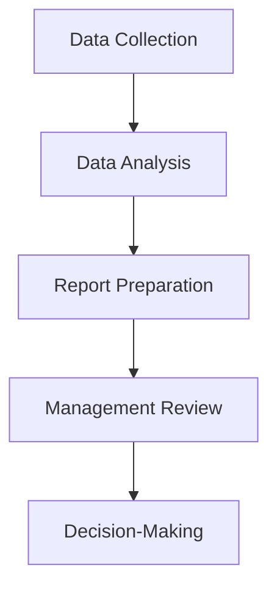

## 16.2 The Role of Managerial Accountants

Managerial accountants play a pivotal role in the strategic and operational decision-making processes within an organization. Their primary function is to provide financial insights and analysis that guide management in planning, controlling, and evaluating business activities. This section delves into the various responsibilities and contributions of managerial accountants, highlighting their importance in achieving organizational goals and maintaining financial health.

### Understanding Managerial Accounting

Managerial accounting, often referred to as management accounting, focuses on providing information to internal stakeholders—such as executives, managers, and department heads—to aid in decision-making. Unlike financial accounting, which is primarily concerned with historical data and external reporting, managerial accounting emphasizes future-oriented analysis and internal business processes.

### Key Responsibilities of Managerial Accountants

Managerial accountants are tasked with a variety of responsibilities that support the strategic objectives of an organization. These responsibilities include:

#### 1. **Budgeting and Forecasting**

Budgeting is a critical component of managerial accounting. Managerial accountants develop detailed budgets that outline expected revenues and expenses for a specific period. They use historical data and market trends to forecast future financial performance, enabling management to allocate resources efficiently and plan for potential challenges.

**Example:** A Canadian manufacturing company may rely on managerial accountants to prepare an annual budget that projects sales, production costs, and overhead expenses. This budget serves as a roadmap for the company's financial activities throughout the year.

#### 2. **Cost Management and Analysis**

Managerial accountants analyze cost behavior and identify opportunities for cost reduction and efficiency improvements. They evaluate the cost-effectiveness of various business processes and recommend strategies to optimize resource utilization.

**Case Study:** Consider a retail chain that wants to reduce its operational costs. Managerial accountants can conduct a cost analysis to identify high-cost areas, such as inventory management or logistics, and suggest process improvements or alternative suppliers to lower expenses.

#### 3. **Performance Evaluation**

Performance evaluation involves assessing the financial and operational performance of different departments or business units. Managerial accountants use key performance indicators (KPIs) and variance analysis to measure actual performance against budgeted targets.

**Scenario:** A technology company may use managerial accountants to evaluate the performance of its R&D department by comparing actual spending on research projects with the allocated budget. This analysis helps management determine whether the department is operating efficiently and achieving its innovation goals.

#### 4. **Decision Support**

Managerial accountants provide decision support by analyzing financial data and presenting actionable insights to management. They use techniques such as cost-volume-profit (CVP) analysis, break-even analysis, and scenario planning to evaluate the financial implications of strategic decisions.

**Example:** When a Canadian food processing company considers expanding its product line, managerial accountants can conduct a CVP analysis to determine the potential profitability of the new products and assess the impact on overall business performance.

#### 5. **Internal Reporting**

Managerial accountants prepare internal reports that provide detailed financial and operational information to management. These reports are tailored to the specific needs of the organization and may include dashboards, scorecards, and customized financial statements.

**Diagram: Internal Reporting Process**

### The Role of Managerial Accountants in Strategic Planning

Strategic planning involves setting long-term goals and determining the best course of action to achieve them. Managerial accountants contribute to strategic planning by providing financial insights and analysis that inform decision-making.

#### 1. **SWOT Analysis**

Managerial accountants participate in SWOT (Strengths, Weaknesses, Opportunities, Threats) analysis by providing financial data that highlights the organization's strengths and weaknesses. They also analyze market trends and competitive dynamics to identify opportunities and threats.

#### 2. **Financial Modeling**

Financial modeling involves creating detailed financial projections that simulate the impact of different strategic scenarios. Managerial accountants use financial models to assess the feasibility of strategic initiatives, such as mergers and acquisitions, capital investments, and market expansion.

#### 3. **Risk Management**

Risk management is an integral part of strategic planning. Managerial accountants identify and assess financial risks associated with strategic decisions and recommend risk mitigation strategies. They use tools such as sensitivity analysis and Monte Carlo simulations to evaluate potential risks and uncertainties.

### The Impact of Technology on Managerial Accounting

Technology plays a significant role in enhancing the capabilities of managerial accountants. Advanced software solutions and data analytics tools enable managerial accountants to process large volumes of data, perform complex analyses, and generate real-time insights.

#### 1. **Data Analytics**

Data analytics involves analyzing large datasets to uncover patterns, trends, and insights. Managerial accountants use data analytics to improve decision-making, optimize business processes, and enhance financial performance.

#### 2. **Automation**

Automation streamlines routine accounting tasks, such as data entry and report generation, allowing managerial accountants to focus on higher-value activities. Automation also reduces the risk of errors and improves the accuracy of financial data.

#### 3. **Cloud Computing**

Cloud computing provides managerial accountants with access to financial data and analytical tools from anywhere, enabling remote collaboration and real-time decision-making. Cloud-based solutions also offer scalability and flexibility, allowing organizations to adapt to changing business needs.

### Ethical Considerations in Managerial Accounting

Ethics play a crucial role in managerial accounting, as managerial accountants are responsible for providing accurate and unbiased financial information. Adhering to ethical standards ensures the integrity of financial reporting and supports informed decision-making.

#### 1. **Confidentiality**

Managerial accountants must maintain the confidentiality of sensitive financial information and protect it from unauthorized access or disclosure.

#### 2. **Integrity**

Integrity involves being honest and transparent in financial reporting and analysis. Managerial accountants must avoid conflicts of interest and ensure that their work is free from bias or manipulation.

#### 3. **Professional Competence**

Managerial accountants must possess the necessary skills and knowledge to perform their duties effectively. Continuous professional development and adherence to industry standards are essential for maintaining competence.

### Real-World Applications and Regulatory Scenarios

Managerial accountants operate within a regulatory framework that governs financial reporting and accounting practices. In Canada, managerial accountants must adhere to standards set by professional bodies such as CPA Canada and comply with regulations such as the International Financial Reporting Standards (IFRS) and Accounting Standards for Private Enterprises (ASPE).

#### 1. **Compliance with IFRS and ASPE**

Managerial accountants must ensure that financial reporting aligns with IFRS and ASPE standards. This involves understanding the specific requirements of each standard and applying them to financial analysis and reporting.

#### 2. **Adherence to CPA Canada Guidelines**

CPA Canada provides guidelines and resources for managerial accountants to ensure compliance with ethical standards and best practices. Managerial accountants must stay informed about updates to these guidelines and incorporate them into their work.

### Best Practices and Common Pitfalls

To excel in their role, managerial accountants should adopt best practices and be aware of common pitfalls that can hinder their effectiveness.

#### Best Practices

- **Continuous Learning:** Stay updated on industry trends, technological advancements, and regulatory changes to enhance skills and knowledge.
- **Collaboration:** Work closely with other departments to gain a comprehensive understanding of business operations and align financial analysis with organizational goals.
- **Proactive Communication:** Communicate financial insights and recommendations clearly and effectively to support informed decision-making.

#### Common Pitfalls

- **Overreliance on Historical Data:** While historical data is valuable, managerial accountants should also consider forward-looking analysis and market trends to provide relevant insights.
- **Neglecting Non-Financial Factors:** Financial analysis should be complemented by an understanding of non-financial factors, such as customer satisfaction and employee engagement, to provide a holistic view of business performance.
- **Inadequate Risk Assessment:** Failing to identify and assess financial risks can lead to suboptimal decision-making and negatively impact organizational performance.

### Conclusion

Managerial accountants are integral to the success of an organization, providing the financial insights and analysis needed to drive strategic planning and decision-making. By understanding their role and responsibilities, you can appreciate the value they bring to an organization and the impact they have on achieving business objectives. As you prepare for the Canadian Accounting Exams, consider the importance of managerial accounting in shaping the future of businesses and the skills required to excel in this dynamic field.

## **Ready to Test Your Knowledge?**



### What is one of the primary responsibilities of managerial accountants?

- [x] Budgeting and forecasting
- [ ] External auditing
- [ ] Tax preparation
- [ ] Financial statement auditing

> **Explanation:** Managerial accountants are responsible for budgeting and forecasting to help organizations plan and allocate resources efficiently.

### How do managerial accountants contribute to strategic planning?

- [x] By providing financial insights and analysis
- [ ] By conducting external audits
- [ ] By preparing tax returns
- [ ] By managing payroll

> **Explanation:** Managerial accountants provide financial insights and analysis that inform strategic planning and decision-making.

### Which tool do managerial accountants use for performance evaluation?

- [x] Key performance indicators (KPIs)
- [ ] Tax returns
- [ ] External audit reports
- [ ] Payroll records

> **Explanation:** Managerial accountants use KPIs to assess the financial and operational performance of departments or business units.

### What is a common pitfall for managerial accountants?

- [x] Overreliance on historical data
- [ ] Conducting external audits
- [ ] Preparing tax returns
- [ ] Managing payroll

> **Explanation:** Overreliance on historical data can hinder the effectiveness of managerial accountants, as they should also consider forward-looking analysis.

### What is one way technology impacts managerial accounting?

- [x] Through data analytics
- [ ] By conducting external audits
- [ ] By preparing tax returns
- [ ] By managing payroll

> **Explanation:** Technology impacts managerial accounting through data analytics, which helps improve decision-making and optimize business processes.

### What ethical consideration is crucial for managerial accountants?

- [x] Confidentiality
- [ ] Conducting external audits
- [ ] Preparing tax returns
- [ ] Managing payroll

> **Explanation:** Confidentiality is crucial for managerial accountants to protect sensitive financial information from unauthorized access or disclosure.

### How do managerial accountants support decision-making?

- [x] By analyzing financial data and presenting actionable insights
- [ ] By conducting external audits
- [ ] By preparing tax returns
- [ ] By managing payroll

> **Explanation:** Managerial accountants support decision-making by analyzing financial data and presenting actionable insights to management.

### What is a best practice for managerial accountants?

- [x] Continuous learning
- [ ] Conducting external audits
- [ ] Preparing tax returns
- [ ] Managing payroll

> **Explanation:** Continuous learning is a best practice for managerial accountants to stay updated on industry trends and enhance their skills.

### What is the role of managerial accountants in risk management?

- [x] Identifying and assessing financial risks
- [ ] Conducting external audits
- [ ] Preparing tax returns
- [ ] Managing payroll

> **Explanation:** Managerial accountants play a role in risk management by identifying and assessing financial risks associated with strategic decisions.

### Managerial accountants primarily focus on external reporting.

- [ ] True
- [x] False

> **Explanation:** Managerial accountants primarily focus on internal reporting and providing information to internal stakeholders for decision-making.


