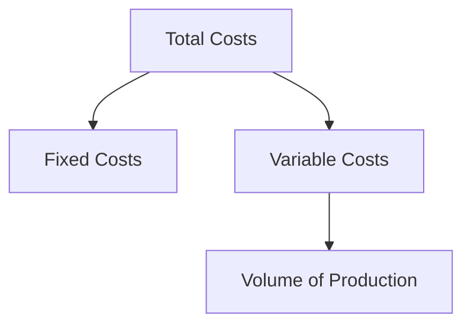

## 16.3 Cost Classifications

In the realm of managerial accounting, understanding cost classifications is fundamental to effective decision-making and financial planning. Costs can be classified in various ways depending on their behavior, traceability, and function. This section will delve into the primary classifications of costs: fixed, variable, direct, and indirect costs. We will explore their definitions, characteristics, and implications for business operations, along with practical examples and applications relevant to the Canadian accounting profession.

### Understanding Cost Classifications

Cost classifications are essential for budgeting, forecasting, and financial analysis. They help managers understand how costs behave under different circumstances, which is crucial for planning and controlling operations. By classifying costs accurately, businesses can make informed decisions about pricing, production, and investment.

### Fixed Costs

**Definition:** Fixed costs are expenses that do not change with the level of production or sales volume. They remain constant regardless of the business activity within a certain range.

**Characteristics of Fixed Costs:**

- **Stability:** Fixed costs remain unchanged in total over a specific period, even if the production volume varies.
- **Time-Related:** These costs are often associated with time periods, such as monthly rent or annual salaries.
- **Capacity Costs:** Fixed costs are often linked to the capacity of the business, such as the cost of maintaining a factory or office space.

**Examples of Fixed Costs:**

- **Rent:** The monthly lease payment for office or factory space.
- **Salaries:** Fixed salaries of administrative staff or management.
- **Depreciation:** The systematic allocation of the cost of a tangible asset over its useful life.
- **Insurance:** Regular premiums paid for business insurance coverage.

**Implications for Business:**

Fixed costs are crucial for understanding the break-even point, which is the level of sales at which total revenues equal total costs. Businesses must cover their fixed costs before they can achieve profitability. Understanding fixed costs helps in pricing strategies and in determining the minimum sales volume required to avoid losses.

### Variable Costs

**Definition:** Variable costs fluctuate with the level of production or sales volume. They increase as production rises and decrease as production falls.

**Characteristics of Variable Costs:**

- **Proportionality:** Variable costs change in direct proportion to changes in production volume.
- **Unit-Based:** These costs are often calculated on a per-unit basis, such as the cost of raw materials per product.
- **Flexibility:** Variable costs provide flexibility in budgeting since they adjust with production levels.

**Examples of Variable Costs:**

- **Raw Materials:** Costs of materials used in the production of goods.
- **Direct Labor:** Wages paid to workers directly involved in manufacturing.
- **Sales Commissions:** Payments to sales staff based on the volume of sales they generate.
- **Utilities:** Costs such as electricity or gas that vary with production levels.

**Implications for Business:**

Variable costs are essential for calculating the contribution margin, which is the difference between sales revenue and variable costs. This margin helps businesses determine how much revenue is available to cover fixed costs and generate profit. Understanding variable costs is crucial for pricing decisions and cost control.

### Direct Costs

**Definition:** Direct costs can be directly traced to a specific cost object, such as a product, department, or project. These costs are directly attributable to the production of goods or services.

**Characteristics of Direct Costs:**

- **Traceability:** Direct costs can be easily and accurately traced to a cost object.
- **Product-Specific:** These costs are incurred specifically for the production of a particular product or service.
- **Variable Nature:** Direct costs are often variable, as they change with the level of production.

**Examples of Direct Costs:**

- **Direct Materials:** Raw materials used in the manufacturing of a product.
- **Direct Labor:** Wages paid to workers who are directly involved in the production process.
- **Manufacturing Supplies:** Items used in the production process that can be directly attributed to a product.

**Implications for Business:**

Direct costs are crucial for product costing and profitability analysis. They help businesses determine the cost of producing each unit of a product, which is essential for pricing strategies and cost management. Accurate tracking of direct costs ensures that businesses can assess the profitability of individual products or services.

### Indirect Costs

**Definition:** Indirect costs cannot be directly traced to a specific cost object. These costs are incurred for the benefit of multiple cost objects and are often referred to as overhead costs.

**Characteristics of Indirect Costs:**

- **Non-Traceability:** Indirect costs cannot be easily traced to a single cost object.
- **Shared Costs:** These costs benefit multiple products, departments, or projects.
- **Fixed or Variable:** Indirect costs can be either fixed or variable, depending on their nature.

**Examples of Indirect Costs:**

- **Utilities:** Costs such as electricity or water that are shared across multiple departments.
- **Administrative Salaries:** Salaries of staff who support the entire organization, not just a specific product line.
- **Depreciation:** The allocation of the cost of equipment used across various products or services.
- **Maintenance and Repairs:** Costs of maintaining facilities and equipment that serve multiple purposes.

**Implications for Business:**

Indirect costs are essential for understanding the full cost of production and for budgeting purposes. They are allocated to cost objects using various methods, such as activity-based costing or traditional overhead allocation. Understanding indirect costs helps businesses control overhead and improve operational efficiency.

### Practical Examples and Applications

To illustrate the application of cost classifications, consider a Canadian manufacturing company producing custom furniture. Here's how different costs would be classified:

- **Fixed Costs:** The company pays a monthly lease for its factory space, which remains constant regardless of the number of furniture pieces produced.
- **Variable Costs:** The cost of wood and other materials used in production varies with the number of furniture pieces manufactured.
- **Direct Costs:** The wages of carpenters who build the furniture are direct costs, as they can be traced to specific products.
- **Indirect Costs:** The salary of the factory manager, who oversees production but does not work on specific pieces, is an indirect cost.

### Real-World Applications and Regulatory Scenarios

In the Canadian context, businesses must adhere to accounting standards such as the International Financial Reporting Standards (IFRS) and the Accounting Standards for Private Enterprises (ASPE). These standards provide guidelines for cost classification and financial reporting.

For example, IFRS requires that costs be classified as either fixed or variable when preparing financial statements. This classification helps stakeholders understand the cost structure of the business and assess its financial performance.

### Step-by-Step Guidance for Cost Classification

1. **Identify Cost Objects:** Determine the products, departments, or projects to which costs will be attributed.
2. **Trace Direct Costs:** Identify and trace costs that can be directly attributed to specific cost objects.
3. **Allocate Indirect Costs:** Use appropriate allocation methods to distribute indirect costs across cost objects.
4. **Classify Costs by Behavior:** Determine whether costs are fixed or variable based on their behavior with changes in production volume.
5. **Review and Adjust:** Regularly review cost classifications to ensure accuracy and relevance in changing business conditions.

### Diagrams and Visual Aids

To enhance understanding, let's visualize the relationship between fixed and variable costs using a simple diagram:

This diagram illustrates that total costs are composed of fixed costs, which remain constant, and variable costs, which fluctuate with production volume.

### Best Practices, Common Pitfalls, and Strategies

**Best Practices:**

- Regularly review cost classifications to ensure they reflect current business operations.
- Use activity-based costing for more accurate allocation of indirect costs.
- Implement cost control measures to manage both fixed and variable costs effectively.

**Common Pitfalls:**

- Misclassifying costs can lead to inaccurate financial analysis and decision-making.
- Failing to update cost classifications as business conditions change can result in outdated financial information.

**Strategies to Overcome Challenges:**

- Invest in accounting software that automates cost classification and allocation.
- Train staff on the importance of accurate cost classification and its impact on financial performance.

### References and Additional Resources

For further exploration of cost classifications and their implications, consider the following resources:

- CPA Canada: Offers guidance on cost management and financial reporting standards.
- IFRS Foundation: Provides comprehensive information on international accounting standards.
- Accounting textbooks and online courses: Offer in-depth coverage of cost accounting principles and practices.

### Summary

Understanding cost classifications is essential for effective managerial accounting and financial decision-making. By accurately classifying costs as fixed, variable, direct, or indirect, businesses can better manage their resources, control expenses, and enhance profitability. This knowledge is crucial for success in the Canadian accounting profession and for passing accounting exams.

## **Ready to Test Your Knowledge?**



### Which of the following is an example of a fixed cost?

- [x] Rent for office space
- [ ] Cost of raw materials
- [ ] Sales commissions
- [ ] Direct labor costs

> **Explanation:** Rent for office space is a fixed cost because it does not change with the level of production or sales volume.

### What is a characteristic of variable costs?

- [ ] They remain constant regardless of production levels.
- [x] They change in direct proportion to production volume.
- [ ] They are always indirect costs.
- [ ] They are always fixed costs.

> **Explanation:** Variable costs change in direct proportion to production volume, meaning they increase as production rises and decrease as production falls.

### Direct costs can be best described as:

- [x] Costs that can be directly traced to a specific cost object.
- [ ] Costs that are shared across multiple departments.
- [ ] Costs that remain constant over time.
- [ ] Costs that are always variable.

> **Explanation:** Direct costs can be directly traced to a specific cost object, such as a product, department, or project.

### Which of the following is an example of an indirect cost?

- [ ] Direct labor costs
- [ ] Raw materials
- [x] Administrative salaries
- [ ] Sales commissions

> **Explanation:** Administrative salaries are indirect costs because they cannot be directly traced to a specific cost object and benefit the entire organization.

### Fixed costs are important for determining:

- [x] The break-even point
- [ ] The contribution margin
- [ ] The variable cost per unit
- [ ] The direct cost of production

> **Explanation:** Fixed costs are important for determining the break-even point, which is the level of sales at which total revenues equal total costs.

### What is the primary purpose of cost classification?

- [ ] To increase production levels
- [ ] To reduce variable costs
- [x] To aid in budgeting and financial analysis
- [ ] To eliminate indirect costs

> **Explanation:** The primary purpose of cost classification is to aid in budgeting and financial analysis by understanding how costs behave under different circumstances.

### Which cost classification is often associated with overhead costs?

- [ ] Direct costs
- [x] Indirect costs
- [ ] Fixed costs
- [ ] Variable costs

> **Explanation:** Indirect costs are often associated with overhead costs, as they cannot be directly traced to a specific cost object and benefit multiple cost objects.

### How do variable costs behave with changes in production volume?

- [x] They increase as production rises and decrease as production falls.
- [ ] They remain constant regardless of production levels.
- [ ] They decrease as production rises and increase as production falls.
- [ ] They are unaffected by production volume.

> **Explanation:** Variable costs increase as production rises and decrease as production falls, as they change in direct proportion to production volume.

### Which of the following is a direct cost in manufacturing?

- [ ] Administrative salaries
- [x] Direct labor
- [ ] Utilities
- [ ] Rent

> **Explanation:** Direct labor is a direct cost in manufacturing because it can be directly traced to the production of specific products.

### True or False: Fixed costs are always indirect costs.

- [ ] True
- [x] False

> **Explanation:** False. Fixed costs are not always indirect costs. For example, the salary of a production manager is a fixed cost but can be considered a direct cost if it can be directly traced to a specific production department.


