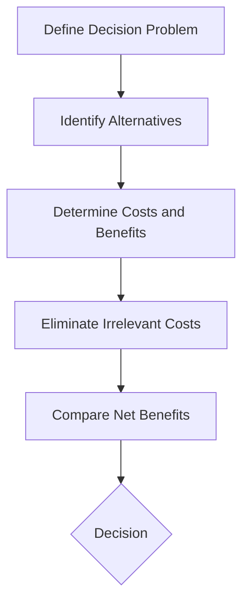

## 16.6 Relevant Costs for Decision Making

In the realm of managerial accounting, understanding relevant costs is crucial for effective decision-making. This section will delve into the concept of relevant costs, their identification, and their application in various business scenarios. By the end of this section, you will have a comprehensive understanding of how relevant costs influence managerial decisions and how to apply this knowledge in practice.

### Understanding Relevant Costs

Relevant costs are those costs that will be directly affected by a specific business decision. They are future costs that differ between alternatives. The key to identifying relevant costs lies in understanding that they must be both future-oriented and variable depending on the decision at hand.

#### Characteristics of Relevant Costs

1. **Future-Oriented**: Relevant costs are expected to occur in the future. Past costs, also known as sunk costs, are not relevant because they have already been incurred and cannot be changed by any future decision.

2. **Differential**: Relevant costs differ between decision alternatives. If a cost remains the same regardless of the decision, it is not considered relevant.

3. **Avoidable**: Relevant costs can be avoided if a particular decision is not taken. If a cost is unavoidable, it is not relevant to the decision-making process.

#### Types of Relevant Costs

1. **Incremental Costs**: These are additional costs incurred if a decision is made. For example, the extra cost of producing an additional unit of product.

2. **Opportunity Costs**: The potential benefit lost when choosing one alternative over another. For instance, if a company uses its factory space to produce Product A instead of Product B, the profit from Product B is the opportunity cost.

3. **Avoidable Costs**: Costs that can be eliminated if a decision is made to discontinue a product line or shut down a business unit.

4. **Variable Costs**: Costs that vary with the level of output or activity. These are often relevant because they change with different decision alternatives.

### Identifying Relevant Costs

To effectively identify relevant costs, one must follow a systematic approach:

1. **Define the Decision Problem**: Clearly outline the decision to be made. This could be a make-or-buy decision, a special order consideration, or a product line discontinuation.

2. **Identify Alternatives**: List all possible alternatives that could be pursued.

3. **Determine Costs and Benefits**: For each alternative, identify all costs and benefits. Focus on those that are future-oriented and differ between the alternatives.

4. **Eliminate Irrelevant Costs**: Remove costs that do not change with the decision, such as sunk costs and fixed costs that remain constant.

5. **Compare Net Benefits**: Evaluate the net benefits of each alternative by comparing the relevant costs and benefits.

### Application of Relevant Costs in Decision Making

Relevant costs play a pivotal role in various business decisions. Let's explore some common scenarios where relevant costs are crucial:

#### 1. Make-or-Buy Decisions

In a make-or-buy decision, a company must decide whether to produce a component internally or purchase it from an external supplier. Relevant costs include:

- **Direct Materials and Labor**: Costs directly associated with manufacturing the component.
- **Variable Overhead**: Costs that vary with production levels.
- **Opportunity Costs**: Benefits foregone by using resources internally rather than for another purpose.

**Example**: A company is considering whether to manufacture a part in-house or buy it from a supplier. The in-house production costs $10 per unit, while the supplier offers it for $12 per unit. However, producing in-house would require additional investment in machinery, which is an opportunity cost to consider.

#### 2. Special Order Decisions

When a company receives a one-time order at a reduced price, it must decide whether to accept or reject the order. Relevant costs include:

- **Incremental Costs**: Additional costs incurred to fulfill the order.
- **Opportunity Costs**: Potential profit lost from not using capacity for regular orders.

**Example**: A manufacturer receives a special order for 1,000 units at $8 each, while the regular price is $10. The variable cost per unit is $6. The decision hinges on whether the incremental revenue covers the incremental costs.

#### 3. Discontinuation Decisions

Deciding whether to discontinue a product line involves analyzing relevant costs such as:

- **Avoidable Fixed Costs**: Costs that can be eliminated if the product line is discontinued.
- **Contribution Margin**: The difference between sales revenue and variable costs.

**Example**: A company is considering discontinuing a product that generates $50,000 in sales, with variable costs of $30,000 and avoidable fixed costs of $15,000. The contribution margin analysis will help determine if discontinuation is beneficial.

### Real-World Applications and Case Studies

To further illustrate the concept of relevant costs, let's consider a real-world scenario involving a Canadian manufacturing company:

**Case Study: Maple Leaf Manufacturing**

Maple Leaf Manufacturing is evaluating whether to continue producing a low-margin product line. The company incurs $200,000 in fixed costs annually, of which $50,000 is avoidable if the product line is discontinued. The product line generates $300,000 in sales and $250,000 in variable costs.

**Analysis**:
- **Contribution Margin**: $300,000 (Sales) - $250,000 (Variable Costs) = $50,000
- **Net Benefit of Discontinuation**: $50,000 (Avoidable Fixed Costs) - $50,000 (Contribution Margin) = $0

In this case, discontinuing the product line does not provide a financial benefit, as the avoidable fixed costs equal the contribution margin.

### Relevant Costs and Canadian Accounting Standards

In Canada, accounting standards such as the International Financial Reporting Standards (IFRS) and Accounting Standards for Private Enterprises (ASPE) guide financial reporting and decision-making. While these standards do not specifically address relevant costs, they emphasize the importance of providing useful information to decision-makers.

#### Compliance Considerations

When analyzing relevant costs, it is essential to ensure compliance with Canadian accounting standards. This involves:

- **Accurate Cost Allocation**: Properly allocating costs to ensure accurate financial reporting.
- **Disclosure Requirements**: Providing sufficient information in financial statements to support decision-making.

### Best Practices and Common Pitfalls

To effectively utilize relevant costs in decision-making, consider the following best practices:

1. **Focus on Incremental Analysis**: Concentrate on the additional costs and benefits associated with each decision alternative.

2. **Avoid Sunk Cost Fallacy**: Do not consider costs that have already been incurred and cannot be changed.

3. **Consider Qualitative Factors**: While relevant costs are quantitative, qualitative factors such as employee morale and brand reputation should also be considered.

4. **Use Sensitivity Analysis**: Evaluate how changes in assumptions affect the decision outcome.

**Common Pitfalls**:

- **Ignoring Opportunity Costs**: Failing to consider the benefits of the next best alternative can lead to suboptimal decisions.
- **Overlooking Fixed Costs**: Assuming all fixed costs are irrelevant can result in inaccurate analysis.

### Diagrams and Visual Aids

To enhance understanding, let's use a diagram to illustrate the decision-making process involving relevant costs:

This flowchart outlines the steps involved in analyzing relevant costs for decision-making, providing a visual representation of the process.

### Conclusion

Understanding and applying relevant costs is essential for effective managerial decision-making. By focusing on future-oriented, differential, and avoidable costs, you can make informed decisions that enhance business performance. Remember to consider both quantitative and qualitative factors and ensure compliance with Canadian accounting standards.

### Ready to Test Your Knowledge?



### Which of the following is a characteristic of relevant costs?

- [x] Future-oriented
- [ ] Past-oriented
- [ ] Constant across alternatives
- [ ] Unavoidable

> **Explanation:** Relevant costs are future-oriented, meaning they are expected to occur in the future and can be influenced by decisions.

### What type of cost is considered when evaluating a make-or-buy decision?

- [x] Incremental costs
- [ ] Sunk costs
- [ ] Fixed costs
- [ ] Historical costs

> **Explanation:** Incremental costs are additional costs incurred if a decision is made, such as producing a component internally versus buying it.

### In a special order decision, which cost is relevant?

- [x] Incremental cost
- [ ] Sunk cost
- [ ] Fixed cost
- [ ] Historical cost

> **Explanation:** Incremental costs are relevant in special order decisions as they represent additional costs incurred to fulfill the order.

### What is an opportunity cost?

- [x] The potential benefit lost when choosing one alternative over another
- [ ] A cost that remains constant regardless of the decision
- [ ] A past cost that cannot be changed
- [ ] A fixed cost that is unavoidable

> **Explanation:** Opportunity cost is the potential benefit lost when choosing one alternative over another.

### Which of the following is NOT a relevant cost?

- [x] Sunk cost
- [ ] Incremental cost
- [ ] Opportunity cost
- [ ] Avoidable cost

> **Explanation:** Sunk costs are past costs that cannot be changed and are not relevant to future decisions.

### What is the main focus of relevant cost analysis?

- [x] Incremental analysis
- [ ] Historical analysis
- [ ] Fixed cost analysis
- [ ] Sunk cost analysis

> **Explanation:** Relevant cost analysis focuses on incremental analysis, which involves evaluating additional costs and benefits associated with decision alternatives.

### When deciding to discontinue a product line, which cost is relevant?

- [x] Avoidable fixed cost
- [ ] Sunk cost
- [ ] Historical cost
- [ ] Unavoidable fixed cost

> **Explanation:** Avoidable fixed costs are relevant because they can be eliminated if the product line is discontinued.

### What is a common pitfall in relevant cost analysis?

- [x] Ignoring opportunity costs
- [ ] Considering all fixed costs
- [ ] Including sunk costs
- [ ] Focusing on qualitative factors

> **Explanation:** Ignoring opportunity costs is a common pitfall, as it can lead to suboptimal decisions by not considering the benefits of the next best alternative.

### Which diagram best represents the decision-making process involving relevant costs?

- [x] Flowchart
- [ ] Pie chart
- [ ] Bar graph
- [ ] Line graph

> **Explanation:** A flowchart best represents the decision-making process involving relevant costs, as it outlines the steps involved in analyzing relevant costs.

### True or False: Relevant costs are always variable costs.

- [ ] True
- [x] False

> **Explanation:** False. While relevant costs often include variable costs, they can also include fixed costs that are avoidable or differential between alternatives.


