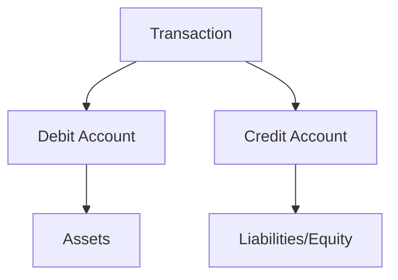

## 18.1 Key Accounting Terms A - D

Understanding key accounting terms is essential for anyone preparing for Canadian accounting exams. This section provides comprehensive definitions and explanations of accounting terms starting with the letters A through D. These terms form the foundation of accounting knowledge and are crucial for both exams and professional practice.

### **A**

#### **Accrual Accounting**

Accrual accounting is a method where revenue and expenses are recorded when they are earned or incurred, regardless of when the cash is actually received or paid. This method provides a more accurate picture of a company's financial position and performance over a specific period.

- **Example:** A company delivers goods in December but receives payment in January. Under accrual accounting, the revenue is recorded in December.

#### **Assets**

Assets are resources owned by a company that have economic value and can provide future benefits. They are classified into current and non-current assets.

- **Current Assets:** Expected to be converted into cash or used within one year (e.g., cash, inventory).
- **Non-Current Assets:** Long-term investments not expected to be converted into cash within a year (e.g., property, equipment).

#### **Amortization**

Amortization refers to the gradual reduction of an intangible asset's value over time. It is similar to depreciation but applies to intangible assets like patents or copyrights.

- **Example:** A company amortizes a patent over its useful life of 10 years.

#### **Accounts Payable**

Accounts payable are short-term liabilities representing amounts a company owes to suppliers for goods and services purchased on credit.

- **Example:** A company receives office supplies and agrees to pay the supplier within 30 days.

#### **Accounts Receivable**

Accounts receivable are amounts owed to a company by customers for goods or services provided on credit. They are considered current assets on the balance sheet.

- **Example:** A customer purchases goods on credit, and the amount owed is recorded as accounts receivable.

#### **Accrued Liabilities**

Accrued liabilities are expenses that have been incurred but not yet paid. They are recorded in the financial statements to reflect the company's obligations.

- **Example:** Salaries payable at the end of the month for work already performed.

#### **Audit**

An audit is an independent examination of financial information to provide assurance that financial statements are accurate and comply with accounting standards.

- **Example:** A public company undergoes an annual audit by an external auditor to verify its financial statements.

### **B**

#### **Balance Sheet**

A balance sheet is a financial statement that provides a snapshot of a company's financial position at a specific point in time. It includes assets, liabilities, and equity.

- **Equation:** Assets = Liabilities + Equity

#### **Bookkeeping**

Bookkeeping involves recording financial transactions systematically. It is the foundation of the accounting process and includes tasks such as recording sales, purchases, receipts, and payments.

- **Example:** A bookkeeper records daily sales transactions in the accounting system.

#### **Budget**

A budget is a financial plan that estimates income and expenses over a specific period. It helps organizations allocate resources and monitor financial performance.

- **Example:** A company prepares an annual budget to plan for expected revenue and expenses.

#### **Bond**

A bond is a fixed-income instrument representing a loan made by an investor to a borrower. Bonds are used by companies, municipalities, and governments to finance projects and operations.

- **Example:** A corporation issues bonds to raise capital for expansion.

#### **Break-Even Point**

The break-even point is the level of sales at which total revenues equal total costs, resulting in neither profit nor loss.

- **Calculation:** Break-Even Point = Fixed Costs / (Selling Price per Unit - Variable Cost per Unit)

#### **Bad Debt**

Bad debt refers to accounts receivable that are unlikely to be collected. Companies estimate bad debts and record them as an expense.

- **Example:** A company writes off a customer's account as bad debt after repeated collection attempts fail.

### **C**

#### **Cash Flow Statement**

A cash flow statement is a financial report that shows the inflows and outflows of cash within a company over a specific period. It is divided into operating, investing, and financing activities.

- **Purpose:** To provide insights into a company's liquidity and financial health.

#### **Capital**

Capital refers to financial assets or resources that a company uses to fund its operations and growth. It includes both equity and debt.

- **Example:** A business raises capital through equity financing by issuing shares.

#### **Cost of Goods Sold (COGS)**

COGS represents the direct costs of producing goods sold by a company. It includes materials, labor, and manufacturing overhead.

- **Calculation:** COGS = Beginning Inventory + Purchases - Ending Inventory

#### **Credit**

In accounting, credit refers to an entry on the right side of an account that increases liabilities, equity, or revenue, or decreases assets and expenses.

- **Example:** Recording a sale on credit increases accounts receivable and revenue.

#### **Current Ratio**

The current ratio is a liquidity ratio that measures a company's ability to pay short-term obligations with its current assets.

- **Calculation:** Current Ratio = Current Assets / Current Liabilities

#### **Contingent Liability**

A contingent liability is a potential liability that may occur depending on the outcome of a future event.

- **Example:** A company faces a lawsuit, and the potential financial impact is disclosed as a contingent liability.

### **D**

#### **Depreciation**

Depreciation is the systematic allocation of the cost of a tangible asset over its useful life. It reflects the wear and tear of the asset.

- **Methods:** Straight-line, declining balance, and units of production.

#### **Dividend**

A dividend is a distribution of a portion of a company's earnings to its shareholders. Dividends can be in the form of cash, stock, or property.

- **Example:** A company declares a cash dividend of $1 per share to its shareholders.

#### **Double-Entry Bookkeeping**

Double-entry bookkeeping is an accounting system where every transaction affects at least two accounts, with debits equaling credits.

- **Principle:** For every debit entry, there must be a corresponding credit entry.

#### **Deferred Revenue**

Deferred revenue is money received by a company for goods or services yet to be delivered. It is recorded as a liability until the service is provided.

- **Example:** A software company receives payment for a one-year subscription in advance.

#### **Debt-to-Equity Ratio**

The debt-to-equity ratio is a financial ratio indicating the relative proportion of shareholders' equity and debt used to finance a company's assets.

- **Calculation:** Debt-to-Equity Ratio = Total Liabilities / Shareholders' Equity

#### **Direct Costs**

Direct costs are expenses that can be directly attributed to the production of specific goods or services.

- **Example:** The cost of raw materials used in manufacturing a product.

### **Visual Aids**

To enhance understanding, let's visualize the double-entry bookkeeping concept using a simple diagram:

### **Best Practices and Exam Tips**

- **Understand the Accounting Equation:** Mastering the accounting equation (Assets = Liabilities + Equity) is fundamental for solving many exam problems.
- **Practice Double-Entry Bookkeeping:** Regular practice with journal entries will help you understand the flow of transactions.
- **Memorize Key Ratios:** Ratios like the current ratio and debt-to-equity ratio are frequently tested. Use mnemonic devices to remember them.
- **Stay Updated on Standards:** Familiarize yourself with Canadian accounting standards, including IFRS and ASPE, as they are crucial for exams.

### **Further Reading and Resources**

- **CPA Canada Handbook:** Provides detailed guidance on accounting standards.
- **International Financial Reporting Standards (IFRS):** Essential for understanding global accounting practices.
- **Accounting Standards for Private Enterprises (ASPE):** Relevant for private companies in Canada.

## **Ready to Test Your Knowledge?**



### What is the primary purpose of accrual accounting?

- [x] To record revenues and expenses when they are earned or incurred
- [ ] To record transactions only when cash is exchanged
- [ ] To simplify financial reporting
- [ ] To avoid recording liabilities

> **Explanation:** Accrual accounting records revenues and expenses when they are earned or incurred, providing a more accurate financial picture.

### Which of the following is a current asset?

- [x] Inventory
- [ ] Equipment
- [ ] Long-term investments
- [ ] Mortgage payable

> **Explanation:** Inventory is a current asset expected to be converted into cash or used within one year.

### What is the equation for the break-even point?

- [x] Break-Even Point = Fixed Costs / (Selling Price per Unit - Variable Cost per Unit)
- [ ] Break-Even Point = Total Revenue - Total Costs
- [ ] Break-Even Point = Total Costs / Total Revenue
- [ ] Break-Even Point = Fixed Costs + Variable Costs

> **Explanation:** The break-even point is calculated by dividing fixed costs by the difference between selling price per unit and variable cost per unit.

### What does the current ratio measure?

- [x] A company's ability to pay short-term obligations
- [ ] A company's profitability
- [ ] A company's long-term solvency
- [ ] A company's market value

> **Explanation:** The current ratio measures a company's ability to pay its short-term obligations with its current assets.

### Which method is used to allocate the cost of an intangible asset over its useful life?

- [x] Amortization
- [ ] Depreciation
- [ ] Depletion
- [ ] Capitalization

> **Explanation:** Amortization is used for intangible assets, while depreciation is for tangible assets.

### What is a contingent liability?

- [x] A potential liability that may occur depending on a future event
- [ ] A liability that is certain to occur
- [ ] A liability that has already occurred
- [ ] A liability that is recorded as an asset

> **Explanation:** A contingent liability is a potential obligation that depends on the outcome of a future event.

### What is the primary purpose of a cash flow statement?

- [x] To show the inflows and outflows of cash within a company
- [ ] To report a company's financial position at a specific point in time
- [ ] To summarize a company's revenue and expenses
- [ ] To provide a detailed list of assets and liabilities

> **Explanation:** The cash flow statement provides insights into a company's liquidity by showing cash inflows and outflows.

### What is the principle of double-entry bookkeeping?

- [x] Every transaction affects at least two accounts
- [ ] Every transaction affects only one account
- [ ] Transactions are recorded only when cash is exchanged
- [ ] Transactions are recorded in a single-entry system

> **Explanation:** Double-entry bookkeeping requires that every transaction affects at least two accounts, maintaining the accounting equation.

### What is the debt-to-equity ratio used for?

- [x] To indicate the relative proportion of shareholders' equity and debt
- [ ] To measure a company's profitability
- [ ] To assess a company's liquidity
- [ ] To evaluate a company's market value

> **Explanation:** The debt-to-equity ratio shows the relative proportion of shareholders' equity and debt used to finance a company's assets.

### True or False: Deferred revenue is recorded as an asset until the service is provided.

- [ ] True
- [x] False

> **Explanation:** Deferred revenue is recorded as a liability until the service is provided, as it represents an obligation to deliver goods or services in the future.



By mastering these key terms, you will be well-prepared for the Canadian accounting exams and equipped with the foundational knowledge necessary for a successful career in accounting.
