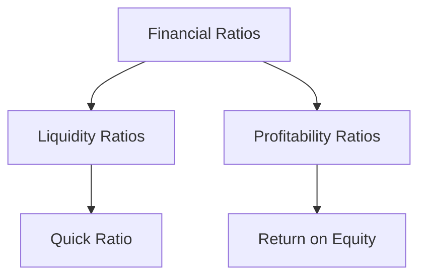

## 18.5 Key Accounting Terms Q - T

In the world of accounting, understanding key terms is essential for both academic success and professional practice. This section of the guide focuses on accounting terms starting with the letters Q through T, providing detailed definitions, practical examples, and real-world applications relevant to the Canadian accounting environment. Whether you're preparing for Canadian accounting exams or enhancing your professional knowledge, this comprehensive glossary will serve as a valuable resource.

### **Q**

#### **Qualified Opinion**
A qualified opinion is a statement issued by an auditor indicating that, except for certain issues, the financial statements are fairly presented. This opinion suggests that the financial statements are mostly in compliance with accounting standards, but there are specific areas that deviate from the norm.

**Example:** An auditor may issue a qualified opinion if they find that inventory valuation methods do not comply with the International Financial Reporting Standards (IFRS) but the rest of the financial statements are accurate.

#### **Quick Ratio**
The quick ratio, also known as the acid-test ratio, measures a company's ability to meet its short-term obligations with its most liquid assets. It is calculated by dividing liquid assets (cash, marketable securities, and receivables) by current liabilities.

**Formula:** Quick Ratio = (Cash + Marketable Securities + Receivables) / Current Liabilities

**Example:** A company with $50,000 in cash, $20,000 in receivables, and $30,000 in current liabilities has a quick ratio of 2.33, indicating strong liquidity.

#### **Quasi-Reorganization**
A quasi-reorganization is an accounting process that allows a company to eliminate a deficit in retained earnings without undergoing a legal reorganization. This process involves revaluing assets and liabilities to reflect their fair value and adjusting the equity section of the balance sheet.

**Application:** Companies use quasi-reorganizations to improve their financial position and attract investors by presenting a healthier balance sheet.

### **R**

#### **Receivables Turnover Ratio**
The receivables turnover ratio measures how efficiently a company collects its accounts receivable. It is calculated by dividing net credit sales by the average accounts receivable.

**Formula:** Receivables Turnover Ratio = Net Credit Sales / Average Accounts Receivable

**Example:** A company with $500,000 in net credit sales and an average accounts receivable of $50,000 has a receivables turnover ratio of 10, indicating efficient collection practices.

#### **Residual Value**
Residual value is the estimated value of an asset at the end of its useful life. It is used in calculating depreciation and is important for determining the total cost of ownership.

**Example:** A company purchases equipment for $100,000 with an estimated residual value of $10,000 after 10 years. The residual value is used to calculate depreciation expenses over the asset's life.

#### **Return on Equity (ROE)**
Return on Equity measures a company's profitability by revealing how much profit a company generates with the money shareholders have invested. It is calculated by dividing net income by shareholder's equity.

**Formula:** ROE = Net Income / Shareholder's Equity

**Example:** A company with a net income of $200,000 and shareholder's equity of $1,000,000 has an ROE of 20%, indicating efficient use of equity.

#### **Revenue Recognition Principle**
The revenue recognition principle dictates that revenue should be recognized when it is earned and realizable, regardless of when cash is received. This principle is fundamental in accrual accounting.

**Application:** A software company recognizes revenue when a service is delivered, even if payment is received later, aligning with the IFRS and ASPE standards.

### **S**

#### **Sales Discount**
A sales discount is a reduction in the price of a product or service offered to customers as an incentive for early payment. It is recorded as a deduction from gross sales.

**Example:** A company offers a 2% discount for payments made within 10 days. If a customer pays a $1,000 invoice within this period, they pay $980, and the company records a $20 sales discount.

#### **Share Capital**
Share capital refers to the funds raised by a company through the issuance of shares. It represents the equity stake of shareholders in the company.

**Types:** Common stock and preferred stock are the two primary types of share capital.

#### **Straight-Line Depreciation**
Straight-line depreciation is a method of allocating the cost of an asset evenly over its useful life. It is the simplest and most commonly used depreciation method.

**Formula:** Annual Depreciation Expense = (Cost of Asset - Residual Value) / Useful Life

**Example:** An asset costing $10,000 with a residual value of $1,000 and a useful life of 9 years has an annual depreciation expense of $1,000.

#### **Subsidiary**
A subsidiary is a company controlled by another company, known as the parent company. The parent company holds a majority of the subsidiary's voting stock.

**Example:** In Canada, a large corporation may establish subsidiaries to operate in different provinces, each focusing on specific markets or products.

### **T**

#### **Tangible Assets**
Tangible assets are physical assets that can be touched, such as machinery, buildings, and inventory. They are recorded on the balance sheet and depreciated over time.

**Example:** A manufacturing company lists its factory and equipment as tangible assets on its balance sheet.

#### **Trial Balance**
A trial balance is a bookkeeping worksheet listing the balances of all ledgers accounts. It is used to ensure that debits equal credits after posting transactions.

**Purpose:** The trial balance helps identify discrepancies in the accounting records before preparing financial statements.

#### **Treasury Stock**
Treasury stock refers to shares that were once a part of the outstanding shares but were later repurchased by the company. These shares are held in the company's treasury and can be reissued or retired.

**Example:** A corporation buys back 1,000 shares of its stock, reducing the number of shares available in the market.

#### **Tax Expense**
Tax expense is the total amount of taxes owed by a company to the government. It includes income tax, sales tax, and other taxes applicable to the business.

**Calculation:** Tax expense is calculated based on taxable income and applicable tax rates.

### **Practical Applications and Exam Tips**

Understanding these key accounting terms is crucial for success in Canadian accounting exams. Here are some practical tips and applications:

- **Real-World Scenarios:** Consider how these terms apply in real-world business situations. For example, understanding the quick ratio can help assess a company's liquidity position during financial analysis.
- **Exam Focus:** Pay attention to terms like "Revenue Recognition Principle" and "Return on Equity," as they are frequently tested in exams.
- **Practice Problems:** Work through problems involving calculations, such as the quick ratio or straight-line depreciation, to reinforce your understanding.
- **Regulatory Standards:** Familiarize yourself with Canadian accounting standards, such as IFRS and ASPE, to understand how these terms are applied in practice.

### **Visual Aids**

To enhance your understanding, consider the following visual representation of the relationship between key financial ratios:

### **Summary**

This section has provided a comprehensive overview of key accounting terms from Q to T, essential for mastering Canadian accounting exams. By understanding these terms, you will be better equipped to analyze financial statements, assess business performance, and apply accounting principles in real-world scenarios.

## **Ready to Test Your Knowledge?**



### What is a Qualified Opinion?

- [x] An auditor's statement indicating that, except for certain issues, the financial statements are fairly presented.
- [ ] A statement that the financial statements are completely accurate.
- [ ] A disclaimer of opinion due to lack of evidence.
- [ ] An opinion that the financial statements are fraudulent.

> **Explanation:** A qualified opinion indicates that the financial statements are mostly accurate, with some exceptions.

### How is the Quick Ratio calculated?

- [x] (Cash + Marketable Securities + Receivables) / Current Liabilities
- [ ] Total Assets / Total Liabilities
- [ ] Net Income / Shareholder's Equity
- [ ] Current Assets / Current Liabilities

> **Explanation:** The quick ratio measures a company's ability to meet short-term obligations with its most liquid assets.

### What does the Revenue Recognition Principle dictate?

- [x] Revenue should be recognized when it is earned and realizable.
- [ ] Revenue should be recognized when cash is received.
- [ ] Revenue should be recognized at the end of the fiscal year.
- [ ] Revenue should be recognized when expenses are paid.

> **Explanation:** The principle states that revenue is recognized when earned, not necessarily when cash is received.

### What is the purpose of a Trial Balance?

- [x] To ensure that debits equal credits after posting transactions.
- [ ] To prepare the income statement.
- [ ] To calculate net income.
- [ ] To determine tax liability.

> **Explanation:** A trial balance checks the accuracy of the ledger accounts by ensuring debits equal credits.

### What are Tangible Assets?

- [x] Physical assets that can be touched, such as machinery and buildings.
- [ ] Intangible assets like patents and trademarks.
- [x] Inventory and equipment.
- [ ] Financial instruments like stocks and bonds.

> **Explanation:** Tangible assets are physical and can be depreciated over time.

### What is Treasury Stock?

- [x] Shares repurchased by the company and held in its treasury.
- [ ] Shares issued to the public for the first time.
- [ ] Shares held by the government.
- [ ] Shares donated to charity.

> **Explanation:** Treasury stock consists of shares that were once outstanding but were repurchased by the company.

### How is Return on Equity (ROE) calculated?

- [x] Net Income / Shareholder's Equity
- [ ] Net Income / Total Assets
- [x] Net Income / Total Equity
- [ ] Net Income / Total Liabilities

> **Explanation:** ROE measures a company's profitability relative to shareholder's equity.

### What is the Residual Value of an asset?

- [x] The estimated value of an asset at the end of its useful life.
- [ ] The initial purchase price of an asset.
- [ ] The current market value of an asset.
- [ ] The depreciation expense of an asset.

> **Explanation:** Residual value is used in calculating depreciation and represents the asset's value at the end of its useful life.

### What is a Sales Discount?

- [x] A reduction in price offered to customers for early payment.
- [ ] A penalty for late payment.
- [ ] A rebate given at the end of the year.
- [ ] A tax deduction for businesses.

> **Explanation:** Sales discounts incentivize early payment by reducing the invoice amount.

### True or False: A subsidiary is a company controlled by another company.

- [x] True
- [ ] False

> **Explanation:** A subsidiary is controlled by a parent company, which holds a majority of its voting stock.


