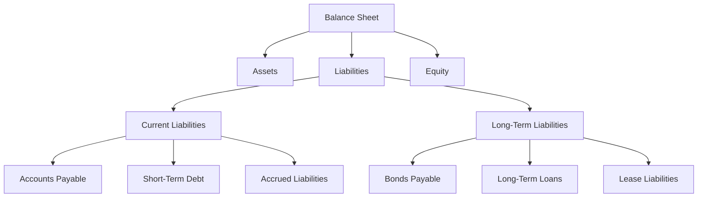

## 2.2 Understanding Liabilities

In the world of accounting, liabilities play a crucial role in understanding a company's financial health and obligations. This section aims to provide a comprehensive overview of liabilities, focusing on their definition, classification, and impact on financial statements. By the end of this section, you will have a solid understanding of current and long-term liabilities, their significance in the accounting equation, and how they are reported in financial statements. This knowledge is essential for anyone preparing for Canadian accounting exams or pursuing a career in accounting.

### What Are Liabilities?

Liabilities are financial obligations or debts that a company owes to external parties. These obligations arise from past transactions or events and are expected to result in an outflow of economic resources, such as cash or other assets, in the future. Liabilities are a key component of the accounting equation, which is expressed as:

**Assets = Liabilities + Equity**

This equation highlights the relationship between a company's resources (assets) and the claims on those resources by creditors (liabilities) and owners (equity).

### Classification of Liabilities

Liabilities are typically classified into two main categories: current liabilities and long-term liabilities. Understanding the distinction between these categories is crucial for accurate financial reporting and analysis.

#### Current Liabilities

Current liabilities are obligations that a company expects to settle within one year or the operating cycle, whichever is longer. These liabilities are crucial for assessing a company's short-term financial health and liquidity. Common examples of current liabilities include:

- **Accounts Payable:** Amounts owed to suppliers for goods and services purchased on credit. Accounts payable are typically settled within 30 to 60 days.
- **Short-Term Debt:** Loans or borrowings that are due within one year. This includes bank overdrafts and short-term notes payable.
- **Accrued Liabilities:** Expenses that have been incurred but not yet paid, such as wages payable, interest payable, and taxes payable.
- **Unearned Revenue:** Payments received in advance for goods or services that have not yet been delivered or performed. This liability is settled as the company fulfills its obligations.
- **Current Portion of Long-Term Debt:** The portion of long-term debt that is due within the next year.

#### Long-Term Liabilities

Long-term liabilities are obligations that a company expects to settle beyond one year or the operating cycle. These liabilities are important for understanding a company's long-term financial commitments and capital structure. Common examples of long-term liabilities include:

- **Bonds Payable:** Debt securities issued by a company to raise capital, typically with a maturity date of more than one year.
- **Long-Term Loans:** Borrowings with a repayment period extending beyond one year, such as mortgages and term loans.
- **Lease Liabilities:** Obligations arising from lease agreements, particularly finance leases, where the company has a long-term commitment to lease assets.
- **Deferred Tax Liabilities:** Taxes that are owed but not yet payable, often arising from temporary differences between accounting and tax treatment of certain items.
- **Pension Liabilities:** Obligations to provide future pension benefits to employees, based on defined benefit plans.

### Importance of Liabilities in Financial Reporting

Liabilities are a critical component of financial statements, providing valuable insights into a company's financial position and risk profile. They are reported on the balance sheet, which presents a snapshot of a company's assets, liabilities, and equity at a specific point in time. Understanding liabilities is essential for several reasons:

1. **Assessing Liquidity:** Current liabilities help assess a company's ability to meet its short-term obligations. A company with high current liabilities relative to its current assets may face liquidity challenges.

2. **Evaluating Solvency:** Long-term liabilities provide insights into a company's solvency and ability to meet its long-term obligations. A high level of long-term debt may indicate financial risk.

3. **Analyzing Financial Health:** Liabilities, in conjunction with assets and equity, help analyze a company's overall financial health and capital structure. This analysis is crucial for investors, creditors, and other stakeholders.

4. **Compliance with Accounting Standards:** Accurate reporting of liabilities is essential for compliance with accounting standards, such as the International Financial Reporting Standards (IFRS) and Accounting Standards for Private Enterprises (ASPE) in Canada.

### Practical Examples and Scenarios

To illustrate the concept of liabilities, let's consider a few practical examples and scenarios relevant to the Canadian accounting profession:

#### Example 1: Accounts Payable

ABC Manufacturing Ltd. purchases raw materials from a supplier on credit, with payment terms of 30 days. The purchase amount is $50,000. This transaction creates an accounts payable liability of $50,000, which ABC Manufacturing Ltd. must settle within 30 days.

#### Example 2: Short-Term Debt

XYZ Corporation takes out a short-term loan of $100,000 from a bank to finance its working capital needs. The loan is due in six months. This creates a short-term debt liability of $100,000 on XYZ Corporation's balance sheet.

#### Example 3: Bonds Payable

DEF Inc. issues bonds with a face value of $1,000,000 and a maturity date of 10 years. The bonds pay interest semi-annually. This transaction creates a long-term liability of $1,000,000, which DEF Inc. must repay at the end of the 10-year term.

### Real-World Applications and Regulatory Scenarios

In the Canadian accounting context, understanding liabilities is crucial for compliance with regulatory requirements and financial reporting standards. Here are some real-world applications and regulatory scenarios:

- **IFRS and ASPE Compliance:** Companies in Canada must comply with IFRS or ASPE when reporting liabilities. These standards provide guidelines on recognizing, measuring, and disclosing liabilities in financial statements.

- **Financial Covenants:** Companies with significant liabilities, such as loans and bonds, may be subject to financial covenants imposed by creditors. These covenants often require the company to maintain certain financial ratios, such as the debt-to-equity ratio, to ensure financial stability.

- **Lease Accounting:** Under IFRS 16, companies must recognize lease liabilities on the balance sheet for most lease agreements. This standard impacts the reporting of both current and long-term liabilities.

### Step-by-Step Guidance for Reporting Liabilities

Accurate reporting of liabilities is essential for financial transparency and compliance. Here is a step-by-step guide to reporting liabilities in financial statements:

1. **Identify Liabilities:** Review all financial obligations and categorize them as current or long-term liabilities based on their settlement period.

2. **Measure Liabilities:** Determine the monetary value of each liability. For example, accounts payable are measured at the invoiced amount, while bonds payable are measured at their face value.

3. **Record Liabilities:** Record liabilities in the accounting system using appropriate journal entries. For example, when a company incurs accounts payable, the journal entry is:

   ```
   Accounts Payable    $XX,XXX
      Inventory/Supplies    $XX,XXX
   ```

4. **Disclose Liabilities:** Provide detailed disclosures in the notes to the financial statements, including the nature, terms, and maturity dates of significant liabilities.

5. **Review and Adjust:** Regularly review liabilities for accuracy and make necessary adjustments, such as reclassifying the current portion of long-term debt.

### Diagrams and Visual Aids

To enhance your understanding of liabilities, let's use a visual aid to illustrate the classification of liabilities on the balance sheet:



### Best Practices and Common Pitfalls

When dealing with liabilities, it's important to follow best practices and avoid common pitfalls:

- **Best Practices:**
  - Regularly review and update liability records to ensure accuracy.
  - Maintain clear documentation for all liabilities, including contracts and agreements.
  - Monitor financial covenants and ensure compliance with creditor requirements.

- **Common Pitfalls:**
  - Failing to recognize liabilities in a timely manner, leading to inaccurate financial reporting.
  - Misclassifying liabilities, such as failing to reclassify the current portion of long-term debt.
  - Overlooking contingent liabilities, which may require disclosure or recognition based on the likelihood of occurrence.

### References to Canadian Accounting Standards

For further exploration of liabilities, consider reviewing the following Canadian accounting standards and resources:

- **International Financial Reporting Standards (IFRS):** IFRS 9 (Financial Instruments) and IFRS 16 (Leases) provide guidance on recognizing and measuring liabilities.
- **Accounting Standards for Private Enterprises (ASPE):** ASPE Section 1000 (Financial Statement Concepts) and Section 3856 (Financial Instruments) are relevant for liability reporting.
- **CPA Canada:** The CPA Canada Handbook offers comprehensive guidance on accounting standards and best practices for liabilities.

### Summary

Understanding liabilities is essential for accurate financial reporting and analysis. By comprehending the classification, measurement, and reporting of liabilities, you can assess a company's financial health and obligations. This knowledge is crucial for Canadian accounting exams and professional practice, enabling you to make informed decisions and provide valuable insights to stakeholders.

## **Ready to Test Your Knowledge?**



### What is a liability in accounting?

- [x] A financial obligation or debt owed by a company to external parties
- [ ] An asset owned by a company
- [ ] Revenue earned by a company
- [ ] Equity held by shareholders

> **Explanation:** A liability is a financial obligation or debt that a company owes to external parties, resulting from past transactions or events.

### Which of the following is a current liability?

- [x] Accounts Payable
- [ ] Bonds Payable
- [ ] Long-Term Loans
- [ ] Lease Liabilities

> **Explanation:** Accounts payable are considered current liabilities because they are expected to be settled within one year or the operating cycle.

### What distinguishes long-term liabilities from current liabilities?

- [x] Long-term liabilities are obligations expected to be settled beyond one year.
- [ ] Long-term liabilities are always larger in amount than current liabilities.
- [ ] Long-term liabilities are only related to loans.
- [ ] Long-term liabilities do not appear on the balance sheet.

> **Explanation:** Long-term liabilities are obligations that a company expects to settle beyond one year or the operating cycle.

### Which accounting standard provides guidance on lease liabilities in Canada?

- [x] IFRS 16
- [ ] IFRS 9
- [ ] ASPE Section 1000
- [ ] CPA Canada Handbook

> **Explanation:** IFRS 16 provides guidance on recognizing and measuring lease liabilities in financial statements.

### What is the current portion of long-term debt?

- [x] The portion of long-term debt due within the next year
- [ ] The entire amount of long-term debt
- [ ] A type of short-term debt
- [ ] A liability that does not require repayment

> **Explanation:** The current portion of long-term debt is the part of long-term debt that is due within the next year and is classified as a current liability.

### How are accrued liabilities reported?

- [x] As current liabilities on the balance sheet
- [ ] As long-term liabilities on the balance sheet
- [ ] As equity on the balance sheet
- [ ] As revenue on the income statement

> **Explanation:** Accrued liabilities are reported as current liabilities on the balance sheet because they represent expenses incurred but not yet paid.

### What is the impact of liabilities on the accounting equation?

- [x] Liabilities increase the claims on a company's assets.
- [ ] Liabilities decrease a company's equity.
- [ ] Liabilities increase a company's revenue.
- [ ] Liabilities decrease a company's assets.

> **Explanation:** Liabilities represent claims on a company's assets by creditors, increasing the total claims on those assets.

### Which of the following is an example of a contingent liability?

- [x] A potential lawsuit settlement
- [ ] Accounts payable
- [ ] Bonds payable
- [ ] Unearned revenue

> **Explanation:** A contingent liability is a potential obligation that may arise depending on the outcome of a future event, such as a lawsuit settlement.

### Why is it important to disclose liabilities in financial statements?

- [x] To provide transparency and inform stakeholders about a company's financial obligations
- [ ] To hide financial obligations from creditors
- [ ] To increase a company's equity
- [ ] To reduce tax liabilities

> **Explanation:** Disclosing liabilities in financial statements provides transparency and informs stakeholders about a company's financial obligations and risk profile.

### True or False: Liabilities are always considered negative for a company's financial health.

- [ ] True
- [x] False

> **Explanation:** While excessive liabilities can indicate financial risk, they are not always negative. Liabilities can be used to finance growth and operations, contributing to a company's financial health when managed properly.


