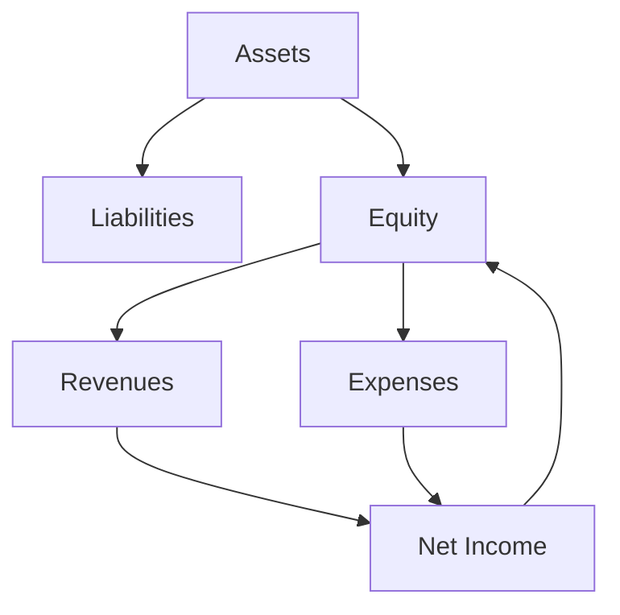

## 2.5 Expanding the Accounting Equation

The accounting equation is the foundation of double-entry bookkeeping and reflects the relationship between a company's assets, liabilities, and equity. Traditionally expressed as:

 \text{Assets} = \text{Liabilities} + \text{Equity} 

This equation provides a snapshot of a company's financial position at any given time. However, to fully understand how a business operates and generates profit, we must expand this equation to include revenues and expenses. This expanded equation is crucial for preparing and analyzing financial statements, particularly the income statement, which reflects a company's financial performance over a period.

### Understanding Revenues and Expenses

**Revenues** are the inflows of resources resulting from the sale of goods or services. They increase equity through profits. **Expenses**, on the other hand, are the outflows or consumption of resources incurred in generating revenues. They decrease equity by reducing profits. 

The expanded accounting equation incorporates these elements:

 \text{Assets} = \text{Liabilities} + \text{Equity} + (\text{Revenues} - \text{Expenses}) 

This equation illustrates how revenues and expenses impact the equity portion of the equation.

### The Expanded Equation in Practice

To understand the expanded accounting equation, consider a practical example:

#### Example: Coffee Shop Operations

Imagine a coffee shop that starts with the following balance sheet:

- **Assets**: $50,000 (cash, equipment)
- **Liabilities**: $20,000 (loan)
- **Equity**: $30,000 (owner's investment)

During the month, the coffee shop generates $10,000 in revenues from sales and incurs $7,000 in expenses (rent, salaries, supplies).

**Expanded Accounting Equation:**

 \text{Assets} = \text{Liabilities} + \text{Equity} + (\text{Revenues} - \text{Expenses}) 

 50,000 + 10,000 - 7,000 = 20,000 + 30,000 + (10,000 - 7,000) 

 53,000 = 20,000 + 33,000 

This example shows how revenues and expenses affect the equity and overall financial position of the business.

### Importance of the Expanded Accounting Equation

The expanded accounting equation is vital for several reasons:

1. **Comprehensive Financial Analysis**: It provides a more detailed view of a company's financial performance by incorporating operational results.
2. **Income Statement Preparation**: It forms the basis for preparing the income statement, which details revenues, expenses, and net income.
3. **Decision-Making**: By understanding how revenues and expenses affect equity, stakeholders can make informed decisions about investments, operations, and financial strategies.
4. **Regulatory Compliance**: Aligning with Canadian accounting standards, such as IFRS and ASPE, ensures accurate and compliant financial reporting.

### Real-World Applications

In the Canadian accounting context, the expanded accounting equation is used extensively in financial reporting and analysis. Companies must adhere to standards set by regulatory bodies like CPA Canada and IFRS, ensuring transparency and consistency in financial statements.

#### Case Study: Canadian Retailer

Consider a Canadian retailer that reports the following:

- **Assets**: $500,000
- **Liabilities**: $200,000
- **Equity**: $300,000

During the fiscal year, the retailer earns $150,000 in revenues and incurs $100,000 in expenses.

**Expanded Equation:**

 \text{Assets} = \text{Liabilities} + \text{Equity} + (\text{Revenues} - \text{Expenses}) 

 500,000 + 150,000 - 100,000 = 200,000 + 300,000 + (150,000 - 100,000) 

 550,000 = 200,000 + 350,000 

This case study illustrates how the expanded equation helps in evaluating the retailer's financial performance and position.

### Step-by-Step Guidance

To effectively apply the expanded accounting equation, follow these steps:

1. **Identify Revenues and Expenses**: Determine all sources of income and costs incurred during the period.
2. **Record Transactions**: Use double-entry bookkeeping to accurately record revenues and expenses, ensuring each transaction impacts at least two accounts.
3. **Adjust Equity**: Calculate the net effect of revenues and expenses on equity.
4. **Prepare Financial Statements**: Use the expanded equation to draft the income statement and balance sheet, reflecting the company's financial performance and position.

### Common Pitfalls and Challenges

1. **Misclassification**: Incorrectly categorizing revenues or expenses can lead to inaccurate financial statements.
2. **Omission**: Failing to record all transactions, particularly accruals and deferrals, can distort financial results.
3. **Complex Transactions**: Handling complex transactions, such as foreign currency exchanges or derivatives, requires careful consideration and adherence to Canadian accounting standards.

### Best Practices

1. **Regular Reconciliation**: Periodically reconcile accounts to ensure accuracy and completeness.
2. **Use of Technology**: Leverage accounting software to automate transaction recording and financial statement preparation.
3. **Continuous Learning**: Stay updated with changes in accounting standards and practices through professional development and resources from CPA Canada.

### Diagrams and Visuals

To enhance understanding, consider the following diagram illustrating the expanded accounting equation:

This diagram shows the flow of transactions and their impact on the expanded accounting equation.

### Conclusion

The expanded accounting equation is a powerful tool for understanding a company's financial dynamics. By incorporating revenues and expenses, it provides a comprehensive view of financial performance, aiding in decision-making and regulatory compliance. Mastery of this concept is essential for success in Canadian accounting exams and professional practice.

---

## **Ready to Test Your Knowledge?**



### What does the expanded accounting equation include that the basic equation does not?

- [x] Revenues and Expenses
- [ ] Assets and Liabilities
- [ ] Equity and Liabilities
- [ ] Cash and Inventory

> **Explanation:** The expanded accounting equation includes revenues and expenses, which are not part of the basic equation.

### How do revenues affect the expanded accounting equation?

- [x] Increase Equity
- [ ] Decrease Liabilities
- [ ] Increase Assets
- [ ] Decrease Expenses

> **Explanation:** Revenues increase equity by contributing to net income.

### What is the primary purpose of the expanded accounting equation?

- [x] To provide a detailed view of financial performance
- [ ] To simplify financial reporting
- [ ] To eliminate the need for balance sheets
- [ ] To reduce accounting complexity

> **Explanation:** The expanded accounting equation provides a detailed view of financial performance by incorporating operational results.

### Which financial statement is directly prepared using the expanded accounting equation?

- [x] Income Statement
- [ ] Balance Sheet
- [ ] Cash Flow Statement
- [ ] Statement of Owner's Equity

> **Explanation:** The income statement is prepared using the expanded accounting equation, reflecting revenues and expenses.

### What is a common pitfall when using the expanded accounting equation?

- [x] Misclassifying revenues and expenses
- [ ] Overstating liabilities
- [ ] Understating assets
- [ ] Ignoring equity

> **Explanation:** Misclassifying revenues and expenses can lead to inaccurate financial statements.

### Which regulatory body sets accounting standards in Canada?

- [x] CPA Canada
- [ ] FASB
- [ ] SEC
- [ ] AICPA

> **Explanation:** CPA Canada sets accounting standards in Canada.

### How do expenses affect the expanded accounting equation?

- [x] Decrease Equity
- [ ] Increase Liabilities
- [ ] Increase Assets
- [ ] Decrease Revenues

> **Explanation:** Expenses decrease equity by reducing net income.

### What is the impact of net income on the expanded accounting equation?

- [x] Increases Equity
- [ ] Decreases Liabilities
- [ ] Increases Assets
- [ ] Decreases Expenses

> **Explanation:** Net income increases equity by contributing to retained earnings.

### Which accounting method is essential for recording transactions in the expanded equation?

- [x] Double-Entry Bookkeeping
- [ ] Single-Entry Bookkeeping
- [ ] Cash Basis Accounting
- [ ] Accrual Basis Accounting

> **Explanation:** Double-entry bookkeeping is essential for accurately recording transactions in the expanded equation.

### True or False: The expanded accounting equation is only used for large corporations.

- [ ] True
- [x] False

> **Explanation:** False. The expanded accounting equation is used by businesses of all sizes to understand financial performance.


