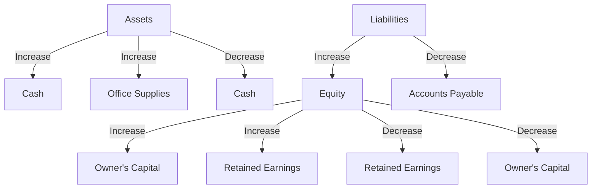

## 2.6 How Transactions Affect the Accounting Equation

Understanding how transactions affect the accounting equation is crucial for anyone studying accounting. The accounting equation, which is expressed as **Assets = Liabilities + Equity**, serves as the foundation of double-entry bookkeeping. Each financial transaction impacts this equation by altering the values of assets, liabilities, or equity. In this section, we will delve into the mechanics of how transactions affect these components, providing you with the knowledge needed to analyze and record financial activities accurately.

### The Accounting Equation: A Quick Recap

Before exploring how transactions affect the accounting equation, let's briefly revisit its components:

- **Assets**: Resources owned by a business that have economic value and can provide future benefits. Examples include cash, inventory, and property.
- **Liabilities**: Obligations or debts that a business owes to external parties. Examples include loans, accounts payable, and mortgages.
- **Equity**: The residual interest in the assets of the entity after deducting liabilities. It represents the owner's claim on the business and includes items such as common stock and retained earnings.

The accounting equation ensures that the balance sheet remains balanced, reflecting the financial position of a business at any given time.

### The Impact of Transactions on the Accounting Equation

Each transaction a business undertakes will affect at least two accounts in the accounting equation. This is the essence of the double-entry bookkeeping system, which requires that every financial transaction be recorded in at least two accounts, ensuring the equation remains balanced.

#### Types of Transactions and Their Effects

1. **Asset Acquisition**

   When a business acquires an asset, it increases its assets. This transaction may be financed through cash (decreasing another asset) or by incurring a liability (increasing liabilities).

   **Example**: A company purchases equipment worth $10,000 by paying $4,000 in cash and taking a loan for the remaining $6,000.

   - **Assets**: Increase by $10,000 (Equipment)
   - **Assets**: Decrease by $4,000 (Cash)
   - **Liabilities**: Increase by $6,000 (Loan Payable)

   The accounting equation remains balanced as the increase in equipment is offset by the decrease in cash and the increase in liabilities.

2. **Revenue Generation**

   Revenue transactions increase both assets and equity. When a business earns revenue, it typically receives cash or increases accounts receivable, thereby increasing assets. Simultaneously, revenue increases equity through retained earnings.

   **Example**: A company earns $5,000 in service revenue on account.

   - **Assets**: Increase by $5,000 (Accounts Receivable)
   - **Equity**: Increase by $5,000 (Retained Earnings)

   This transaction reflects the business's increased resources and owner's claim due to revenue generation.

3. **Expense Incurrence**

   Expenses decrease equity because they reduce net income, which in turn reduces retained earnings. Expenses may also decrease assets if paid in cash or increase liabilities if incurred on credit.

   **Example**: A company pays $2,000 in rent expense in cash.

   - **Assets**: Decrease by $2,000 (Cash)
   - **Equity**: Decrease by $2,000 (Retained Earnings)

   The reduction in cash and retained earnings reflects the cost of operating the business.

4. **Liability Settlement**

   Paying off a liability decreases both liabilities and assets. When a business settles its debts, it uses its assets, typically cash, to reduce its obligations.

   **Example**: A company pays off a $3,000 loan.

   - **Assets**: Decrease by $3,000 (Cash)
   - **Liabilities**: Decrease by $3,000 (Loan Payable)

   This transaction reduces both the company's resources and its obligations, keeping the equation balanced.

5. **Owner's Investment**

   When an owner invests additional capital into the business, both assets and equity increase. The business receives cash or other assets, and the owner's equity increases by the same amount.

   **Example**: An owner invests $8,000 cash into the business.

   - **Assets**: Increase by $8,000 (Cash)
   - **Equity**: Increase by $8,000 (Owner's Capital)

   This transaction enhances the business's resources and the owner's stake.

6. **Owner's Withdrawal**

   Withdrawals decrease both assets and equity. When an owner takes cash or other assets out of the business for personal use, it reduces the business's resources and the owner's equity.

   **Example**: An owner withdraws $1,500 in cash for personal use.

   - **Assets**: Decrease by $1,500 (Cash)
   - **Equity**: Decrease by $1,500 (Owner's Capital)

   The reduction in cash and owner's capital reflects the personal use of business resources.

### Practical Examples of Transactions

To further illustrate how transactions affect the accounting equation, let's consider a series of transactions for a hypothetical business, ABC Consulting.

#### Transaction 1: Starting the Business

The owner invests $20,000 cash to start ABC Consulting.

- **Assets**: Increase by $20,000 (Cash)
- **Equity**: Increase by $20,000 (Owner's Capital)

#### Transaction 2: Purchasing Office Supplies

ABC Consulting purchases $2,000 worth of office supplies on credit.

- **Assets**: Increase by $2,000 (Office Supplies)
- **Liabilities**: Increase by $2,000 (Accounts Payable)

#### Transaction 3: Providing Services

ABC Consulting provides consulting services and earns $5,000, which is received in cash.

- **Assets**: Increase by $5,000 (Cash)
- **Equity**: Increase by $5,000 (Retained Earnings)

#### Transaction 4: Paying Expenses

ABC Consulting pays $1,000 in rent for the office space.

- **Assets**: Decrease by $1,000 (Cash)
- **Equity**: Decrease by $1,000 (Retained Earnings)

#### Transaction 5: Settling Liabilities

ABC Consulting pays off $500 of its accounts payable.

- **Assets**: Decrease by $500 (Cash)
- **Liabilities**: Decrease by $500 (Accounts Payable)

#### Transaction 6: Owner's Withdrawal

The owner withdraws $1,000 for personal use.

- **Assets**: Decrease by $1,000 (Cash)
- **Equity**: Decrease by $1,000 (Owner's Capital)

### Visualizing Transactions with Diagrams

To enhance understanding, let's use a diagram to visualize how these transactions affect the accounting equation:

### Real-World Applications and Compliance

In practice, understanding how transactions affect the accounting equation is essential for accurate financial reporting and compliance with accounting standards. Canadian businesses must adhere to the International Financial Reporting Standards (IFRS) or Accounting Standards for Private Enterprises (ASPE), which require accurate recording and reporting of financial transactions.

#### Regulatory Considerations

- **IFRS and ASPE**: Both sets of standards emphasize the importance of maintaining accurate financial records and ensuring that the accounting equation remains balanced.
- **CPA Canada**: As the national organization for the accounting profession in Canada, CPA Canada provides guidelines and resources to help businesses comply with accounting standards and accurately report financial transactions.

### Common Pitfalls and Best Practices

#### Common Pitfalls

- **Omitting Transactions**: Failing to record all transactions can lead to an unbalanced equation and inaccurate financial statements.
- **Incorrect Classification**: Misclassifying transactions can distort the financial position and performance of a business.
- **Neglecting Adjustments**: Not making necessary adjusting entries can result in misstated assets, liabilities, and equity.

#### Best Practices

- **Regular Reconciliation**: Regularly reconcile accounts to ensure all transactions are recorded and classified correctly.
- **Use of Software**: Utilize accounting software to automate transaction recording and reduce errors.
- **Continuous Learning**: Stay updated with changes in accounting standards and practices through continuous education and professional development.

### Conclusion

Understanding how transactions affect the accounting equation is fundamental to mastering accounting principles. By analyzing the impact of transactions on assets, liabilities, and equity, you can ensure accurate financial reporting and compliance with Canadian accounting standards. Practice recording and analyzing transactions to reinforce your understanding and prepare for the Canadian Accounting Exams.

## **Ready to Test Your Knowledge?**



### Which of the following transactions increases both assets and equity?

- [x] Earning revenue on account
- [ ] Paying off a loan
- [ ] Purchasing equipment with cash
- [ ] Owner's withdrawal

> **Explanation:** Earning revenue on account increases assets (accounts receivable) and equity (retained earnings).

### What happens to the accounting equation when a company pays off a liability with cash?

- [x] Assets decrease, liabilities decrease
- [ ] Assets increase, liabilities increase
- [ ] Assets decrease, equity decreases
- [ ] Liabilities increase, equity increases

> **Explanation:** Paying off a liability with cash decreases both assets (cash) and liabilities (the liability being paid off).

### How does an owner's investment in the business affect the accounting equation?

- [x] Increases assets and increases equity
- [ ] Increases assets and decreases liabilities
- [ ] Decreases assets and decreases equity
- [ ] Increases liabilities and decreases equity

> **Explanation:** An owner's investment increases assets (cash or other assets) and increases equity (owner's capital).

### What is the effect of incurring an expense on the accounting equation?

- [x] Decreases equity
- [ ] Increases assets
- [ ] Increases liabilities
- [ ] Increases equity

> **Explanation:** Incurring an expense decreases equity because it reduces net income and retained earnings.

### Which of the following transactions will decrease both assets and equity?

- [x] Owner's withdrawal
- [ ] Purchasing inventory on credit
- [ ] Receiving cash from a customer
- [ ] Taking out a bank loan

> **Explanation:** An owner's withdrawal decreases assets (cash) and equity (owner's capital).

### What is the effect of purchasing inventory on credit?

- [x] Increases assets and increases liabilities
- [ ] Increases assets and increases equity
- [ ] Decreases assets and decreases liabilities
- [ ] Increases liabilities and decreases equity

> **Explanation:** Purchasing inventory on credit increases assets (inventory) and increases liabilities (accounts payable).

### How does providing services for cash affect the accounting equation?

- [x] Increases assets and increases equity
- [ ] Increases liabilities and decreases equity
- [ ] Decreases assets and decreases liabilities
- [ ] Increases assets and decreases equity

> **Explanation:** Providing services for cash increases assets (cash) and increases equity (retained earnings).

### What happens to the accounting equation when a company incurs a liability?

- [x] Increases liabilities
- [ ] Decreases assets
- [ ] Decreases equity
- [ ] Increases equity

> **Explanation:** Incurring a liability increases liabilities as the company now owes more to creditors.

### Which transaction affects only the equity side of the accounting equation?

- [x] Declaring a dividend
- [ ] Paying off a loan
- [ ] Purchasing equipment
- [ ] Receiving cash from a customer

> **Explanation:** Declaring a dividend affects only equity by reducing retained earnings.

### True or False: Every transaction affects at least two accounts in the accounting equation.

- [x] True
- [ ] False

> **Explanation:** True. Every transaction affects at least two accounts, maintaining the balance of the accounting equation.


