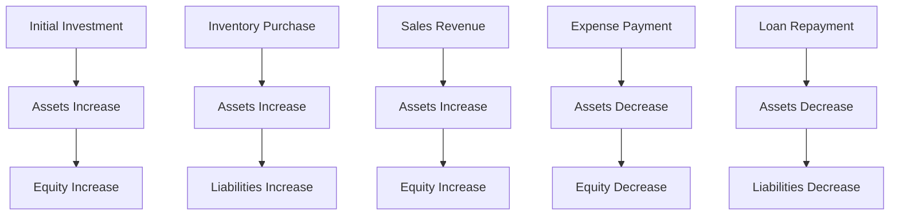

## 2.7 Examples of the Accounting Equation in Practice

The accounting equation, a fundamental principle in accounting, is expressed as:

**Assets = Liabilities + Equity**

This equation forms the backbone of double-entry bookkeeping and ensures that a company's financial statements are balanced. Understanding this equation is crucial for anyone preparing for Canadian accounting exams or working in the accounting field. In this section, we will explore practical examples and scenarios to illustrate how the accounting equation is applied in real-world situations.

### Understanding the Components

Before diving into examples, let's briefly revisit the components of the accounting equation:

- **Assets**: Resources owned by a company that have economic value, such as cash, inventory, and property.
- **Liabilities**: Obligations or debts that a company owes to external parties, like loans or accounts payable.
- **Equity**: The owner's residual interest in the company after liabilities are deducted from assets. It includes common stock, retained earnings, and additional paid-in capital.

### Example 1: Starting a Business

Imagine you are starting a new business, "Maple Leaf Consulting." You invest $50,000 of your own money into the business. This transaction affects the accounting equation as follows:

- **Assets**: Increase by $50,000 (Cash)
- **Equity**: Increase by $50,000 (Owner's Equity)

**Accounting Equation**: Assets ($50,000) = Liabilities ($0) + Equity ($50,000)

This example demonstrates how an owner's investment increases both the assets and equity of the business, keeping the equation balanced.

### Example 2: Purchasing Equipment with Cash

Maple Leaf Consulting decides to purchase office equipment worth $10,000 using cash. Here's how this transaction impacts the accounting equation:

- **Assets**: Decrease by $10,000 (Cash), Increase by $10,000 (Equipment)
- **Liabilities**: No change
- **Equity**: No change

**Accounting Equation**: Assets ($50,000 - $10,000 + $10,000) = Liabilities ($0) + Equity ($50,000)

In this scenario, the total assets remain the same, but the composition of the assets changes.

### Example 3: Taking a Loan

To expand operations, Maple Leaf Consulting takes a $20,000 loan from a bank. This transaction affects the accounting equation as follows:

- **Assets**: Increase by $20,000 (Cash)
- **Liabilities**: Increase by $20,000 (Loan Payable)

**Accounting Equation**: Assets ($70,000) = Liabilities ($20,000) + Equity ($50,000)

Here, the increase in assets is matched by an increase in liabilities, maintaining the balance of the equation.

### Example 4: Revenue from Services

Maple Leaf Consulting earns $15,000 from providing consulting services. This transaction impacts the accounting equation in the following way:

- **Assets**: Increase by $15,000 (Cash or Accounts Receivable)
- **Equity**: Increase by $15,000 (Revenue)

**Accounting Equation**: Assets ($85,000) = Liabilities ($20,000) + Equity ($65,000)

Revenue increases both assets and equity, reflecting the company's earnings.

### Example 5: Paying Expenses

The company incurs $5,000 in operating expenses, paid in cash. This transaction affects the accounting equation as follows:

- **Assets**: Decrease by $5,000 (Cash)
- **Equity**: Decrease by $5,000 (Expenses)

**Accounting Equation**: Assets ($80,000) = Liabilities ($20,000) + Equity ($60,000)

Expenses reduce both assets and equity, demonstrating the cost of business operations.

### Example 6: Paying Off a Liability

Maple Leaf Consulting decides to pay off $10,000 of its loan. Here's how this transaction impacts the accounting equation:

- **Assets**: Decrease by $10,000 (Cash)
- **Liabilities**: Decrease by $10,000 (Loan Payable)

**Accounting Equation**: Assets ($70,000) = Liabilities ($10,000) + Equity ($60,000)

Paying off liabilities reduces both assets and liabilities, keeping the equation balanced.

### Example 7: Owner's Withdrawal

The owner decides to withdraw $5,000 from the business for personal use. This transaction affects the accounting equation as follows:

- **Assets**: Decrease by $5,000 (Cash)
- **Equity**: Decrease by $5,000 (Owner's Draw)

**Accounting Equation**: Assets ($65,000) = Liabilities ($10,000) + Equity ($55,000)

Owner's withdrawals decrease both assets and equity, reflecting the distribution of profits.

### Real-World Application: Canadian Context

In Canada, businesses must adhere to specific accounting standards, such as the International Financial Reporting Standards (IFRS) and Accounting Standards for Private Enterprises (ASPE). These standards ensure consistency and transparency in financial reporting. Understanding how the accounting equation applies within these frameworks is crucial for compliance and accurate financial analysis.

### Case Study: Small Business Scenario

Let's consider a small Canadian retail business, "Northern Lights Boutique." Here's a series of transactions and how they affect the accounting equation:

1. **Initial Investment**: The owner invests $100,000.
   - **Assets**: Increase by $100,000 (Cash)
   - **Equity**: Increase by $100,000

   **Equation**: Assets ($100,000) = Liabilities ($0) + Equity ($100,000)

2. **Inventory Purchase**: The business buys $30,000 worth of inventory on credit.
   - **Assets**: Increase by $30,000 (Inventory)
   - **Liabilities**: Increase by $30,000 (Accounts Payable)

   **Equation**: Assets ($130,000) = Liabilities ($30,000) + Equity ($100,000)

3. **Sales Revenue**: The boutique sells inventory for $50,000, receiving cash.
   - **Assets**: Increase by $50,000 (Cash), Decrease by $30,000 (Inventory)
   - **Equity**: Increase by $20,000 (Revenue)

   **Equation**: Assets ($150,000) = Liabilities ($30,000) + Equity ($120,000)

4. **Expense Payment**: Pays $10,000 in rent and utilities.
   - **Assets**: Decrease by $10,000 (Cash)
   - **Equity**: Decrease by $10,000 (Expenses)

   **Equation**: Assets ($140,000) = Liabilities ($30,000) + Equity ($110,000)

5. **Loan Repayment**: Pays off $5,000 of the accounts payable.
   - **Assets**: Decrease by $5,000 (Cash)
   - **Liabilities**: Decrease by $5,000

   **Equation**: Assets ($135,000) = Liabilities ($25,000) + Equity ($110,000)

This case study illustrates how various transactions impact the accounting equation, reflecting the financial health and operations of a business.

### Visualizing the Accounting Equation

To further enhance understanding, let's visualize the flow of transactions using a diagram:

This diagram illustrates the interconnectedness of transactions and their impact on the accounting equation, emphasizing the importance of maintaining balance.

### Common Pitfalls and Best Practices

**Pitfalls**:
- **Ignoring Double-Entry**: Failing to record both sides of a transaction can lead to imbalances.
- **Misclassifying Accounts**: Incorrectly categorizing assets, liabilities, or equity can distort financial statements.
- **Overlooking Adjustments**: Not accounting for accrued expenses or revenues can misrepresent financial health.

**Best Practices**:
- **Regular Reconciliation**: Frequently reconcile accounts to ensure accuracy.
- **Consistent Categorization**: Use a standardized chart of accounts to maintain consistency.
- **Thorough Documentation**: Keep detailed records of all transactions for transparency and audit purposes.

### Exam Preparation Tips

- **Understand the Equation**: Grasp the fundamental relationship between assets, liabilities, and equity.
- **Practice Scenarios**: Work through various transaction scenarios to see how they affect the equation.
- **Use Visual Aids**: Diagrams and charts can help visualize the flow of transactions.
- **Review Standards**: Familiarize yourself with IFRS and ASPE as they apply to the accounting equation.

### Conclusion

The accounting equation is a foundational concept in accounting, crucial for understanding financial statements and ensuring accurate bookkeeping. By exploring practical examples and real-world scenarios, you can gain a deeper insight into how this equation operates within the Canadian accounting framework. Mastery of this concept will not only aid in exam preparation but also enhance your ability to analyze and interpret financial data in a professional setting.

## **Ready to Test Your Knowledge?**



### Which of the following transactions would increase both assets and liabilities?

- [x] Taking out a bank loan
- [ ] Paying off a loan
- [ ] Owner's withdrawal
- [ ] Paying expenses

> **Explanation:** Taking out a bank loan increases cash (an asset) and creates a liability (loan payable).

### What happens to the accounting equation when a business earns revenue?

- [x] Assets increase, equity increases
- [ ] Assets decrease, equity decreases
- [ ] Liabilities increase, equity decreases
- [ ] Assets increase, liabilities increase

> **Explanation:** Earning revenue increases assets (cash or accounts receivable) and equity (revenue).

### How does paying off a liability affect the accounting equation?

- [x] Assets decrease, liabilities decrease
- [ ] Assets increase, liabilities decrease
- [ ] Assets decrease, equity decrease
- [ ] Liabilities increase, equity increase

> **Explanation:** Paying off a liability decreases cash (an asset) and reduces the liability.

### Which component of the accounting equation is affected by owner's withdrawal?

- [x] Equity
- [ ] Assets
- [ ] Liabilities
- [ ] Revenue

> **Explanation:** Owner's withdrawal decreases equity as it represents a distribution of profits.

### In the accounting equation, what does equity represent?

- [x] Owner's residual interest
- [ ] Company's debts
- [ ] Company's assets
- [ ] Company's expenses

> **Explanation:** Equity represents the owner's residual interest in the company after liabilities are deducted from assets.

### What is the effect of purchasing inventory on credit?

- [x] Assets increase, liabilities increase
- [ ] Assets decrease, liabilities decrease
- [ ] Assets increase, equity increases
- [ ] Liabilities decrease, equity decreases

> **Explanation:** Purchasing inventory on credit increases inventory (an asset) and accounts payable (a liability).

### How does paying operating expenses impact the accounting equation?

- [x] Assets decrease, equity decreases
- [ ] Assets increase, equity increases
- [ ] Liabilities increase, equity decreases
- [ ] Assets decrease, liabilities decrease

> **Explanation:** Paying operating expenses decreases cash (an asset) and reduces equity (expenses).

### What happens to the accounting equation when a company receives cash for services provided?

- [x] Assets increase, equity increases
- [ ] Assets decrease, equity decreases
- [ ] Liabilities increase, equity increases
- [ ] Assets increase, liabilities increase

> **Explanation:** Receiving cash for services increases cash (an asset) and equity (revenue).

### Which transaction would decrease both assets and equity?

- [x] Paying dividends
- [ ] Taking a loan
- [ ] Purchasing equipment
- [ ] Earning revenue

> **Explanation:** Paying dividends decreases cash (an asset) and reduces equity.

### True or False: The accounting equation must always remain balanced.

- [x] True
- [ ] False

> **Explanation:** The accounting equation must always remain balanced to accurately reflect a company's financial position.


