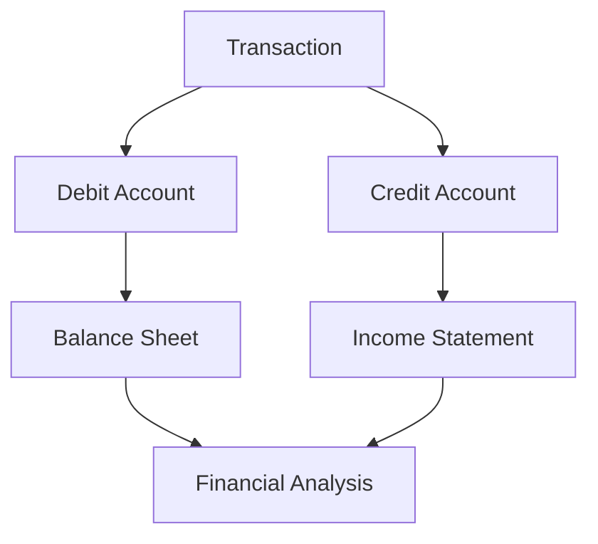

## 3.10 Advantages of Double-Entry Bookkeeping

Double-entry bookkeeping is a cornerstone of modern accounting, providing a structured and reliable method for recording financial transactions. This system, which requires every financial transaction to be recorded in at least two accounts, offers numerous advantages that enhance the accuracy, reliability, and utility of financial information. Understanding these benefits is crucial for anyone preparing for Canadian accounting exams, as it forms the basis for more advanced accounting practices and financial analysis.

### **1. Enhanced Accuracy and Error Detection**

One of the primary advantages of double-entry bookkeeping is its ability to enhance the accuracy of financial records. By requiring that each transaction affects at least two accounts, the system inherently includes a built-in mechanism for error detection. If the total debits do not equal the total credits, it indicates that an error has occurred, prompting further investigation. This dual-entry system reduces the likelihood of errors that can occur in single-entry systems, such as omitting transactions or recording them incorrectly.

#### **Example:**

Consider a business that purchases office supplies for $500 on credit. In a double-entry system, this transaction would be recorded as follows:

- Debit Office Supplies Expense $500
- Credit Accounts Payable $500

If the entries do not balance, the discrepancy signals an error, allowing for timely corrections.

### **2. Comprehensive Financial Information**

Double-entry bookkeeping provides a comprehensive view of a business's financial position. By recording both the source and the use of funds, it allows for the creation of detailed financial statements, including the balance sheet, income statement, and cash flow statement. These statements provide valuable insights into a company's financial health and performance, aiding in decision-making and strategic planning.

#### **Mermaid Diagram:**

### **3. Facilitates Financial Analysis and Reporting**

The double-entry system is essential for financial analysis and reporting. It allows accountants to prepare accurate financial statements that reflect a company's financial performance and position. These statements are crucial for stakeholders, including investors, creditors, and management, to assess the company's profitability, liquidity, and solvency.

#### **Real-World Application:**

In Canada, companies are required to prepare financial statements in accordance with International Financial Reporting Standards (IFRS) or Accounting Standards for Private Enterprises (ASPE). Double-entry bookkeeping ensures compliance with these standards, providing reliable data for analysis.

### **4. Supports Regulatory Compliance**

Double-entry bookkeeping supports compliance with regulatory requirements and accounting standards. In Canada, adherence to IFRS or ASPE is mandatory for financial reporting. The double-entry system facilitates compliance by ensuring that financial records are complete, accurate, and verifiable, reducing the risk of non-compliance and potential penalties.

### **5. Improved Financial Control and Fraud Prevention**

The double-entry system enhances financial control and helps prevent fraud. By maintaining a detailed record of all transactions, it provides a clear audit trail that can be used to verify the accuracy of financial information. This transparency deters fraudulent activities and enables auditors to detect and investigate discrepancies.

#### **Case Study:**

A Canadian company discovered fraudulent activities when an audit revealed discrepancies in its financial records. The double-entry system provided the necessary documentation to trace the transactions and identify the source of the fraud, leading to corrective actions and improved internal controls.

### **6. Facilitates Budgeting and Forecasting**

Double-entry bookkeeping provides the detailed financial data necessary for effective budgeting and forecasting. By analyzing historical financial information, businesses can make informed predictions about future revenues, expenses, and cash flows. This capability is essential for strategic planning and resource allocation.

### **7. Enhances Decision-Making**

Accurate and reliable financial information is critical for effective decision-making. The double-entry system provides a complete and accurate picture of a company's financial position, enabling management to make informed decisions about investments, financing, and operations.

### **8. Supports Business Growth and Expansion**

As businesses grow and expand, their financial transactions become more complex. The double-entry system can accommodate this complexity by providing a scalable framework for recording and managing financial information. This capability is essential for businesses looking to expand into new markets or introduce new products and services.

### **9. Provides Historical Financial Data**

Double-entry bookkeeping maintains a detailed record of all financial transactions, providing a valuable historical record that can be used for analysis and decision-making. This historical data is essential for identifying trends, evaluating performance, and making strategic decisions.

### **10. Facilitates External Audits**

The double-entry system provides a clear and verifiable record of financial transactions, facilitating external audits. Auditors rely on the accuracy and completeness of financial records to assess a company's financial statements and provide assurance to stakeholders.

### **11. Global Acceptance and Standardization**

Double-entry bookkeeping is widely accepted and used globally, providing a standardized method for recording financial transactions. This standardization facilitates international business operations and financial reporting, enabling companies to compete in the global marketplace.

### **12. Supports Financial Transparency**

The double-entry system promotes financial transparency by providing a clear and accurate record of all financial transactions. This transparency is essential for building trust with stakeholders, including investors, creditors, and regulatory authorities.

### **13. Enhances Internal Controls**

Double-entry bookkeeping enhances internal controls by providing a structured framework for recording and managing financial transactions. This framework helps ensure the accuracy and reliability of financial information, reducing the risk of errors and fraud.

### **14. Facilitates Tax Compliance**

Accurate financial records are essential for tax compliance. The double-entry system provides the detailed financial information necessary for preparing tax returns and ensuring compliance with tax laws and regulations.

### **15. Supports Financial Planning and Analysis**

The double-entry system provides the detailed financial data necessary for financial planning and analysis. By analyzing historical financial information, businesses can make informed predictions about future revenues, expenses, and cash flows, supporting strategic planning and decision-making.

### **Conclusion**

Double-entry bookkeeping is a fundamental accounting system that provides numerous advantages, enhancing the accuracy, reliability, and utility of financial information. Understanding these benefits is crucial for anyone preparing for Canadian accounting exams, as it forms the basis for more advanced accounting practices and financial analysis. By mastering the principles of double-entry bookkeeping, you will be well-equipped to succeed in your exams and advance your career in the accounting profession.

---

## **Ready to Test Your Knowledge?**



### What is one of the primary advantages of double-entry bookkeeping?

- [x] Enhanced accuracy and error detection
- [ ] Simplified transaction recording
- [ ] Reduced need for financial statements
- [ ] Limited financial information

> **Explanation:** Double-entry bookkeeping enhances accuracy and error detection by requiring that each transaction affects at least two accounts, allowing discrepancies to be identified and corrected.

### How does double-entry bookkeeping support regulatory compliance?

- [x] By ensuring financial records are complete, accurate, and verifiable
- [ ] By simplifying tax calculations
- [ ] By eliminating the need for audits
- [ ] By reducing the number of financial statements required

> **Explanation:** Double-entry bookkeeping supports regulatory compliance by ensuring that financial records are complete, accurate, and verifiable, reducing the risk of non-compliance and potential penalties.

### What role does double-entry bookkeeping play in financial analysis?

- [x] It allows for the preparation of accurate financial statements
- [ ] It simplifies the calculation of financial ratios
- [ ] It eliminates the need for budgeting
- [ ] It reduces the complexity of financial transactions

> **Explanation:** Double-entry bookkeeping allows for the preparation of accurate financial statements, which are crucial for financial analysis and assessing a company's performance and position.

### How does double-entry bookkeeping enhance financial control?

- [x] By providing a clear audit trail
- [ ] By reducing the number of accounts used
- [ ] By simplifying transaction recording
- [ ] By eliminating the need for internal audits

> **Explanation:** Double-entry bookkeeping enhances financial control by providing a clear audit trail, which can be used to verify the accuracy of financial information and deter fraudulent activities.

### In what way does double-entry bookkeeping support business growth?

- [x] By providing a scalable framework for managing financial information
- [ ] By reducing the number of financial statements required
- [ ] By simplifying tax compliance
- [ ] By eliminating the need for external audits

> **Explanation:** Double-entry bookkeeping supports business growth by providing a scalable framework for recording and managing financial information, accommodating the complexity of expanding operations.

### Why is double-entry bookkeeping important for tax compliance?

- [x] It provides detailed financial information necessary for preparing tax returns
- [ ] It simplifies the calculation of tax liabilities
- [ ] It reduces the need for tax audits
- [ ] It eliminates the need for financial statements

> **Explanation:** Double-entry bookkeeping is important for tax compliance because it provides the detailed financial information necessary for preparing tax returns and ensuring compliance with tax laws and regulations.

### How does double-entry bookkeeping facilitate external audits?

- [x] By providing a clear and verifiable record of financial transactions
- [ ] By reducing the number of accounts used
- [ ] By simplifying transaction recording
- [ ] By eliminating the need for financial statements

> **Explanation:** Double-entry bookkeeping facilitates external audits by providing a clear and verifiable record of financial transactions, which auditors rely on to assess a company's financial statements.

### What is a key advantage of the global acceptance of double-entry bookkeeping?

- [x] It facilitates international business operations and financial reporting
- [ ] It simplifies tax compliance
- [ ] It reduces the need for external audits
- [ ] It eliminates the need for financial statements

> **Explanation:** The global acceptance of double-entry bookkeeping facilitates international business operations and financial reporting by providing a standardized method for recording financial transactions.

### How does double-entry bookkeeping support financial transparency?

- [x] By providing a clear and accurate record of all financial transactions
- [ ] By reducing the number of financial statements required
- [ ] By simplifying tax compliance
- [ ] By eliminating the need for external audits

> **Explanation:** Double-entry bookkeeping supports financial transparency by providing a clear and accurate record of all financial transactions, which is essential for building trust with stakeholders.

### True or False: Double-entry bookkeeping eliminates the need for financial statements.

- [ ] True
- [x] False

> **Explanation:** False. Double-entry bookkeeping does not eliminate the need for financial statements; rather, it facilitates their preparation by providing accurate and reliable financial information.


