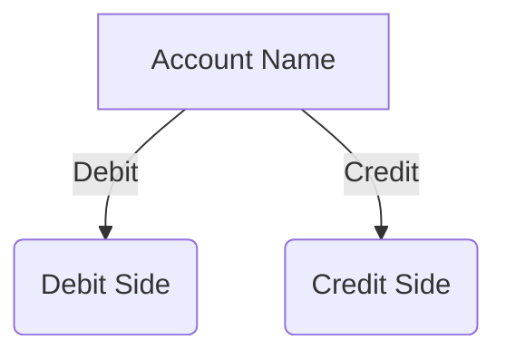
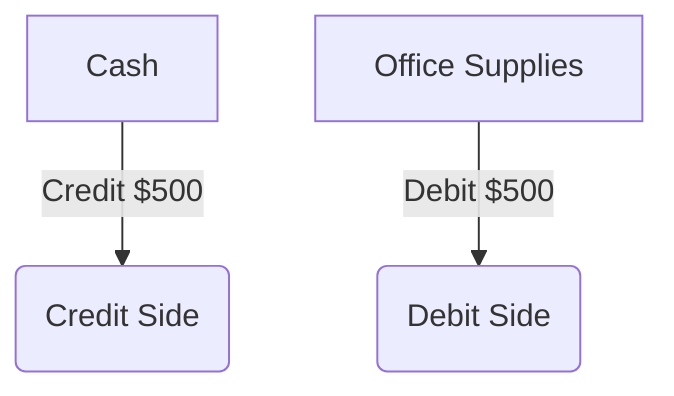

## 3.2 The T-Account

### Introduction to the T-Account

In the realm of accounting, the T-account is a fundamental tool that aids in understanding the dual nature of transactions in the double-entry bookkeeping system. Named for its T-like shape, this tool helps visualize how transactions affect accounts, offering a clear depiction of debits and credits. For those preparing for Canadian accounting exams, mastering the T-account is crucial, as it forms the basis for recording and analyzing financial transactions.

### The Structure of a T-Account

A T-account consists of two sides: the left side for debits and the right side for credits. Each account in the ledger is represented as a T-account, allowing accountants to track the flow of transactions. Here's a basic representation:

- **Debit Side (Left):** Increases in assets and expenses, decreases in liabilities, equity, and revenue.
- **Credit Side (Right):** Increases in liabilities, equity, and revenue, decreases in assets and expenses.

### Understanding Debits and Credits

The terms "debit" and "credit" have specific meanings in accounting. They do not imply positive or negative values but rather indicate the direction of changes in accounts:

- **Debits (Dr):** Increase asset and expense accounts; decrease liability, equity, and revenue accounts.
- **Credits (Cr):** Increase liability, equity, and revenue accounts; decrease asset and expense accounts.

### Practical Example: Recording a Transaction

Consider a simple transaction where a company purchases office supplies for $500 cash. This transaction affects two accounts: Cash and Office Supplies.

1. **Identify Accounts Affected:**
   - Cash (Asset)
   - Office Supplies (Asset)

2. **Determine Increase or Decrease:**
   - Cash decreases (credit)
   - Office Supplies increases (debit)

3. **Record in T-Accounts:**

### The Role of T-Accounts in the Accounting Cycle

T-accounts play a vital role in the accounting cycle, particularly during the recording and posting phases. They help ensure that the accounting equation (Assets = Liabilities + Equity) remains balanced after each transaction.

### Step-by-Step Guide to Using T-Accounts

1. **Analyze the Transaction:** Identify the accounts involved and determine whether each account is debited or credited.
2. **Record the Transaction:** Enter the debit and credit amounts in the respective T-accounts.
3. **Check for Balance:** Ensure that the total debits equal total credits for each transaction.
4. **Summarize Account Balances:** At the end of the accounting period, summarize the balances in each T-account to prepare for the trial balance.

### Common Transactions and Their T-Account Entries

1. **Sales on Credit:**
   - Accounts Receivable (Debit)
   - Sales Revenue (Credit)

2. **Payment of Salaries:**
   - Salaries Expense (Debit)
   - Cash (Credit)

3. **Purchase of Equipment on Credit:**
   - Equipment (Debit)
   - Accounts Payable (Credit)

### Advantages of Using T-Accounts

- **Clarity:** Provides a clear visual representation of how transactions affect accounts.
- **Simplicity:** Simplifies the process of recording and analyzing transactions.
- **Error Detection:** Helps identify discrepancies and errors in recording transactions.

### Limitations of T-Accounts

- **Complexity with Large Data:** Managing numerous T-accounts can become cumbersome for large organizations.
- **Lack of Detail:** T-accounts provide a summary view and may not capture detailed transaction information.

### Real-World Application and Compliance

In Canada, accountants must adhere to standards set by CPA Canada and the International Financial Reporting Standards (IFRS). Understanding T-accounts is essential for compliance and accurate financial reporting.

### Practice Problems and Exercises

To reinforce your understanding of T-accounts, consider the following practice problems:

1. **Transaction Analysis:** Analyze a series of transactions and record them in T-accounts.
2. **Trial Balance Preparation:** Use T-account balances to prepare a trial balance.
3. **Error Correction:** Identify and correct errors in T-account entries.

### Conclusion

Mastering the T-account is a foundational skill for any aspiring accountant. By understanding how to use T-accounts effectively, you can ensure accurate financial reporting and analysis, which is crucial for success in Canadian accounting exams and professional practice.

## **Ready to Test Your Knowledge?**



### What is the primary purpose of a T-account in accounting?

- [x] To visualize the effect of transactions on accounts
- [ ] To calculate net income
- [ ] To prepare financial statements
- [ ] To determine tax liabilities

> **Explanation:** A T-account is used to visualize how transactions affect accounts, showing debits and credits.

### Which side of the T-account is used to record debits?

- [x] Left side
- [ ] Right side
- [ ] Both sides
- [ ] Neither side

> **Explanation:** Debits are recorded on the left side of the T-account.

### In a T-account, what does a credit entry typically indicate for a liability account?

- [x] An increase
- [ ] A decrease
- [ ] No change
- [ ] An error

> **Explanation:** A credit entry increases a liability account.

### When a company pays cash for office supplies, which account is credited?

- [x] Cash
- [ ] Office Supplies
- [ ] Accounts Payable
- [ ] Sales Revenue

> **Explanation:** Cash is credited because it decreases when paying for office supplies.

### Which of the following transactions would result in a debit to an asset account?

- [x] Purchase of equipment
- [ ] Payment of dividends
- [ ] Issuance of stock
- [ ] Payment of interest

> **Explanation:** Purchasing equipment increases an asset account, resulting in a debit.

### What is the effect of a debit entry on an expense account?

- [x] Increase
- [ ] Decrease
- [ ] No effect
- [ ] Error

> **Explanation:** A debit entry increases an expense account.

### How does a credit entry affect an equity account?

- [x] Increase
- [ ] Decrease
- [ ] No effect
- [ ] Error

> **Explanation:** A credit entry increases an equity account.

### Which of the following is a limitation of using T-accounts?

- [x] Complexity with large data
- [ ] Lack of clarity
- [ ] Inability to record transactions
- [ ] Inaccuracy in calculations

> **Explanation:** Managing numerous T-accounts can become cumbersome for large organizations.

### What is the first step in using T-accounts for recording transactions?

- [x] Analyze the transaction
- [ ] Record the transaction
- [ ] Check for balance
- [ ] Summarize account balances

> **Explanation:** The first step is to analyze the transaction to determine the accounts affected.

### True or False: T-accounts are used to prepare financial statements directly.

- [ ] True
- [x] False

> **Explanation:** T-accounts are not used directly to prepare financial statements; they are used to record and analyze transactions.


