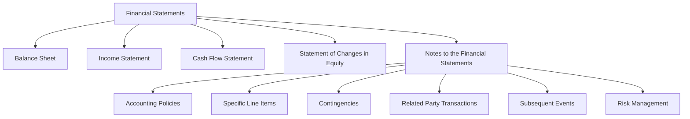

## 5.6 Notes to the Financial Statements

In the realm of accounting, financial statements are the cornerstone of financial reporting, providing a snapshot of a company's financial health. However, these statements alone may not tell the whole story. This is where the notes to the financial statements come into play. These notes are an integral part of financial reporting, offering additional context, explanations, and disclosures that enhance the understanding of the financial data presented. In this section, we will delve into the importance, components, and applications of notes to the financial statements, particularly within the Canadian accounting framework.

### The Importance of Notes to the Financial Statements

Notes to the financial statements serve several critical functions:

1. **Providing Context and Clarity**: Financial statements present numerical data, but without context, these numbers can be misleading or misunderstood. Notes provide the necessary background, explanations, and details that clarify the figures.

2. **Enhancing Transparency**: By disclosing accounting policies, assumptions, and methodologies, notes enhance the transparency of financial reporting, allowing users to understand how the financial statements were prepared.

3. **Facilitating Comparability**: Notes help users compare financial statements across different periods and entities by disclosing changes in accounting policies or estimates.

4. **Supporting Decision-Making**: Investors, creditors, and other stakeholders rely on notes to make informed decisions. They provide insights into potential risks, commitments, and contingencies that may affect a company's future performance.

5. **Compliance with Standards**: Notes are required by accounting standards such as the International Financial Reporting Standards (IFRS) and Accounting Standards for Private Enterprises (ASPE) in Canada. They ensure that financial statements comply with these standards by providing necessary disclosures.

### Key Components of Notes to the Financial Statements

The content and structure of notes to the financial statements can vary depending on the entity and the applicable accounting standards. However, some common components include:

#### 1. **Summary of Significant Accounting Policies**

This section outlines the accounting policies adopted by the entity in preparing the financial statements. It includes information on:

- **Basis of Preparation**: Whether the financial statements are prepared in accordance with IFRS, ASPE, or another framework.
- **Revenue Recognition**: The criteria for recognizing revenue, including timing and measurement.
- **Inventory Valuation**: Methods used to value inventory, such as FIFO, LIFO, or weighted average.
- **Depreciation and Amortization**: Methods and rates used for depreciating tangible assets and amortizing intangible assets.
- **Foreign Currency Translation**: How foreign currency transactions and balances are translated into the reporting currency.

#### 2. **Notes on Specific Financial Statement Items**

These notes provide detailed information about specific line items in the financial statements, such as:

- **Cash and Cash Equivalents**: Composition and restrictions on cash balances.
- **Accounts Receivable**: Aging analysis, allowance for doubtful accounts, and credit risk management.
- **Inventory**: Breakdown by category, write-downs, and obsolescence.
- **Property, Plant, and Equipment**: Details on acquisitions, disposals, and impairments.
- **Liabilities**: Terms and conditions of loans, maturity profiles, and interest rates.

#### 3. **Contingencies and Commitments**

This section discloses potential liabilities or commitments that are not recognized in the financial statements but could impact the entity's financial position. Examples include:

- **Legal Proceedings**: Description of ongoing litigation and potential financial impact.
- **Guarantees**: Details of guarantees provided to third parties.
- **Lease Commitments**: Future lease payments and terms.

#### 4. **Related Party Transactions**

Disclosures about transactions with related parties, such as subsidiaries, associates, or key management personnel, are crucial for understanding potential conflicts of interest or preferential terms.

#### 5. **Subsequent Events**

Events occurring after the reporting period but before the financial statements are authorized for issue may need to be disclosed if they have a significant impact on the financial statements.

#### 6. **Risk Management and Financial Instruments**

Information on how the entity manages financial risks, such as credit risk, liquidity risk, and market risk, is often included. This section may also cover the use of financial instruments and hedging activities.

### Practical Examples and Case Studies

To illustrate the application of notes to the financial statements, let's consider a few practical examples and case studies relevant to the Canadian accounting profession.

#### Example 1: Revenue Recognition

A Canadian technology company, Tech Innovations Inc., recognizes revenue from software sales and subscription services. The notes to the financial statements disclose that revenue from software sales is recognized at the point of sale, while subscription revenue is recognized over the subscription period. This disclosure helps users understand the timing and pattern of revenue recognition.

#### Example 2: Inventory Valuation

A retail company, Maple Retail Ltd., uses the FIFO method to value its inventory. The notes disclose that due to market conditions, the company wrote down obsolete inventory by $500,000 during the year. This information provides insight into the company's inventory management practices and potential impacts on profitability.

#### Example 3: Contingencies

A manufacturing company, Northern Manufacturing Corp., is involved in a legal dispute over patent infringement. The notes disclose that the company has a contingent liability of $1 million, which is not recognized in the financial statements due to uncertainty about the outcome. This disclosure informs users about potential future liabilities.

### Real-World Applications and Regulatory Scenarios

In Canada, the preparation and presentation of notes to the financial statements are governed by standards such as IFRS and ASPE. These standards outline specific disclosure requirements to ensure consistency and comparability across entities.

#### IFRS and ASPE Requirements

- **IFRS**: Under IFRS, entities must provide disclosures that enable users to evaluate the financial position, performance, and cash flows. This includes detailed notes on accounting policies, estimates, and judgments.
  
- **ASPE**: For private enterprises in Canada, ASPE provides a simplified framework with reduced disclosure requirements compared to IFRS. However, key disclosures, such as related party transactions and contingencies, remain essential.

#### Compliance Considerations

Compliance with these standards is crucial for maintaining the integrity and reliability of financial reporting. Non-compliance can lead to penalties, loss of investor confidence, and reputational damage.

### Step-by-Step Guidance for Preparing Notes

Preparing notes to the financial statements involves several steps:

1. **Identify Disclosure Requirements**: Review applicable accounting standards to determine the required disclosures for your entity.

2. **Gather Relevant Information**: Collect data and information related to each disclosure requirement, including accounting policies, financial statement items, and contingencies.

3. **Draft the Notes**: Prepare draft notes, ensuring clarity, accuracy, and completeness. Use plain language and avoid jargon to enhance readability.

4. **Review and Revise**: Review the draft notes with management and auditors to ensure compliance with standards and consistency with the financial statements.

5. **Finalize and Approve**: Finalize the notes and obtain approval from management and the board of directors before issuing the financial statements.

### Diagrams and Visual Aids

To enhance understanding, let's use a Mermaid.js diagram to illustrate the relationship between financial statements and notes.

### Best Practices, Common Pitfalls, and Strategies

#### Best Practices

- **Be Comprehensive**: Ensure all relevant disclosures are included, providing a complete picture of the entity's financial position and performance.
- **Maintain Consistency**: Align notes with the financial statements and ensure consistency across reporting periods.
- **Use Clear Language**: Avoid technical jargon and use plain language to enhance readability.

#### Common Pitfalls

- **Omitting Key Disclosures**: Failing to disclose significant accounting policies or contingencies can mislead users.
- **Inconsistent Information**: Discrepancies between notes and financial statements can undermine credibility.
- **Overloading with Details**: While comprehensive, notes should not overwhelm users with excessive detail.

#### Strategies to Overcome Challenges

- **Regular Updates**: Keep abreast of changes in accounting standards and update notes accordingly.
- **Engage Stakeholders**: Involve management, auditors, and legal advisors in the preparation and review process.
- **Leverage Technology**: Use accounting software to streamline the preparation and presentation of notes.

### References and Additional Resources

For further exploration of notes to the financial statements, consider the following resources:

- **CPA Canada**: Offers guidance on financial reporting and disclosure requirements.
- **IFRS Foundation**: Provides comprehensive resources on IFRS standards and interpretations.
- **Canadian Accounting Standards Board (AcSB)**: Offers updates and resources on ASPE and other Canadian accounting standards.

### Summary

Notes to the financial statements are a vital component of financial reporting, providing the context and clarity needed to understand the financial data presented. By enhancing transparency, facilitating comparability, and supporting decision-making, notes play a crucial role in the financial reporting process. Understanding their components, applications, and preparation is essential for anyone involved in accounting and financial reporting.

## **Ready to Test Your Knowledge?**



### Which of the following is NOT typically included in the notes to the financial statements?

- [ ] Summary of significant accounting policies
- [ ] Contingencies and commitments
- [ ] Detailed marketing strategies
- [ ] Related party transactions

> **Explanation:** Detailed marketing strategies are not typically included in the notes to the financial statements. The notes focus on accounting policies, contingencies, and related party transactions.

### What is the primary purpose of the notes to the financial statements?

- [x] To provide additional context and disclosures
- [ ] To summarize the financial statements
- [ ] To replace the financial statements
- [ ] To provide a detailed analysis of market conditions

> **Explanation:** The primary purpose of the notes is to provide additional context and disclosures that enhance the understanding of the financial statements.

### Which accounting standard requires the disclosure of significant accounting policies?

- [x] IFRS
- [ ] GAAP
- [ ] SOX
- [ ] SEC

> **Explanation:** IFRS requires the disclosure of significant accounting policies in the notes to the financial statements.

### What type of information is typically disclosed in the notes regarding inventory?

- [x] Inventory valuation methods
- [ ] Marketing strategies for inventory
- [ ] Inventory sales projections
- [ ] Inventory color options

> **Explanation:** The notes typically disclose inventory valuation methods, such as FIFO or LIFO, to provide insight into how inventory is accounted for.

### How do notes to the financial statements enhance comparability?

- [x] By disclosing changes in accounting policies
- [ ] By providing detailed sales forecasts
- [x] By explaining accounting estimates
- [ ] By listing all company employees

> **Explanation:** Notes enhance comparability by disclosing changes in accounting policies and explaining accounting estimates, allowing users to compare financial statements across periods and entities.

### What is a common pitfall when preparing notes to the financial statements?

- [ ] Including all relevant disclosures
- [x] Omitting key disclosures
- [ ] Using clear language
- [ ] Aligning notes with financial statements

> **Explanation:** A common pitfall is omitting key disclosures, which can mislead users and undermine the credibility of the financial statements.

### Which section of the notes would disclose a company's involvement in a legal dispute?

- [ ] Summary of significant accounting policies
- [ ] Related party transactions
- [x] Contingencies and commitments
- [ ] Subsequent events

> **Explanation:** The contingencies and commitments section would disclose a company's involvement in a legal dispute, providing information about potential liabilities.

### What is the role of technology in preparing notes to the financial statements?

- [x] To streamline preparation and presentation
- [ ] To replace the need for notes
- [ ] To provide financial forecasts
- [ ] To eliminate the need for accounting standards

> **Explanation:** Technology plays a role in streamlining the preparation and presentation of notes, making the process more efficient and accurate.

### Which of the following is a best practice when preparing notes to the financial statements?

- [x] Use clear language
- [ ] Include excessive details
- [ ] Omit minor disclosures
- [ ] Use technical jargon

> **Explanation:** A best practice is to use clear language to enhance readability and understanding, avoiding technical jargon and excessive details.

### True or False: Notes to the financial statements are optional under IFRS.

- [ ] True
- [x] False

> **Explanation:** False. Notes to the financial statements are not optional under IFRS; they are a required component of financial reporting.


