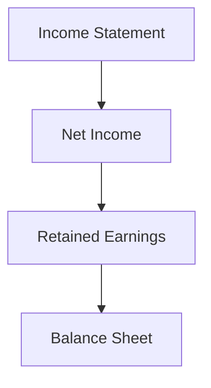

## 5.7 Understanding Financial Statement Relationships

Understanding the relationships between financial statements is crucial for anyone studying accounting, particularly for those preparing for Canadian Accounting Exams. Financial statements are not isolated documents; they are interrelated and provide a comprehensive picture of a company's financial health. This section will explore these relationships, illustrating how the balance sheet, income statement, statement of cash flows, and statement of changes in equity are interconnected. We will also delve into practical examples, real-world applications, and regulatory scenarios relevant to the Canadian context.

### The Core Financial Statements

Before diving into their relationships, let's briefly review the core financial statements:

1. **Balance Sheet**: This statement provides a snapshot of a company's financial position at a specific point in time, detailing assets, liabilities, and equity.

2. **Income Statement**: Also known as the profit and loss statement, it shows a company's financial performance over a period, highlighting revenues, expenses, and net income.

3. **Statement of Cash Flows**: This statement outlines the cash inflows and outflows from operating, investing, and financing activities over a period.

4. **Statement of Changes in Equity**: It details changes in the owners' equity over a period, including investments by and distributions to owners.

### Interconnections Between Financial Statements

#### 1. Balance Sheet and Income Statement

The income statement and balance sheet are closely linked. The net income from the income statement affects the equity section of the balance sheet. Specifically, net income increases retained earnings, which is a component of equity. Conversely, a net loss decreases retained earnings.

**Example**: If a company reports a net income of $50,000, this amount will increase the retained earnings on the balance sheet, assuming no dividends are paid out.

**Mermaid Diagram**: Visualizing the flow from income statement to balance sheet.

#### 2. Income Statement and Statement of Cash Flows

The income statement and statement of cash flows are linked through net income, which is the starting point for the cash flows from operating activities section. Adjustments are made for non-cash items (e.g., depreciation) and changes in working capital to reconcile net income to net cash provided by operating activities.

**Example**: If a company has a net income of $50,000, depreciation of $5,000, and an increase in accounts receivable of $3,000, the cash flow from operating activities would be adjusted to reflect these items.

#### 3. Balance Sheet and Statement of Cash Flows

The statement of cash flows explains changes in the balance sheet from one period to the next. Cash flows from investing and financing activities affect the assets and liabilities sections of the balance sheet.

**Example**: Purchasing equipment for $10,000 would decrease cash and increase fixed assets on the balance sheet, reflected in the investing activities section of the cash flow statement.

#### 4. Statement of Changes in Equity and Other Statements

The statement of changes in equity connects with the income statement through net income and with the balance sheet through equity. It also reflects transactions like dividends, which affect both retained earnings and cash flows.

**Example**: Declaring a dividend of $5,000 reduces retained earnings and is reported as a financing activity outflow in the cash flow statement.

### Practical Examples and Case Studies

#### Case Study: ABC Corporation

**Scenario**: ABC Corporation, a Canadian manufacturing company, reports the following:

- Net income of $100,000
- Depreciation expense of $10,000
- Increase in inventory of $20,000
- Issued new shares worth $50,000
- Paid dividends of $30,000

**Analysis**:

1. **Income Statement Impact**: The net income of $100,000 is reported.
2. **Balance Sheet Impact**: 
   - Retained earnings increase by $70,000 ($100,000 net income - $30,000 dividends).
   - Equity increases by $50,000 from issuing new shares.
3. **Cash Flow Statement Impact**:
   - Operating activities start with $100,000 net income, adjusted for $10,000 depreciation and $20,000 increase in inventory, resulting in $90,000 net cash from operations.
   - Financing activities show $50,000 from issuing shares and $30,000 outflow for dividends.

### Real-World Applications

Understanding these relationships is vital for financial analysis, decision-making, and regulatory compliance. For instance, investors assess a company's profitability and cash flow generation to make informed decisions. Regulators ensure that financial statements comply with standards like IFRS as adopted in Canada.

### Regulatory Scenarios

In Canada, financial statements must adhere to IFRS or ASPE, depending on the entity type. These standards dictate how transactions are recorded and reported, ensuring consistency and transparency.

**Example**: Under IFRS, companies must present a statement of comprehensive income, which includes net income and other comprehensive income, affecting equity.

### Best Practices and Common Pitfalls

#### Best Practices

- **Consistency**: Ensure consistent application of accounting policies across periods.
- **Reconciliation**: Regularly reconcile net income to cash flows to identify discrepancies.
- **Disclosure**: Provide adequate disclosures in notes to explain financial statement relationships.

#### Common Pitfalls

- **Ignoring Non-Cash Items**: Failing to adjust for non-cash items can misrepresent cash flows.
- **Overlooking Changes in Working Capital**: Changes in current assets and liabilities significantly impact cash flows.

### Strategies for Exam Preparation

- **Understand Key Concepts**: Focus on how net income affects retained earnings and cash flows.
- **Practice Reconciliation**: Work through examples of reconciling net income to cash flows.
- **Analyze Case Studies**: Review real-world scenarios to understand financial statement dynamics.

### Summary

Understanding the relationships between financial statements is fundamental for analyzing a company's financial health. These statements provide a comprehensive view when considered together, highlighting the importance of each component in financial reporting and decision-making.

### References and Further Reading

- CPA Canada Handbook: Financial Reporting
- IFRS Standards as adopted in Canada
- Accounting Standards for Private Enterprises (ASPE)

### Ready to Test Your Knowledge?



### How does net income affect the balance sheet?

- [x] It increases retained earnings.
- [ ] It decreases liabilities.
- [ ] It has no impact on assets.
- [ ] It reduces cash.

> **Explanation:** Net income increases retained earnings, which is part of equity on the balance sheet.

### What is the starting point for the cash flows from operating activities section?

- [x] Net income
- [ ] Total revenue
- [ ] Gross profit
- [ ] Cash balance

> **Explanation:** The cash flows from operating activities section starts with net income, which is then adjusted for non-cash items and changes in working capital.

### Which statement explains changes in the balance sheet from one period to the next?

- [x] Statement of Cash Flows
- [ ] Income Statement
- [ ] Statement of Changes in Equity
- [ ] Notes to Financial Statements

> **Explanation:** The statement of cash flows explains changes in the balance sheet by detailing cash inflows and outflows.

### What is the impact of declaring dividends on financial statements?

- [x] It reduces retained earnings.
- [ ] It increases net income.
- [ ] It affects total assets.
- [ ] It has no impact on cash flows.

> **Explanation:** Declaring dividends reduces retained earnings and is reported as a financing activity outflow in the cash flow statement.

### Which financial statement is directly affected by issuing new shares?

- [x] Balance Sheet
- [ ] Income Statement
- [ ] Statement of Cash Flows
- [ ] Notes to Financial Statements

> **Explanation:** Issuing new shares increases equity on the balance sheet.

### What is the effect of depreciation on the cash flow statement?

- [x] It is added back to net income in operating activities.
- [ ] It decreases cash in investing activities.
- [ ] It increases liabilities.
- [ ] It affects financing activities.

> **Explanation:** Depreciation is a non-cash expense added back to net income in the operating activities section of the cash flow statement.

### How are changes in working capital reflected in financial statements?

- [x] They adjust net income in the cash flow statement.
- [ ] They directly affect equity.
- [ ] They are recorded as expenses.
- [ ] They impact long-term liabilities.

> **Explanation:** Changes in working capital adjust net income in the cash flow statement to reflect actual cash flows.

### What is the relationship between the income statement and statement of changes in equity?

- [x] Net income affects retained earnings.
- [ ] Revenues are reported as equity.
- [ ] Expenses increase liabilities.
- [ ] Dividends are recorded as income.

> **Explanation:** Net income from the income statement increases retained earnings in the statement of changes in equity.

### Which statement provides a snapshot of a company's financial position at a specific point in time?

- [x] Balance Sheet
- [ ] Income Statement
- [ ] Statement of Cash Flows
- [ ] Statement of Changes in Equity

> **Explanation:** The balance sheet provides a snapshot of a company's financial position, detailing assets, liabilities, and equity.

### True or False: The statement of cash flows includes cash inflows and outflows from operating, investing, and financing activities.

- [x] True
- [ ] False

> **Explanation:** The statement of cash flows details cash inflows and outflows from operating, investing, and financing activities, providing insight into a company's cash management.


