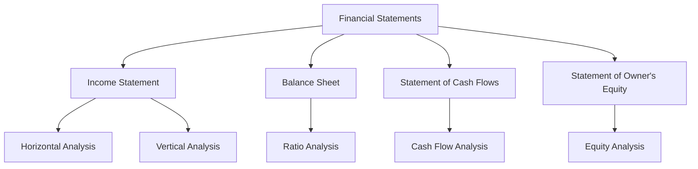

## 5.9 Analyzing Financial Statements

Financial statement analysis is a critical skill for accountants, investors, and business managers. It involves evaluating the financial health of a company by interpreting its financial statements. This section will guide you through the fundamental techniques used to analyze financial statements, focusing on the Canadian accounting environment and standards.

### Understanding Financial Statements

Before diving into analysis, it's essential to understand the primary financial statements:

- **Income Statement**: Shows the company's revenues and expenses over a specific period, resulting in net income or loss.
- **Balance Sheet**: Provides a snapshot of the company's assets, liabilities, and equity at a particular point in time.
- **Statement of Cash Flows**: Illustrates the cash inflows and outflows from operating, investing, and financing activities.
- **Statement of Owner's Equity**: Details changes in the equity section of the balance sheet over a period.

### Objectives of Financial Statement Analysis

The primary objectives of financial statement analysis include:

1. **Assessing Profitability**: Understanding how well a company generates profit relative to its sales, assets, or equity.
2. **Evaluating Liquidity**: Determining the company's ability to meet short-term obligations.
3. **Analyzing Solvency**: Assessing the company's capacity to meet long-term liabilities.
4. **Understanding Operational Efficiency**: Evaluating how effectively a company uses its resources.
5. **Assessing Market Valuation**: Understanding the company's value in the market.

### Techniques for Financial Statement Analysis

#### 1. Horizontal Analysis

Horizontal analysis, also known as trend analysis, involves comparing financial data over multiple periods. This technique helps identify trends and growth patterns.

**Example**: If a company's revenue increased from $1 million in 2022 to $1.2 million in 2023, the horizontal analysis would show a 20% increase in revenue.

#### 2. Vertical Analysis

Vertical analysis involves expressing each item in a financial statement as a percentage of a base figure. This technique is useful for comparing companies of different sizes.

**Example**: On an income statement, each expense might be expressed as a percentage of total sales.

#### 3. Ratio Analysis

Ratio analysis involves calculating and interpreting various financial ratios to assess a company's performance. Key ratios include:

- **Liquidity Ratios**: Measure the company's ability to meet short-term obligations (e.g., Current Ratio, Quick Ratio).
- **Solvency Ratios**: Assess the company's long-term financial stability (e.g., Debt to Equity Ratio, Interest Coverage Ratio).
- **Profitability Ratios**: Evaluate the company's ability to generate profit (e.g., Gross Profit Margin, Return on Assets).
- **Efficiency Ratios**: Measure how effectively the company uses its assets (e.g., Inventory Turnover, Accounts Receivable Turnover).
- **Market Value Ratios**: Provide insights into the company's market valuation (e.g., Earnings Per Share, Price to Earnings Ratio).

#### 4. Cash Flow Analysis

Analyzing the statement of cash flows helps assess the company's liquidity, financial flexibility, and overall financial performance. It involves examining cash flows from operating, investing, and financing activities.

**Example**: A company with strong operating cash flow but negative cash flow from investing activities might be investing heavily in growth.

### Real-World Applications and Regulatory Scenarios

In Canada, financial statement analysis must comply with the International Financial Reporting Standards (IFRS) or the Accounting Standards for Private Enterprises (ASPE). Understanding these standards is crucial for accurate analysis.

#### Case Study: Analyzing a Canadian Retail Company

Consider a Canadian retail company that reports the following:

- **Revenue Growth**: The company shows a consistent 10% annual growth in revenue.
- **Profitability**: The gross profit margin is stable at 40%, but the net profit margin has declined from 10% to 8% over the past three years.
- **Liquidity**: The current ratio is 1.5, indicating adequate liquidity.
- **Solvency**: The debt to equity ratio is 0.8, suggesting a balanced capital structure.

**Analysis**: The company is growing steadily, but the declining net profit margin may indicate rising operating costs or increased competition. The liquidity and solvency ratios suggest financial stability, but further investigation into cost management is recommended.

### Step-by-Step Guidance for Financial Statement Analysis

1. **Gather Financial Statements**: Obtain the company's income statement, balance sheet, statement of cash flows, and statement of owner's equity.
2. **Perform Horizontal Analysis**: Compare financial data across multiple periods to identify trends.
3. **Conduct Vertical Analysis**: Express each item as a percentage of a base figure to facilitate comparison.
4. **Calculate Financial Ratios**: Use key ratios to assess liquidity, solvency, profitability, efficiency, and market value.
5. **Analyze Cash Flows**: Examine cash flows from operating, investing, and financing activities.
6. **Interpret Results**: Draw conclusions based on the analysis and identify areas for improvement or further investigation.

### Diagrams and Visual Aids

To enhance understanding, let's use a Mermaid.js diagram to illustrate the relationship between financial statements and analysis techniques:

### Best Practices and Common Pitfalls

- **Best Practices**: Regularly update your analysis with the latest financial data, and use multiple techniques for a comprehensive view.
- **Common Pitfalls**: Avoid relying solely on ratios without considering the broader context, and be cautious of one-time events that may skew results.

### References to Canadian Accounting Standards

- **IFRS**: International standards adopted by Canadian public companies.
- **ASPE**: Standards for private enterprises in Canada.
- **CPA Canada**: Provides guidelines and resources for financial statement analysis.

### Encouraging Practice and Application

To master financial statement analysis, practice with real-world financial statements and apply the techniques discussed. Consider using online resources, practice exams, and additional study materials to deepen your understanding.

### Summary

Financial statement analysis is a vital skill for interpreting a company's financial health. By mastering techniques such as horizontal and vertical analysis, ratio analysis, and cash flow analysis, you can make informed decisions and provide valuable insights. Remember to consider the context and comply with Canadian accounting standards for accurate analysis.

## **Ready to Test Your Knowledge?**



### What is the primary purpose of financial statement analysis?

- [x] To assess a company's financial health
- [ ] To prepare financial statements
- [ ] To audit financial records
- [ ] To calculate taxes

> **Explanation:** The primary purpose of financial statement analysis is to assess a company's financial health by interpreting its financial data.

### Which analysis technique involves comparing financial data over multiple periods?

- [x] Horizontal Analysis
- [ ] Vertical Analysis
- [ ] Ratio Analysis
- [ ] Cash Flow Analysis

> **Explanation:** Horizontal analysis involves comparing financial data over multiple periods to identify trends and growth patterns.

### What does the current ratio measure?

- [x] Liquidity
- [ ] Profitability
- [ ] Solvency
- [ ] Efficiency

> **Explanation:** The current ratio measures a company's liquidity, or its ability to meet short-term obligations.

### Which financial statement provides a snapshot of a company's assets, liabilities, and equity?

- [x] Balance Sheet
- [ ] Income Statement
- [ ] Statement of Cash Flows
- [ ] Statement of Owner's Equity

> **Explanation:** The balance sheet provides a snapshot of a company's assets, liabilities, and equity at a particular point in time.

### What is the debt to equity ratio used to assess?

- [x] Solvency
- [ ] Liquidity
- [ ] Profitability
- [ ] Market Value

> **Explanation:** The debt to equity ratio is used to assess a company's solvency, or its long-term financial stability.

### Which statement is true about vertical analysis?

- [x] It expresses each item as a percentage of a base figure.
- [ ] It compares financial data over multiple periods.
- [ ] It calculates financial ratios.
- [ ] It analyzes cash flows.

> **Explanation:** Vertical analysis expresses each item in a financial statement as a percentage of a base figure, facilitating comparison.

### What is the significance of the gross profit margin?

- [x] It indicates the percentage of revenue that exceeds the cost of goods sold.
- [ ] It measures the company's liquidity.
- [ ] It assesses the company's solvency.
- [ ] It evaluates market value.

> **Explanation:** The gross profit margin indicates the percentage of revenue that exceeds the cost of goods sold, reflecting profitability.

### Which financial statement analysis technique involves calculating and interpreting various financial ratios?

- [x] Ratio Analysis
- [ ] Horizontal Analysis
- [ ] Vertical Analysis
- [ ] Cash Flow Analysis

> **Explanation:** Ratio analysis involves calculating and interpreting various financial ratios to assess a company's performance.

### What does cash flow analysis help assess?

- [x] Liquidity and financial flexibility
- [ ] Profitability
- [ ] Market valuation
- [ ] Operational efficiency

> **Explanation:** Cash flow analysis helps assess a company's liquidity, financial flexibility, and overall financial performance.

### True or False: Financial statement analysis must comply with IFRS or ASPE in Canada.

- [x] True
- [ ] False

> **Explanation:** In Canada, financial statement analysis must comply with the International Financial Reporting Standards (IFRS) or the Accounting Standards for Private Enterprises (ASPE).


