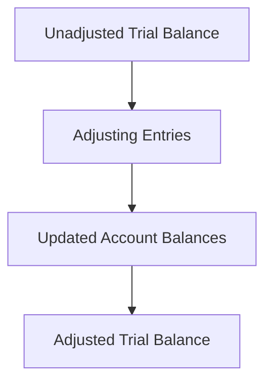

## 6.3 Preparing the Adjusted Trial Balance

The adjusted trial balance is a crucial step in the accounting cycle, serving as the foundation for preparing accurate financial statements. This section will guide you through the process of preparing the adjusted trial balance, ensuring you understand its importance, the adjustments involved, and how it fits into the broader accounting framework. By mastering this topic, you'll be well-equipped to tackle related questions on the Canadian accounting exams and apply these principles in professional practice.

### Understanding the Adjusted Trial Balance

The adjusted trial balance is a list of all accounts and their balances after adjusting entries have been made. It ensures that the total debits equal total credits, reflecting the adjustments necessary for accurate financial reporting. These adjustments are made to account for accrued and deferred items, ensuring that revenues and expenses are recorded in the correct accounting period.

#### Key Objectives of the Adjusted Trial Balance

1. **Accuracy**: Ensures that all financial transactions are recorded accurately and completely.
2. **Compliance**: Aligns financial reporting with accounting standards such as IFRS and ASPE.
3. **Preparation**: Serves as a basis for preparing financial statements, including the income statement, balance sheet, and statement of cash flows.

### Steps to Prepare the Adjusted Trial Balance

#### Step 1: Gather Information

Before preparing the adjusted trial balance, gather all necessary information, including:

- **Unadjusted Trial Balance**: The starting point, listing all account balances before adjustments.
- **Adjusting Entries**: Entries made to update account balances for accrued and deferred items.

#### Step 2: Record Adjusting Entries

Adjusting entries are made to ensure that revenues and expenses are recognized in the period they occur, following the accrual basis of accounting. Common types of adjusting entries include:

- **Accrued Revenues**: Revenues earned but not yet received or recorded.
- **Accrued Expenses**: Expenses incurred but not yet paid or recorded.
- **Deferred Revenues**: Revenues received in advance but not yet earned.
- **Deferred Expenses**: Expenses paid in advance but not yet incurred.
- **Depreciation**: Allocation of the cost of tangible assets over their useful lives.

#### Example of Adjusting Entries

Consider a company that pays $1,200 for a one-year insurance policy on January 1. By December 31, $1,100 of the policy has expired. The adjusting entry would be:

- **Debit Insurance Expense**: $1,100
- **Credit Prepaid Insurance**: $1,100

This entry reflects the expense incurred during the year.

#### Step 3: Update Account Balances

After recording adjusting entries, update the account balances in the ledger. This step ensures that all accounts reflect the adjustments made.

#### Step 4: Prepare the Adjusted Trial Balance

List all accounts and their updated balances in the adjusted trial balance. Ensure that total debits equal total credits, confirming the accuracy of the adjustments.

### Importance of the Adjusted Trial Balance

The adjusted trial balance is essential for several reasons:

1. **Foundation for Financial Statements**: Provides the data needed to prepare accurate financial statements.
2. **Error Detection**: Helps identify errors in the accounting records, ensuring accuracy.
3. **Compliance with Standards**: Ensures that financial reporting complies with accounting standards, such as IFRS and ASPE.

### Common Adjustments and Their Impact

#### Accrued Revenues and Expenses

Accrued revenues and expenses are recognized when earned or incurred, regardless of when cash is received or paid. This adjustment ensures that financial statements reflect the true financial position of the company.

#### Deferred Revenues and Expenses

Deferred revenues and expenses are initially recorded as liabilities or assets, respectively, and recognized as income or expense over time. This adjustment aligns financial reporting with the matching principle.

#### Depreciation

Depreciation allocates the cost of tangible assets over their useful lives, reflecting the consumption of the asset's economic benefits. This adjustment impacts both the income statement and the balance sheet.

### Practical Example: Preparing an Adjusted Trial Balance

Let's consider a practical example to illustrate the preparation of an adjusted trial balance.

#### Scenario

ABC Corp. has the following unadjusted trial balance as of December 31:

| Account               | Debit ($) | Credit ($) |
|-----------------------|-----------|------------|
| Cash                  | 5,000     |            |
| Accounts Receivable   | 3,000     |            |
| Prepaid Insurance     | 1,200     |            |
| Equipment             | 10,000    |            |
| Accumulated Depreciation |         | 2,000      |
| Accounts Payable      |           | 1,500      |
| Unearned Revenue      |           | 1,000      |
| Common Stock          |           | 5,000      |
| Retained Earnings     |           | 8,700      |
| Service Revenue       |           | 7,000      |
| Salaries Expense      | 2,500     |            |
| Rent Expense          | 1,500     |            |

#### Adjusting Entries

1. **Accrued Salaries**: Salaries of $500 are accrued at year-end.
   - Debit Salaries Expense: $500
   - Credit Salaries Payable: $500

2. **Depreciation**: Equipment depreciation of $1,000.
   - Debit Depreciation Expense: $1,000
   - Credit Accumulated Depreciation: $1,000

3. **Insurance Expense**: $1,100 of prepaid insurance has expired.
   - Debit Insurance Expense: $1,100
   - Credit Prepaid Insurance: $1,100

4. **Unearned Revenue**: $500 of unearned revenue is earned.
   - Debit Unearned Revenue: $500
   - Credit Service Revenue: $500

#### Adjusted Trial Balance

| Account               | Debit ($) | Credit ($) |
|-----------------------|-----------|------------|
| Cash                  | 5,000     |            |
| Accounts Receivable   | 3,000     |            |
| Prepaid Insurance     | 100       |            |
| Equipment             | 10,000    |            |
| Accumulated Depreciation |         | 3,000      |
| Accounts Payable      |           | 1,500      |
| Salaries Payable      |           | 500        |
| Unearned Revenue      |           | 500        |
| Common Stock          |           | 5,000      |
| Retained Earnings     |           | 8,700      |
| Service Revenue       |           | 7,500      |
| Salaries Expense      | 3,000     |            |
| Rent Expense          | 1,500     |            |
| Insurance Expense     | 1,100     |            |
| Depreciation Expense  | 1,000     |            |

### Challenges and Best Practices

#### Common Challenges

1. **Complex Adjustments**: Some adjustments, such as those involving depreciation or accruals, can be complex and require careful calculation.
2. **Error Detection**: Identifying and correcting errors in the trial balance can be challenging, especially in large organizations.

#### Best Practices

1. **Regular Review**: Regularly review and reconcile accounts to ensure accuracy.
2. **Detailed Documentation**: Maintain detailed documentation of all adjustments for transparency and compliance.
3. **Use of Software**: Utilize accounting software to automate and streamline the preparation of the adjusted trial balance.

### Real-World Applications

In practice, the adjusted trial balance is used by accountants and auditors to ensure the accuracy of financial statements. It is a critical tool for financial analysis, budgeting, and decision-making, providing a snapshot of a company's financial position at a specific point in time.

### Regulatory Considerations

In Canada, financial reporting must comply with standards such as IFRS and ASPE. The adjusted trial balance plays a key role in ensuring compliance with these standards, providing the foundation for accurate and transparent financial reporting.

### Exam Tips and Strategies

1. **Understand Adjustments**: Focus on understanding the types of adjustments and their impact on the trial balance.
2. **Practice Problems**: Work through practice problems to reinforce your understanding and improve your accuracy.
3. **Time Management**: Allocate sufficient time to review and prepare the adjusted trial balance during exams.

### Conclusion

Preparing the adjusted trial balance is a fundamental skill for accountants, essential for accurate financial reporting and compliance with accounting standards. By mastering this process, you'll be well-prepared for the Canadian accounting exams and equipped to apply these principles in your professional career.

---

## **Ready to Test Your Knowledge?**



### What is the primary purpose of the adjusted trial balance?

- [x] To ensure that total debits equal total credits after adjustments
- [ ] To prepare the unadjusted trial balance
- [ ] To calculate net income
- [ ] To record initial transactions

> **Explanation:** The adjusted trial balance ensures that total debits equal total credits after adjustments, serving as a basis for preparing financial statements.

### Which of the following is an example of an adjusting entry?

- [x] Accrued salaries
- [ ] Cash sales
- [ ] Purchase of equipment
- [ ] Payment of utilities

> **Explanation:** Accrued salaries are an example of an adjusting entry, recognizing expenses incurred but not yet paid.

### How does depreciation affect the adjusted trial balance?

- [x] Increases expenses and accumulated depreciation
- [ ] Decreases cash and increases expenses
- [ ] Increases liabilities and decreases assets
- [ ] Decreases revenue and increases liabilities

> **Explanation:** Depreciation increases expenses and accumulated depreciation, reflecting the allocation of asset cost over time.

### What is the impact of recording accrued revenues?

- [x] Increases assets and revenues
- [ ] Decreases liabilities and expenses
- [ ] Increases liabilities and decreases assets
- [ ] Decreases assets and revenues

> **Explanation:** Recording accrued revenues increases assets (accounts receivable) and revenues, recognizing income earned but not yet received.

### Which account is affected by deferred revenue adjustments?

- [x] Unearned revenue
- [ ] Accounts payable
- [x] Service revenue
- [ ] Cash

> **Explanation:** Deferred revenue adjustments affect unearned revenue and service revenue, recognizing income earned over time.

### What is the role of the adjusted trial balance in financial reporting?

- [x] Provides data for preparing financial statements
- [ ] Records initial transactions
- [ ] Calculates tax liabilities
- [ ] Manages cash flow

> **Explanation:** The adjusted trial balance provides data for preparing financial statements, ensuring accuracy and compliance.

### Which of the following is a common challenge in preparing the adjusted trial balance?

- [x] Complex adjustments
- [ ] Recording cash transactions
- [x] Error detection
- [ ] Calculating sales tax

> **Explanation:** Complex adjustments and error detection are common challenges in preparing the adjusted trial balance.

### How can accounting software assist in preparing the adjusted trial balance?

- [x] Automates calculations and adjustments
- [ ] Records manual entries
- [ ] Prepares tax returns
- [ ] Manages payroll

> **Explanation:** Accounting software automates calculations and adjustments, streamlining the preparation of the adjusted trial balance.

### What is the impact of recording deferred expenses?

- [x] Decreases assets and increases expenses
- [ ] Increases liabilities and decreases expenses
- [ ] Increases assets and revenues
- [ ] Decreases liabilities and increases revenues

> **Explanation:** Recording deferred expenses decreases assets (prepaid expenses) and increases expenses, recognizing costs incurred over time.

### True or False: The adjusted trial balance is prepared before adjusting entries are recorded.

- [ ] True
- [x] False

> **Explanation:** False. The adjusted trial balance is prepared after adjusting entries are recorded to ensure accuracy.


