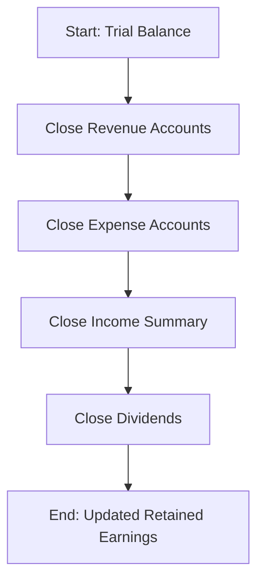

## 6.5 Closing Entries

Closing entries are a fundamental aspect of the accounting cycle, representing the final step that ensures the accuracy and completeness of financial records. This process involves closing temporary accounts to prepare for the next accounting period, ensuring that revenue and expense accounts begin with a zero balance. In this section, we will delve into the purpose, process, and significance of closing entries, providing you with the knowledge and skills necessary to master this critical accounting function.

### Understanding the Purpose of Closing Entries

Closing entries serve several key purposes in the accounting cycle:

1. **Resetting Temporary Accounts:** Temporary accounts, such as revenues, expenses, and dividends, are closed at the end of each accounting period to reset their balances to zero. This allows for the accurate tracking of financial performance in subsequent periods.

2. **Transferring Balances to Permanent Accounts:** The balances from temporary accounts are transferred to permanent accounts, specifically the retained earnings account, to reflect the cumulative effect of the period's financial activities on the company's equity.

3. **Ensuring Accurate Financial Reporting:** By closing temporary accounts, businesses ensure that their financial statements accurately reflect the results of operations for a specific period, providing stakeholders with reliable information for decision-making.

### The Closing Process: Step-by-Step Guide

The closing process involves several steps, each crucial for ensuring the accuracy and integrity of financial records. Below is a detailed guide to executing closing entries:

#### Step 1: Close Revenue Accounts

The first step in the closing process is to close all revenue accounts. This involves transferring the balance of each revenue account to the Income Summary account. The Income Summary account is a temporary account used solely for the closing process.

- **Example:** If a company has a revenue account with a balance of $100,000, the closing entry would involve debiting the revenue account for $100,000 and crediting the Income Summary account for the same amount.

#### Step 2: Close Expense Accounts

Next, close all expense accounts by transferring their balances to the Income Summary account. This step ensures that all expenses incurred during the period are accounted for in determining net income.

- **Example:** If a company has expense accounts totaling $70,000, the closing entry would involve crediting each expense account for its respective balance and debiting the Income Summary account for the total amount of $70,000.

#### Step 3: Close the Income Summary Account

After closing revenue and expense accounts, the Income Summary account will reflect the net income or loss for the period. The next step is to close the Income Summary account to the retained earnings account.

- **Example:** If the Income Summary account shows a net income of $30,000 (revenues of $100,000 minus expenses of $70,000), the closing entry would involve debiting the Income Summary account for $30,000 and crediting the retained earnings account for the same amount.

#### Step 4: Close Dividends (or Withdrawals) Account

Finally, close the dividends account (or withdrawals account for sole proprietorships and partnerships) to the retained earnings account. This step reflects the distribution of earnings to shareholders or owners.

- **Example:** If a company declared dividends of $5,000, the closing entry would involve debiting the retained earnings account for $5,000 and crediting the dividends account for the same amount.

### Practical Example: Closing Entries in Action

To illustrate the closing process, let's consider a practical example involving a fictional company, Maple Leaf Enterprises, for the fiscal year ending December 31, 2023.

#### Trial Balance Before Closing Entries

| Account               | Debit ($) | Credit ($) |
|-----------------------|-----------|------------|
| Cash                  | 15,000    |            |
| Accounts Receivable   | 10,000    |            |
| Inventory             | 20,000    |            |
| Equipment             | 50,000    |            |
| Accumulated Depreciation |         | 10,000     |
| Accounts Payable      |           | 5,000      |
| Revenue               |           | 100,000    |
| Expenses              | 70,000    |            |
| Dividends             | 5,000     |            |
| Retained Earnings     |           | 5,000      |

#### Step-by-Step Closing Entries

1. **Close Revenue Accounts:**

   ```
   Debit Revenue: $100,000
   Credit Income Summary: $100,000
   ```

2. **Close Expense Accounts:**

   ```
   Debit Income Summary: $70,000
   Credit Expenses: $70,000
   ```

3. **Close Income Summary Account:**

   ```
   Debit Income Summary: $30,000
   Credit Retained Earnings: $30,000
   ```

4. **Close Dividends Account:**

   ```
   Debit Retained Earnings: $5,000
   Credit Dividends: $5,000
   ```

#### Trial Balance After Closing Entries

| Account               | Debit ($) | Credit ($) |
|-----------------------|-----------|------------|
| Cash                  | 15,000    |            |
| Accounts Receivable   | 10,000    |            |
| Inventory             | 20,000    |            |
| Equipment             | 50,000    |            |
| Accumulated Depreciation |         | 10,000     |
| Accounts Payable      |           | 5,000      |
| Retained Earnings     |           | 30,000     |

### Importance of Closing Entries

Closing entries are vital for maintaining accurate financial records and ensuring compliance with accounting standards. They provide a clear demarcation between accounting periods, allowing businesses to accurately measure performance and make informed decisions.

#### Compliance with Canadian Accounting Standards

In Canada, closing entries must comply with the Accounting Standards for Private Enterprises (ASPE) or International Financial Reporting Standards (IFRS) as adopted in Canada. These standards ensure consistency and comparability in financial reporting, which is crucial for stakeholders such as investors, creditors, and regulatory bodies.

### Common Challenges and Best Practices

While closing entries are a routine part of the accounting cycle, they can present challenges, particularly for those new to accounting. Below are some common challenges and best practices to overcome them:

#### Common Challenges

- **Complex Chart of Accounts:** A complex chart of accounts can make it difficult to identify and close all temporary accounts accurately.
- **Errors in Journal Entries:** Mistakes in journal entries can lead to incorrect balances in the Income Summary and retained earnings accounts.
- **Time Constraints:** Closing entries must be completed promptly to prepare financial statements for stakeholders.

#### Best Practices

- **Review Chart of Accounts:** Regularly review and update the chart of accounts to ensure it reflects the company's current operations and structure.
- **Double-Check Journal Entries:** Carefully review journal entries for accuracy before posting them to the ledger.
- **Use Accounting Software:** Leverage accounting software to automate the closing process and reduce the risk of errors.

### Real-World Applications and Regulatory Scenarios

Closing entries have significant implications in real-world accounting and regulatory scenarios. For example, publicly traded companies must adhere to strict reporting timelines and standards, making the accurate and timely completion of closing entries essential for compliance with securities regulations.

#### Case Study: Closing Entries in a Publicly Traded Company

Consider a publicly traded company, Northern Lights Inc., which must prepare its financial statements in accordance with IFRS. The company faces tight reporting deadlines and must ensure that its closing entries are accurate and compliant with regulatory requirements.

- **Challenge:** Northern Lights Inc. has a complex chart of accounts with numerous revenue and expense accounts, increasing the risk of errors in closing entries.
- **Solution:** The company implements accounting software with automated closing features, reducing the time and effort required to complete the closing process and ensuring compliance with IFRS.

### Diagrams and Visual Aids

To enhance understanding, let's visualize the closing process using a flowchart:



### Summary and Key Takeaways

Closing entries are a critical component of the accounting cycle, ensuring the accuracy and completeness of financial records. By closing temporary accounts and transferring their balances to permanent accounts, businesses can accurately measure financial performance and comply with accounting standards.

- **Purpose:** Reset temporary accounts, transfer balances to retained earnings, and ensure accurate financial reporting.
- **Process:** Close revenue accounts, close expense accounts, close the Income Summary account, and close dividends.
- **Importance:** Essential for compliance with Canadian accounting standards and accurate financial reporting.

### Exam Preparation Tips

- **Understand the Purpose:** Grasp the reasons behind closing entries and their impact on financial statements.
- **Practice Journal Entries:** Familiarize yourself with the journal entries involved in the closing process through practice problems.
- **Review Standards:** Study relevant Canadian accounting standards, such as ASPE and IFRS, to understand their implications for closing entries.

### Ready to Test Your Knowledge?



### What is the primary purpose of closing entries in accounting?

- [x] To reset temporary accounts to zero
- [ ] To record new transactions
- [ ] To adjust permanent accounts
- [ ] To prepare the cash flow statement

> **Explanation:** Closing entries reset temporary accounts to zero, allowing for accurate tracking of financial performance in the next period.

### Which account is used as an intermediary during the closing process?

- [x] Income Summary
- [ ] Cash
- [ ] Accounts Receivable
- [ ] Retained Earnings

> **Explanation:** The Income Summary account is used as an intermediary to transfer balances from temporary accounts to retained earnings.

### What type of account is the Dividends account considered?

- [ ] Permanent
- [ ] Revenue
- [x] Temporary
- [ ] Liability

> **Explanation:** The Dividends account is a temporary account that is closed to retained earnings at the end of the period.

### In the closing process, which account is credited when closing revenue accounts?

- [ ] Cash
- [x] Income Summary
- [ ] Retained Earnings
- [ ] Accounts Payable

> **Explanation:** Revenue accounts are credited to the Income Summary account during the closing process.

### What is the result of closing the Income Summary account?

- [x] Net income or loss is transferred to retained earnings
- [ ] Revenue accounts are reset
- [ ] Expense accounts are reset
- [ ] Dividends are declared

> **Explanation:** Closing the Income Summary account transfers net income or loss to retained earnings, reflecting the period's financial results.

### What is the final step in the closing process?

- [ ] Closing revenue accounts
- [ ] Closing expense accounts
- [ ] Closing the Income Summary account
- [x] Closing the Dividends account

> **Explanation:** The final step is closing the Dividends account to retained earnings, completing the closing process.

### Which of the following is a common challenge in the closing process?

- [x] Complex chart of accounts
- [ ] Lack of financial statements
- [ ] Excess cash flow
- [ ] Overstated liabilities

> **Explanation:** A complex chart of accounts can make it difficult to identify and close all temporary accounts accurately.

### What is a best practice for ensuring accurate closing entries?

- [ ] Ignore temporary accounts
- [x] Double-check journal entries
- [ ] Use manual calculations
- [ ] Avoid using accounting software

> **Explanation:** Double-checking journal entries ensures accuracy before posting them to the ledger.

### How does accounting software assist in the closing process?

- [x] Automates the closing process and reduces errors
- [ ] Increases manual workload
- [ ] Eliminates the need for financial statements
- [ ] Creates new temporary accounts

> **Explanation:** Accounting software automates the closing process, reducing the risk of errors and saving time.

### True or False: Closing entries are only necessary for publicly traded companies.

- [ ] True
- [x] False

> **Explanation:** Closing entries are necessary for all types of businesses to ensure accurate financial reporting and compliance with accounting standards.


