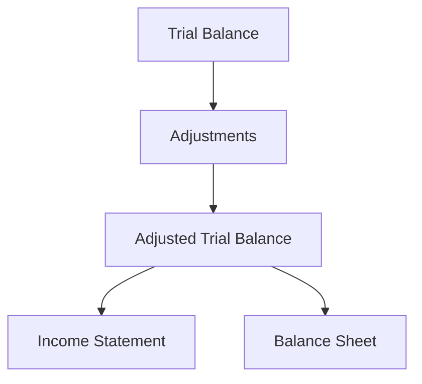

## 6.7 The Accounting Worksheet

The accounting worksheet is an essential tool in the accounting cycle that helps accountants organize and prepare financial statements. It serves as a bridge between the end of the accounting period and the preparation of financial statements. This section will guide you through the purpose, structure, and application of the accounting worksheet, providing you with the knowledge and skills necessary to utilize this tool effectively in both exam settings and professional practice.

### Understanding the Accounting Worksheet

The accounting worksheet is a multi-column document used by accountants to ensure that all financial transactions are accurately recorded and that the financial statements are prepared correctly. It is not a formal financial statement but rather a tool used to facilitate the preparation of formal financial statements.

#### Purpose of the Accounting Worksheet

1. **Organization of Financial Data**: The worksheet organizes all financial data in one place, making it easier to prepare financial statements.
2. **Error Detection**: It helps identify and correct errors before the financial statements are finalized.
3. **Adjustment Preparation**: The worksheet is used to prepare and record adjusting entries.
4. **Trial Balance Verification**: It ensures that the debits and credits are balanced before preparing the financial statements.
5. **Facilitation of Financial Statement Preparation**: The worksheet simplifies the process of preparing the income statement, balance sheet, and other financial reports.

### Structure of the Accounting Worksheet

An accounting worksheet typically consists of several columns, each serving a specific purpose in the accounting process. The standard columns include:

1. **Trial Balance**: Lists all account balances from the ledger.
2. **Adjustments**: Records any necessary adjustments to account balances.
3. **Adjusted Trial Balance**: Reflects account balances after adjustments.
4. **Income Statement**: Contains revenue and expense accounts to calculate net income or loss.
5. **Balance Sheet**: Includes asset, liability, and equity accounts to prepare the balance sheet.

Below is a simplified representation of an accounting worksheet structure:

### Steps in Preparing an Accounting Worksheet

Preparing an accounting worksheet involves several steps, each crucial for ensuring the accuracy and completeness of financial statements.

#### Step 1: Prepare the Trial Balance

The first step is to prepare the trial balance. This involves listing all the account balances from the general ledger. The trial balance ensures that the total debits equal the total credits, which is a fundamental principle of double-entry bookkeeping.

#### Step 2: Record Adjustments

Adjusting entries are necessary to update account balances to reflect the true financial position of the business. Common adjustments include:

- **Accrued Revenues**: Revenues earned but not yet recorded.
- **Accrued Expenses**: Expenses incurred but not yet recorded.
- **Prepaid Expenses**: Expenses paid in advance that need to be adjusted for the period.
- **Depreciation**: Allocation of the cost of tangible assets over their useful lives.

#### Step 3: Prepare the Adjusted Trial Balance

After recording adjustments, prepare the adjusted trial balance. This step involves updating the trial balance with the adjustments to ensure that the debits still equal the credits.

#### Step 4: Prepare the Income Statement

Using the adjusted trial balance, prepare the income statement. This involves listing all revenue and expense accounts to determine the net income or loss for the period.

#### Step 5: Prepare the Balance Sheet

The balance sheet is prepared using the adjusted trial balance. It includes all asset, liability, and equity accounts, providing a snapshot of the company's financial position at the end of the period.

### Practical Example: Preparing an Accounting Worksheet

Let's consider a practical example to illustrate the preparation of an accounting worksheet.

**Scenario**: ABC Corporation is preparing its financial statements for the year ended December 31, 2023. The following trial balance and adjustments are provided:

**Trial Balance (as of December 31, 2023):**

- Cash: $10,000
- Accounts Receivable: $5,000
- Supplies: $1,000
- Equipment: $20,000
- Accumulated Depreciation: $4,000
- Accounts Payable: $3,000
- Common Stock: $10,000
- Retained Earnings: $15,000
- Service Revenue: $30,000
- Salaries Expense: $8,000
- Rent Expense: $2,000

**Adjustments:**

1. Depreciation Expense for Equipment: $2,000
2. Supplies on Hand: $200
3. Accrued Salaries: $1,000

**Step-by-Step Preparation:**

1. **Trial Balance**: List all account balances.
2. **Adjustments**: Record the adjustments.
   - Depreciation Expense: Debit $2,000, Credit Accumulated Depreciation $2,000
   - Supplies Expense: Debit $800, Credit Supplies $800 (Supplies used = $1,000 - $200)
   - Salaries Expense: Debit $1,000, Credit Salaries Payable $1,000
3. **Adjusted Trial Balance**: Update the trial balance with adjustments.
4. **Income Statement**: Calculate net income.
   - Service Revenue: $30,000
   - Total Expenses: Salaries $9,000 (8,000 + 1,000), Rent $2,000, Supplies $800, Depreciation $2,000
   - Net Income: $30,000 - ($9,000 + $2,000 + $800 + $2,000) = $16,200
5. **Balance Sheet**: Prepare the balance sheet.
   - Assets: Cash $10,000, Accounts Receivable $5,000, Supplies $200, Equipment $20,000, Accumulated Depreciation ($6,000)
   - Liabilities: Accounts Payable $3,000, Salaries Payable $1,000
   - Equity: Common Stock $10,000, Retained Earnings $15,000, Net Income $16,200

### Benefits of Using an Accounting Worksheet

1. **Efficiency**: Streamlines the preparation of financial statements.
2. **Accuracy**: Reduces the risk of errors in financial reporting.
3. **Comprehensiveness**: Provides a complete view of the accounting cycle.
4. **Flexibility**: Allows for adjustments and corrections before finalizing financial statements.

### Common Pitfalls and Challenges

1. **Omitting Adjustments**: Failing to record necessary adjustments can lead to inaccurate financial statements.
2. **Balancing Errors**: Errors in balancing debits and credits can complicate the preparation of financial statements.
3. **Complex Transactions**: Handling complex transactions without a clear understanding can lead to errors.

### Best Practices for Preparing an Accounting Worksheet

1. **Double-Check Entries**: Always verify entries to ensure accuracy.
2. **Use Software Tools**: Consider using accounting software to automate the worksheet process.
3. **Stay Updated**: Keep abreast of changes in accounting standards and regulations.

### Real-World Applications and Regulatory Scenarios

In Canada, the accounting worksheet is used in accordance with International Financial Reporting Standards (IFRS) and Accounting Standards for Private Enterprises (ASPE). It is crucial for accountants to understand how to apply these standards when preparing financial statements.

### Conclusion

The accounting worksheet is a vital tool in the accounting cycle, providing a structured approach to preparing financial statements. By mastering the use of the accounting worksheet, you will enhance your ability to produce accurate and reliable financial reports, a skill that is invaluable in both exam settings and professional practice.

## **Ready to Test Your Knowledge?**



### What is the primary purpose of an accounting worksheet?

- [x] To organize and prepare financial statements
- [ ] To replace the general ledger
- [ ] To serve as a formal financial statement
- [ ] To eliminate the need for adjusting entries

> **Explanation:** The primary purpose of an accounting worksheet is to organize and prepare financial statements, ensuring accuracy and completeness.

### Which column in the accounting worksheet is used to record adjusting entries?

- [ ] Trial Balance
- [x] Adjustments
- [ ] Adjusted Trial Balance
- [ ] Income Statement

> **Explanation:** The Adjustments column is used to record any necessary adjustments to account balances.

### What is the result of the Income Statement column in the accounting worksheet?

- [ ] Adjusted Trial Balance
- [ ] Balance Sheet
- [x] Net Income or Loss
- [ ] Cash Flow Statement

> **Explanation:** The Income Statement column calculates the net income or loss for the period.

### Which of the following is NOT a common adjustment in the accounting worksheet?

- [ ] Accrued Revenues
- [ ] Depreciation
- [ ] Prepaid Expenses
- [x] Cash Sales

> **Explanation:** Cash sales are not typically an adjustment; they are recorded as part of regular transactions.

### What is the final step in preparing an accounting worksheet?

- [ ] Recording Adjustments
- [ ] Preparing the Trial Balance
- [ ] Preparing the Adjusted Trial Balance
- [x] Preparing the Balance Sheet

> **Explanation:** The final step is preparing the Balance Sheet using the adjusted trial balance.

### How does the accounting worksheet help in error detection?

- [x] By organizing data and highlighting discrepancies
- [ ] By eliminating the need for a trial balance
- [ ] By serving as a formal financial statement
- [ ] By automating all accounting processes

> **Explanation:** The worksheet organizes data and highlights discrepancies, aiding in error detection.

### Which of the following is a benefit of using an accounting worksheet?

- [x] Efficiency in preparing financial statements
- [ ] Replacement of the general ledger
- [ ] Elimination of all accounting errors
- [ ] Creation of formal financial statements

> **Explanation:** The worksheet streamlines the preparation of financial statements, enhancing efficiency.

### What is a common pitfall when using an accounting worksheet?

- [ ] Overestimating net income
- [x] Omitting necessary adjustments
- [ ] Underestimating liabilities
- [ ] Overstating assets

> **Explanation:** Omitting necessary adjustments can lead to inaccurate financial statements.

### Which accounting standard is applicable in Canada for preparing financial statements?

- [ ] Generally Accepted Accounting Principles (GAAP)
- [x] International Financial Reporting Standards (IFRS)
- [ ] Financial Accounting Standards Board (FASB)
- [ ] American Institute of CPAs (AICPA)

> **Explanation:** In Canada, International Financial Reporting Standards (IFRS) are applicable for preparing financial statements.

### True or False: The accounting worksheet is a formal financial statement.

- [ ] True
- [x] False

> **Explanation:** False. The accounting worksheet is not a formal financial statement; it is a tool used to facilitate the preparation of financial statements.


