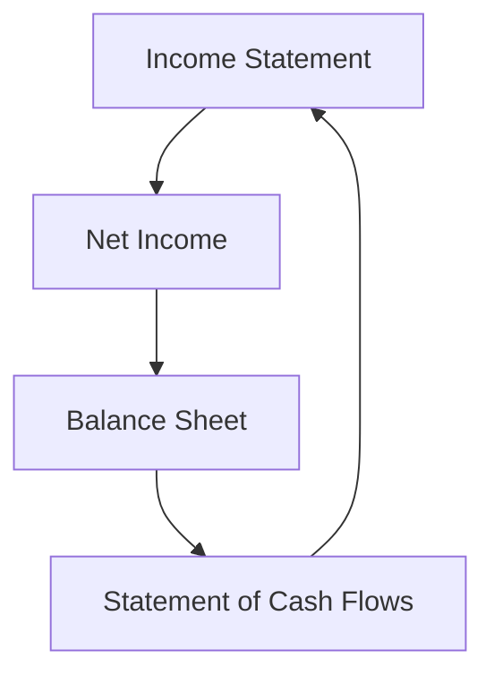

## 6.8 Accounting Cycle for Merchandising Companies

The accounting cycle for merchandising companies involves a series of steps that are crucial for accurately recording and reporting financial transactions. Unlike service companies, merchandising businesses deal with inventory, which adds complexity to their accounting processes. This section will guide you through the unique aspects of the accounting cycle for merchandising companies, providing practical examples, real-world applications, and exam-focused insights to help you succeed in your Canadian accounting exams.

### Understanding Merchandising Companies

Merchandising companies are businesses that purchase goods for resale to customers. They earn revenue by selling these goods at a higher price than their cost. The primary financial statements for merchandising companies include the income statement, balance sheet, and statement of cash flows. These statements provide insights into the company's profitability, financial position, and cash flow activities.

### The Accounting Cycle: An Overview

The accounting cycle is a systematic process of identifying, recording, and reporting a company's financial transactions. For merchandising companies, the cycle includes the following steps:

1. **Identifying Transactions**: Recognizing economic events that affect the company's financial position.
2. **Recording Transactions**: Using journals to document transactions in chronological order.
3. **Posting to the Ledger**: Transferring journal entries to the general ledger.
4. **Preparing a Trial Balance**: Summarizing all ledger accounts to ensure debits equal credits.
5. **Adjusting Entries**: Making necessary adjustments for accrued and deferred items.
6. **Preparing Financial Statements**: Compiling the income statement, balance sheet, and cash flow statement.
7. **Closing Entries**: Closing temporary accounts to prepare for the next accounting period.
8. **Post-Closing Trial Balance**: Ensuring all accounts are balanced after closing entries.

### Step-by-Step Guide to the Accounting Cycle for Merchandising Companies

#### Step 1: Identifying Transactions

Merchandising companies engage in various transactions, including purchasing inventory, selling goods, and managing returns and allowances. Identifying these transactions is the first step in the accounting cycle. Key transactions include:

- **Purchases of Inventory**: Acquiring goods for resale.
- **Sales Transactions**: Selling goods to customers, which may involve cash or credit sales.
- **Sales Returns and Allowances**: Handling returned goods or providing allowances for damaged items.

#### Step 2: Recording Transactions

Transactions are recorded in the company's journals using the double-entry bookkeeping system. For merchandising companies, this involves:

- **Purchases Journal**: Recording inventory purchases.
- **Sales Journal**: Documenting sales transactions.
- **Cash Receipts and Disbursements Journals**: Tracking cash inflows and outflows.

**Example**: A merchandising company purchases $5,000 worth of inventory on credit. The journal entry would be:

- Debit Inventory $5,000
- Credit Accounts Payable $5,000

#### Step 3: Posting to the Ledger

Once transactions are recorded in the journals, they are posted to the general ledger. The ledger provides a detailed record of all accounts and their balances. This step ensures that all transactions are accurately reflected in the company's financial records.

#### Step 4: Preparing a Trial Balance

A trial balance is prepared to verify that total debits equal total credits. This step helps identify any discrepancies or errors in the recording process. For merchandising companies, the trial balance includes accounts such as inventory, sales, and cost of goods sold (COGS).

#### Step 5: Adjusting Entries

Adjusting entries are made to account for accrued and deferred items. For merchandising companies, common adjustments include:

- **Inventory Adjustments**: Reflecting changes in inventory levels due to sales or shrinkage.
- **Accrued Expenses**: Recognizing expenses incurred but not yet paid.
- **Deferred Revenue**: Adjusting for revenue received in advance.

**Example**: At the end of the accounting period, a physical inventory count reveals $500 of shrinkage. The adjusting entry would be:

- Debit Cost of Goods Sold $500
- Credit Inventory $500

#### Step 6: Preparing Financial Statements

Financial statements are prepared using the adjusted trial balance. For merchandising companies, key statements include:

- **Income Statement**: Showing revenue, COGS, and net income.
- **Balance Sheet**: Reflecting assets, liabilities, and equity.
- **Statement of Cash Flows**: Detailing cash inflows and outflows.

**Mermaid Diagram: Financial Statement Relationships**

#### Step 7: Closing Entries

Closing entries are made to transfer balances from temporary accounts (e.g., revenue, expenses) to permanent accounts (e.g., retained earnings). This process resets temporary accounts for the next accounting period.

#### Step 8: Post-Closing Trial Balance

A post-closing trial balance is prepared to ensure that all accounts are balanced after closing entries. This step verifies the accuracy of the company's financial records before starting a new accounting period.

### Unique Aspects of the Accounting Cycle for Merchandising Companies

#### Inventory Management

Inventory is a critical component of a merchandising company's financial statements. Effective inventory management involves:

- **Inventory Valuation Methods**: Using methods such as FIFO (First-In, First-Out) or LIFO (Last-In, First-Out) to value inventory.
- **Inventory Turnover Ratio**: Measuring how quickly inventory is sold and replaced.
- **Lower of Cost or Market Rule**: Ensuring inventory is valued at the lower of its cost or market value.

#### Cost of Goods Sold (COGS)

COGS represents the direct costs of producing goods sold by a company. For merchandising companies, COGS is calculated as:

 \text{COGS} = \text{Beginning Inventory} + \text{Purchases} - \text{Ending Inventory} 

#### Sales Returns and Allowances

Sales returns and allowances account for returned goods or allowances provided to customers. These transactions impact revenue and require careful tracking to ensure accurate financial reporting.

### Practical Example: Accounting Cycle for a Merchandising Company

Consider a Canadian merchandising company, Maple Goods, Inc., which sells outdoor equipment. The following example illustrates the accounting cycle for Maple Goods:

1. **Identifying Transactions**: Maple Goods purchases $10,000 of inventory and sells $15,000 worth of goods.
2. **Recording Transactions**: Journal entries are made for purchases and sales.
3. **Posting to the Ledger**: Transactions are posted to the general ledger.
4. **Preparing a Trial Balance**: A trial balance is prepared to ensure accuracy.
5. **Adjusting Entries**: Adjustments are made for inventory shrinkage and accrued expenses.
6. **Preparing Financial Statements**: Financial statements are compiled using the adjusted trial balance.
7. **Closing Entries**: Temporary accounts are closed to retained earnings.
8. **Post-Closing Trial Balance**: A post-closing trial balance is prepared to verify accuracy.

### Real-World Applications and Compliance Considerations

Merchandising companies must adhere to Canadian accounting standards, such as the International Financial Reporting Standards (IFRS) and Accounting Standards for Private Enterprises (ASPE). Compliance with these standards ensures accurate financial reporting and transparency.

#### Regulatory Bodies and Standards

- **CPA Canada**: Provides guidance and resources for accounting professionals.
- **IFRS**: International standards adopted in Canada for financial reporting.
- **ASPE**: Standards for private enterprises in Canada.

### Exam Strategies and Tips

- **Understand Key Concepts**: Focus on inventory management, COGS, and sales returns.
- **Practice Journal Entries**: Familiarize yourself with recording and posting transactions.
- **Review Financial Statements**: Ensure you can prepare and analyze financial statements.
- **Stay Updated on Standards**: Keep abreast of changes in Canadian accounting standards.

### Common Pitfalls and Challenges

- **Inventory Errors**: Misvaluing inventory can lead to inaccurate financial statements.
- **Incorrect Adjustments**: Failing to make necessary adjustments can impact financial accuracy.
- **Incomplete Closing Entries**: Ensure all temporary accounts are closed to avoid discrepancies.

### Summary

The accounting cycle for merchandising companies involves a series of steps that ensure accurate financial reporting. By understanding the unique aspects of this cycle, such as inventory management and COGS, you can effectively prepare for your Canadian accounting exams and apply these principles in professional practice.

### Additional Resources

- **CPA Canada**: [CPA Canada Website](https://www.cpacanada.ca)
- **IFRS Standards**: [IFRS Foundation](https://www.ifrs.org)
- **ASPE Guidelines**: [CPA Canada ASPE](https://www.cpacanada.ca/en/business-and-accounting-resources/accounting-and-financial-reporting/accounting-standards-for-private-enterprises-aspe)

## **Ready to Test Your Knowledge?**



### What is the first step in the accounting cycle for merchandising companies?

- [x] Identifying Transactions
- [ ] Preparing Financial Statements
- [ ] Adjusting Entries
- [ ] Closing Entries

> **Explanation:** Identifying transactions is the first step in the accounting cycle, where economic events affecting the company's financial position are recognized.

### Which method is commonly used to value inventory in merchandising companies?

- [x] FIFO (First-In, First-Out)
- [ ] LIFO (Last-In, First-Out)
- [ ] Weighted Average
- [ ] Specific Identification

> **Explanation:** FIFO is a common inventory valuation method that assumes the oldest inventory items are sold first.

### What does COGS stand for in merchandising companies?

- [x] Cost of Goods Sold
- [ ] Cost of General Sales
- [ ] Cost of Goods Supplied
- [ ] Cost of Goods Stocked

> **Explanation:** COGS stands for Cost of Goods Sold, representing the direct costs of producing goods sold by a company.

### What is the purpose of closing entries in the accounting cycle?

- [x] To reset temporary accounts for the next accounting period
- [ ] To prepare financial statements
- [ ] To adjust for accrued items
- [ ] To post transactions to the ledger

> **Explanation:** Closing entries transfer balances from temporary accounts to permanent accounts, resetting them for the next period.

### Which financial statement shows a company's profitability?

- [x] Income Statement
- [ ] Balance Sheet
- [ ] Statement of Cash Flows
- [ ] Statement of Owner's Equity

> **Explanation:** The income statement shows a company's profitability by detailing revenue, expenses, and net income.

### What is the formula for calculating COGS?

- [x] Beginning Inventory + Purchases - Ending Inventory
- [ ] Beginning Inventory - Purchases + Ending Inventory
- [ ] Purchases + Ending Inventory - Beginning Inventory
- [ ] Ending Inventory - Purchases + Beginning Inventory

> **Explanation:** COGS is calculated as Beginning Inventory + Purchases - Ending Inventory, reflecting the cost of goods sold during the period.

### What is the role of adjusting entries in the accounting cycle?

- [x] To account for accrued and deferred items
- [ ] To prepare financial statements
- [ ] To identify transactions
- [ ] To close temporary accounts

> **Explanation:** Adjusting entries are made to account for accrued and deferred items, ensuring accurate financial reporting.

### Which regulatory body provides guidance for accounting professionals in Canada?

- [x] CPA Canada
- [ ] IFRS Foundation
- [ ] ASPE Board
- [ ] Financial Accounting Standards Board (FASB)

> **Explanation:** CPA Canada provides guidance and resources for accounting professionals in Canada.

### What is the primary purpose of a trial balance?

- [x] To verify that total debits equal total credits
- [ ] To prepare financial statements
- [ ] To adjust for accrued items
- [ ] To close temporary accounts

> **Explanation:** A trial balance is prepared to verify that total debits equal total credits, ensuring accuracy in the recording process.

### True or False: Merchandising companies do not need to prepare a statement of cash flows.

- [ ] True
- [x] False

> **Explanation:** False. Merchandising companies do prepare a statement of cash flows to detail cash inflows and outflows.


