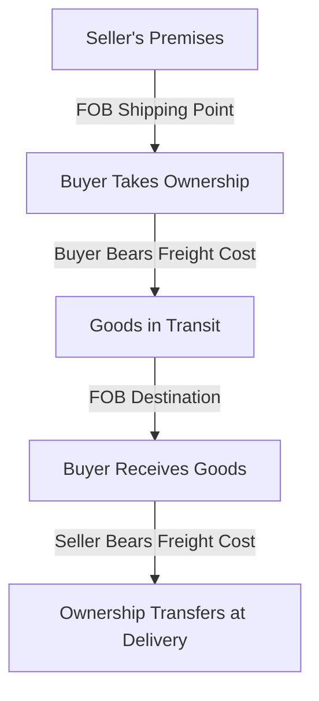

## 7.10 Freight Costs and Terms

Freight costs and terms are critical components in the accounting for merchandising operations. They not only determine the point at which ownership of goods transfers from the seller to the buyer but also significantly impact the accounting entries and financial statements of both parties involved. Understanding these concepts is essential for anyone preparing for Canadian accounting exams, as they are frequently tested and have practical implications in the field of accounting.

### Understanding Freight Costs

Freight costs refer to the expenses incurred in transporting goods from the seller to the buyer. These costs can be substantial and are influenced by several factors, including the distance between the seller and buyer, the mode of transportation, and the weight and volume of the goods being shipped. In accounting, freight costs must be accurately recorded to ensure that financial statements reflect the true cost of goods sold and inventory values.

#### Types of Freight Costs

1. **Freight-in**: This is the cost incurred by the buyer to transport goods from the supplier to their location. It is typically added to the cost of inventory and affects the cost of goods sold.

2. **Freight-out**: This is the cost incurred by the seller to deliver goods to the buyer. It is considered a selling expense and is recorded on the income statement.

3. **Prepaid Freight**: When the seller pays the freight charges in advance, it is known as prepaid freight. This cost may be included in the invoice sent to the buyer.

4. **Collect Freight**: In this scenario, the buyer is responsible for paying the freight charges upon delivery.

### Shipping Terms and Their Accounting Implications

Shipping terms define the point at which ownership of goods transfers from the seller to the buyer and who is responsible for freight costs. The two most common shipping terms are FOB Shipping Point and FOB Destination.

#### FOB Shipping Point

- **Definition**: FOB (Free On Board) Shipping Point means that ownership of goods transfers to the buyer as soon as the goods leave the seller's premises. The buyer is responsible for freight costs and bears the risk of loss during transit.

- **Accounting Implications**: 
  - The buyer records the inventory and freight costs as soon as the goods are shipped.
  - The seller recognizes revenue at the point of shipment.
  - Example: If a Canadian company purchases goods FOB Shipping Point, they must include the freight costs in their inventory valuation.

#### FOB Destination

- **Definition**: FOB Destination means that ownership of goods transfers to the buyer only when the goods arrive at the buyer's location. The seller is responsible for freight costs and bears the risk of loss during transit.

- **Accounting Implications**: 
  - The seller records the freight costs as a selling expense.
  - Revenue is recognized by the seller only upon delivery of goods to the buyer.
  - Example: For a Canadian seller, goods sold FOB Destination are not recorded as revenue until they reach the buyer.

### Practical Examples and Case Studies

To illustrate the impact of freight costs and terms on accounting entries, consider the following examples:

#### Example 1: FOB Shipping Point

A Canadian retailer purchases merchandise from a supplier in the United States. The terms are FOB Shipping Point, and the freight cost is $500. The retailer records the following journal entry upon shipment:

```
Inventory                      $500
   Cash/Accounts Payable       $500
```

This entry reflects the addition of freight costs to the inventory value.

#### Example 2: FOB Destination

A Canadian manufacturer sells goods to a distributor in Europe with FOB Destination terms. The freight cost is $1,000. The manufacturer records the following entry upon delivery:

```
Freight-out Expense            $1,000
   Cash/Accounts Payable       $1,000
```

This entry shows the freight cost as a selling expense, affecting the income statement.

### Real-World Applications and Regulatory Scenarios

In practice, understanding freight costs and terms is crucial for accurate financial reporting and compliance with Canadian accounting standards. Companies must adhere to the International Financial Reporting Standards (IFRS) as adopted in Canada, which require proper recognition and measurement of inventory and expenses.

#### Compliance Considerations

- **Inventory Valuation**: Freight-in costs must be included in the inventory valuation to comply with IFRS and ASPE (Accounting Standards for Private Enterprises) in Canada.
- **Revenue Recognition**: Revenue must be recognized based on the transfer of control, which is influenced by shipping terms.

### Step-by-Step Guidance for Accounting Entries

To ensure accuracy in accounting for freight costs, follow these steps:

1. **Determine Shipping Terms**: Identify whether the terms are FOB Shipping Point or FOB Destination.
2. **Calculate Freight Costs**: Obtain the total freight cost from the shipping invoice or agreement.
3. **Record Inventory or Expense**: Depending on the terms, record the freight cost as part of inventory or as a selling expense.
4. **Recognize Revenue**: Ensure revenue is recognized at the appropriate point based on the shipping terms.

### Diagrams and Visual Aids

To enhance understanding, consider the following diagram illustrating the flow of ownership and responsibility under different shipping terms:



### Best Practices and Common Pitfalls

- **Best Practices**:
  - Always verify shipping terms before recording transactions.
  - Include freight-in costs in inventory valuation for accurate cost of goods sold.
  - Ensure timely recognition of revenue based on shipping terms.

- **Common Pitfalls**:
  - Misclassifying freight costs as expenses instead of inventory.
  - Incorrectly recognizing revenue before the transfer of control.
  - Failing to update inventory records for freight-in costs.

### References to Canadian Accounting Standards

For further exploration, refer to the following resources:

- **CPA Canada Handbook**: Provides guidance on accounting for inventory and expenses.
- **IFRS 15 - Revenue from Contracts with Customers**: Details revenue recognition principles.
- **ASPE Section 3031 - Inventories**: Covers inventory measurement and recognition.

### Summary

Freight costs and terms play a vital role in the accounting for merchandising operations. By understanding the implications of FOB Shipping Point and FOB Destination, you can ensure accurate financial reporting and compliance with Canadian accounting standards. Remember to incorporate freight costs into inventory valuation and recognize revenue at the appropriate point to reflect the true financial position of your business.

## **Ready to Test Your Knowledge?**



### What is the primary difference between FOB Shipping Point and FOB Destination?

- [x] Ownership transfers at the seller's premises for FOB Shipping Point and at the buyer's location for FOB Destination.
- [ ] The seller always pays for freight costs in both terms.
- [ ] Revenue is recognized at the same time for both terms.
- [ ] There is no difference in risk of loss between the two terms.

> **Explanation:** FOB Shipping Point transfers ownership when goods leave the seller's premises, while FOB Destination transfers ownership upon delivery to the buyer.

### How should freight-in costs be recorded under FOB Shipping Point terms?

- [x] As part of inventory costs.
- [ ] As a selling expense.
- [ ] As a liability.
- [ ] As a revenue deduction.

> **Explanation:** Freight-in costs under FOB Shipping Point are added to inventory costs, affecting the cost of goods sold.

### Under FOB Destination terms, when is revenue recognized by the seller?

- [x] Upon delivery of goods to the buyer.
- [ ] When goods are shipped.
- [ ] When the buyer pays for the goods.
- [ ] Upon receipt of the purchase order.

> **Explanation:** Revenue is recognized upon delivery under FOB Destination, as ownership transfers at that point.

### Which of the following is considered a selling expense?

- [x] Freight-out costs.
- [ ] Freight-in costs.
- [ ] Inventory costs.
- [ ] Purchase discounts.

> **Explanation:** Freight-out costs are incurred by the seller to deliver goods and are recorded as selling expenses.

### What is the impact of misclassifying freight-in costs as expenses?

- [x] Understatement of inventory value.
- [ ] Overstatement of revenue.
- [x] Overstatement of expenses.
- [ ] No impact on financial statements.

> **Explanation:** Misclassifying freight-in costs as expenses understates inventory and overstates expenses, affecting net income.

### Which accounting standard provides guidance on revenue recognition?

- [x] IFRS 15.
- [ ] ASPE Section 3031.
- [ ] IFRS 16.
- [ ] ASPE Section 3400.

> **Explanation:** IFRS 15 provides guidelines on recognizing revenue from contracts with customers.

### What should be included in the inventory valuation under Canadian accounting standards?

- [x] Freight-in costs.
- [ ] Freight-out costs.
- [x] Purchase price.
- [ ] Selling expenses.

> **Explanation:** Inventory valuation includes freight-in costs and purchase price, reflecting the total cost of acquiring goods.

### How can companies ensure compliance with Canadian accounting standards for freight costs?

- [x] By accurately recording freight costs based on shipping terms.
- [ ] By ignoring shipping terms and focusing on payment terms.
- [ ] By recording all freight costs as selling expenses.
- [ ] By recognizing revenue at the point of shipment for all sales.

> **Explanation:** Compliance is ensured by recording freight costs according to shipping terms and recognizing revenue appropriately.

### What is a common pitfall in accounting for freight costs?

- [x] Misclassifying freight-in costs as selling expenses.
- [ ] Including freight-out costs in inventory valuation.
- [ ] Recognizing revenue before payment is received.
- [ ] Ignoring the impact of freight terms on financial statements.

> **Explanation:** Misclassifying freight-in costs as selling expenses leads to inaccurate inventory and expense reporting.

### True or False: Under FOB Shipping Point, the seller bears the risk of loss during transit.

- [ ] True
- [x] False

> **Explanation:** Under FOB Shipping Point, the buyer bears the risk of loss during transit, as ownership transfers at shipment.


