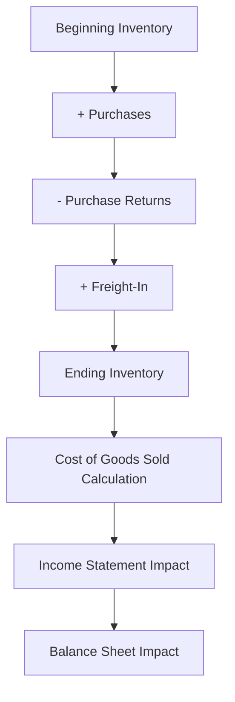

## 8.8 Periodic Inventory System Entries

In the realm of accounting, understanding the periodic inventory system is essential for managing and valuing inventory effectively. This system, widely used in various industries, provides a straightforward approach to tracking inventory levels and costs. For those preparing for Canadian accounting exams, mastering periodic inventory system entries is crucial. This section will guide you through the fundamental concepts, practical applications, and exam-focused insights to help you excel.

### Understanding the Periodic Inventory System

The periodic inventory system is a method where inventory records are updated at specific intervals, typically at the end of an accounting period. Unlike the perpetual inventory system, which continuously tracks inventory transactions, the periodic system relies on physical counts to determine inventory levels and cost of goods sold (COGS).

#### Key Characteristics of the Periodic Inventory System

1. **Infrequent Updates**: Inventory records are updated periodically, not continuously.
2. **Physical Counts**: Inventory levels are determined through physical counts at the end of each period.
3. **Cost of Goods Sold Calculation**: COGS is calculated at the end of the period using the formula: 
   
   \text{COGS} = \text{Beginning Inventory} + \text{Purchases} - \text{Ending Inventory}
   
4. **Simplicity**: The system is simpler and less costly to implement compared to the perpetual system.

#### Advantages and Disadvantages

**Advantages:**
- Cost-effective for small businesses with limited resources.
- Simplicity in implementation and maintenance.

**Disadvantages:**
- Lack of real-time inventory data.
- Potential for discrepancies due to infrequent updates.

### Accounting Entries in the Periodic Inventory System

In the periodic inventory system, specific accounting entries are made to record inventory transactions. These entries are crucial for accurate financial reporting and inventory management.

#### Recording Purchases

When inventory is purchased, the transaction is recorded in the Purchases account, not directly in the Inventory account. This distinction is vital in the periodic system.

**Example:**

A company purchases $5,000 worth of inventory on credit.

**Journal Entry:**

| Date       | Account        | Debit  | Credit |
|------------|----------------|--------|--------|
| YYYY-MM-DD | Purchases      | $5,000 |        |
|            | Accounts Payable |        | $5,000 |

#### Recording Purchase Returns and Allowances

If inventory is returned to suppliers or allowances are granted, these are recorded in the Purchase Returns and Allowances account.

**Example:**

The company returns $500 worth of inventory to the supplier.

**Journal Entry:**

| Date       | Account                  | Debit  | Credit |
|------------|--------------------------|--------|--------|
| YYYY-MM-DD | Accounts Payable         | $500   |        |
|            | Purchase Returns and Allowances |        | $500   |

#### Recording Freight-In

Freight costs associated with acquiring inventory are recorded in the Freight-In account, which is added to the cost of purchases.

**Example:**

The company incurs $200 in freight costs for inventory delivery.

**Journal Entry:**

| Date       | Account    | Debit  | Credit |
|------------|------------|--------|--------|
| YYYY-MM-DD | Freight-In | $200   |        |
|            | Cash       |        | $200   |

#### Calculating Cost of Goods Sold

At the end of the period, the COGS is calculated using the formula mentioned earlier. This calculation is essential for determining the ending inventory and COGS for the financial statements.

**Example:**

- Beginning Inventory: $10,000
- Purchases: $5,000
- Purchase Returns and Allowances: $500
- Freight-In: $200
- Ending Inventory (determined by physical count): $8,000

**COGS Calculation:**


\text{COGS} = \$10,000 + (\$5,000 - \$500 + \$200) - \$8,000 = \$6,700


### Preparing Financial Statements

In the periodic inventory system, the financial statements are prepared at the end of the accounting period after the physical inventory count and COGS calculation.

#### Income Statement

The income statement will reflect the calculated COGS, affecting the gross profit and net income.

**Example:**

| Income Statement Item | Amount  |
|-----------------------|---------|
| Sales Revenue         | $20,000 |
| Cost of Goods Sold    | $6,700  |
| Gross Profit          | $13,300 |
| Operating Expenses    | $5,000  |
| Net Income            | $8,300  |

#### Balance Sheet

The balance sheet will show the ending inventory as a current asset.

**Example:**

| Balance Sheet Item | Amount  |
|--------------------|---------|
| Current Assets     |         |
| - Cash             | $2,000  |
| - Accounts Receivable | $3,000 |
| - Inventory        | $8,000  |
| Total Current Assets | $13,000 |

### Practical Examples and Case Studies

To solidify your understanding of periodic inventory system entries, let's explore practical examples and case studies relevant to the Canadian accounting profession.

#### Example 1: Retail Store Inventory Management

A retail store uses the periodic inventory system to manage its inventory. At the end of the fiscal year, the store conducts a physical inventory count and records the following:

- Beginning Inventory: $15,000
- Purchases: $25,000
- Purchase Returns: $2,000
- Freight-In: $1,000
- Ending Inventory: $20,000

**COGS Calculation:**


\text{COGS} = \$15,000 + (\$25,000 - \$2,000 + \$1,000) - \$20,000 = \$19,000


The store's income statement will reflect the COGS of $19,000, impacting its gross profit and net income.

#### Example 2: Manufacturing Company Inventory Valuation

A manufacturing company applies the periodic inventory system to value its raw materials and finished goods. The company records the following transactions:

- Beginning Inventory: $50,000
- Raw Material Purchases: $30,000
- Purchase Returns: $3,000
- Freight-In: $2,500
- Ending Inventory: $45,000

**COGS Calculation:**


\text{COGS} = \$50,000 + (\$30,000 - \$3,000 + \$2,500) - \$45,000 = \$34,500


This calculation helps the company determine the cost of goods manufactured and sold during the period.

### Exam-Focused Insights and Tips

For Canadian accounting exams, understanding the periodic inventory system is vital. Here are some exam-focused insights and tips to help you succeed:

1. **Memorize Key Formulas**: Ensure you can recall and apply the COGS formula accurately.
2. **Practice Journal Entries**: Familiarize yourself with recording purchases, returns, and freight-in transactions.
3. **Understand Financial Statement Impact**: Recognize how inventory and COGS affect the income statement and balance sheet.
4. **Review Case Studies**: Analyze real-world scenarios to apply theoretical knowledge.
5. **Stay Updated on Standards**: Keep abreast of any changes in Canadian accounting standards related to inventory management.

### Common Pitfalls and Challenges

While studying the periodic inventory system, be aware of common pitfalls and challenges:

- **Inaccurate Physical Counts**: Ensure physical inventory counts are precise to avoid discrepancies.
- **Misclassification of Costs**: Properly classify purchase returns and freight-in costs.
- **Timing Issues**: Be mindful of the timing of inventory purchases and sales to ensure accurate financial reporting.

### Real-World Applications and Regulatory Scenarios

In the Canadian context, businesses must adhere to accounting standards such as the International Financial Reporting Standards (IFRS) and Accounting Standards for Private Enterprises (ASPE). Understanding the periodic inventory system's application within these frameworks is essential for compliance and accurate reporting.

#### IFRS and ASPE Considerations

- **IFRS**: Under IFRS, inventory is measured at the lower of cost and net realizable value. The periodic system must align with these valuation principles.
- **ASPE**: ASPE allows for more flexibility in inventory valuation methods, but consistency and accuracy remain critical.

### Diagrams and Visual Aids

To enhance your understanding, let's explore a visual representation of the periodic inventory system process.

### Encouraging Practice and Application

To reinforce your learning, engage in practice problems and exercises. Consider preparing mock journal entries, calculating COGS, and analyzing financial statements based on hypothetical scenarios.

### Summary and Key Takeaways

In summary, mastering periodic inventory system entries is crucial for effective inventory management and valuation. By understanding the key concepts, practicing journal entries, and applying exam-focused insights, you'll be well-prepared for Canadian accounting exams.

### Additional Resources

For further exploration, consider the following resources:

- CPA Canada: [CPA Canada Website](https://www.cpacanada.ca)
- IFRS Standards: [IFRS Foundation](https://www.ifrs.org)
- ASPE Guidelines: [CPA Canada ASPE](https://www.cpacanada.ca/en/business-and-accounting-resources/accounting-and-financial-reporting/aspe)

---

## **Ready to Test Your Knowledge?**



### What is the primary characteristic of the periodic inventory system?

- [x] Inventory records are updated at specific intervals.
- [ ] Inventory records are updated continuously.
- [ ] Inventory is never physically counted.
- [ ] Inventory is updated in real-time.

> **Explanation:** In the periodic inventory system, inventory records are updated at specific intervals, typically at the end of an accounting period.

### Which account is used to record inventory purchases in the periodic system?

- [x] Purchases
- [ ] Inventory
- [ ] Cost of Goods Sold
- [ ] Accounts Receivable

> **Explanation:** In the periodic inventory system, purchases are recorded in the Purchases account, not directly in the Inventory account.

### How is the Cost of Goods Sold calculated in the periodic inventory system?

- [x] Beginning Inventory + Purchases - Ending Inventory
- [ ] Purchases - Ending Inventory + Beginning Inventory
- [ ] Ending Inventory - Purchases + Beginning Inventory
- [ ] Beginning Inventory - Purchases + Ending Inventory

> **Explanation:** The Cost of Goods Sold is calculated as Beginning Inventory plus Purchases minus Ending Inventory.

### What is the impact of purchase returns on the periodic inventory system?

- [x] They reduce the Purchases account.
- [ ] They increase the Purchases account.
- [ ] They have no impact on the Purchases account.
- [ ] They are recorded in the Inventory account.

> **Explanation:** Purchase returns reduce the Purchases account, reflecting the return of inventory to suppliers.

### Which account is used to record freight costs in the periodic inventory system?

- [x] Freight-In
- [ ] Inventory
- [ ] Cost of Goods Sold
- [ ] Sales Revenue

> **Explanation:** Freight costs are recorded in the Freight-In account, which is added to the cost of purchases.

### What is a disadvantage of the periodic inventory system?

- [x] Lack of real-time inventory data
- [ ] High implementation cost
- [ ] Complexity in maintenance
- [ ] Continuous updates required

> **Explanation:** A disadvantage of the periodic inventory system is the lack of real-time inventory data due to infrequent updates.

### How does the periodic inventory system affect the income statement?

- [x] It impacts the Cost of Goods Sold and Gross Profit.
- [ ] It affects only the Sales Revenue.
- [ ] It does not affect the income statement.
- [ ] It impacts only the Operating Expenses.

> **Explanation:** The periodic inventory system impacts the Cost of Goods Sold and Gross Profit on the income statement.

### What is the role of physical inventory counts in the periodic system?

- [x] To determine ending inventory levels
- [ ] To update inventory continuously
- [ ] To eliminate the need for journal entries
- [ ] To calculate sales revenue

> **Explanation:** Physical inventory counts are used to determine ending inventory levels in the periodic system.

### Which accounting standard is relevant for inventory valuation in Canada?

- [x] IFRS
- [ ] GAAP
- [ ] FASB
- [ ] AICPA

> **Explanation:** In Canada, inventory valuation is governed by IFRS (International Financial Reporting Standards).

### True or False: The periodic inventory system is more complex than the perpetual system.

- [ ] True
- [x] False

> **Explanation:** False. The periodic inventory system is generally simpler and less complex than the perpetual system.


