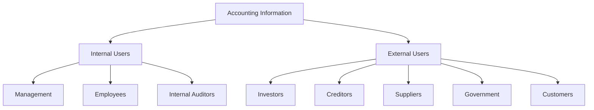

## 1.3 Users of Accounting Information

In the realm of accounting, information is power. It serves as the backbone of decision-making processes for a myriad of stakeholders, both within and outside an organization. In Canada, accounting information is crucial for various users, each with distinct needs and expectations. Understanding these users and their requirements is essential for anyone preparing for Canadian accounting exams or pursuing a career in this field. This section delves into the key users of accounting information, categorizing them into internal and external stakeholders, and explores how they utilize this information to make informed decisions.

### Internal Users of Accounting Information

Internal users are individuals or groups within an organization who rely on accounting information to manage and operate the business effectively. They require detailed and timely data to make strategic decisions, plan, and control operations.

#### 1.3.1 Management

**Role and Importance:**

Management teams are at the helm of decision-making within an organization. They use accounting information to plan, organize, and control business activities. This information helps them in budgeting, forecasting, and evaluating the company's performance against its objectives.

**Applications:**

- **Budgeting and Forecasting:** Managers use historical financial data to predict future trends, allocate resources efficiently, and set financial targets.
- **Performance Evaluation:** By analyzing financial statements, managers assess the company's profitability, liquidity, and solvency, enabling them to make informed strategic decisions.
- **Cost Control:** Detailed cost information assists managers in identifying areas where expenses can be reduced without compromising quality.

**Example:** A Canadian manufacturing company might use cost accounting data to determine the cost of producing each unit, helping managers decide on pricing strategies and cost-cutting measures.

#### 1.3.2 Employees

**Role and Importance:**

Employees, particularly those involved in operations and finance, use accounting information to understand the company's financial health and their role in achieving its objectives. This information can also influence their job security and compensation.

**Applications:**

- **Performance Incentives:** Employees may have performance-based incentives tied to financial metrics such as revenue growth or profit margins.
- **Job Security:** Understanding the company's financial position can provide employees with insights into job stability and potential for growth.

**Example:** In a Canadian retail chain, sales staff might be incentivized based on quarterly sales targets derived from accounting data.

#### 1.3.3 Internal Auditors

**Role and Importance:**

Internal auditors use accounting information to evaluate the effectiveness of an organization's internal controls, risk management, and governance processes. They ensure compliance with policies and regulations, safeguarding the company's assets.

**Applications:**

- **Risk Assessment:** Auditors assess financial data to identify potential risks and recommend improvements to internal controls.
- **Compliance Monitoring:** They ensure that financial reporting adheres to Canadian accounting standards and regulatory requirements.

**Example:** A Canadian bank's internal audit team might analyze transaction data to detect irregularities and prevent fraud.

### External Users of Accounting Information

External users are individuals or entities outside an organization who rely on accounting information to make decisions about their interactions with the company. These users require accurate and transparent financial data to assess the organization's performance and financial health.

#### 1.3.4 Investors and Shareholders

**Role and Importance:**

Investors and shareholders are primarily interested in the company's profitability and growth potential. They use accounting information to make informed decisions about buying, holding, or selling their investments.

**Applications:**

- **Investment Decisions:** Financial statements provide insights into the company's earnings, cash flow, and financial position, influencing investment choices.
- **Dividend Decisions:** Shareholders assess profitability and cash reserves to determine potential dividend payouts.

**Example:** A Canadian tech startup might attract investors by showcasing strong revenue growth and positive cash flow in its financial statements.

#### 1.3.5 Creditors and Lenders

**Role and Importance:**

Creditors and lenders, such as banks and financial institutions, use accounting information to evaluate the creditworthiness of a company. They assess the risk of lending money and the likelihood of repayment.

**Applications:**

- **Credit Evaluation:** Financial ratios and cash flow statements help creditors assess the company's ability to meet its debt obligations.
- **Loan Terms:** Lenders use financial data to determine interest rates and repayment terms.

**Example:** A Canadian construction firm seeking a loan might provide detailed financial statements to demonstrate its ability to repay the debt.

#### 1.3.6 Suppliers and Trade Creditors

**Role and Importance:**

Suppliers and trade creditors rely on accounting information to evaluate the financial stability of their customers. They need assurance that the company can pay for goods and services provided on credit.

**Applications:**

- **Credit Terms:** Suppliers assess financial statements to determine credit limits and payment terms.
- **Risk Assessment:** They evaluate the company's liquidity and solvency to mitigate the risk of non-payment.

**Example:** A Canadian automotive parts supplier might review a client's financial health before extending trade credit.

#### 1.3.7 Government and Regulatory Bodies

**Role and Importance:**

Government agencies and regulatory bodies use accounting information to ensure compliance with laws and regulations. They also rely on this data for economic planning and policy-making.

**Applications:**

- **Taxation:** Accurate financial reporting is essential for calculating taxes owed by the company.
- **Regulatory Compliance:** Companies must adhere to Canadian accounting standards and regulations, such as those set by the Canadian Securities Administrators (CSA).

**Example:** A Canadian energy company must provide detailed financial reports to comply with environmental regulations and taxation laws.

#### 1.3.8 Customers

**Role and Importance:**

Customers may use accounting information to assess the financial stability of a company, particularly if they are entering into long-term contracts or partnerships.

**Applications:**

- **Partnership Decisions:** Customers evaluate financial health to ensure the company can fulfill its commitments.
- **Pricing and Negotiations:** Understanding a company's cost structure can influence pricing negotiations.

**Example:** A Canadian telecommunications company might provide financial transparency to reassure corporate clients of its stability and reliability.

### The Role of Accounting Information in Decision-Making

Accounting information serves as a critical tool for decision-making across various user groups. It provides a factual basis for evaluating past performance, predicting future outcomes, and making informed choices. The following sections explore how different users apply accounting information in their decision-making processes.

#### 1.3.9 Strategic Planning

**Management and Strategic Planning:**

Management teams use accounting information to develop long-term strategies and set organizational goals. Financial data helps identify growth opportunities, allocate resources, and assess the feasibility of strategic initiatives.

**Example:** A Canadian retail chain might use sales data to decide on expanding into new markets or launching new product lines.

#### 1.3.10 Performance Measurement

**Performance Metrics and Evaluation:**

Accounting information provides key performance indicators (KPIs) that measure an organization's success in achieving its objectives. These metrics help managers and investors evaluate efficiency, profitability, and overall performance.

**Example:** A Canadian airline might track metrics such as revenue per passenger and fuel cost per kilometer to assess operational efficiency.

#### 1.3.11 Risk Management

**Identifying and Mitigating Risks:**

Accounting information helps organizations identify financial risks and develop strategies to mitigate them. This includes assessing credit risk, market risk, and operational risk.

**Example:** A Canadian financial institution might analyze loan portfolios to identify potential default risks and adjust lending practices accordingly.

### Practical Examples and Case Studies

To illustrate the application of accounting information by various users, let's explore some practical examples and case studies relevant to the Canadian accounting profession.

#### Case Study: Investor Decision-Making

**Scenario:**

A Canadian technology company, TechInnovate Inc., is seeking investment to expand its operations. The company provides potential investors with detailed financial statements, including income statements, balance sheets, and cash flow statements.

**Analysis:**

Investors analyze these statements to assess TechInnovate's profitability, liquidity, and growth potential. Key metrics such as earnings per share (EPS), return on equity (ROE), and operating cash flow are evaluated to determine the company's financial health and investment attractiveness.

**Outcome:**

Based on the positive financial indicators, investors decide to invest in TechInnovate, anticipating strong returns and growth opportunities.

#### Case Study: Supplier Credit Evaluation

**Scenario:**

A Canadian manufacturing company, Maple Manufacturing Ltd., seeks to establish a credit line with a new supplier. The supplier requests financial statements to assess Maple Manufacturing's creditworthiness.

**Analysis:**

The supplier reviews the company's balance sheet and cash flow statement to evaluate its liquidity and ability to meet short-term obligations. Ratios such as the current ratio and quick ratio are calculated to assess financial stability.

**Outcome:**

Satisfied with Maple Manufacturing's strong liquidity position, the supplier extends favorable credit terms, facilitating a successful business relationship.

### Diagrams and Visual Aids

To enhance understanding, let's incorporate a diagram illustrating the flow of accounting information among different users.

### Best Practices and Common Pitfalls

Understanding the needs of different users of accounting information is crucial for accurate and effective financial reporting. Here are some best practices and common pitfalls to consider:

#### Best Practices

- **Transparency:** Ensure financial statements are clear, accurate, and transparent to build trust with users.
- **Timeliness:** Provide timely information to facilitate informed decision-making.
- **Relevance:** Tailor financial reports to meet the specific needs of different user groups.

#### Common Pitfalls

- **Overcomplication:** Avoid overly complex financial reports that may confuse users.
- **Inaccuracy:** Ensure data accuracy to prevent misleading conclusions.
- **Lack of Context:** Provide context and explanations to help users interpret financial data correctly.

### Conclusion

Accounting information is a vital resource for a diverse range of users, each with unique needs and applications. By understanding these users and their requirements, accountants can ensure that financial reporting is accurate, relevant, and useful. This knowledge is not only essential for passing Canadian accounting exams but also for building a successful career in the accounting profession.

---

## **Ready to Test Your Knowledge?**



### Who are the primary internal users of accounting information?

- [x] Management
- [ ] Investors
- [ ] Creditors
- [ ] Government

> **Explanation:** Management is an internal user of accounting information, utilizing it for planning, organizing, and controlling business activities.

### Which external user is primarily interested in a company's creditworthiness?

- [ ] Employees
- [ ] Management
- [x] Creditors
- [ ] Internal Auditors

> **Explanation:** Creditors are external users interested in a company's creditworthiness to assess the risk of lending money.

### What is a key performance indicator (KPI) used by managers to evaluate efficiency?

- [ ] Dividend Payout Ratio
- [x] Revenue per Passenger
- [ ] Current Ratio
- [ ] Earnings Per Share

> **Explanation:** Revenue per Passenger is a KPI used by managers, particularly in the airline industry, to evaluate operational efficiency.

### Which user group relies on accounting information to ensure compliance with laws and regulations?

- [ ] Investors
- [ ] Employees
- [x] Government
- [ ] Customers

> **Explanation:** Government agencies and regulatory bodies use accounting information to ensure compliance with laws and regulations.

### What is a common pitfall in financial reporting?

- [ ] Transparency
- [x] Inaccuracy
- [ ] Timeliness
- [ ] Relevance

> **Explanation:** Inaccuracy is a common pitfall in financial reporting that can lead to misleading conclusions.

### Which internal user evaluates the effectiveness of an organization's internal controls?

- [ ] Employees
- [ ] Suppliers
- [x] Internal Auditors
- [ ] Customers

> **Explanation:** Internal Auditors evaluate the effectiveness of an organization's internal controls, risk management, and governance processes.

### What do investors primarily use accounting information for?

- [ ] Job Security
- [x] Investment Decisions
- [ ] Credit Evaluation
- [ ] Performance Incentives

> **Explanation:** Investors use accounting information to make informed investment decisions based on the company's profitability and growth potential.

### Which external user assesses a company's financial stability before entering long-term contracts?

- [ ] Employees
- [ ] Internal Auditors
- [ ] Government
- [x] Customers

> **Explanation:** Customers assess a company's financial stability before entering long-term contracts to ensure the company can fulfill its commitments.

### What is the role of accounting information in strategic planning?

- [ ] Ensuring Compliance
- [ ] Evaluating Job Security
- [x] Developing Long-term Strategies
- [ ] Monitoring Internal Controls

> **Explanation:** Accounting information helps management develop long-term strategies and set organizational goals.

### True or False: Suppliers are internal users of accounting information.

- [ ] True
- [x] False

> **Explanation:** Suppliers are external users of accounting information, evaluating financial stability to determine credit terms.


