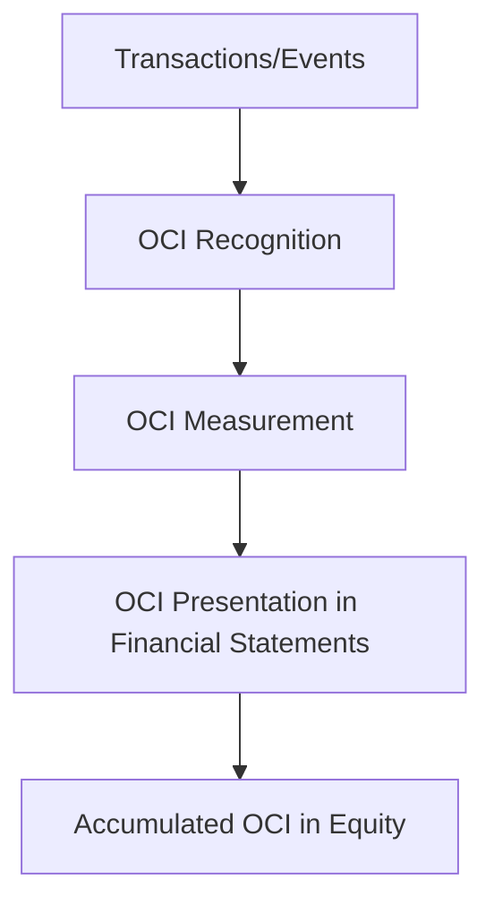

## 11.3 Other Comprehensive Income

In the realm of financial accounting, understanding the nuances of Other Comprehensive Income (OCI) is crucial for Canadian accountants, especially those preparing for professional exams. OCI is a key component of the financial statements that provides insights into the company's financial performance beyond what is captured in net income. This section will delve into the components of OCI, its recognition and measurement, and the differences in reporting under International Financial Reporting Standards (IFRS) and Canadian Accounting Standards for Private Enterprises (ASPE).

### Understanding Other Comprehensive Income

**Other Comprehensive Income (OCI)** refers to revenues, expenses, gains, and losses that are excluded from net income on the income statement. Instead, they are reported in the equity section of the balance sheet under accumulated other comprehensive income. OCI provides a broader view of a company's financial performance by capturing items that are not realized or are subject to future realization.

#### Components of Other Comprehensive Income

OCI typically includes the following components:

1. **Unrealized Gains and Losses on Available-for-Sale Financial Assets**: These are changes in the fair value of investments that are not yet sold. Under IFRS 9, these are now classified as fair value through other comprehensive income (FVOCI) for certain equity investments.

2. **Foreign Currency Translation Adjustments**: When a company has foreign operations, the financial statements of these operations need to be translated into the reporting currency. The resulting translation differences are recognized in OCI.

3. **Gains and Losses on Derivatives Designated as Cash Flow Hedges**: These are changes in the fair value of derivatives used to hedge future cash flows, recognized in OCI until the hedged transaction affects profit or loss.

4. **Revaluation Surplus on Property, Plant, and Equipment**: Under the revaluation model, increases in the carrying amount of an asset are recognized in OCI.

5. **Actuarial Gains and Losses on Defined Benefit Plans**: These arise from changes in actuarial assumptions or differences between expected and actual returns on plan assets.

6. **Changes in Fair Value of Financial Liabilities at Fair Value through Profit or Loss (due to credit risk)**: These are recognized in OCI to avoid volatility in profit or loss.

### Recognition and Measurement of OCI

The recognition and measurement of OCI components are governed by specific IFRS standards. For instance, IFRS 9 outlines the treatment of financial instruments, while IAS 19 deals with employee benefits. The recognition of OCI items involves:

- **Initial Recognition**: OCI items are initially recognized when the underlying transaction or event occurs.
- **Subsequent Measurement**: OCI items are re-measured at each reporting date, with changes recognized in OCI.
- **Reclassification Adjustments**: When an OCI item is realized, it is reclassified from OCI to profit or loss. This process is known as recycling.

### Reporting OCI under IFRS and ASPE

#### IFRS Reporting

Under IFRS, OCI is presented in the Statement of Comprehensive Income, which includes two sections:

1. **Profit or Loss**: This section includes all items of income and expense recognized in the period, excluding those required to be recognized in OCI.
2. **Other Comprehensive Income**: This section includes items that are recognized directly in equity.

The total comprehensive income is the sum of profit or loss and OCI, providing a complete picture of a company's performance.

#### ASPE Reporting

ASPE does not require the presentation of OCI. Instead, items that would typically be classified as OCI under IFRS are included in net income or directly in equity. This difference highlights the less complex nature of ASPE compared to IFRS, which is designed to reduce the reporting burden on private enterprises.

### Practical Examples and Case Studies

#### Example 1: Foreign Currency Translation

Consider a Canadian company with a subsidiary in Europe. The subsidiary's financial statements are prepared in euros, which must be translated into Canadian dollars for consolidation. The translation process results in a foreign currency translation adjustment, recognized in OCI.

#### Example 2: Cash Flow Hedges

A Canadian manufacturer enters into a forward contract to hedge the future purchase of raw materials priced in U.S. dollars. The changes in the fair value of the forward contract are recognized in OCI until the purchase transaction occurs, at which point they are reclassified to profit or loss.

### Real-World Applications and Regulatory Scenarios

In practice, OCI plays a vital role in providing stakeholders with a comprehensive view of a company's financial health. For instance, investors and analysts use OCI to assess the impact of market fluctuations on a company's financial position. Moreover, regulatory bodies such as the Canadian Securities Administrators (CSA) require public companies to disclose OCI items to enhance transparency.

### Step-by-Step Guidance for Preparing OCI

1. **Identify OCI Components**: Determine which transactions and events give rise to OCI.
2. **Measure OCI Items**: Calculate the fair value changes or adjustments for each OCI component.
3. **Record OCI Entries**: Make journal entries to recognize OCI items in the financial statements.
4. **Present OCI in Financial Statements**: Ensure OCI is accurately presented in the Statement of Comprehensive Income and accumulated in equity.

### Diagrams and Visual Aids

To enhance understanding, consider the following diagram illustrating the flow of OCI items:

### Best Practices, Common Pitfalls, and Strategies

**Best Practices**:
- Regularly review and update fair value measurements for OCI items.
- Ensure accurate translation of foreign operations to avoid misstatements.

**Common Pitfalls**:
- Failing to recycle OCI items to profit or loss upon realization.
- Misclassifying OCI items, leading to incorrect financial reporting.

**Strategies**:
- Implement robust internal controls to ensure accurate OCI reporting.
- Stay informed about updates to accounting standards affecting OCI.

### References and Additional Resources

- **IFRS Standards**: Refer to IFRS 9, IAS 19, and IAS 21 for detailed guidance on OCI components.
- **CPA Canada**: Access resources and publications on financial reporting and OCI.
- **Practice Exams**: Utilize CPA Canada's practice exams to test your understanding of OCI.

### Summary

Other Comprehensive Income is a critical component of financial reporting that provides insights into a company's financial performance beyond net income. Understanding the recognition, measurement, and reporting of OCI is essential for Canadian accountants, particularly those preparing for professional exams. By mastering OCI, you can enhance your financial analysis skills and contribute to more transparent and comprehensive financial reporting.

## **Ready to Test Your Knowledge?**



### What is Other Comprehensive Income (OCI)?

- [x] Revenues, expenses, gains, and losses excluded from net income
- [ ] Only realized gains and losses
- [ ] Only cash transactions
- [ ] Only foreign currency transactions

> **Explanation:** OCI includes items excluded from net income, such as unrealized gains and losses.

### Which of the following is NOT typically included in OCI?

- [ ] Foreign currency translation adjustments
- [x] Operating expenses
- [ ] Unrealized gains on available-for-sale securities
- [ ] Actuarial gains and losses

> **Explanation:** Operating expenses are included in net income, not OCI.

### Under IFRS, where is OCI presented?

- [x] In the Statement of Comprehensive Income
- [ ] In the Statement of Cash Flows
- [ ] In the Statement of Changes in Equity
- [ ] In the Notes to the Financial Statements

> **Explanation:** OCI is presented in the Statement of Comprehensive Income under IFRS.

### What is the process of moving OCI items to profit or loss called?

- [x] Recycling
- [ ] Revaluation
- [ ] Translation
- [ ] Amortization

> **Explanation:** Recycling is the process of reclassifying OCI items to profit or loss upon realization.

### Which standard governs the treatment of financial instruments in OCI under IFRS?

- [x] IFRS 9
- [ ] IAS 19
- [ ] IAS 21
- [ ] IFRS 15

> **Explanation:** IFRS 9 governs the treatment of financial instruments, including those in OCI.

### What is a common pitfall in OCI reporting?

- [x] Misclassifying OCI items
- [ ] Overstating net income
- [ ] Understating cash flows
- [ ] Ignoring depreciation

> **Explanation:** Misclassifying OCI items can lead to incorrect financial reporting.

### Which of the following is a component of OCI?

- [x] Gains and losses on cash flow hedges
- [ ] Interest income
- [ ] Cost of goods sold
- [ ] Depreciation expense

> **Explanation:** Gains and losses on cash flow hedges are recognized in OCI.

### How are foreign currency translation adjustments recognized?

- [x] In OCI
- [ ] In net income
- [ ] In cash flows
- [ ] In retained earnings

> **Explanation:** Foreign currency translation adjustments are recognized in OCI.

### What is the role of OCI in financial reporting?

- [x] To provide a comprehensive view of financial performance
- [ ] To calculate tax liabilities
- [ ] To determine cash flow
- [ ] To allocate dividends

> **Explanation:** OCI provides a broader view of financial performance beyond net income.

### True or False: ASPE requires the presentation of OCI.

- [ ] True
- [x] False

> **Explanation:** ASPE does not require the presentation of OCI; items are included in net income or equity.


