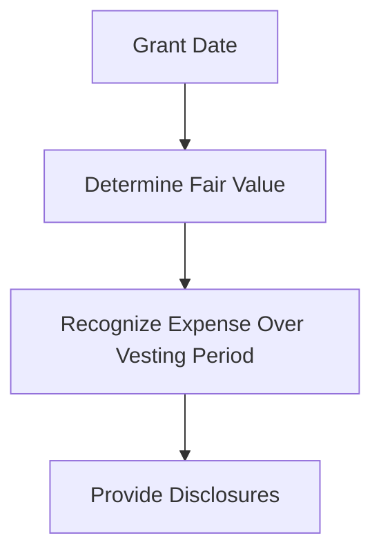

## 11.5 Equity-Settled Share-Based Payments

Equity-settled share-based payments are a critical component of modern compensation packages, particularly in Canada, where they are frequently used to align the interests of employees and shareholders. This section will delve into the principles and applications of equity-settled share-based payments, focusing on stock options and equity compensation, as they are applied within the Canadian accounting framework. We will explore the relevant accounting standards, provide practical examples, and offer insights into the regulatory environment.

### Understanding Equity-Settled Share-Based Payments

Equity-settled share-based payments involve transactions where an entity receives goods or services as consideration for equity instruments of the entity. This typically includes stock options, restricted shares, and other forms of equity compensation. The primary objective of these payments is to incentivize employees, align their interests with those of shareholders, and retain key personnel.

#### Key Concepts and Definitions

1. **Equity Instruments**: Financial instruments that evidence a residual interest in the assets of an entity after deducting all liabilities. Common examples include shares, stock options, and warrants.

2. **Share-Based Payment Transactions**: Transactions in which an entity receives goods or services in exchange for equity instruments or incurs liabilities for amounts based on the price of the entity's shares or other equity instruments.

3. **Grant Date**: The date on which the entity and the employee agree to the terms of the share-based payment arrangement. At this point, the entity becomes obligated to issue equity instruments.

4. **Vesting Period**: The period during which all specified vesting conditions of a share-based payment arrangement must be satisfied.

5. **Exercise Price**: The price at which an employee can purchase the underlying shares in a stock option plan.

### Accounting Standards for Equity-Settled Share-Based Payments

In Canada, the accounting for equity-settled share-based payments is governed by International Financial Reporting Standards (IFRS) and, for private enterprises, the Accounting Standards for Private Enterprises (ASPE).

#### IFRS 2: Share-Based Payment

IFRS 2 provides guidance on the accounting for share-based payment transactions. It requires entities to recognize an expense for goods or services received in a share-based payment transaction, with a corresponding increase in equity.

- **Measurement**: The fair value of the equity instruments granted is measured at the grant date and is not subsequently adjusted for changes in the fair value of the instruments.

- **Recognition**: The expense is recognized over the vesting period, reflecting the services received.

- **Disclosure**: Entities must disclose information that enables users to understand the nature and extent of share-based payment arrangements that existed during the period.

#### ASPE Section 3870: Stock-Based Compensation and Other Stock-Based Payments

For private enterprises in Canada, ASPE Section 3870 provides guidance similar to IFRS 2, with some differences in measurement and disclosure requirements.

- **Measurement**: The fair value of stock options is measured at the grant date using an option pricing model.

- **Recognition**: Similar to IFRS, the expense is recognized over the vesting period.

- **Disclosure**: ASPE requires less extensive disclosures compared to IFRS.

### Practical Examples and Case Studies

#### Example 1: Stock Option Plan

ABC Corporation grants 1,000 stock options to an employee on January 1, 2024. The options vest over three years, with one-third vesting each year. The fair value of each option at the grant date is $10.

- **Calculation**: Total expense = 1,000 options x $10 = $10,000
- **Recognition**: The expense is recognized over the vesting period:
  - Year 1: $3,333
  - Year 2: $3,333
  - Year 3: $3,334

#### Example 2: Restricted Share Units (RSUs)

XYZ Ltd. grants 500 RSUs to an employee, which vest after two years. The fair value of each RSU at the grant date is $15.

- **Calculation**: Total expense = 500 RSUs x $15 = $7,500
- **Recognition**: The expense is recognized over the vesting period:
  - Year 1: $3,750
  - Year 2: $3,750

### Regulatory Environment and Compliance

The regulatory environment in Canada requires entities to comply with specific accounting standards and disclosure requirements for share-based payments. This ensures transparency and consistency in financial reporting.

#### Compliance Considerations

1. **Fair Value Measurement**: Entities must use appropriate valuation models, such as the Black-Scholes model, to determine the fair value of stock options.

2. **Disclosure Requirements**: Entities must provide detailed disclosures about share-based payment arrangements, including the nature and terms of the arrangements, the number of equity instruments granted, and the fair value of the instruments.

3. **Tax Implications**: Share-based payments may have tax implications for both the entity and the employees. It is essential to consider the tax treatment of stock options and other equity instruments under Canadian tax laws.

### Challenges and Best Practices

#### Common Challenges

1. **Valuation Complexity**: Determining the fair value of stock options can be complex, requiring the use of sophisticated valuation models.

2. **Vesting Conditions**: Entities must carefully assess the vesting conditions of share-based payment arrangements to ensure accurate recognition of expenses.

3. **Disclosure Requirements**: Meeting the extensive disclosure requirements of IFRS can be challenging, particularly for entities with complex share-based payment arrangements.

#### Best Practices

1. **Use of Valuation Experts**: Engage valuation experts to assist in determining the fair value of stock options and other equity instruments.

2. **Regular Review of Arrangements**: Regularly review share-based payment arrangements to ensure compliance with accounting standards and regulatory requirements.

3. **Comprehensive Disclosure**: Provide comprehensive disclosures that clearly explain the nature and terms of share-based payment arrangements.

### Real-World Applications

Equity-settled share-based payments are widely used in various industries, including technology, finance, and healthcare. They are an effective tool for attracting and retaining talent, aligning employee interests with those of shareholders, and incentivizing performance.

#### Case Study: TechCorp Inc.

TechCorp Inc., a leading technology company in Canada, uses stock options as a key component of its employee compensation package. By offering stock options, TechCorp aligns the interests of its employees with those of its shareholders, encouraging employees to contribute to the company's growth and success.

- **Implementation**: TechCorp grants stock options to employees based on their performance and contribution to the company.

- **Outcome**: The use of stock options has resulted in increased employee retention and motivation, contributing to the company's overall success.

### Step-by-Step Guidance for Accounting Procedures

#### Step 1: Determine the Fair Value of Equity Instruments

- Use an appropriate valuation model, such as the Black-Scholes model, to determine the fair value of stock options at the grant date.

#### Step 2: Recognize the Expense

- Recognize the expense over the vesting period, reflecting the services received from employees.

#### Step 3: Provide Disclosures

- Provide detailed disclosures about the share-based payment arrangements, including the nature and terms of the arrangements, the number of equity instruments granted, and the fair value of the instruments.

### Diagrams and Visual Aids

To enhance understanding, we can use diagrams to illustrate the flow of accounting transactions related to equity-settled share-based payments.

### Summary

Equity-settled share-based payments are a vital component of modern compensation packages, offering a means to align employee interests with those of shareholders. By understanding the accounting standards, regulatory requirements, and best practices, entities can effectively manage share-based payment arrangements and ensure compliance with Canadian accounting standards.

### Additional Resources

- **CPA Canada**: Provides guidance and resources on accounting standards and share-based payments.
- **IFRS Foundation**: Offers detailed information on IFRS 2 and other relevant standards.
- **Valuation Experts**: Engage experts to assist with the valuation of stock options and other equity instruments.

## **Ready to Test Your Knowledge?**



### What is the primary objective of equity-settled share-based payments?

- [x] To align the interests of employees and shareholders
- [ ] To reduce company expenses
- [ ] To increase stock prices
- [ ] To avoid taxes

> **Explanation:** The primary objective of equity-settled share-based payments is to align the interests of employees and shareholders by providing employees with a stake in the company's success.

### Which accounting standard governs equity-settled share-based payments in Canada?

- [x] IFRS 2
- [ ] ASPE 3870
- [ ] IFRS 15
- [ ] IAS 16

> **Explanation:** IFRS 2 is the accounting standard that governs equity-settled share-based payments in Canada, providing guidance on recognition, measurement, and disclosure.

### What is the grant date in a share-based payment arrangement?

- [x] The date when the entity and employee agree to the terms
- [ ] The date when the options vest
- [ ] The date when the options are exercised
- [ ] The date when the shares are issued

> **Explanation:** The grant date is when the entity and the employee agree to the terms of the share-based payment arrangement, creating an obligation for the entity.

### How is the expense for equity-settled share-based payments recognized?

- [x] Over the vesting period
- [ ] At the grant date
- [ ] At the exercise date
- [ ] At the end of the financial year

> **Explanation:** The expense for equity-settled share-based payments is recognized over the vesting period, reflecting the services received from employees.

### What model is commonly used to determine the fair value of stock options?

- [x] Black-Scholes model
- [ ] CAPM model
- [ ] DCF model
- [ ] LIFO model

> **Explanation:** The Black-Scholes model is commonly used to determine the fair value of stock options at the grant date.

### What is the vesting period in a share-based payment arrangement?

- [x] The period during which vesting conditions must be satisfied
- [ ] The period after the options are exercised
- [ ] The period before the grant date
- [ ] The period when the shares are issued

> **Explanation:** The vesting period is the time during which all specified vesting conditions of a share-based payment arrangement must be satisfied.

### Which of the following is a challenge in accounting for share-based payments?

- [x] Valuation complexity
- [ ] Simple disclosure requirements
- [ ] Lack of regulatory guidance
- [ ] No tax implications

> **Explanation:** Valuation complexity is a common challenge in accounting for share-based payments due to the need for sophisticated valuation models.

### What is a common best practice for managing share-based payment arrangements?

- [x] Engaging valuation experts
- [ ] Ignoring disclosure requirements
- [ ] Using outdated valuation models
- [ ] Avoiding regular reviews

> **Explanation:** Engaging valuation experts is a best practice for managing share-based payment arrangements, ensuring accurate valuation and compliance.

### What should entities disclose about share-based payment arrangements?

- [x] Nature and terms of arrangements
- [ ] Only the number of options granted
- [ ] Only the exercise price
- [ ] Only the grant date

> **Explanation:** Entities should disclose the nature and terms of share-based payment arrangements, including the number of equity instruments granted and their fair value.

### True or False: The fair value of equity instruments is adjusted after the grant date.

- [ ] True
- [x] False

> **Explanation:** False. The fair value of equity instruments is measured at the grant date and is not subsequently adjusted for changes in the fair value of the instruments.


