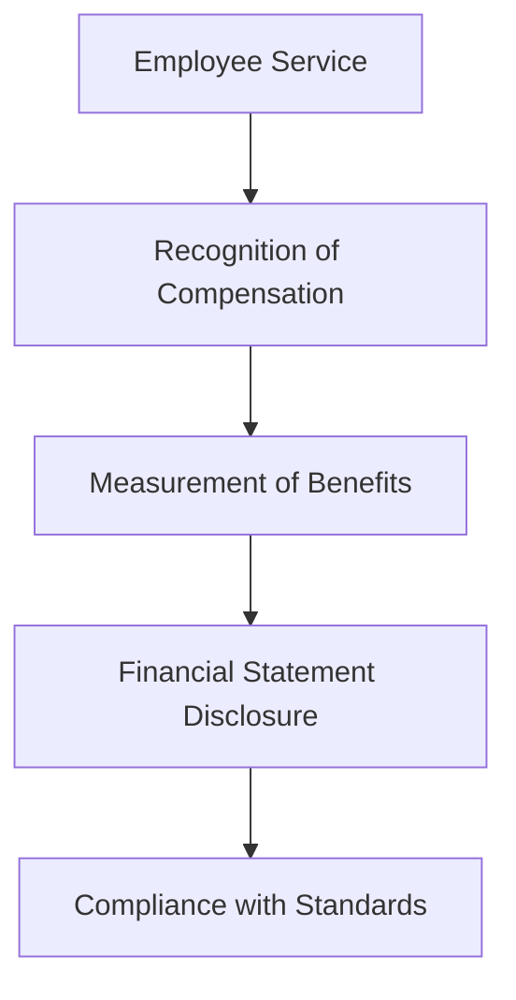

## 13.9 Employee Compensation and Benefits

Employee compensation and benefits represent a significant portion of a company's expenses and are crucial for attracting and retaining talent. In Canadian accounting, the recognition, measurement, and reporting of these expenses are governed by specific standards and principles. This section will delve into the various components of employee compensation and benefits, the relevant accounting standards, and practical examples to help you understand how these expenses are recorded and reported in financial statements.

### Understanding Employee Compensation and Benefits

Employee compensation and benefits encompass all forms of consideration given by an entity in exchange for services rendered by employees. This includes wages, salaries, bonuses, stock options, pensions, health insurance, and other fringe benefits. Proper accounting for these expenses is essential for accurate financial reporting and compliance with regulatory requirements.

#### Components of Employee Compensation

1. **Wages and Salaries**: The most direct form of compensation, representing the fixed regular payments made to employees for their services.

2. **Bonuses and Incentives**: Additional compensation awarded based on performance metrics or company profitability.

3. **Stock-Based Compensation**: Includes stock options, restricted stock units (RSUs), and other equity-based awards.

4. **Pension and Retirement Benefits**: Contributions to employee retirement plans, including defined benefit and defined contribution plans.

5. **Health and Welfare Benefits**: Health insurance, dental plans, life insurance, and other non-monetary benefits.

6. **Other Fringe Benefits**: Includes perks such as company cars, housing allowances, and tuition reimbursement.

### Accounting Standards for Employee Compensation and Benefits

In Canada, the accounting for employee compensation and benefits is primarily governed by International Financial Reporting Standards (IFRS) and Accounting Standards for Private Enterprises (ASPE). Each framework provides guidance on recognizing, measuring, and disclosing these expenses.

#### International Financial Reporting Standards (IFRS)

Under IFRS, employee benefits are covered by IAS 19 - Employee Benefits. This standard outlines the accounting treatment for all types of employee benefits, including short-term benefits, post-employment benefits, other long-term benefits, and termination benefits.

##### Key Aspects of IAS 19

- **Short-Term Employee Benefits**: Recognized as an expense when the employee has rendered service. This includes wages, salaries, and social security contributions.

- **Post-Employment Benefits**: Includes pensions and other retirement benefits. These are further classified into defined contribution plans and defined benefit plans.

- **Other Long-Term Employee Benefits**: Recognized similarly to post-employment benefits but without the actuarial assumptions required for defined benefit plans.

- **Termination Benefits**: Recognized at the earlier of when the entity can no longer withdraw the offer or when the entity recognizes costs for a restructuring.

#### Accounting Standards for Private Enterprises (ASPE)

For private enterprises in Canada, Section 3462 - Employee Future Benefits provides guidance on accounting for employee benefits. While similar to IAS 19, ASPE allows for some simplifications in the recognition and measurement of these benefits.

##### Key Aspects of Section 3462

- **Defined Contribution Plans**: Expenses are recognized as the contributions are made.

- **Defined Benefit Plans**: Requires actuarial valuations and the recognition of actuarial gains and losses.

- **Multi-Employer Plans**: Treated as defined contribution plans unless the entity has sufficient information to apply defined benefit accounting.

### Recognition and Measurement of Employee Compensation and Benefits

The recognition and measurement of employee compensation and benefits involve determining the appropriate timing and amount to be recorded in the financial statements. This process can be complex, especially for benefits that extend beyond the current accounting period.

#### Recognition Criteria

- **Service Rendered**: Compensation is recognized when the employee has provided the service.

- **Obligation to Pay**: An expense is recognized when the entity has an obligation to pay, even if the payment will occur in the future.

#### Measurement Considerations

- **Fair Value Measurement**: For stock-based compensation, the fair value of the equity instruments granted is measured at the grant date.

- **Actuarial Assumptions**: For defined benefit plans, actuarial assumptions are used to estimate the present value of the obligation and the fair value of plan assets.

- **Discount Rates**: Used to determine the present value of future cash flows related to post-employment benefits.

### Practical Examples and Case Studies

To illustrate the application of these principles, let's explore a few practical examples and case studies relevant to Canadian accounting.

#### Example 1: Recognition of Wages and Salaries

A company pays its employees bi-weekly. At the end of the accounting period, the company must recognize an accrual for wages earned by employees but not yet paid. This ensures that the expense is recorded in the period in which the service was rendered.

#### Example 2: Accounting for Stock-Based Compensation

A technology company grants stock options to its employees as part of their compensation package. The fair value of the options is determined using an option pricing model, and the expense is recognized over the vesting period.

#### Example 3: Defined Benefit Pension Plan

A manufacturing company sponsors a defined benefit pension plan for its employees. The company must use actuarial assumptions to estimate the present value of the pension obligation and the fair value of plan assets. Actuarial gains and losses are recognized in other comprehensive income.

### Real-World Applications and Regulatory Scenarios

Understanding the real-world applications and regulatory scenarios related to employee compensation and benefits is crucial for accountants and financial professionals.

#### Compliance with Regulatory Requirements

- **CPA Canada Guidelines**: Provides guidance on the application of accounting standards for employee benefits.

- **Tax Implications**: Employee benefits may have tax implications for both the employer and the employee. Understanding the tax treatment of different types of compensation is essential for compliance.

#### Challenges and Best Practices

- **Complexity of Actuarial Valuations**: Actuarial valuations for defined benefit plans can be complex and require specialized expertise.

- **Disclosure Requirements**: Adequate disclosure of employee benefits in financial statements is critical for transparency and compliance with accounting standards.

- **Managing Benefit Costs**: Companies must balance the need to provide competitive benefits with the financial impact on the organization.

### Diagrams and Visual Aids

To enhance understanding, let's use a diagram to illustrate the flow of accounting for employee benefits:

### Summary and Key Takeaways

Employee compensation and benefits are a vital aspect of financial reporting and require careful consideration to ensure compliance with accounting standards. By understanding the recognition, measurement, and disclosure requirements, accountants can accurately report these expenses and provide valuable insights into the financial health of an organization.

### Exam Preparation Tips

- **Understand Key Standards**: Familiarize yourself with IAS 19 and Section 3462, focusing on the recognition and measurement of different types of employee benefits.

- **Practice Calculations**: Work through examples of calculating pension obligations, stock-based compensation, and other benefits.

- **Review Disclosure Requirements**: Ensure you understand the disclosure requirements for employee benefits in financial statements.

- **Stay Updated**: Keep abreast of any updates or amendments to accounting standards related to employee benefits.

### Additional Resources

- **CPA Canada**: Offers resources and guidance on accounting standards for employee benefits.

- **IFRS Foundation**: Provides access to the full text of IFRS standards and related interpretations.

- **Actuarial Organizations**: Offer insights and tools for understanding actuarial valuations and assumptions.

## **Ready to Test Your Knowledge?**



### What is the primary accounting standard for employee benefits under IFRS?

- [x] IAS 19
- [ ] IFRS 15
- [ ] IAS 16
- [ ] IFRS 9

> **Explanation:** IAS 19 - Employee Benefits is the primary standard for accounting for employee benefits under IFRS.

### Which of the following is considered a short-term employee benefit?

- [x] Wages and Salaries
- [ ] Pension Plans
- [ ] Stock Options
- [ ] Health Insurance

> **Explanation:** Short-term employee benefits include wages, salaries, and other benefits expected to be settled within 12 months.

### How are stock-based compensation expenses measured?

- [x] At fair value at the grant date
- [ ] At book value
- [ ] At market value at the exercise date
- [ ] At historical cost

> **Explanation:** Stock-based compensation is measured at the fair value of the equity instruments granted at the grant date.

### What is a key requirement for recognizing termination benefits?

- [x] The entity can no longer withdraw the offer
- [ ] The employee has completed the service period
- [ ] The benefits are expected to be settled within 12 months
- [ ] The benefits are part of a defined benefit plan

> **Explanation:** Termination benefits are recognized when the entity can no longer withdraw the offer or when costs for restructuring are recognized.

### What type of plan requires actuarial valuations?

- [x] Defined Benefit Plans
- [ ] Defined Contribution Plans
- [ ] Multi-Employer Plans
- [ ] Short-Term Benefit Plans

> **Explanation:** Defined benefit plans require actuarial valuations to estimate the present value of the obligation and the fair value of plan assets.

### Which section of ASPE covers employee future benefits?

- [x] Section 3462
- [ ] Section 3856
- [ ] Section 3051
- [ ] Section 3400

> **Explanation:** Section 3462 - Employee Future Benefits provides guidance on accounting for employee benefits under ASPE.

### What is the main difference between defined contribution and defined benefit plans?

- [x] Defined contribution plans do not require actuarial valuations
- [ ] Defined benefit plans are always short-term
- [ ] Defined contribution plans guarantee a specific retirement benefit
- [ ] Defined benefit plans have no disclosure requirements

> **Explanation:** Defined contribution plans do not require actuarial valuations, as the expense is recognized as contributions are made.

### How are actuarial gains and losses recognized under IFRS?

- [x] In other comprehensive income
- [ ] In profit or loss
- [ ] As a prior period adjustment
- [ ] As a deferred asset

> **Explanation:** Actuarial gains and losses are recognized in other comprehensive income under IFRS.

### What is the purpose of using discount rates in measuring post-employment benefits?

- [x] To determine the present value of future cash flows
- [ ] To calculate the fair value of plan assets
- [ ] To estimate the expected return on plan assets
- [ ] To adjust for inflation

> **Explanation:** Discount rates are used to determine the present value of future cash flows related to post-employment benefits.

### Employee benefits may have tax implications for both the employer and the employee.

- [x] True
- [ ] False

> **Explanation:** Employee benefits can have tax implications, affecting both the employer's tax liability and the employee's taxable income.


